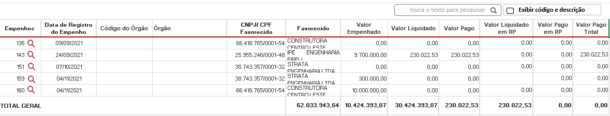
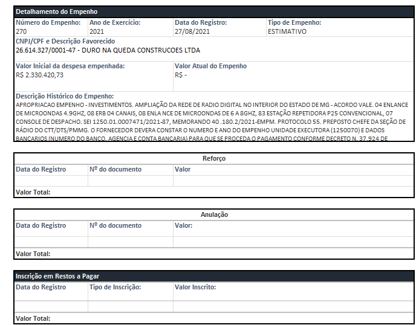
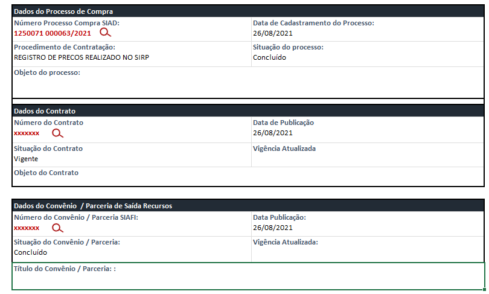
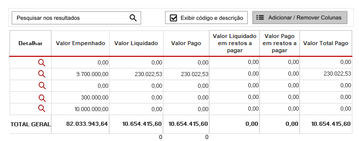

# Especificação - Dados da Consulta
<a href="#top">(inicio)</a>

Esse documento tem como base a criação de uma nova consulta para possibilitar o acompanhamento das ações desenvolvidas pelo governo do estado com recursos provenientes do acordo judicial firmado com a Vale .

## Pesquisa Básica - Tipo de Consultas
<a href="#top">(inicio)</a>

Para acessar o comportamento padrão da consulta básica acesse a [Especificação Layout - Consulta Básica](https://github.com/transparencia-mg/especificacoes-portal-transparencia/blob/espec018_recusos-vale/espec018_recursos-acordo-judicial-vale/recursos-vale-espec.md)

### Por Projeto
<a href="#top">(inicio)</a>

Os dados dessa consulta serão extraídos do Universo BO SIGCON- Entrada.
- Armazém BO / Pastas públicas - SIAFI > SUPORTE- SIAFI > CGE > Consulta Vale Recursos Vale> Tela Projeto

#### Filtros da Consulta
Essa consulta será plurianual, ou seja, o usuário irá visualizar todos os projetos e valores independente do ano.

|    Fonte de Dados    | URL
|--------------------------|-----------------
|Portal de Dados Abertos|    https://homologa.cge.mg.gov.br/dataset/projetos-acordo-judicial-reparacao-vale

Nota: Ess url será utilizada apenas para fins de testes.

#### Campos da Tabela

| Portal de Dados Abertos | PdT | Tooltip - PdT | Exibição da Coluna
|------------|-----|--------------------|---|
| Código Projeto| Código Projeto           | Código do Projeto no armazém SIAFI (Sistema Integrado de Administração Financeira de Minas Gerais ) |default
| Projeto     | Projeto               | Descrição do Projeto conforme consta no Acordo de Reparação e de execução do Governo do Estado                 |default
| Anexo         | Anexo      |          Anexo ao qual o Projeto se refere conforme o Acordo de Reparação      |default
| Valor do Projeto          | Valor do Projeto        |          Valor total destinado ao projeto         |default

**Comportamento da Consulta:**

- Ao clicar no campo 'Código Projeto' o usuário será direcionado para o 2º nível da consulta por execução, ou seja, a tabela de empenhos **com o acréscimo das colunas Código Órgão e Órgão**. A consulta deverá exibir todos dos empenhos relacionados ao Código Projeto selecionado independentemente do ano de registro do empenho.

### Por Execução
<a href="#top">(inicio)</a>

Os dados dessa consulta serão extraídos do Universo BO SIAFI
-  Armazém BO / Pastas públicas - SIAFI > SUPORTE- SIAFI > CGE > Consulta Vale Recursos Vale> TELA ÓRGÃO

#### Filtros da Consulta

Essa consulta será anual, ou seja, o usuário irá visualizar a execução (Despesa e restos a Pagar) do projeto conforme o período selecionado.

|Dados| Armazém BO- SIAFI       |Dimensão SIAFI| Filtro  |
|--|--------------------------|----------|-------
| Despesa| Contrato Convênio Entrada |SIAFI - Execução Orçamentária da Despesa > Despesa Realizada| Usar como filtro todos os 'Códigos Projeto' listados na consulta Por Projeto |     
| Restos a Pagar| Contrato Convênio Entrada  | SIAFI - Execução de Restos a Pagar > Restos a Pagar | Usar como filtro todos os 'Códigos Projeto' listados na consulta Por Projeto
| | Ano de Exercício  | SIAFI - Período Contábil |

#### Campos da Tabela

##### Tabela 1º nível

|Dados| Campo armazém BO- SIAFI     | Dimensão SIAFI| Campo PdT | Tooltip - PdT           | Exibição da Coluna
|--|------|---|---------------|------------|---|
|Despesa| ContratoConvênio Entrada | SIAFI - Execução Orçamentária da Despesa > Despesa Realizada |Código Projeto            | Código do Projeto no armazém SIAFI (Sistema Integrado de Administração Financeira de Minas Gerais ) |default
|Despesa| Unidade Orçamentária-Código      |SIAFI - Execução Orçamentária da Despesa > Despesa Realizada |Código Órgão            |    Código da Unidade Orçamentária responsável pelo Projeto                | ao acionar o botão '*Exibir código e descrição*''
|Despesa| Unidade Orçamentária-Nome        | SIAFI - Execução Orçamentária da Despesa > Despesa Realizada| Órgão                   |    Descrição da Unidade Orçamentária responsável pelo Projeto                |default
|Despesa| Valor Despesa Empenhada             |SIAFI - Execução Orçamentária da Despesa > Despesa Realizada | Valor Empenhado       | Valor do orçamento reservado para cumprir o compromisso assumido com o fornecedor ou credor |default
|Despesa| Valor Despesa Liquidada            | SIAFI - Execução Orçamentária da Despesa > Despesa Realizada| Valor Liquidado      | Valor que o fornecedor ou credor tem direito a receber referente ao produto ou serviço devidamente entregue       |default
|Despesa| Valor Pago Financeiro           |SIAFI - Execução Orçamentária da Despesa > Despesa Realizada | Valor Pago | Valor referente aos pagamentos efetuados, no exercício, através de movimentações bancárias, escriturais e apropriação contábil da despesa. O efetivo pagamento pode estar pendente de transmissão bancária e/ou sujeita a compensação bancária  |default
|Restos a Pagar| Valor Despesa Liquidada             |SIAFI - Execução de Restos a Pagar > Restos a Pagar |Valor Liquidado em RP      | Valor que o fornecedor ou credor tem direito a receber referente ao produto ou serviço devidamente entregue referente a exercícios anteriores                    |default
|Restos a Pagar| -Valor Pago Processado  -Valor Pago não processado |  SIAFI - Execução de Restos a Pagar > Restos a Pagar | Valor Pago em Restos a Pagar     | Valor pago referente a exercícios anteriores efetuados através de movimentações bancárias, escriturais e apropriação contábil da despesa, referente a produtos e serviços realizados em exercícios anteriores. O efetivo pagamento pode estar pendente de transmissão bancária e/ou sujeita a compensação bancária. |default
|Fórmula Portal|   | | Valor Total Pago   | Somatório dos valores pagos neste exercício e pagos em restos a pagar processados e não processados.           |default

**Comportamento da Consulta:**

- Ao clicar no campo 'Código Projeto' o usuário será direcionado para o 2º nível da consulta, ou seja, tabela de empenhos.
____

##### Tabela 2º nível

- Armazém BO / Pastas públicas - SIAFI > SUPORTE- SIAFI > CGE > Consulta Vale Recursos Vale> TELA ÓRGÃO - nível 2

Ao clicar em algum dado do campo 'Código Projeto' o usuário será direciona ao segundo nível da consulta, lista de empenhos correspondente ao código Projeto selecionado.

|Dados|  Campo Armazém BO- SIAFI     | Dimensão SIAFI| Campo PdT | Tooltip - PdT           | Exibição da Coluna
|--|-----------------------------|---|-------------------------|--------------------|---|
|Despesa| Número Empenho| SIAFI - Execução Orçamentária da Despesa > Despesa Realizada| Empenho           | Número de identificação do documento de empenho no SIAFI (Sistema Integrado de Administração Financeira de Minas Gerais )  |default
|Despesa| Data Registro Doc Empenho | SIAFI - Execução Orçamentária da Despesa > Despesa Realizada |Data de Registro do Empenho  | Data de registro do documento de empenho   |default
|Despesa|  CNPJ_CPF Credor - Formatado    |SIAFI - Execução Orçamentária da Despesa > Despesa Realizada |CNPJ/ CPF  Favorecido  | Número de identificação: Pessoa Física (CPF) e Pessoa Jurídica (CNPJ) | default
| Despesa|  Razão Social Credor   |SIAFI - Execução Orçamentária da Despesa > Despesa Realizada | Favorecido    | Nome de quem recebeu recursos públicos estaduais pela prestação de serviço ou entrega do produto. Ex: prefeituras, servidores, empresas, entidades do terceiro setor, etc.  |default
| Despesa| Valor Despesa Empenhada |SIAFI - Execução Orçamentária da Despesa > Despesa Realizada | Valor Empenhado| Valor do orçamento reservado para cumprir o compromisso assumido com o fornecedor ou credor |default
| Despesa| Valor Despesa Liquidada  | SIAFI - Execução Orçamentária da Despesa > Despesa Realizada| Valor Liquidado      | Valor que o fornecedor ou credor tem direito a receber referente ao produto ou serviço devidamente entregue        |default
| Despesa| Valor Pago Financeiro  | SIAFI - Execução Orçamentária da Despesa > Despesa Realizada| Valor Pago  | Valor referente aos pagamentos efetuados, no exercício, através de movimentações bancárias, escriturais e apropriação contábil da despesa. O efetivo pagamento pode estar pendente de transmissão bancária e/ou sujeita a compensação bancária |default
|Restos a Pagar| Valor Despesa Liquidada   |SIAFI - Execução de Restos a Pagar > Restos a Pagar |Valor Liquidado em RP      | Valor que o fornecedor ou credor tem direito a receber referente ao produto ou serviço devidamente entregue referente a exercícios anteriores |default
|Restos a Pagar| - Valor Pago Processado  - Valor Pago não processado |  SIAFI - Execução de Restos a Pagar > Restos a Pagar | Valor Pago em Restos a Pagar     | Valor pago referente a exercícios anteriores efetuados através de movimentações bancárias, escriturais e apropriação contábil da despesa, referente a produtos e serviços realizados em exercícios anteriores. O efetivo pagamento pode estar pendente de transmissão bancária e/ou sujeita a compensação bancária. |default                 |default
|Fórmula Portal|   | | Valor Total Pago   |   Somatório dos valores pagos neste exercício e pagos em restos a pagar processados e não processados.           |default

**Comportamento da Consulta:**

- Ao clicar no campo 'Empenho' o usuário será direcionado o formulário de detalhamento.

-----

##### Formulário de Detalhamento

- Armazém BO / Pastas públicas - SIAFI > SUPORTE- SIAFI > CGE > Consulta Vale Recursos Vale> > Formulário de Detalhamento

O formulário de detalhamento deverá exibir a inscrição, liquidação e pagamento dos valores em restos a pagar referente ao todos os exercícios.
Exemplo:
- Ano de registro do Empenho: 2020
- Inscrição em Restos a Pagar: 2021
- Reinscrito em Restos e Pagar: 2022

**1- Formulário Classificação Orçamentária**

|Dados|  Campo Armazém BO- SIAFI     | Dimensão SIAFI| Campo PdT | Observações
|--|-----------------------------|---|-------------------------|----|
|Despesa| Número Empenho| SIAFI - Execução Orçamentária da Despesa > Despesa Realizada| Empenho           |
|Despesa| Data Registro Doc Empenho | SIAFI - Execução Orçamentária da Despesa > Despesa Realizada |Data de Registro|
|Despesa| Unidade Orçamentária - Código/Nome | SIAFI - Unidade Orçamentária |Unidade Orçamentária| Código  e descrição no mesmo campo
|Despesa| Unidade Executora - Código/Nome | SIAFI - Unidade Executora |Unidade Executora| Código e descrição no mesmo campo
|Despesa| Função - Descrição| SIAFI - Execução Orçamentária da Despesa > Despesa Realizada > Programa de Trabalho - Despesa |Função| Código e descrição no mesmo campo
|Despesa| Função - Código| SIAFI - Execução Orçamentária da Despesa > Despesa Realizada > Programa de Trabalho - Despesa || Código e descrição no mesmo campo
|Despesa| Subfunção - Descrição| SIAFI - Execução Orçamentária da Despesa > Despesa Realizada > Programa de Trabalho - Despesa |Subfunção| Código e descrição no mesmo campo
|Despesa| Subfunção - Código| SIAFI - Execução Orçamentária da Despesa > Despesa Realizada > Programa de Trabalho - Despesa || Código e descrição no mesmo campo
|Despesa| Programa - Descrição| SIAFI - Execução Orçamentária da Despesa > Despesa Realizada > Programa de Trabalho - Despesa |Programa| Código e descrição no mesmo campo
|Despesa| Programa - Código| SIAFI - Execução Orçamentária da Despesa > Despesa Realizada > Programa de Trabalho - Despesa || Código e descrição no mesmo campo
|Despesa| Projeto_Atividade - Descrição| SIAFI - Execução Orçamentária da Despesa > Despesa Realizada > Programa de Trabalho - Despesa |Ação (Projeto Atividade)| Código e descrição no mesmo campo
|Despesa| Projeto_Atividade - Código| SIAFI - Execução Orçamentária da Despesa > Despesa Realizada > Programa de Trabalho - Despesa || Código e descrição no mesmo campo
|Despesa| Categoria Econômica Despesa - Desc| SIAFI - Execução Orçamentária da Despesa > Despesa Realizada > Natureza da Despesa Realizada |Categoria Econômica da Despesa| Código e descrição no mesmo campo
|Despesa| Categoria Econômica Despesa - Código| SIAFI - Execução Orçamentária da Despesa > Despesa Realizada > Natureza da Despesa Realizada || Código e descrição no mesmo campo
|Despesa| Grupo Despesa - Descrição| SIAFI - Execução Orçamentária da Despesa > Despesa Realizada > Natureza da Despesa Realizada | Grupo de Despesa| Código e descrição no mesmo campo
|Despesa| Grupo Despesa - Código| SIAFI - Execução Orçamentária da Despesa > Despesa Realizada > Natureza da Despesa Realizada || Código e descrição no mesmo campo
|Despesa| Modalidade de Aplicação - Descrição| SIAFI - Execução Orçamentária da Despesa > Despesa Realizada > Natureza da Despesa Realizada | Modalidade de Aplicação| Código e descrição no mesmo campo
|Despesa| Modalidade de Aplicação - Código| SIAFI - Execução Orçamentária da Despesa > Despesa Realizada > Natureza da Despesa Realizada || Código e descrição no mesmo campo
|Despesa| Elemento Despesa - Descrição| SIAFI - Execução Orçamentária da Despesa > Despesa Realizada > Natureza da Despesa Realizada | Elemento de Despesa| Código e descrição no mesmo campo
|Despesa| Elemento Despesa - Código| SIAFI - Execução Orçamentária da Despesa > Despesa Realizada > Natureza da Despesa Realizada || Código e descrição no mesmo campo
|Despesa| Item Despesa - Descrição| SIAFI - Execução Orçamentária da Despesa > Despesa Realizada > Natureza da Despesa Realizada | Item de Despesa| Código e descrição no mesmo campo
|Despesa| Item Despesa - Código| SIAFI - Execução Orçamentária da Despesa > Despesa Realizada > Natureza da Despesa Realizada || Código e descrição no mesmo campo
|Despesa| Fonte Recurso - Descrição| SIAFI - Execução Orçamentária da Despesa > Despesa Realizada > GMIFP | Fonte de Recurso| Código e descrição no mesmo campo
|Despesa| Fonte Recurso - Código| SIAFI - Execução Orçamentária da Despesa > Despesa Realizada > GMIFP  || Código e descrição no mesmo campo
|Despesa| Procedência - Descrição| SIAFI - Execução Orçamentária da Despesa > Despesa Realizada > GMIFP | Indicador de Procedência e Uso (IPU)| Código e descrição no mesmo campo
|Despesa| Procedência - Código| SIAFI - Execução Orçamentária da Despesa > Despesa Realizada > GMIFP  || Código e descrição no mesmo campo

_______

**2- Formulário Empenho**

|Dados|  Campo Armazém BO- SIAFI     | Dimensão SIAFI| Campo PdT | Observações
|--|-----------------------------|---|-------------------------|----|
|Detalhamento do Empenho| Número Empenho| SIAFI - Execução Orçamentária da Despesa > Despesa Realizada| Empenho|
|Detalhamento do Empenho| Data Registro Doc Empenho | SIAFI - Execução Orçamentária da Despesa > Despesa Realizada |Data de Registro||Despesa| Data Registro Doc Empenho | SIAFI - Execução Orçamentária da Despesa > Despesa Realizada |Data de Registro|
|Detalhamento do Empenho| Ano de Exercício | SIAFI - Período Contábil |Ano de Exercício|
|Despesa |Tipo Empenho - Descrição| SIAFI - Execução Orçamentária da Despesa > Despesa Realizada |Tipo de Empenho|
|Detalhamento do Empenho|  CNPJ_CPF Credor - Formatado    |SIAFI - Execução Orçamentária da Despesa > Despesa Realizada || Código e descrição no mesmo campo
| Detalhamento do Empenho|  Razão Social Credor   |SIAFI - Execução Orçamentária da Despesa > Despesa Realizada | CNPJ/ CPF e Descrição do  Favorecido | Código e descrição no mesmo campo
| Detalhamento do Empenho|  Valor Inicial Empenho   |SIAFI - Execução Orçamentária da Despesa > Despesa Realizada | Valor inicial empenhado | | Despesa|     |SIAFI - Execução Orçamentária da Despesa > Despesa Realizada | Valor Atualizado do Empenho (reforço e anulação |
| Detalhamento do Empenho|  Valor Despesa Empenhada  |SIAFI - Execução Orçamentária da Despesa > Despesa Realizada | Valor atual do empenho (reforços e anulações) | |
| Detalhamento do Empenho|    ||Descrição Histórico do Empenho |Integração entre Portal e SIAFI |
| Reforço do Empenho|  Valor Reforço  Empenho |SIAFI - Execução Orçamentária da Despesa > Despesa Realizada |Valor |
| Reforço do Empenho|  |SIAFI - Execução Orçamentária da Despesa > Despesa Realizada |Nº do documento | Campo SIAFI não disponível para visualização da DTA. Trazer o campo já utilizado no formulário de detalhamento da despesa
| Reforço do Empenho|  Data Reforço/Anulação |SIAFI - Execução Orçamentária da Despesa > Despesa Realizada |Data de Registro |
| Anulação do Empenho|  Valor Anulação Empenho  |SIAFI - Execução Orçamentária da Despesa > Despesa Realizada | Valor | |
| Anulação do Empenho|  |SIAFI - Execução Orçamentária da Despesa > Despesa Realizada |Nº do documento | Campo SIAFI não disponível para visualização da DTA. Trazer o campo já utilizado no formulário de detalhamento da despesa.
| Anulação do Empenho|  Data Reforço/Anulação |SIAFI - Execução Orçamentária da Despesa > Despesa Realizada |Data de Registro |
|Inscrição em Restos a Pagar| Data Registro Doc Empenho  | SIAFI - Execução de Restos a Pagar > Restos a Pagar > Dados do Empenho - Restos a Pagar |Data de Registro| Data de registro que o empenho foi inscrito em Restos a Pagar
|Inscrição em Restos a Pagar|   |  | Tipo de Inscrição| Campo SIAFI não disponível para visualização da DTA. Trazer o campo já utilizado no formulário de detalhamento da consulta de Restos a pagar
|Inscrição em Restos a Pagar|**soma** do Valor Inscrito Processado - Valor Cancelado Processado ou Valor Restabelecido Processado      **OU soma** do Valor Inscrito Não Processado - Valor Cancelado Não Processado + Valor Restabelecido Não Processado   |  SIAFI - Execução de Restos a Pagar > Restos a Pagar| Valor Inscrito| Cada linha deverá apresentar o valor corresponde ao tipo de inscrição em restos a pagar.

_______

**3- Formulário Liquidação**

|Dados|  Campo Armazém BO- SIAFI     | Dimensão SIAFI| Campo PdT | Observações
|--|-----------------------------|---|-------------------------|----|
|Detalhamento da Liquidação| | SIAFI - Execução Orçamentária da Despesa > Despesa Realizada| Nº do documento| Campo SIAFI não disponível para visualização da DTA. Trazer o campo já utilizado no formulário de detalhamento da liquidação.
|Detalhamento da Liquidação| Data Registro Doc Liquidação | SIAFI - Execução Orçamentária da Despesa > Despesa Realizada |Data de Registro||Despesa| Data Registro Doc Empenho | SIAFI - Execução Orçamentária da Despesa > Despesa Realizada |Data de Registro|
|Detalhamento da Liquidação|  CNPJ_CPF Credor - Formatado    |SIAFI - Execução Orçamentária da Despesa > Despesa Realizada || Código e descrição no mesmo campo
| Detalhamento da Liquidação|  Razão Social Credor   |SIAFI - Execução Orçamentária da Despesa > Despesa Realizada | CNPJ/ CPF e Descrição do  Favorecido | Código e descrição no mesmo campo
| Detalhamento da Liquidação|  Valor Despesa Liquidada   |SIAFI - Execução Orçamentária da Despesa > Despesa Realizada |Valor Liquidado |
|Liquidação em Restos a Pagar| Data Registro Doc Liquidação  | SIAFI - Execução de Restos a Pagar > Restos a Pagar > Dados da Liquidação - Restos a Pagar |Data de Registro| Data de registro que o restos a pagar não processado foi liquidado.
|Liquidação em Restos a Pagar|  CNPJ_CPF Credor - Numérico   | SIAFI - Execução de Restos a Pagar > Restos a Pagar || Código e descrição no mesmo campo
| Liquidação em Restos a Pagar|  Razão Social Credor   | SIAFI - Execução de Restos a Pagar > Restos a Pagar | CNPJ/ CPF e Descrição do  Favorecido | Código e descrição no mesmo campo
| Liquidação em Restos a Pagar|  Valor Despesa Liquidada   |SIAFI - Execução de Restos a Pagar > Restos a Pagar |Valor Liquidado RP| Valor liquidado do restos a pagar não processado

_______

**4- Formulário Pagamento**

|Dados|  Campo Armazém BO- SIAFI     | Dimensão SIAFI| Campo PdT | Observações
|--|-----------------------------|---|-------------------------|----|
|Detalhamento do Pagamento| Data de Registro| SIAFI - Execução Orçamentária da Despesa > Despesa Realizada > Dados da Ordem de Pagamento - Despesa| Data de Registro do pagamento|
|Detalhamento do Pagamento| Número Docto Pagamento | SIAFI - Execução Orçamentária da Despesa > Despesa Realizada > Dados da Ordem de Pagamento - Despesa |Nº do documento|
|Detalhamento do Pagamento| Situação Ordem de Pagamento - Descrição | SIAFI - Execução Orçamentária da Despesa > Despesa Realizada > Dados da Ordem de Pagamento - Despesa |Situação da Ordem de Pagamento|
|Detalhamento do Pagamento|  CNPJ_CPF Credor - Formatado    |SIAFI - Execução Orçamentária da Despesa > Despesa Realizada || Código e descrição no mesmo campo
| Detalhamento do Pagamento|  Razão Social Credor   |SIAFI - Execução Orçamentária da Despesa > Despesa Realizada | CNPJ/ CPF e Descrição do  Favorecido | Código e descrição no mesmo campo
| Detalhamento do Pagamento|  Valor Pago Financeiro  |SIAFI - Execução Orçamentária da Despesa > Despesa Realizada |Valor Pago |
|Pagamento em Restos a Pagar| Data Registro | SIAFI - Execução de Restos a Pagar > Restos a Pagar > Dados da Ordem de Pagamento - Restos a Pagar |Data de Registro do pagamento| Data de registro que o restos a pagar foi pago.
|Pagamento em Restos a Pagar| Número Ordem de Pagamento | SIAFI - Execução de Restos a Pagar > Restos a Pagar > Dados da Ordem de Pagamento - Restos a Pagar |Nº do documento|
|Detalhamento do Pagamento| Situação Ordem de Pagamento - Descrição |  SIAFI - Execução de Restos a Pagar > Restos a Pagar > Dados da Ordem de Pagamento - Restos a Pagar |Situação da Ordem de Pagamento|
|Pagamento em Restos a Pagar|  CNPJ_CPF Credor - Numérico   | SIAFI - Execução de Restos a Pagar > Restos a Pagar || Código e descrição no mesmo campo
| Pagamento em Restos a Pagar|  Razão Social Credor   | SIAFI - Execução de Restos a Pagar > Restos a Pagar | CNPJ/ CPF e Descrição do  Favorecido | Código e descrição no mesmo campo
| Pagamento em Restos a Pagar|  Valor Pago Processado ou Valor Pago não processado |SIAFI - Execução de Restos a Pagar > Restos a Pagar |Valor Pago em RP |

_______

**4- Formulário Outras Informações**

|Dados|  Campo Armazém BO     | Dimensão Armazém BO| Campo PdT | Observações
|--|-----------------------------|---|-------------------------|----|
|Dados do Processo de Compra| Número do Processo de Compra| SIAFI - Execução Orçamentária da Despesa > Despesa Realizada | Número do Processo de Compra| Campo utilizado para cruzamento das informações empenho vs processo de compra. Ao identificar qual processo de compra está vinculado ao empenho os demais dados referente ao processo serão extraídos do Armazém SIADI - Portal de Compras - Módulo Compras
|Dados do Processo de Compra| Data criação do Processo | Armazém SIADI - Portal de Compras - Módulo Compras > Data criação do Processo| Data de Cadastramento do Processo|
|Dados do Processo de Compra| Procedimento de Contratação - Detalhamento 1 | Armazém SIADI - Portal de Compras - Módulo Compras > Procedimento de Contratação| Procedimento de Contratação|
|Dados do Processo de Compra| Situação Processo | Armazém SIADI - Portal de Compras - Módulo Compras | Situação do Processo|
|Dados do Processo de Compra| Objeto Processo | Armazém SIADI - Portal de Compras - Módulo Compras | Objeto do Processo|
|Dados Contrato| Número Contrato| Armazém SIADI - Portal de Compras - Módulo Compras > Contrato | Número do Contrato|
|Dados Contrato| Data Publicação Contrato | Armazém SIADI - Portal de Compras - Módulo Compras > Data Publicação Contrato| Data de Publicação|
|Dados Contrato| Data Término Vigência Contrato | Armazém SIADI - Portal de Compras - Módulo Compras > Data Atualizada Término Vigência Contrato| Vigência atualizada |
|Dados Contrato| Situação Contrato | Armazém SIADI - Portal de Compras - Módulo Compras > Contrato | Situação do Contrato|
|Dados Contrato| Objeto Contrato | Armazém SIADI - Portal de Compras - Módulo Compras > Contrato | Objeto do Contrato|
|Dados do Convênio  / Parceria de Saída Recursos| Contrato Convênio Saída| SIAFI - Execução Orçamentária da Despesa > Despesa Realizada > Dados do Empenho - Despesa | Número do Convênio / Parceria SIAFI| Ao identificar que existe 'Contrato Convênio Saída' relacionado a um empenho deve-se realizar o cruzamento com a base de dados do Pdt consulta Convênio de Saída / Parceria de recursos e caso a informação conste na base de dados essas serão replicadas nesse formulário. Exemplo: Código SIAFI (Contrato Convênio Entrada) 9288133 >> Empenho (Número do Empenho) 367/2021 >> Número do Convênio / Parceria SIAFI (Contrato Convênio Saída) [9318584](https://www.transparencia.mg.gov.br/convenios/convenios-de-saida/convenios-conslivre-detalhesconv/2021/01-01-2021/31-12-2021/61691)
|Dados do Convênio/Parceria de Saída Recursos| Data Publicação |PdT - Consulta Convênios / Parceria de Saída de Recursos | Data de Publicação|
|Dados do Convênio/Parceria de Saída Recursos| Vigência atualizada | PdT - Consulta Convênios / Parceria de Saída de Recursos| Vigência atualizada |
|Dados do Convênio/Parceria de Saída Recursos| Situação do Convênio / Parceria| PdT - Consulta Convênios / Parceria de Saída de Recursos | Situação do Convênio / Parceria|
|Dados do Convênio/Parceria de Saída Recursos| Título do Convênio / Parceria | PdT - Consulta Convênios / Parceria de Saída de Recursos| Título do Convênio / Parceria|

**Comportamento da Consulta:**

- Ao clicar no campo 'Número do Processo de Compra' o usuário será direcionado o formulário de detalhamento da consulta [Compras e Contratos](https://www.transparencia.mg.gov.br/compras-e-patrimonio/compras-e-contratos/comprasecontratos-detalhe-proccompra/2021/20210101/20211231/352133).

- Ao clicar no campo 'Número do Contrato' o usuário poderá fazer o [download do contrato](https://www1.compras.mg.gov.br/contrato/gestaocontratos/arquivosContrato.html?idContrato=170153).

- Ao clicar no campo 'Número do Convênio / Parceria SIAFI' o usuário será direcionado o formulário de detalhamento da consulta [Consulta Convênios / Parceria de Saída de Recursos](https://www.transparencia.mg.gov.br/convenios/convenios-de-saida/convenios-conslivre-detalhesconv/2021/01-01-2021/31-12-2021/61691)

_______
### Por Município
<a href="#top">(inicio)</a>

Os dados dessa consulta serão extraídos do Universo BO SIAFI.
- Armazém BO / Pastas públicas - SIAFI > SUPORTE- SIAFI > CGE > Consulta Vale Recursos Vale> Tela Município

#### Filtros da Consulta

Essa consulta será plurianual, ou seja, o usuário irá visualizar todos repasses referente ao Município independentemente do ano de repasse.

| Armazém BO- SIAFI       | Filtro
|--------------------------|-----------------
|Contrato Convênio Entrada | 9288130    

#### Campos da Tabela

|Dados| Campo armazém BO- SIAFI     | Dimensão SIAFI| Campo PdT | Tooltip - PdT           | Exibição da Coluna
|-|------|---|---------------|------------|---|
|Município |Ano de Exercício |Período Contábil| Ano do Repasse|Ano de exercício que o repasse ocorreu|---|
|Município |Município Credor - Descrição| SIAFI - Execução Orçamentária da Despesa - Despesa Realizada > Credor - Despesa |Município |Nome do Município que recebeu os repasses do Acordo Judicial conforme art. 5º e anexo V da Lei Estadual nº 23.830/2021|*default*
|Município |Número Empenho| SIAFI - Execução Orçamentária da Despesa - Despesa Realizada|Empenho| Número de identificação do documento de empenho no SIAFI (Sistema Integrado de Administração Financeira de Minas Gerais )|*default*|
|Município |Data Registro| SIAFI - Execução Orçamentária da Despesa > Despesa Realizada > Dados da Ordem de Pagamento - Despesa| Data de Registro do pagamento|Data de Registro do Pagamento no SIAFI (Sistema Integrado de Administração Financeira de Minas Gerais )|*default*|
|Município |Situação Ordem de Pagamento - Descrição |SIAFI - Execução Orçamentária da Despesa > Despesa Realizada > Dados da Ordem de Pagamento - Despesa |Situação da Ordem de Pagamento| Situação da Ordem de Pagamento conforme consta no SIAFI (Sistema Integrado de Administração Financeira de Minas Gerais )|*default*|
|Município |Valor Pago Financeiro| SIAFI - Execução Orçamentária da Despesa > Despesa Realizada |Valor Pago| Valor referente aos repasses efetuados conforme art. 5º e anexo V da Lei Estadual nº 23.830/2021 do Acordo Judicial|*default*|

**Comportamento da Consulta:**

- Ao clicar no campo 'Empenho' o usuário será direcionado o formulário de detalhamento referente ao empenho.

______
### Por Receita
<a href="#top">(inicio)</a>

Os dados dessa consulta serão extraídos do Universo BO SIAFI.
- Armazém BO / Pastas públicas - SIAFI > SUPORTE- SIAFI > CGE > Consulta Vale Recursos Vale> Tela Receita

#### Filtros da Consulta

Essa consulta será plurianual, ou seja, o usuário irá visualizar os valores arrecadados por ano.

| Armazém BO- SIAFI       | Filtro
|--------------------------|-----------------
|Fonte de Recurso| 95
Classificação Receita - Formatado| 2990.00.1.1.02.000 

#### Campos da Tabela

|Dados| Campo armazém BO- SIAFI     | Dimensão SIAFI| Campo PdT | Tooltip - PdT           | Exibição da Coluna
|-| -|---|---------------|------------|---|
|Receita| Ano de Exercício |SIAFI - Período Contábil|Ano de Exercício |Ano de exercício que ocorreu a arrecadação|*default*|
|Receita |Classificação Receita - Formatado |SIAFI - Execução Orçamentária da Receita > Receita Orçamentária > Classificação Receita Orçamentária a partir de 2018 > |Código da Classificação Receita|Classificação criada a fim de possibilitar a identificação detalhada dos recursos que ingressam nos cofres públicos. Os números representam, da esquerda para a direita: categoria econômica; origem da receita; espécie da receita; desdobramento 1 da receita, desdobramento 2 da receita, desdobramento 3 da receita, tipo da receita| ao acionar o botão 'Exibir código e descrição'|
|Receita| Classificação Receita - Descrição |SIAFI - Execução Orçamentária da Receita > Receita Orçamentária > Classificação Receita Orçamentária a partir de 2018|Classificação Receita |Descrição da identificação detalhada dos recursos que ingressam nos cofres públicos |*default*|
|Receita| Fonte de Recurso - Código |SIAFI - Execução Orçamentária da Receita > Receita Orçamentária > Classificação Receita Orçamentária a partir de 2018|Código da Fonte de Recurso||ao acionar o botão 'Exibir código e descrição'|
|Receita| Fonte de Recurso -  |SIAFI - Execução Orçamentária da Receita > Receita Orçamentária > Classificação Receita Orçamentária a partir de 2018|Fonte de Recurso |Indica a origem do dinheiro arrecadado. Combina a origem do dinheiro às despesas orçamentárias. Esta vinculação visa demonstrar o montante de dinheiro que já está comprometido com o atendimento de determinadas finalidades, e aquele que pode ser livremente alocado.|*default*|
|Receita| Valor Previsto Inicial |SIAFI - Execução Orçamentária da Receita > Receita Orçamentária > Classificação Receita Orçamentária a partir de 2018| Valor Previsto Inicial| Valor estimado da arrecadação para o ano consultado, previsto na Lei Orçamentária Anual (LOA)|*default*|
|Receita|  Valor Previsto Atualizado|SIAFI - Execução Orçamentária da Receita > Receita Orçamentária > Classificação Receita Orçamentária a partir de 2018|Valor Previsto Atualizado| Valor estimado inicial para arrecadação no ano consultado, previsto na Lei Orçamentária Anual, atualizado ao longo do ano.|*default*
|Receita| Valor Efetivado Ajustado |SIAFI - Execução Orçamentária da Receita > Receita Orçamentária > Classificação Receita Orçamentária a partir de 2018|Valor Arrecadado| Valor financeiro que entrou nos cofres públicos no período consultado|*default*

## Monte sua pesquisa - Pesquisa Avançada
<a href="#top">(inicio)</a>

Os dados/tabelas da pesquisa avançada serão os mesmos que constam nas tabelas da pesquisa básica, porém será necessário verificar a granularidade para os devidos cruzamentos.

|Campo PdT |Barra vertical| Campos Adicionar/remover colunas
|----|--|-----|
|Período  ***(Data)***|sim| ***NÃO*** |
|Período  ***(Apenas o ano)***|***NÃO***| sim |
|Código Projeto|sim|sim ||
|Anexo|sim|**NÃO** ||
|Projeto|sim|sim ||
|Órgão|sim | sim||
|Unidade Executora|sim | sim||
|Função|sim | sim||
|Subfunção|sim | sim||
|Programa|sim | sim||
|Ação|sim | sim||
|Categoria Econômica da Despesa|sim | sim||
|Grupo de Despesa|sim | sim||
|Modalidade de Aplicação|sim | sim||
|Elemento de Despesa|sim | sim||
|Item de Despesa|sim | sim||
|Fonte de Recurso|sim | sim||
|Indicador de Procedência e Uso (IPU)|sim | sim||
|Empenho|sim |sim|
|Número do Processo de Compra|sim | sim||
|Procedimento de Contratação|sim |sim|
|Objeto Processo|sim |sim|
|Número Contrato // Convênio/Parceria de recurso de saída|sim |sim|
|Objeto Contrato|sim |sim|
|Título do Convênio / Parceria|sim |sim|
|CNPJ/ CPF Favorecido ***Usar o atributo placeholder : Texto: 'apenas números'***|sim |sim|
|Favorecido ***Usar o atributo placeholder : Texto: 'informe pelo menos 3 caracteres'***|sim |sim|
|Número documento Pagamento|sim | sim||
|Data Registro do Empenho |***NÃO*** | sim|
|Data de Registro do Pagamento|***NÃO*** | sim||
|Tipo Empenho|***NÃO*** | sim||
|Situação Ordem de Pagamento| ***NÃO*** | sim||
|Data criação do Processo|***NÃO*** |sim|
|Situação Processo|***NÃO*** |sim|
|Data Publicação Contrato|***NÃO*** |sim|
|Data Vigência Atualizada do Contrato|***NÃO*** |sim|
|Data Publicação Convênio/ Parceria|***NÃO*** |sim|
|Situação do Convênio / Parceria|***NÃO*** |sim|
|Situação do Contrato|***NÃO*** |sim|
|Valor Empenhado|***NÃO***|sim|
|Valor Liquidado|***NÃO***|sim|
|Valor Pago|***NÃO***|sim|
|Valor Liquidado em RP |***NÃO***|sim|
|Valor Pago em Restos a Pagar|***NÃO***|sim|
|Valor Total Pago|***NÃO***|sim|

Os campos referente aos códigos serão exibidos quando o usuário acionar o botão *Exibir código/descrição*  e na extração/download dos dados.

|Campo PdT (Códigos)
|- |
|Código Órgão|
|Código Unidade Executora|
|Código Função|
|Código Subfunção
|Código Programa
|Código Ação|
|Código Categoria Econômica da Despesa
|Código Grupo de Despesa
|Código Modalidade de Aplicação
|Código Elemento de Despesa
|Código Item de Despesa
|Código Fonte de Recurso
|Código Indicador de Procedência e Uso (IPU)

## Observações Gerais

### Comportamento padrão da consulta

[Ver Especificação Layout - Monte sua pesquisa](https://github.com/transparencia-mg/especificacoes-portal-transparencia/blob/espec018_recusos-vale/espec018_recursos-acordo-judicial-vale/recursos-vale-espec.md)

### Barra de Navegação Vertical

1. Todos os campos da barra vertical poderão ser consultados por descrição ou código, assim como ocorre na [Consulta PdT Proposta Orçamentária](https://www.transparencia.mg.gov.br/planejamento-e-resultados/proposta-lei-orcamentaria/proposta-orcamentaria/proposta-pesquisa-avancada) em que é possível digitar o nome ou a descrição nos filtros.
1. Como padrão o período a ser exibido será o do ano corrente até a data da atualização;

### Barra de filtros

1. Ao selecionar o período específico a barra deslizante de cada filtro irá exibir como parâmetros apenas as classificações orçamentárias vigentes no ano. A exceção será para a consulta de Restos a Pagar, onde os parâmetros da barra deslizante irá refletir apenas as classificações orçamentárias inscritas em restos a pagar, e não a classificação orçamentária vigente no ano.

1.A medida que o usuário selecionar um parâmetro de qualquer filtro automaticamente apenas as opções que possuem relacionamento com o parâmetro selecionado será exibida nos demais filtros.    

Exemplo:   
Ao selecionar o parâmetro '1521- Controladoria-Geral do Estado' no filtro *Órgão* e em seguida clicar no filtro *Programa* apenas os programas que tiveram execução na Controladoria-Geral do Estado naquele ano serão exibidos.

O [Portal da Transparência do Estado de São Paulo](www.fazenda.sp.gov.br/SigeoLei131/Paginas/FlexConsDespesa.aspx) possui a funcionalidade citada acima.

1. Casos os parâmetros selecionados não retornem nenhuma informação o PdT deverá apresentar uma mensagem informando que '*Não há dados a serem exibidos com os parâmetros selecionados.*''
2. Os parâmetros selecionados na barra deslizante deverão ser exibidos na ordem que o usuário escolheu.

### Tabela de Resultados

1. A tabela de resultados apresentará colunas com padrões.
2. As colunas definidas como padrão ficarão marcadas na tabela ***Adicionar/Remover Colunas*** podendo o usuário desativá-las.
3. Ao inserir qualquer coluna essas serão incluídas antes das colunas de valores. E caso seja incluída alguma coluna de valor o portal deverá manter a ordem da execução orçamentária (Valor empenhado, valor liquidado, valor pago, valor liquidado em RP, Valor Pago em RP, Valor Total Pago).

***1º nível:***
  - [Detalhar]()
  - Valor Empenhado
  - valor Liquidado
  - Valo Pago
  - Valor Liquidado em RP
  - Valor Pago em restos a Pagar
  - Valor Total pago

A tabela de resultados do 1º nível terá como opção o botão *Detalhar* o qual direcionará o usuário para a lista de empenhos (2º nível) conforme os filtros selecionados e em seguida poderá ser direcionado para o formulário de detalhamento ao clicar em um dos empenhos da lista.
Caso o usuário solicite a exibição da coluna empenho já no 1º nível e este for um valor único, o usuário será direcionado diretamente para o formulário de detalhamento relacionado ao empenho.

***2º nível:***

  - [Empenho]()
  - Data de registro do empenho
  - Unidade orçamentária
  - Unidade Executora
  - Favorecido
  - CPF/CNPJ do Favorecido
  - Valor Empenhado
  - valor Liquidado
  - Valo Pago
  - Valor Liquidado em RP
  - Valor Pago em restos a Pagar
  - Valor Total pago

O usuário poderá clicar no *número do empenho* para exibir o formulário de detalhamento relacionado ao empenho.

***Exceção:***     
Quando o usuário utilizar o filtro "***Número da Ordem de Pagamento***" na barra de filtro vertical as colunas abaixo deverão ser exibidas em formato desabilitado, sem a exibição de dados:
      - Valor empenhado
      - Valo liquidado
      - Valor liquidado em RP

Caso o filtro "***Número da Ordem de Pagamento*** seja retirado da barra de filtros aplicados a formatação e exibição dos valores dessas colunas seguirá o padrão.

4. Opção exportar Planilha (CSV): exibir código e descrição em colunas distintas, independente de o usuário selecionar a opção código na tabela de resultado. O período selecionado deverá ser exibido na primeira coluna da planilha;

7. A tabela de resultados deverá apresentar todos os atributos das tabelas da pesquisa básica.
