# Visão geral da demanda
<a href="#top">(inicio)</a>

Essa demanda visa a criação de uma seção no Portal da Transparência para possibilitar o acompanhamento das ações desenvolvidas pelo Governo do Estado de Minas Gerais com recursos provenientes do acordo judicial firmado com a Vale. Considerando a relevância e os valores envolvidos no acordo, a seção será um instrumento de transparência e prestação de contas a sociedade colocando em evidência a execução do acordo.

Juntamente com a criação da nova seção será implementado no Portal da Transparência algumas necessidades dos usuários identificadas durante o projeto **Experiência do Usuário no Portal da Transparência**, realizado em abril de 2021, como por exemplo:

- Alteração do Formulário de Detalhamento;
- Pesquisa básica mais intuitiva e dinâmica;
- Inclusão de novas informações;
- Consolidação os dados de Despesa e RP em uma única consulta.

# Motivação / contexto da demanda
<a href="#top">(inicio)</a>

O Governo de Minas, o Ministério Público de Minas Gerais (MPMG), o Ministério Público Federal (MPF) e a Defensoria Pública de Minas Gerais (DPMG) assinaram um termo de Medidas de Reparação, no dia 4 de fevereiro de 2021, que garante que a empresa Vale seja imediatamente responsabilizada pelos danos causados às regiões atingidas e à sociedade mineira pelo rompimento da barragem Mina Córrego do Feijão, em Brumadinho, no ano de 2019.

O documento define “obrigações de fazer” e “obrigações de pagar” da Vale e prevê um total de recursos a serem aplicados em reparação socioambiental e socioeconômica de R$37.689.767.329,00 (trinta e sete bilhões, seiscentos e oitenta e nove milhões, setecentos e sessenta e sete mil, trezentos e vinte e nove reais). Destes, R$11.060.000.000,00 (onze bilhões e sessenta milhões) serão utilizados pelo Poder Executivo estadual para execução de projetos de mobilidade (anexo III), fortalecimento do serviço público (anexo IV), segurança hídrica (anexo II.3) e ressarcimento de despesas decorrentes da execução do referido Termo Judicial.

A [Lei nº 23.830/2021](https://www.almg.gov.br/consulte/legislacao/completa/completa.html?tipo=LEI&num=23830&comp=&ano=2021), publicada em 28/07/2021, autorizou abertura de crédito suplementar ao orçamento do Estado em função dos recursos previstos no Termo de Reparação que deverão ser alocados conforme consta no Acordo Judicial.

# Especificação
<a href="#top">(inicio)</a>

Esse documento tem como base a criação de uma nova consulta para possibilitar o acompanhamento das ações desenvolvidas pelo Governo do Estado de Minas Gerais com recursos provenientes do acordo judicial firmado com a Vale

## Página Inicial
<a href="#top">(inicio)</a>

Adequar a Página Inicial do Portal para recepcionar a nova consulta de transparência dos recursos da Vale.

- Criar de um quadro informativo (slideshow) que irá apresentar as novidades que forem lançadas no Portal;
- Criar uma consulta (bloco) específico para disponibilizar as consultas de eventos extraordinários. Inicialmente esse menu será composto pela Consulta COVID e a Consulta do Acordo Judicial da Vale.

Exemplo:
- [*Slideshow* Portal de Transparência Santa Catarina](http://transparencia.sc.gov.br/)

## Página Inicial da consulta - Pesquisa Básica
<a href="#top">(inicio)</a>

#### Texto explicativo
<a href="#top">(inicio)</a>

Inclusão de um campo que irá trazer uma breve explicação do conteúdo da consulta.  

Atributos do campo:

* O usuário poderá exibir mais detalhes do texto ao clicar em "*Mais*" ou ocultar ao clicar "*Menos*". [eg. Leroy Merlin](https://www.leroymerlin.com.br/materiais-hidraulicos).
* A funcionalidade deverá permitir a visualização de *tooltip* ao posicionar o mouse sobre uma palavra ou termo. [eg. tooltips](https://getbootstrap.com.br/docs/4.1/components/tooltips/)
* Ao clicar sobre a palavra ou termo o PdT deverá abrir um um *pop-up* em forma de glossário. [eg. pop-up](https://www.usaspending.gov/)
* O PdT deverá permitir que por meio da área administrativa do Portal a equipe DTA inclua ou altere os dados desse campo incluindo os *tooltips*.

Exemplos:  
- Menos

____

- Tooltip de termos
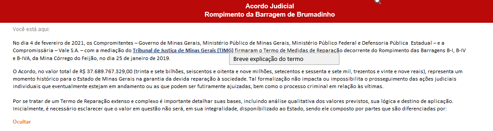
___

- Pop-up
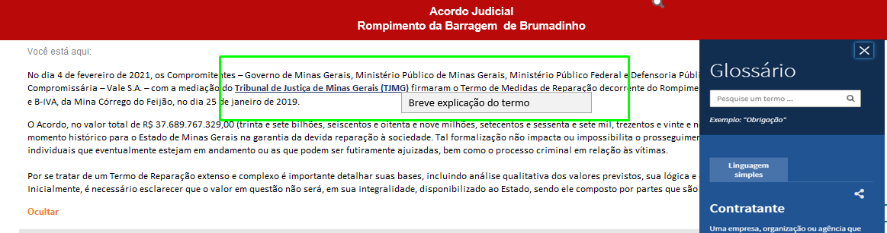

#### Leiaute - Barra de navegação
<a href="#top">(inicio)</a>

A barra de navegação superior será composta pelos seguintes campos:

* Ícones por tipo de consulta;
* Período (dd/mm/aaaa)
* Opção de *'Filtrar por'*;
* Botão *'Monte sua consulta'*

###### Observações:

* A pesquisa básica será composta, inicialmente, por 4 ícones de tipo de consultas:
  * Por projeto
  * Por Execução
  * Por Receita
  * Transferência por Município

* Os ícones serão clicáveis. Quando o usuário posicionar o mouse sobre o ícone será exibido um *tooltip* com uma breve descrição da consulta.

* O campo período será no formato **dd/mm/aaaa** composto por início e fim (eg. 01/04/2021 a 30/12/2021);
* O comportamento da opção *'Filtrar por'* será conforme o tipo de consulta selecionada e como padrão será exibido a opção 'Todos'
  * **Por Projeto**: Ao selecionar essa opção o usuário poderá escolher o Projeto a ser exibido.
  * **Por Órgão**: Ao selecionar esse tipo de consulta no campo *"Filtrar por"* o usuário poderá escolher se a busca será realizada pelo nome do Favorecido, pelo CPF/CNPJ ou Órgão. Nesse caso deverá ser exibido uma barra onde o usuário irá digitar os dados, conforme já ocorre atualmente no PdT.
  * **Por Receita**:
  * **Transferência por Município**: o usuário poderá escolher um Município ser exibido.

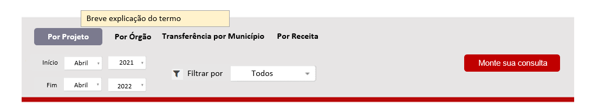

#### Leiaute - Tabelas navegação
<a href="#top">(inicio)</a>

* A tabela de resultado levará em consideração os parâmetros dos filtros aplicados.

* A pesquisa básica irá apresentar como padrão a tabela de resultados com os dados do exercício vigente e os dados da consulta 'Por Projeto'.

* A data de atualização dos dados (*Dados atualizados em*), o período, o ícone *Exibir Gráfico* ou *Fechar Gráfico*, Download, Compartilhar serão exibidos acima do gráfico/tabela de resultados.

* Como padrão os dados serão exibidos no formato de tabela e caso o usuário queira visualizar os dados em forma de gráfico deve clicar em '*Exibir Gráfico*' e os dados da tabela serão deslocados para baixo. Para retornar a exibição apenas no formato tabela o usuário deve clicar em '*Fechar Gráfico*'

* A barra de pesquisa da tabela de resultado deverá retornar os dados a medida que o usuário for digitando. O atributo *placeholder* deve ser aplicado na barra de pesquisa.

* A opção de 'Exibir linhas' (quantidade de linhas) será exibida na parte superior da tabela.

* O usuário poderá solicitar a exibição dos dados com código e descrição. Ao clicar no botão '*Exibir código e descrição*' uma nova coluna será adicionada a esquerda de cada coluna que tenha a descrição.

* Os valores TOTAL GERAL e o SUBTOTAL serão exibidos na tabela de resultados de acordo com o comportamento do usuário:

  * **TOTAL GERAL:** quando o usuário não aplicar nenhum filtro na tabela ou quanto todos os dados forem exibidos em uma única página, ou seja, sem paginação;
  * **SUBTOTAL:** quando o usuário aplicar qualquer filtro na tabela através da barra de pesquisa ou quando houver paginação na tabela de resultado, ou seja, houver mais de uma página de resultado.

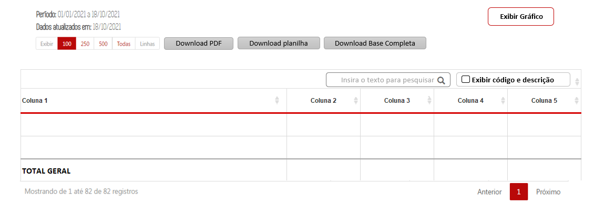

##### Estrutura de design das tabelas de resultados da Pesquisa básica

 * Cabeçalho fixo - Fixer Header ([eg. Consulta de Remuneração do PdT](https://www.transparencia.mg.gov.br/estado-pessoal/remuneracao-dos-servidores/remuneracao-faixa/202112/3/1094/4022/C/3569184/995/26150365));
 * Rolagem horizontal - Horizontal Scroll. Quando o número de colunas ultrapassar o limite da página o PdT deve possibilizar a rolagem horizontal;
 * Colunas movíveis e classificáveis conforme ocorre atualmente;
 * Paginação e seleção da quantidade de linhas a serem exibidas, conforme ocorre atualmente;
 * O texto deve ser ajustável nas colunas, ou seja, caso seja necessário pode haver quebra de linha;
 * A tabela apresentará campos clicáveis (com link) que irá direcionar o usuário para o formulário de detalhamento ou para o próximo nível da consulta.
 * Os campos clicáveis serão destacados conforme o layout já adotado pelo PdT e terão a imagem de uma lupa.

#### Download dos dados:
<a href="#top">(inicio)</a>

* **Download PDF:** O documento gerado em PDF deverá exibir:
 * logo do Portal de Transparência no início da página e
 * *URL*, paginação e a data no fim da página.
 * O arquivo gerado irá exibir os mesmos dados apresentados na tela considerando todos os filtros aplicados e inclusive o TOTAL GERAL ou SUBTOTAL conforme o comportamento do usuário.
 * ao selecionar essa opção o arquivo PDF deverá ser aberto em outra aba do navegador

* **Download Planilha (CSV):**
 * Será exibido a tabela completa de todas as páginas no formato CSV, independente do filtro aplicado.
 * O campo TOTAL GERAL também deverá ser exibido.      
 * Exibir código e descrição em campos distintos, independente de o usuário selecionar a opção '*Exibir código e descrição*'

* **Download base completa:**
 * O usuário será direcionado para o conjunto de dados da respectiva consulta no Portal de Dados Abertos.
 *O PdT deverá permitir que a equipe DTA inclua/altere a *url* desse campo através da área administrativa do Portal.                  
 * O PdT deverá permitir que por meio da área administrativa do Portal a equipe DTA decida se o campo Download Base Completa será exibido ou não na parte superior da tabela de resultado.

#### Barra de pesquisa

A barra de pesquisa deve aceitar várias formas de preenchimento dos dados:

* Desconsiderar acentuação, letras maiúsculas/minúsculas;
* Desconsiderar palavras intermediárias (ex.: Ao digitar “gestao pública”, um dos resultados será “Gestão da Administração Pública”);
* O usuário poderá pesquisar por qualquer coluna na tabela de resultados.

#### Compartilhar dados:
<a href="#top">(inicio)</a>

O usuário poderá Compartilhar os link dos dados nos seguintes canais, no mínimo:

- Twitter
- Facebook
- WhatsApp
- Por e-mail
- Copiar *url*

#### Campos Pesquisa básica - Navegação por filtros

###### Consulta por Projeto

* 1º NÍVEL
  - [Código Projeto]() -> ao clicar o usuário será direcionado para o 2º nível
  - Projeto
  - Anexo
  - Valor Total

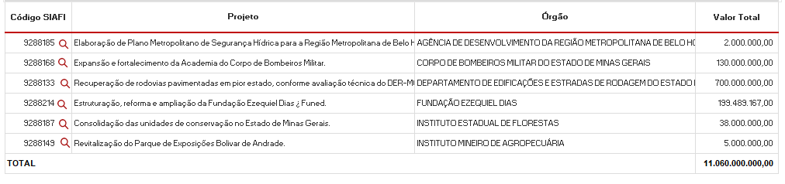

* 2º NÍVEL

  * [Empenho]() -> ao clicar o usuário será direcionado para o 3º nível
  * Data de Registro do Empenho
  * Código Órgão - > apenas quando o usuário clicar em 'Exibir Código e Descrição'         
  * Órgão
  * CNPJ/CPF Favorecido
  * Favorecido
  * Valor Despesa Empenhada            
  * Valor Despesa Liquidada         
  * Valor Pago
  * Valor Liquidado em Restos a Pagar
  * Valor Pago em Restos a Pagar
  * Valor Total Pago

  

* 3º NÍVEL
    - Formulário de Detalhamento

###### Consulta por Execução

  * 1º NÍVEL
    * [Código Projeto]() -> ao clicar o usuário será direcionado para o 2º nível
    * Código Órgão -> -> apenas quando o usuário clicar em 'Exibir Código e Descrição'           
    * Órgão               
    * Valor Despesa Empenhada            
    * Valor Despesa Liquidada         
    * Valor Pago
    * Valor Liquidado em RP
    * Valor Pago em Restos a Pagar
    * Valor Total Pago     

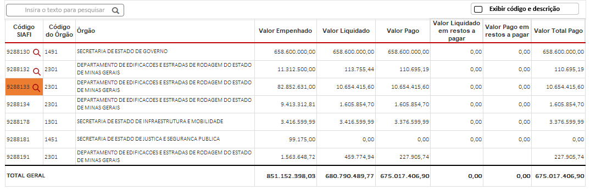

  * 2º NÍVEL
    * [Empenho]() -> ao clicar o usuário será direcionado para o 3º nível
    * Data de Registro do Empenho
    * CNPJ/CPF Favorecido
    * Favorecido
    * Valor Despesa Empenhada            
    * Valor Despesa Liquidada         
    * Valor Pago
    * Valor Liquidado em Restos a Pagar
    * Valor Pago em Restos a Pagar
    * Valor Total Pago

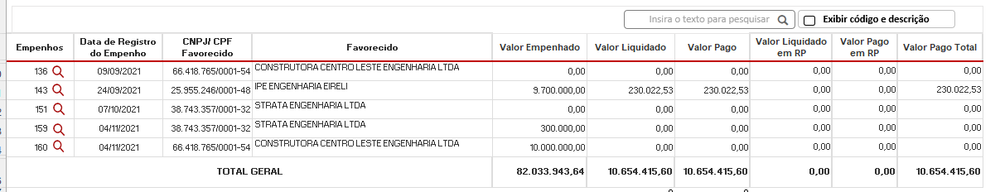

  * 3º NÍVEL - Formulário de Detalhamento

###### Consulta por Município

  * 1º NÍVEL  
    * Ano      
    * Município           
    * [Empenho]()       
    * Data de Registro do Pagamento
    * Situação da Ordem de Pagamento
    * Valor Pago

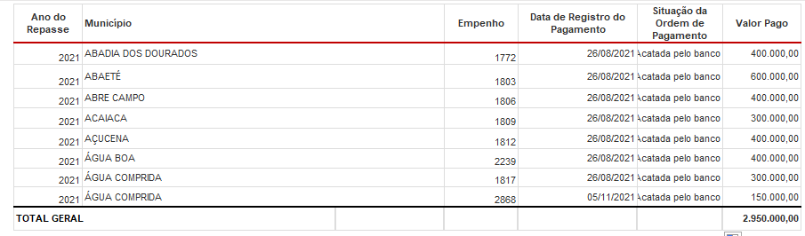

* 2º NÍVEL
  - Segundo nível da consulta por Execução

* 3º NÍVEL
    - Formulário de Detalhamento

###### Consulta por Receita

  * 1º NÍVEL       
    * Ano de Exercício     
    * Código da Classificação da Receita -> apenas quando o usuário clicar em 'Exibir Código e Descrição'   
    * Classificação da Receita
    * Código da Fonte de Recurso -> apenas quando o usuário clicar em 'Exibir Código e Descrição'   
    * Fonte de Recurso
    * Valor Previsto Inicial
    * Valor Previsto Atualizado
    * Valor Arrecadado

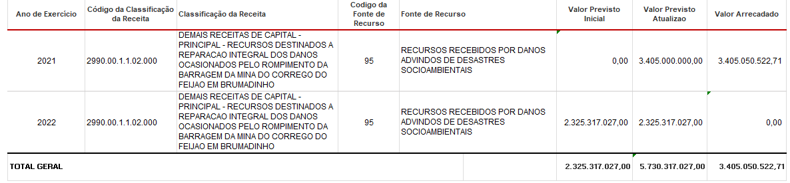

#### Leiaute - Formulário de Detalhamento
<a href="#top">(inicio)</a>

Ao clicar em campo clicável da tabela de resultados o usuário será direcionado para o formulário de detalhamento, que será composto pelos seguintes atributos:

* As tabelas que compõe o formulário de detalhamento serão exibidas em formato de guias (eg. [*Tabs*](https://www.w3schools.com/howto/howto_js_tabs.asp))

* O usuário poderá fazer o Download das informações do formulário de detalhamento ao clicar no botão '*Download*'.
A exportação em planilha (CSV) deverá ser em formato de tabela. Cada campo em uma coluna.

##### Campos do formulário de detalhamento

* Classificação Orçamentária
 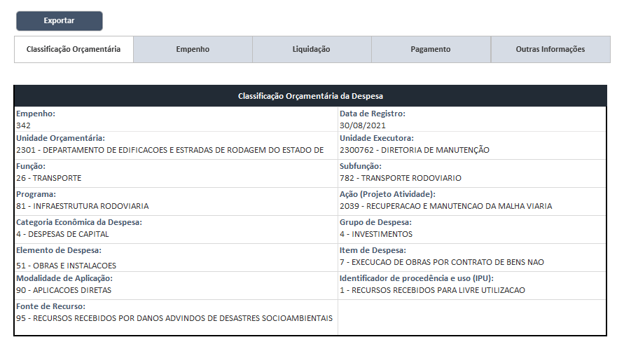

* Empenho
 

* Liquidação
 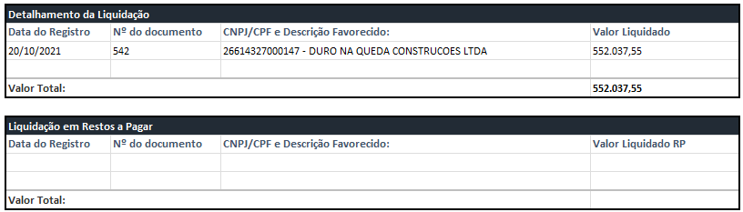

* Pagamento
 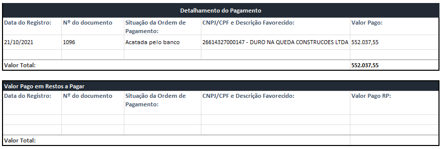

* Outras Informações
  

## Monte sua consulta
<a href="#top">(inicio)</a>

A pesquisa será composta pelos seguintes componentes:

* Barra de navegação vertical com filtros;
* Filtros Aplicados;
* Tabela de Resultado;

### Barra de Navegação Vertical
<a href="#top">(inicio)</a>

 Atributos da barra de navegação vertical:

* Todos os filtros deverão apresentar uma breve descrição.
* Todos os campos da barra vertical poderão ser consultados por descrição ou código, assim como ocorre na [Consulta Avançada do PdT - Proposta Orçamentária](https://www.transparencia.mg.gov.br/planejamento-e-resultados/proposta-lei-orcamentaria/proposta-orcamentaria/proposta-pesquisa-avancada) em que é possível digitar o nome ou a descrição nos filtros.
* A lista de filtros será localizada a esquerda da tela. Caso a quantidade de filtros ultrapasse o limite da tela deverá ser utilizado a barra de rolagem.
[Ver filtros - Especificação Dados](https://github.com/transparencia-mg/especificacoes-portal-transparencia/blob/espec018_recusos-vale/espec018_recursos-acordo-judicial-vale/recursos-vale-dados.md)

* O usuário poderá realizar a busca de qualquer filtro na **barra de pesquisa**. A barra de pesquisa deverá possuir atributo [placeholder](https://www.w3schools.com/tags/att_input_placeholder.asp) para facilitar ou indicar como o campo deverá sem preenchido.

* Alguns filtros da barra de navegação também deverão possuir atributos *placeholder*.

* A barra de navegação poderá ser **ocultada/exibida** ([*collapsed Sidebar*](https://www.w3schools.com/howto/howto_js_collapse_sidebar.asp)) a partir dos comandos (eg. [Portal de Transparência Federal](http://www.portaltransparencia.gov.br/despesas/programa-e-acao?ordenarPor=programa&direcao=asc))

    *	Ocultada => ao clicar no símbolo **[<<]** ou no botão **[<< Ocultar Filtros]**;
    * Exibida => ao clicar no botão **[<< Exibir Filtros]**

**OBS**: Ao ocultar a barra de navegação vertical dos demais conteúdos (tabela de resultados, campos aplicados e etc) serão reajustados na página.

* Ao clicar em qualquer filtro da barra de navegação será exibido uma outra barra de filtros onde o usuário deverá selecionar os parâmetros da pesquisa.  

### Barra deslizante para baixo
<a href="#top">(inicio)</a>

* A barra deslizante só será exibida se o usuário clicar em algum filtro  da barra de navegação vertical.
* A barra deslizante será **ocultada** ao clicar em outro filtro.

* Quando a barra deslizante for ocultada e as opções forem selecionadas a seção em que o utilizador se encontra deverá apresentar a quantidade de filtros foram selecionados. Exemplo tela wireframe proposta pela Prodemge [Slides 13 e 16](https://xd.adobe.com/view/64a90aea-4369-4d8d-b426-72f46590dbcd-31fa/screen/649d572d-e66a-466a-afae-96ed268ab76c)

* Ao clicar sob a **barra de pesquisa** será exibido uma lista suspensa com todos os parâmetros referente ao filtro. Para selecionar o parâmetro desejado o usuário poderá usar a barra de rolagem ou a barra de pesquisa.  

* A barra deslizante deverá listar os parâmetros selecionados com a opção ***['x']() (excluir)***. O usuário poderá remover os parâmetros não desejados clicando no ***['x']()***.

* O usuário poderá combinar vários parâmetros para o mesmo filtro (selecionar mais de um item) ou selecionar a opção ***[Exibir Todos]***.
* Ao selecionar ***[Exibir Todos]***, abrirá uma tela modal exibindo todos os parâmetros daquele filtro com as opções *Selecionar tudo, Limpar Seleção, Inverter seleção*. O usuário poderá remover os parâmetros não desejados ao assinalar com tique a opção.  
eg. [Slides 10](https://xd.adobe.com/view/965f7297-a884-462e-af3c-902944963cb1-c30c/screen/f342f2a6-6869-4a32-98aa-c77e9fe30dd3)

* Os botões **Aplicar/Limpar** devem ser estilisticamente diferenciados (eg. [*Differentiate button types*](https://medium.com/nextux/design-better-buttons-6b64eb7f13bc#aj%20la%20lb))

* Ao selecionar o período específico a barra deslizante de cada filtro irá exibir como parâmetros apenas as classificações orçamentárias vigentes no ano. A exceção será para a consulta de Restos a Pagar, onde os parâmetros da barra deslizante irá refletir apenas as classificações orçamentárias inscritas em restos a pagar, e não a classificação orçamentária vigente no ano.

* A medida que o usuário selecionar um parâmetro de qualquer filtro automaticamente apenas as opções que possuem relacionamento com o parâmetro selecionado será exibida nos demais filtros.    

Exemplo:   
Ao selecionar o parâmetro '1521- Controladoria-Geral do Estado' no filtro *Órgão* e em seguida clicar no filtro *Programa* apenas os programas que tiveram execução na Controladoria-Geral do Estado naquele ano serão exibidos.

O [Portal da Transparência do Estado de São Paulo](www.fazenda.sp.gov.br/SigeoLei131/Paginas/FlexConsDespesa.aspx) possui a funcionalidade citada acima.

* Todos os parâmetros selecionados serão exibidos no campo **Filtros Aplicados**.

### Filtros Aplicados
<a href="#top">(inicio)</a>

* O usuário poderá **ocultar/exibir** o conteúdo do campo filtros aplicados a partir do comandos: (eg. [Portal de Transparência Federal](http://www.portaltransparencia.gov.br/despesas/programa-e-acao?ordenarPor=programa&direcao=asc) ).

  * **[^]**: Exibi o conteúdo do campo;
  * **[v]**: Oculta o conteúdo do campo. Ao ocultar os dados do campo os demais conteúdos da tela serão ajustados na página.
  .

* Como padrão o filtro **Período** será exibido no campo filtros aplicados. O período exibido será o dd/mm/aaaa inicial do exercício vigente até o dd/mm/aaaa da última atualização dos dados.

* O campo filtro aplicados será composto pelos botões: Pesquisar, Atualizar e Limpar tudo localizados na parte superior:

  * A posição na tela dos botões Pesquisar e Atualizar será a mesma, sendo a exibição de um ou outro realizada de acordo com as regras abaixo.
  * Pesquisar: será exibido após o usuário selecionar qualquer parâmetro na barra deslizante.  O Usuário deverá clicar em pesquisar para exibir o resultado desejado.
  * Atualizar: será exibido quando o usuário remover/adicionar algum parâmetro, ou seja, fizer qualquer alteração no campo filtros aplicados.
  * Limpar tudo: ficará disponível sempre que houver pelo menos um parâmetro selecionado. Ao clicar nesse botão será excluído todo o conteúdo desse campo.

OBS: Os botões **Pesquisar/ Atualizar/Limpar** devem ser estilisticamente diferenciados (eg. [*Differentiate button types*](https://medium.com/nextux/design-better-buttons-6b64eb7f13bc#aj%20la%20lb))

* O usuário poderá excluir um filtro por completo. Por exemplo, caso o usuário queira excluir o campo 'Órgãos' ele poderá fazer isso sem a necessidade de excluir os filtros um a um. Ele poderá excluir o campo "ÓRGÃO"

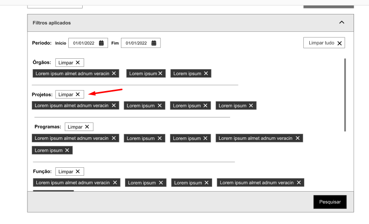

* Casos os parâmetros selecionados não retornem nenhuma informação o PdT deverá apresentar uma mensagem informando que '*Não há dados a serem exibidos com os parâmetros selecionados.*''

* Os parâmetros selecionados na barra deslizante deverão ser exibidos na ordem que o usuário escolheu.

* Todos os parâmetros serão representados no campo filtros aplicados da seguinte forma:
  * **Filtro** (*nome do filtro*): **Parâmentro** (*nome do parâmetro*)-(**[X]()**)(*excluir*);

* À medida que o usuário for incluindo parâmetros na pesquisa a tabela de resultados será deslocada para baixo quando ultrapassar o limite da tela (eg. [Portal de Transparência Federal](http://www.portaltransparencia.gov.br/despesas/programa-e-acao?ordenarPor=programa&direcao=asc)).

* Caso o usuário selecione uma grande quantidade de filtros será acrescentado a opção *Ver mais* abaixo da lista de filtros.

### Tabela de resultados
<a href="#top">(inicio)</a>

* A tabela de resultado levará em consideração os parâmetros do campo filtros aplicados.

* A tabela apresentará colunas padrões que serão exibidas independentemente de o usuário selecionar/aplicar algum filtro. [Ver especificação dados](https://github.com/transparencia-mg/especificacoes-portal-transparencia/edit/espec018_recusos-vale/espec018_recursos-acordo-judicial-vale/recursos-vale-dados.md).

* A data de atualização dos dados, e a opção de compartilhamento serão exibidos acima da tabela de resultados.

* Os valores **TOTAL GERAL** e o **SUBTOTAL** serão exibidos na tabela de resultados de acordo com o comportamento do usuário:

  * TOTAL GERAL: quando o usuário não aplicar nenhum filtro na tabela ou quanto todos os dados forem exibidos em uma única página, ou seja, sem paginação;   

  * SUBTOTAL: quando o usuário aplicar qualquer filtros na tabela através da barra de pesquisa ou quando houver paginação no tabela de resultado, ou seja, houver mais de uma página de resultado.

* A tabela de resultados não exibirá os campos **TOTAL GERAL** e o **SUBTOTAL** quando não houver dados referentes a valores.

* A **barra de pesquisa** da tabela de resultado deverá retornar os dados da tabela que estão exibidos. A medida que o usuário for digitando os dados a busca será acionada. O atributo *placeholder*: deve ser aplicado na barra de pesquisa.

* Estrutura de design das tabelas de resultados:
  * Cabeçalho fixo - *[Fixer Header](https://medium.com/nextux/design-better-data-tables-4ecc99d23356#86cf)* (eg. [Consulta de Remuneração do PdT](http://www.transparencia.mg.gov.br/estado-pessoal/remuneracao-dos-servidores/remuneracao-faixa/202103/1/1038/4158/C/3251081/986/23239313));

  

  * Rolagem horizontal - *[Horizontal Scroll](https://medium.com/nextux/design-better-data-tables-4ecc99d23356#2dba)*. Quando o número de colunas ultrapassar o limite da página o PdT deve possibilizar a rolagem horizontal.

  

  * Colunas movíveis e classificáveis conforme ocorre atualmente;

  * Paginação e seleção da quantidade de linhas a serem exibidas, conforme ocorre atualmente;
  * O texto deve ser ajustável nas colunas, ou seja, caso seja necessário pode haver quebra de linha;

* O usuário poderá adicionar ou remover colunas - [*hide/show columns*](https://ux.stackexchange.com/a/110079) na tabela de resultados. Ao clicar em **Adicionar/Remover colunas** será exibido uma barra lateral a direta com todas as colunas que poderão ser adicionadas ou removidas (eg. [Portal da Transparência Federal](http://www.portaltransparencia.gov.br/despesas/consulta?ordenarPor=mesAno&direcao=desc)).

* Ao exibir ou ocultar alguma coluna a tabela de resultados será atualizada automaticamente (eg.[Column Toggle Table](https://ux.stackexchange.com/questions/110077/best-practices-to-allow-user-to-hide-show-columns-in-a-data-table/110079#110079)).

* O ícone **Adicionar/Remover Colunas** além dos filtros pré-determinados pela DTA terá uma barra de pesquisa onde o usuário poderá digitar o filtro desejado.

* As colunas definidas como padrão ficarão marcadas na tabela ***Adicionar/Remover Colunas*** podendo o usuário desativá-las.

* Ao inserir qualquer coluna essas serão incluídas antes das colunas de valores. E caso seja incluída alguma coluna de valor o portal deverá manter a ordem da execução orçamentária (Valor empenhado, valor liquidado, valor pago, valor liquidado em RP, Valor Pago em RP, Valor Total Pago).

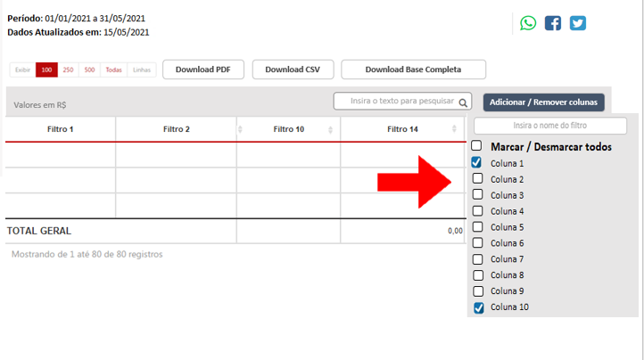

* Alguns filtros da tabela apresentará campos clicáveis (com link) que irá direcionar o usuário para o formulário de detalhamento da consulta (eg. [Consulta Compras e Contratos PdT](http://www.transparencia.mg.gov.br/compras-e-patrimonio/compras-e-contratos/comprasecontratos-resultado-pesquisa-avancada/2021/01-01-2021/31-12-2021/1831070/0/0/0/0/0/0/0/0/0/0/0/0/0/0/0/0/0/0/0/0/0/0/0/0/0/0/0/0/0/0/0/0/0/0/0/0/0/0)).

* Os campos clicáveis serão destacados conforme o layout já adotado pelo PdT e terão a imagem de uma lupa.

#### Download dos dados:

Seguir o padrão da pesquisa básica

### Observações gerais:

* Todas as **barras de pesquisa** devem aceitar várias formas de preenchimento dos dados.
  * Autocompletar (*autocomplete* ) desde a primeira letra (eg. [Portal de Transparência MG](http://www.transparencia.mg.gov.br/planejamento-e-resultados/proposta-lei-orcamentaria/proposta-orcamentaria/proposta-pesquisa-avancada));
  * Desconsiderar acentuação, letras maiúsculas/minúsculas;
  * Desconsiderar palavras intermediárias (ex.: Ao digitar “gestao pública”, um dos resultados será “Gestão da Administração Pública”);
  * O usuário poderá pesquisar código ou descrição das classificações orçamentárias (eg. [Proposta Orçamentára - PdT MG](http://www.transparencia.mg.gov.br/planejamento-e-resultados/proposta-lei-orcamentaria/proposta-orcamentaria/proposta-pesquisa-avancada)).   

* Todos os filtros selecionados serão exibidos na tabela de resultado.

* A exibição de código e descrição será diferente em cada seção:

 * Barra de pesquisa e filtros aplicados: exibir código e descrição no mesmo campo (eg. [Proposta Orçamentára - PdT MG](http://www.transparencia.mg.gov.br/planejamento-e-resultados/proposta-lei-orcamentaria/proposta-orcamentaria/proposta-pesquisa-avancada));
 * Tabela de resultado: exibir apenas descrição. Os códigos serão exibidos apenas se o usuário adicionar a coluna;
 * Opção exportar CSV.: exibir código e descrição em campos distintos, independente de o usuário selecionar a opção código na tabela de resultado.
