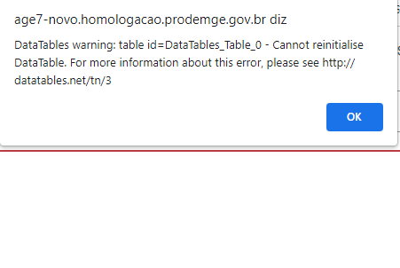

# Homologação dos dados da consulta - FORMULÁRIO DE DETALHAMENTO
<a href="#top">(inicio)</a>

## FORMULÁRIO DE DETALHAMENTO
<a href="#top">(inicio)</a>

### Classificação Orçamentária

Foi realizada a conferência dos dados do Portal com os dados do Armazém BO.

Foram identificados erros nos seguintes itens:
  - Na modalidade de Aplicação foi informado o elemento de despesa
  - No Elemento de Despesa foi informado o item de despesa
  - No Item de Despesa foi informado a modalidade de aplicação

Abaixo foram identificadas as colunas com erros

 

#### Observação:

Ao clicar no nível 1, aparece a mensagem de erro abaixo

Adequar a Página Inicial do Portal para recepcionar a nova consulta de transparência dos recursos da Vale.

### Nível 1

Foi realizada a conferência dos dados do Portal com os dados do Armazém BO e foram identificados erros nos dados dos empenhos, liquidações e pagamentos.

##### PROJETO 9288134 (detalhamento na planilha)

- Dados incorretos baixados do armazém BO – foram localizados vários empenhos com erro (43, 44, 46, 90, 109, 146, 148, 150 e 200)

##### PROJETO 9288143 (detalhamento na planilha)
- Dados incorretos baixados do armazém BO – foram localizados vários empenhos com erro (33, 35, 36, 37, 38, 44, 45, 46, 47, 48, 49)
