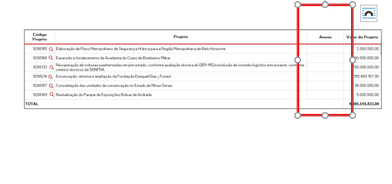

# Homologação dos dados da consulta - CONSULTA PROJETO
<a href="#top">(inicio)</a>

## Consulta por Projeto
<a href="#top">(inicio)</a>

### Nível 1

  
#### 1. Coluna Anexo - OK
  

#### 2. Coluna PROJETO - OK
  

  
### Nível 2  
  

Foi realizada a conferência dos dados do Portal com os dados do Armazém BO e foram identificados erros nos dados dos empenhos, liquidações e pagamentos.

##### PROJETO 9288143 (detalhamento na planilha) - ERRO

- Não foram localizados os empenhos referentes ao ano de 2021 (empenhos 36, 37, 38 e 44, todos de 2021)
  

##### PROJETO 9288134 (detalhamento na planilha) - ERRO

- Não foram localizados alguns empenhos referentes ao ano de 2021 (empenhos 109, 146, 148, 150 e 200, todos de 2021)
- As informações sobre despesa empenhada, despesa liquidada e valor pago financeiro do portal, também não coincidiram com os dados do armazém.
  

  

