# Homologação do Layout

[Ambiente de Homologação](https://age7-novo.homologacao.prodemge.gov.br/)

## Página Inicial

Adequar a Página Inicial do Portal para recepcionar a nova consulta de transparência dos recursos da Vale.

- **OK** Criar de um quadro informativo (slideshow) que irá apresentar as novidades que forem lançadas no Portal;

- **OK** Criar uma consulta (bloco) específico para disponibilizar as consultas de eventos extraordinários. Inicialmente esse menu será composto pela Consulta COVID e a Consulta do Acordo Judicial da Vale.

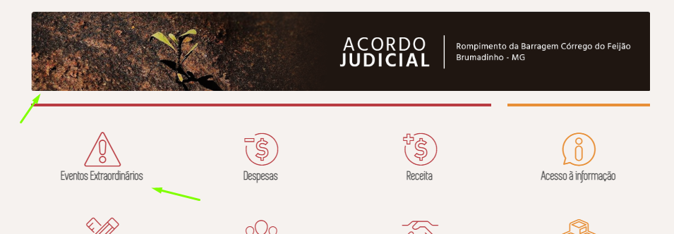

**Dúvida**

Teremos acesso através do joomla para alterar o conteúdo abaixo? Se não é preciso retirar esse texto. Se sim, fazemos essa alteração por aqui mesmos

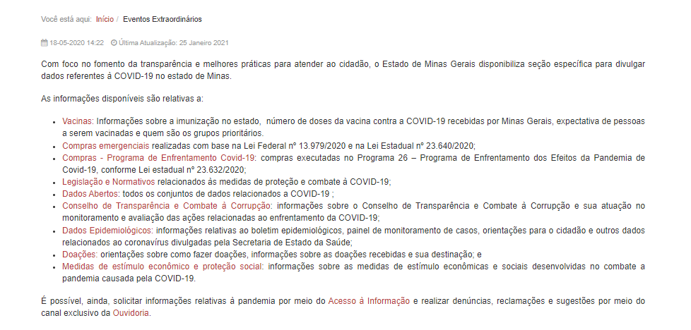

 

## Página Inicial da consulta - Pesquisa Básica

#### Texto explicativo

O texto do título da consulta está muito próximo do ícone de Menu. Será que podemos colocar uma quebra de linha para melhor visualização. Não tenho uma opinião formada sobre isso. Seria interessante acionar a área de design.

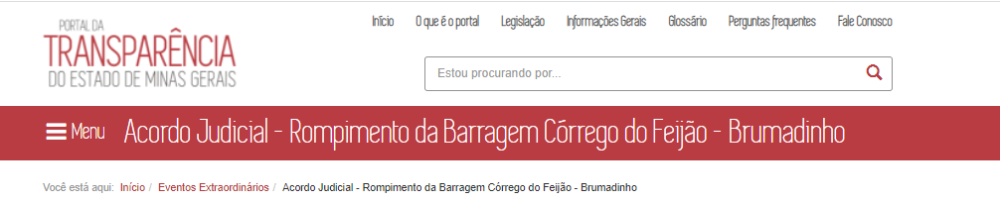

 

 ______________________

OK
--
**OK** Inclusão de um campo que irá trazer uma breve explicação do conteúdo da consulta.  

Atributos do campo:

* **OK** O usuário poderá exibir mais detalhes do texto ao clicar em "*Mais*" ou ocultar ao clicar "*Menos*". [eg. Leroy Merlin](https://www.leroymerlin.com.br/materiais-hidraulicos).

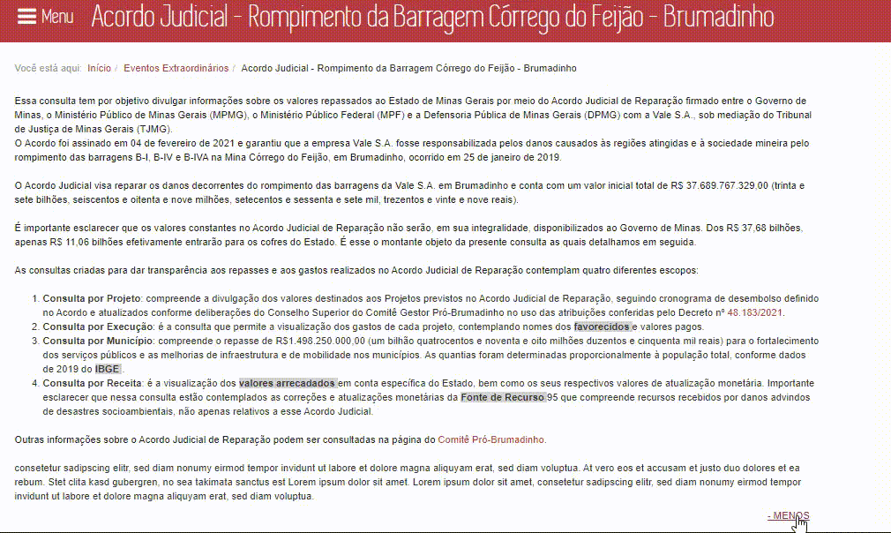
--

 

**A formatação escolhida (colorido cinza) para destacar os termos está um pouco apagada. Favor verificar com a área de design outra opção.**

* A funcionalidade deverá permitir a visualização de *tooltip* ao posicionar o mouse sobre uma palavra ou termo. [eg. tooltips](https://getbootstrap.com.br/docs/4.1/components/tooltips/)  

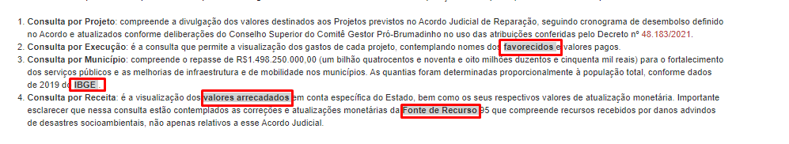

**Deslocar o glossário para a parte direita da tela, conforme solicitado em reunião e homologado nas telas wireframe.**

* Ao clicar sobre a palavra ou termo o PdT deverá abrir um um *pop-up* em forma de glossário. [eg. pop-up](https://www.usaspending.gov/)

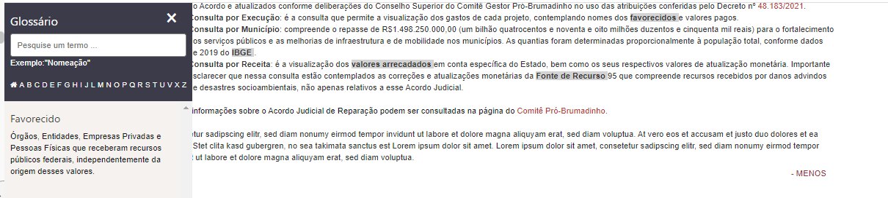

* O PdT deverá permitir que por meio da área administrativa do Portal a equipe DTA inclua ou altere os dados desse campo incluindo os *tooltips*.

#### Leiaute - Barra de navegação

A barra de navegação superior será composta pelos seguintes campos:

* Ícones por tipo de consulta;
* Período (dd/mm/aaaa)
* Opção de *'Filtrar por'*;
* Botão *'Monte sua consulta'*

###### Observações:

Trocar o nome das consultas
--
* A pesquisa básica será composta, inicialmente, por 4 ícones de tipo de consultas:
  * Projeto
  * Execução
  * Receita
  * Transferência por Município

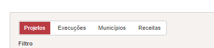

* **OK** Os ícones serão clicáveis. Quando o usuário posicionar o mouse sobre o ícone será exibido um *tooltip* com uma breve descrição da consulta.

* **OK** O campo período será no formato **dd/mm/aaaa** composto por início e fim (eg. 01/04/2021 a 30/12/2021);

* O comportamento da opção *'Filtrar por'* será conforme o tipo de consulta selecionada e como padrão será exibido a opção 'Todos'

  * **OK** **Por Projeto**: Ao selecionar essa opção o usuário poderá escolher o Projeto a ser exibido.

  

  * **Por Execução**: Ao selecionar esse tipo de consulta no campo *"Filtrar por"* o usuário poderá escolher se a busca será realizada pelo nome do Favorecido, pelo CPF/CNPJ ou Órgão. Nesse caso deverá ser exibido uma barra onde o usuário irá digitar os dados, conforme já ocorre atualmente no PdT.

**Corrigir**

  1- Ao escolher o nome de um órgão não é exibido nenhum resultado, mesmo havendo dados referente ao órgão selecionado.

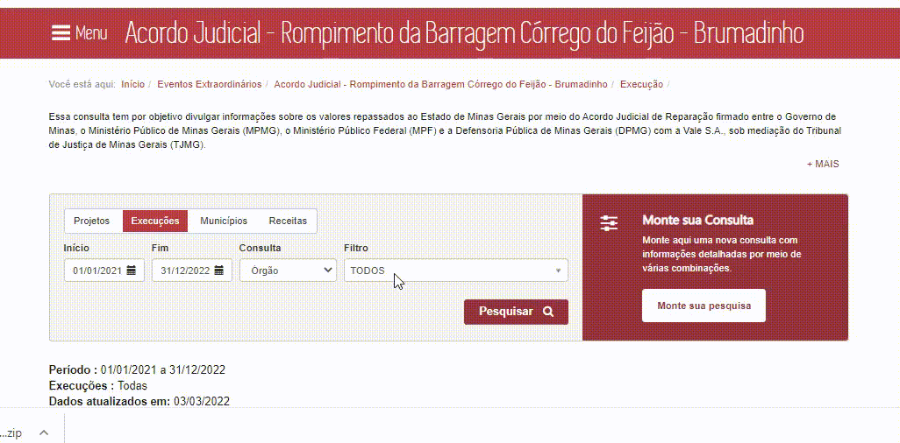

**Corrigir**

  2- Ao selecionar um favorecido por nome ou CPF/CNPJ o portal apresenta erro. Esse erro é mesmo já relatado no issues;

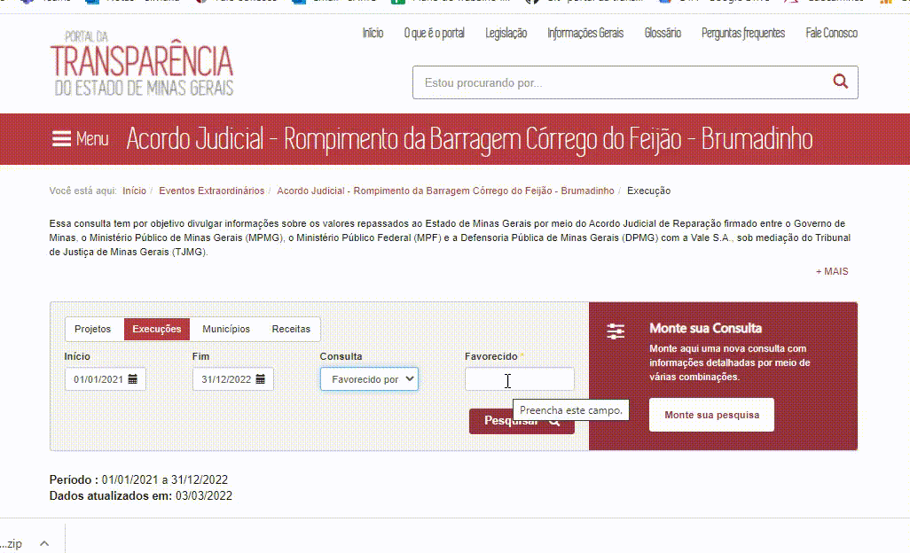

**Corrigir**

  3- A descrição dos órgãos na caixa de busca deve obedecer o mesmo padrão já adotado no Portal, ou seja, apenas as primeiras letras em maiúsculo.

* **Por Receita**:

Corrigir
--
O campo filtro não apresenta as opções

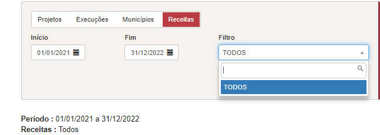

  * **OK**  **Transferência por Município**: o usuário poderá escolher um Município ser exibido.

**CORRIGIR - Cabeçalho da Planilha**

1- Ao selecionar a consulta por projeto o período não será exibido, pois a consulta é atemporal.

2- O texto a ser exibido não é Projeto da Vale e sim apenas **Projeto**

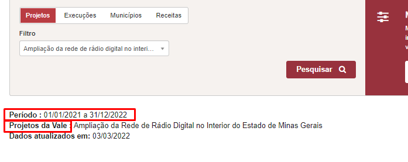

3- Como o filtro Órgão da consulta execução não está funcionando não é possível verificar se os valores exibidos estão corretos

4- Ao selecionar o filtro "Favorecido por nome" ou "Favorecido por CPF/CNPJ" a informação não é exibida

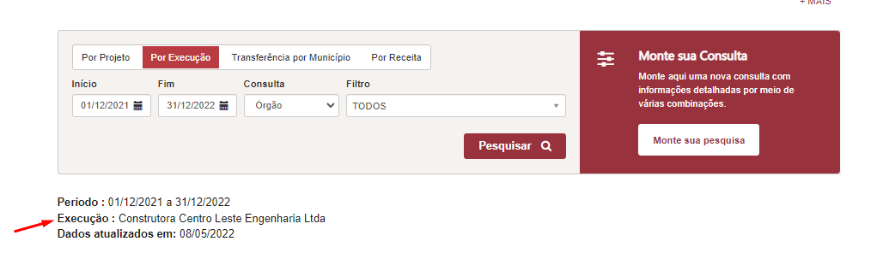

5 - Apenas a informação Municípios deve ser exibida;
6- Ao selecionar um municipio a informação não é exibida

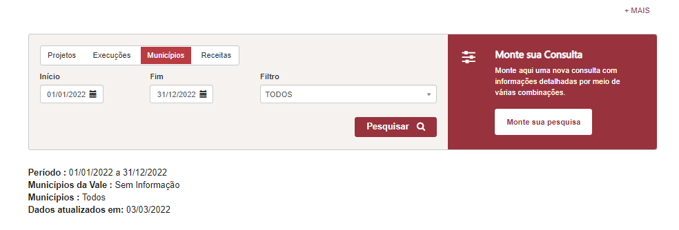

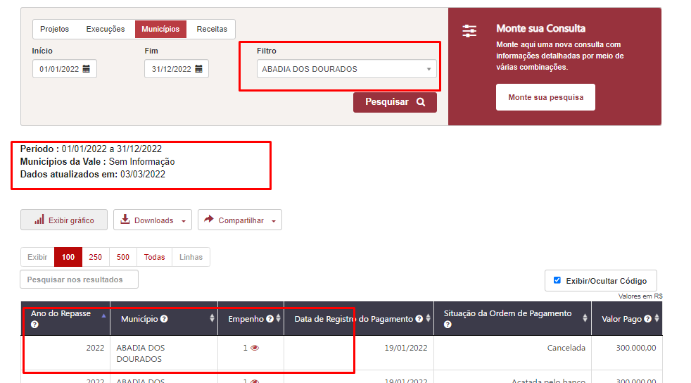

7- Como não há informações no filtro  da consulta por receita não é possível verificar se os valores exibidos estão corretos.

#### Leiaute - Tabelas navegação

* A tabela de resultado levará em consideração os parâmetros dos filtros aplicados.

* **OK** A pesquisa básica irá apresentar como padrão a tabela de resultados com os dados do exercício vigente e os dados da consulta 'Por Projeto'.

* A data de atualização dos dados (*Dados atualizados em*), o período, o ícone *Exibir Gráfico* ou *Fechar Gráfico*, Download, Compartilhar serão exibidos acima do gráfico/tabela de resultados.

**Verificar**

1- Foi solicitado que os campos Download, Compartilhar fossem exibidos acima do gráfico/tabela, porém ao solicitar a exibição do gráfico a informação se perde na parte superior e o usuário pode não perceber que os dados podem ser baixados.
É possível colocar esses campos próximo a tabela?

2- Como teremos apenas uma opção de gráfico não é preciso colocar o campo 'gráfico área'

3- O gráfico da consulta por Projeto não está exibindo os dados que constam na tabela

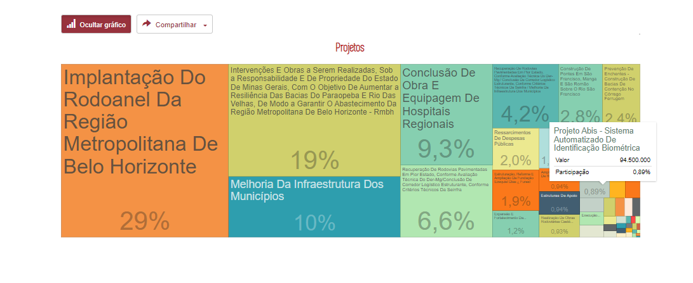

* **OK** Como padrão os dados serão exibidos no formato de tabela e caso o usuário queira visualizar os dados em forma de gráfico deve clicar em '*Exibir Gráfico*' e os dados da tabela serão deslocados para baixo. Para retornar a exibição apenas no formato tabela o usuário deve clicar em '*Fechar Gráfico*'

* **OK** A barra de pesquisa da tabela de resultado deverá retornar os dados a medida que o usuário for digitando. O atributo *placeholder* deve ser aplicado na barra de pesquisa.

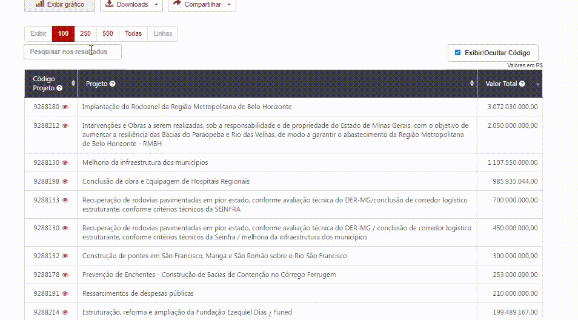

* **OK** A opção de 'Exibir linhas' (quantidade de linhas) será exibida na parte superior da tabela.

* O usuário poderá solicitar a exibição dos dados com código e descrição. Ao clicar no botão '*Exibir código e descrição*' uma nova coluna será adicionada a esquerda de cada coluna que tenha a descrição.

**Corrigir**

1 - A funcionalidade Exibir Código não está funcionado na consulta por Execução.

2 - Na consulta de receita o padrão é exibir o código apenas quando o usuário marcar a opção '*Exibir código e descrição*'

* **OK** Os valores TOTAL GERAL e o SUBTOTAL serão exibidos na tabela de resultados de acordo com o comportamento do usuário:

  * **TOTAL GERAL:** quando o usuário não aplicar nenhum filtro na tabela ou quanto todos os dados forem exibidos em uma única página, ou seja, sem paginação;
  * **SUBTOTAL:** quando o usuário aplicar qualquer filtro na tabela através da barra de pesquisa ou quando houver paginação na tabela de resultado, ou seja, houver mais de uma página de resultado.

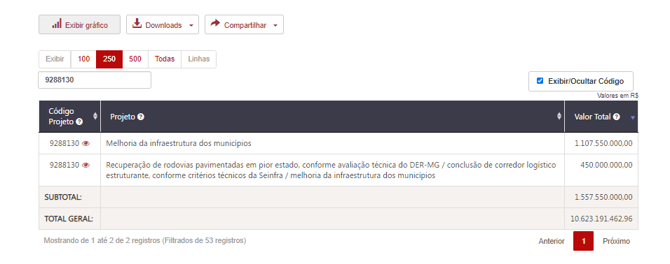
