# **ERROS PENDENTES DE CORREÇÃO E/OU VERIFICAÇÃO**

#### Homologação do Layout
<a href="#top">(inicio)</a>

[Ambiente de Homologação](https://age7-novo.homologacao.prodemge.gov.br/)

#### 1. Página Inicial
<a href="#top">(inicio)</a>

Adequar a Página Inicial do Portal para recepcionar a nova consulta de transparência dos recursos da Vale.

- **OK** Criar de um quadro informativo (slideshow) que irá apresentar as novidades que forem lançadas no Portal;

- **OK** Criar uma consulta (bloco) específico para disponibilizar as consultas de eventos extraordinários. Inicialmente esse menu será composto pela Consulta COVID e a Consulta do Acordo Judicial da Vale.

**Acesso concedido**

Teremos acesso através do joomla para alterar o conteúdo abaixo? Se não é preciso retirar esse texto. Se sim, fazemos essa alteração por aqui mesmos

 

#### 2. Página Inicial da consulta - Pesquisa Básica
<a href="#top">(inicio)</a>

#### 2.1 Texto explicativo
<a href="#top">(inicio)</a>

**CORRIGIDO**

~O texto do título da consulta está muito próximo do ícone de Menu. Será que podemos colocar uma quebra de linha para melhor visualização. Não tenho uma opinião formada sobre isso. Seria interessante acionar a área de design.~

OK
--
**OK** Inclusão de um campo que irá trazer uma breve explicação do conteúdo da consulta.  

Atributos do campo:

* **OK** O usuário poderá exibir mais detalhes do texto ao clicar em "*Mais*" ou ocultar ao clicar "*Menos*". [eg. Leroy Merlin](https://www.leroymerlin.com.br/materiais-hidraulicos).

--

 

**CORRIGIDO**

~A formatação escolhida (colorido cinza) para destacar os termos está um pouco apagada. Favor verificar com a área de design outra opção.~

* A funcionalidade deverá permitir a visualização de *tooltip* ao posicionar o mouse sobre uma palavra ou termo. [eg. tooltips](https://getbootstrap.com.br/docs/4.1/components/tooltips/)  

GLOSSÁRIO

<a href="#top">(inicio)</a>

**CORRIGIDO** 26/05/2022

~Ao deslocar o glossário para direita o botão de acessibilidade está atrapalhando a leitura do texto em alguns caso. Vide imagem abaixo. Sugiro que a formatação utilizada seja a mesma do termo "Favorecido"~

O botão de acessibilidade foi deslocado para a esquerda

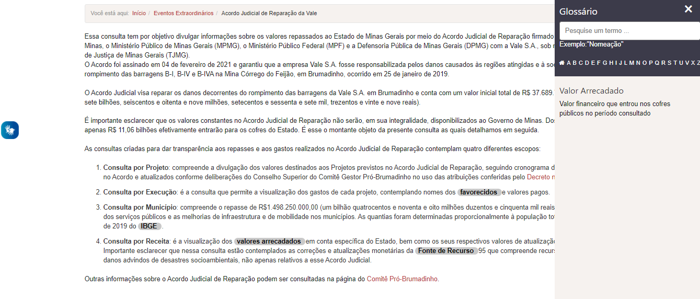

~Deslocar o glossário para a parte direita da tela, conforme solicitado em reunião e homologado nas telas wireframe.~

* Ao clicar sobre a palavra ou termo o PdT deverá abrir um um *pop-up* em forma de glossário. [eg. pop-up](https://www.usaspending.gov/)

* O PdT deverá permitir que por meio da área administrativa do Portal a equipe DTA inclua ou altere os dados desse campo incluindo os *tooltips*.

#### 2.3 Leiaute - Barra de navegação
<a href="#top">(inicio)</a>

A barra de navegação superior será composta pelos seguintes campos:

* Ícones por tipo de consulta;
* Período (dd/mm/aaaa)
* Opção de *'Filtrar por'*;
* Botão *'Monte sua consulta'*

###### Observações:

CORRIGIDO   ~Trocar o nome das consultas~

* A pesquisa básica será composta, inicialmente, por 4 ícones de tipo de consultas:
  * Projeto
  * Execução
  * Receita
  * Transferência por Município

* Os ícones serão clicáveis. Quando o usuário posicionar o mouse sobre o ícone será exibido um *tooltip* com uma breve descrição da consulta.

**CORRIGIDO**

~A funcionalidade de exibição do tooltip estava funcionando, porém na versão do dia 09/05 ela foi desabilitada.~

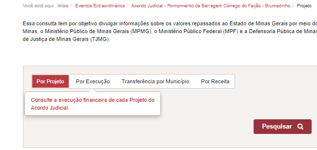

* **OK** O campo período será no formato **dd/mm/aaaa** composto por início e fim (eg. 01/04/2021 a 30/12/2021);

* O comportamento da opção *'Filtrar por'* será conforme o tipo de consulta selecionada e como padrão será exibido a opção 'Todos'

  * **OK** **Por Projeto**: Ao selecionar essa opção o usuário poderá escolher o Projeto a ser exibido.

  

  * **Por Execução**: Ao selecionar esse tipo de consulta no campo *"Filtrar por"* o usuário poderá escolher se a busca será realizada pelo nome do Favorecido, pelo CPF/CNPJ ou Órgão. Nesse caso deverá ser exibido uma barra onde o usuário irá digitar os dados, conforme já ocorre atualmente no PdT.

**Corrigido**

~O erro foi corrigido parcialmente.** Ao escolher o nome de um órgão não é exibido nenhum resultado, mesmo havendo dados referente ao órgão selecionado.~

~Quando é selecionado apenas um exercício  a exibição dos dados são apresentadas corretamente, mas quando seleciona mais de um exercício os dados não são exibidos~

O RESULTADO DA CONSULTA NÃO CORRESPONDE AO PERÍODO SELECIONADO
--
<a href="#top">(inicio)</a>

Ao selecionar apenas o período de 2022 para o órgão Controladoria Geral do Estado a tabela de resultados apresenta valores zerados e quando é clicado no detalhamento os empenhos listados correspondem ao exercício de 2021.

Quando não houver execução do órgão no período selecionado não deve exibir dados nem zerados.

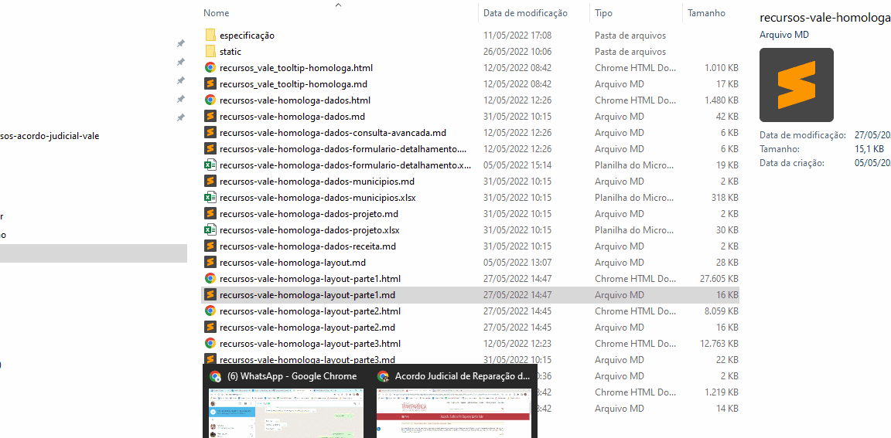

**Corrigido**

~Ao selecionar um favorecido por nome ou CPF/CNPJ o portal apresenta erro. Esse erro é mesmo já relatado no issues;~

**CORRIGIDO**

  ~3- A descrição dos órgãos na caixa de busca deve obedecer o mesmo padrão já adotado no Portal, ou seja, apenas as primeiras letras em maiúsculo.~

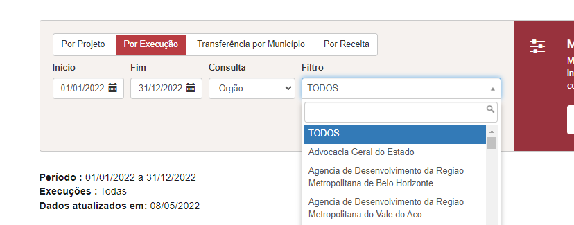

~FORMATAÇÃO DO PERÍODO~

<a href="#top">(inicio)</a>

* **Por Receita**:

**CORRIGIDO** 26/05/2021

Ao selecionar a consulta Por receita a formatação do campo data é perdida

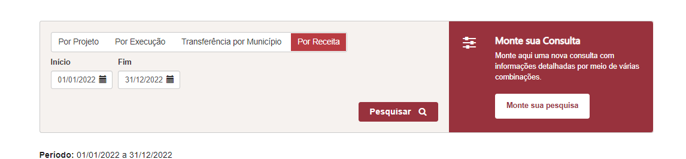

**Corrigido**

Não terá a opção de filtra, pois possui apenas uma classificação.
~O campo filtro não apresenta as opções~

  * **OK**  **Transferência por Município**: o usuário poderá escolher um Município ser exibido.

#### 2.4 Cabeçalho da Planilha
<a href="#top">(inicio)</a>

**CORRIGIDO**

~1- Ao selecionar a consulta por projeto o período não será exibido, pois a consulta é atemporal.~

~2- O texto a ser exibido não é Projeto da Vale e sim apenas **Projeto**~

~TEXTO DO CABEÇALHO~

<a href="#top">(inicio)</a>

**CORRIGIDO**

1 O texto que deverá ser exibido ao selecionar o filtro órgão é "Órgão" e não execução.

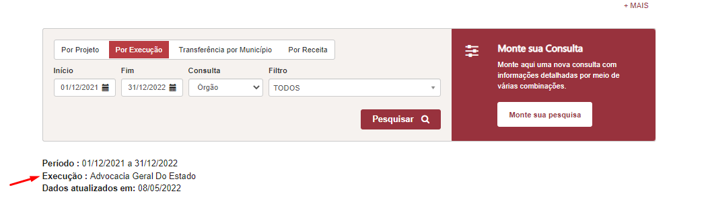

2- A mesma correção deverá ser implementada ao utilizar o filtro Favorecido por nome ou Favorecido por CPF/CNPJ.

**NÃO CORRIGIDO**

**SEGUIR O MESMO PADRÃO ADOTADO NA CONSULTA DE DESPESA DO PDT**

Quando abrir a tabela modal não é preciso a migalha da consulta.

~O caminho da consulta não está sendo exibido no Cabeçalho. A mesma lógica deve ser adotata nas migalha da parte superior~

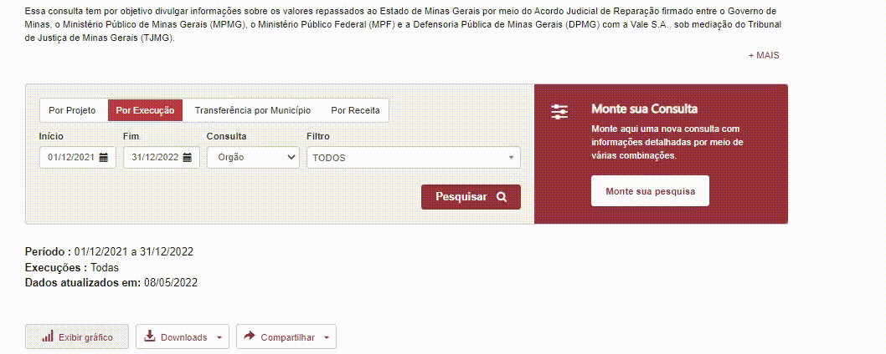

LISTA DE MUNICÍPIOS NO CAMPO FILTRO

**CORRIGIDO** 26/05/2022

~Nesse campo filtro deve ser exibido apenas dados (Municípios) que correspondem a execução (repasse). Atualmente o campo filtro está exibindo Municípios até mesmo de outros estados.~

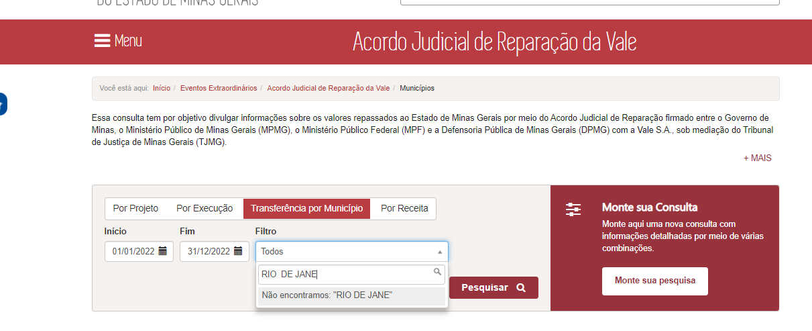

**CORRIGIDO**

~5 - Apenas a informação Municípios deve ser exibida;~
~6- Ao selecionar um municipio a informação não é exibida~

#### 2.5 Leiaute - Tabelas navegação

~FORMATAÇÃO DA TABELA DE RESULTADOS~

**CORRIGIDO** 26/05/2021

~A formatação da tabela não exibe todos os dados. Como por exemplos o R$ da frase:'Valores em R$'~

O texto 'Valores em R$' foi deslocado para a esquerda da tela

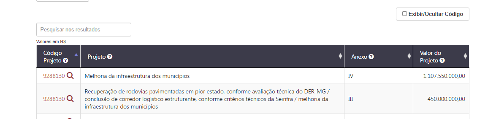

* A tabela de resultado levará em consideração os parâmetros dos filtros aplicados.

* **OK** A pesquisa básica irá apresentar como padrão a tabela de resultados com os dados do exercício vigente e os dados da consulta 'Por Projeto'.

* A data de atualização dos dados (*Dados atualizados em*), o período, o ícone *Exibir Gráfico* ou *Fechar Gráfico*, Download, Compartilhar serão exibidos acima do gráfico/tabela de resultados.

~POSICIONAMENTO DOS BOTÕES DOWNLOAD E Compartilhar~

1- **CORRIGIDO** ~Foi solicitado que os campos Download, Compartilhar fossem exibidos acima do gráfico/tabela, porém ao solicitar a exibição do gráfico a informação se perde na parte superior e o usuário pode não perceber que os dados podem ser baixados.~
É possível colocar esses campos próximo a tabela?

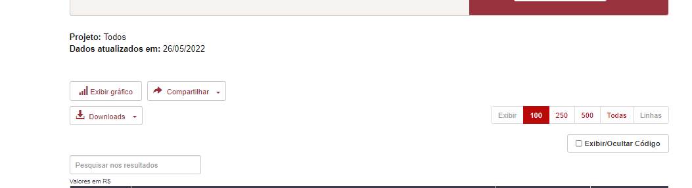

2- **CORRIGIDO** ~Como teremos apenas uma opção de gráfico não é preciso colocar o campo 'gráfico área'~

3- **CORRIGIDO** ~O gráfico da consulta por Projeto não está exibindo os dados que constam na tabela~

~EXIBIÇÃO DO GRÁFICO~

<a href="#top">(inicio)</a>

**CORRIGIDO** 26/05/2022

~Os dados do gráfico de área (Consulta por Execução/ Receita/ Município) não estão sendo exibidos na totalidade devido a formatação.~

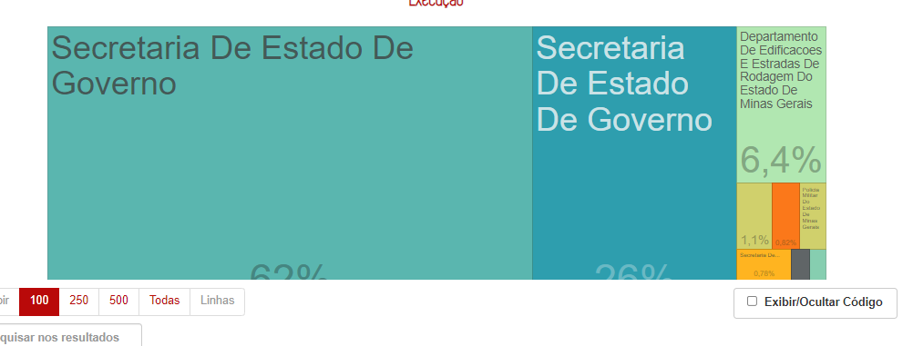

* **OK** Como padrão os dados serão exibidos no formato de tabela e caso o usuário queira visualizar os dados em forma de gráfico deve clicar em '*Exibir Gráfico*' e os dados da tabela serão deslocados para baixo. Para retornar a exibição apenas no formato tabela o usuário deve clicar em '*Fechar Gráfico*'

* **OK** A barra de pesquisa da tabela de resultado deverá retornar os dados a medida que o usuário for digitando. O atributo *placeholder* deve ser aplicado na barra de pesquisa.

* A opção de 'Exibir linhas' (quantidade de linhas) será exibida na parte superior da tabela.

EXIBIÇÃO DAS LINHAS

**CORRIGIDO** 26/05/2021

~A opção 'exibir linhas' não está respeitando o selecionado pelo usuário.
Por exemplo no detalhamento do Projeto 9288130 ao selecionar a opção 100 linhas todas as linhas estão sendo exibidas.~

FORMATAÇÃO

**CORRIGIDO** 26/05/2021

**Formatação da Tabelas**
1. OK Por Projeto - 1 nível: O conteúdo da coluna 'Anexo' deve ser alinhado à esquerda
2. OK Por Projeto / execução - 2 nível:
3. OK Município: Coluna 'Situação da ordem de pagamento' alinhar a esquerda
4. OK Receita: Coluna 'classificação da receita' alinhar a esquerda

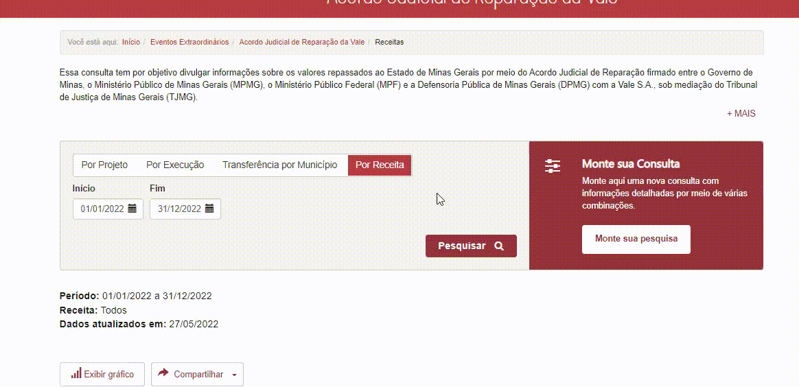

* O usuário poderá solicitar a exibição dos dados com código e descrição. Ao clicar no botão '*Exibir código e descrição*' uma nova coluna será adicionada a esquerda de cada coluna que tenha a descrição.

EXIBIR/OCULTAR FILTROS

**CORRIGIDO** 26/05/2022

**Campo 'exibir/oculta código'**

1. ~**CORRIGIDO**Por projeto - 1 nível: Ao clicar em 'exibir/oculta código' a coluna descrição do projeto é ocultada, nesse caso nenhuma coluna deverá ser ocultada;~
2. OK ~Por projeto e Por execução - 2 nível: a opção não funciona~

3. ~Por Transferência por município: conforme especificação não é para ter o código do Município. Então nesse caso a funcionalidade deverá ficar sempre marcada e nenhuma coluna deverá ser ocultada.~

4.  ~Receita: o código da fonte de recurso não está sendo exibido/ocultado~

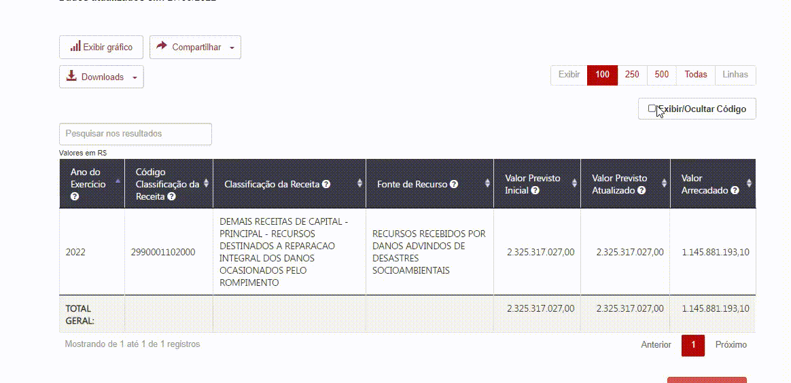

* Os valores TOTAL GERAL e o SUBTOTAL serão exibidos na tabela de resultados de acordo com o comportamento do usuário:

  * **TOTAL GERAL:** quando o usuário não aplicar nenhum filtro na tabela ou quanto todos os dados forem exibidos em uma única página, ou seja, sem paginação;

SUBTOTAL
--
<a href="#top">(inicio)</a>

**NÃO CORRIGIDO** 10/05/2022 // 26/05/2022

A opção SUBTOTAL só deve aparecer quando for aplicado algum filtro ou houver paginação dos dados

  * **SUBTOTAL:** quando o usuário aplicar qualquer filtro na tabela através da barra de pesquisa ou quando houver paginação na tabela de resultado, ou seja, houver mais de uma página de resultado. **OK**

DATA

**CORRIGIDO** 26/05/2022

~Não está sendo possível selecionar o ano de pesquisa na da dd/mm/aaaa. O usuário deve conseguir selecionar o ano ou digitar. O Pdt permite a escolha apenas 'setinha'~

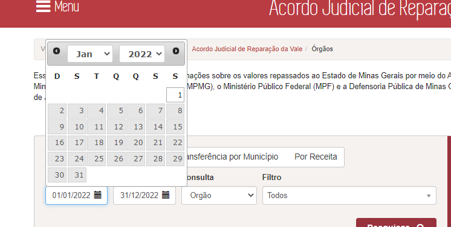
---

