# **ERROS PENDENTES DE CORREÇÃO E/OU VERIFICAÇÃO**

##### Homologação do Layout - parte 2
<a href="#top">(inicio)</a>

##### 1.Estrutura de design das tabelas de resultados da Pesquisa básica

* **OK** Cabeçalho fixo - *[Fixer Header](https://medium.com/nextux/design-better-data-tables-4ecc99d23356#86cf)* (eg. [Consulta de Remuneração do PdT](http://www.transparencia.mg.gov.br/estado-pessoal/remuneracao-dos-servidores/remuneracao-faixa/202103/1/1038/4158/C/3251081/986/23239313));

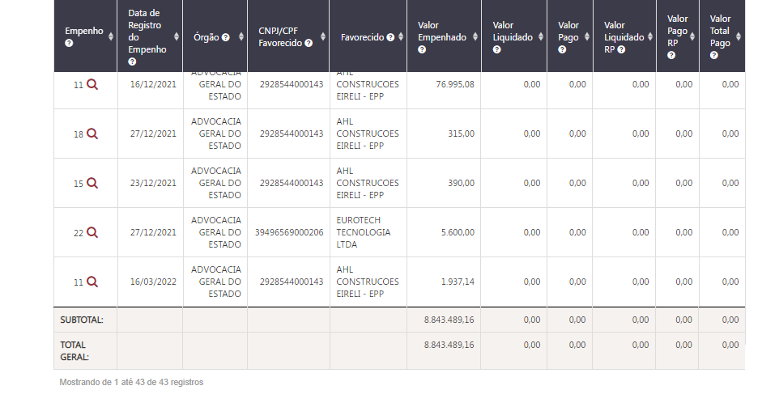

**CORRIGIDO**

 * Rolagem horizontal - Horizontal Scroll. Quando o número de colunas ultrapassar o limite da página o PdT deve possibilizar a rolagem horizontal;

- ~A funcionalidade não está funcionado;~ CORRIGIDO

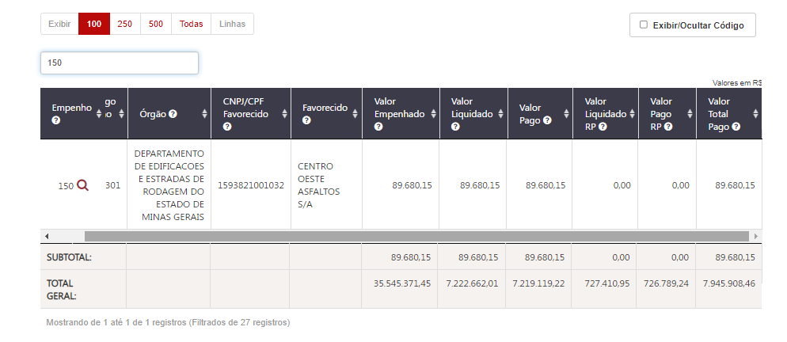

 

*  **OK** Colunas movíveis e classificáveis conforme ocorre atualmente;
*  **OK** O texto deve ser ajustável nas colunas, ou seja, caso seja necessário pode haver quebra de linha;

*  Paginação e seleção da quantidade de linhas a serem exibidas, conforme ocorre atualmente;

* A tabela apresentará campos clicáveis (com link) que irá direcionar o usuário para o formulário de detalhamento ou para o próximo nível da consulta.

CAMPOS CLICÁVEIS

~Os campos clicáveis serão destacados conforme o layout já adotado pelo PdT e terão a imagem de uma lupa.~

~1- Em algumas páginas é exibido uma lupa em outras um olho. Padronizar para LUPA.~
~2- O campos clicáveis não estão em destaque, conforme ocorre atualmente no pdt. Assim o usuário poderá clicar tanto na lupa como no código o projeto, como por exemplo.~

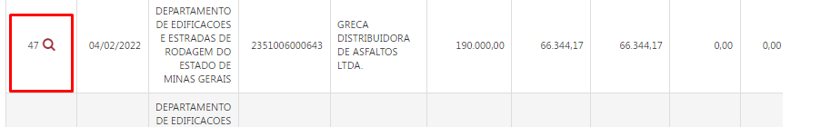

**CORRIGIDO**

 ~1- O título do gráfico da consulta de município está como 'Sem informação'~

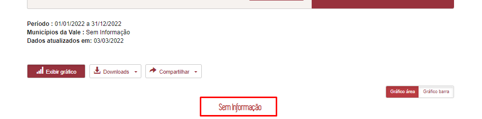

OK

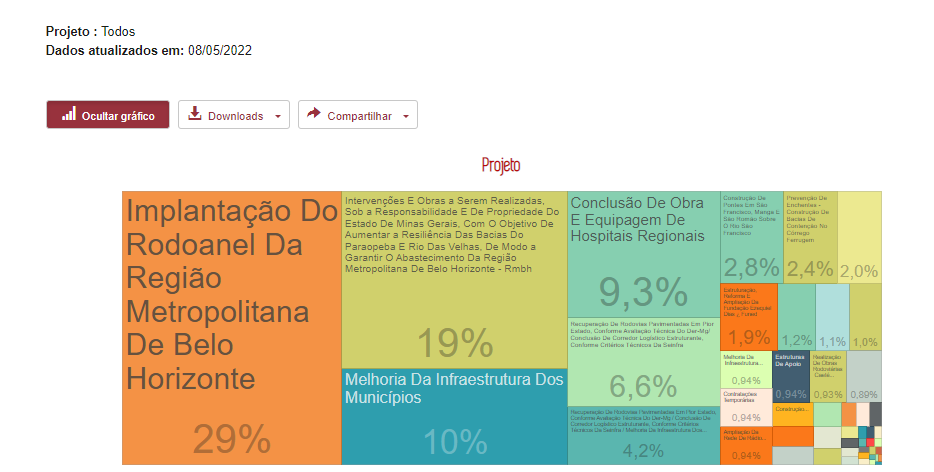

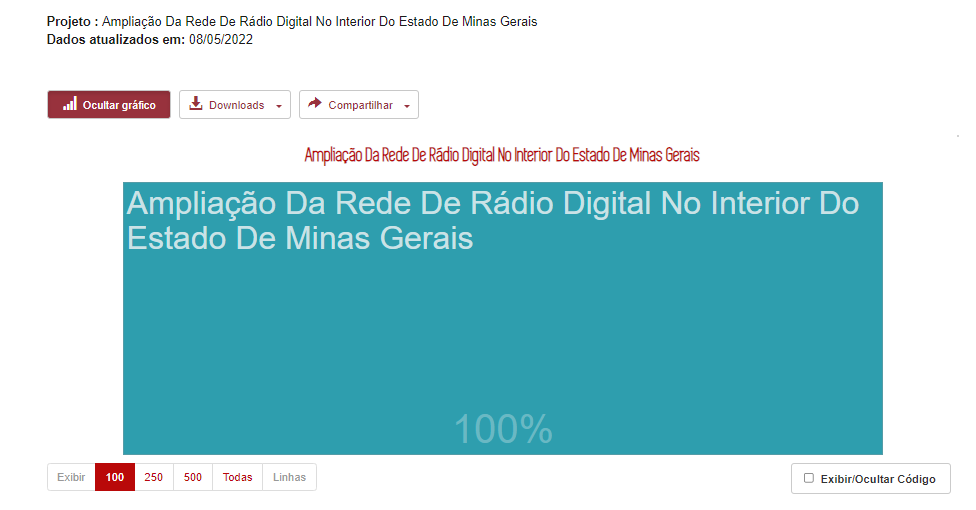

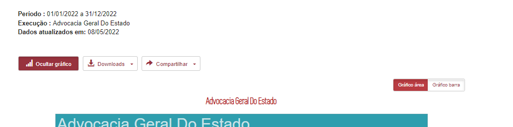

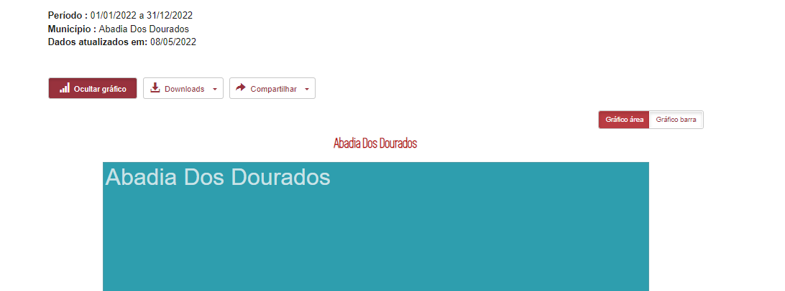

NAVEGAÇÃO PELOS GRÁFICOS

**CORRIGIDO** 27/05/2022

1- OK ~Nome do título do gráfico de Execução para Órgãos~

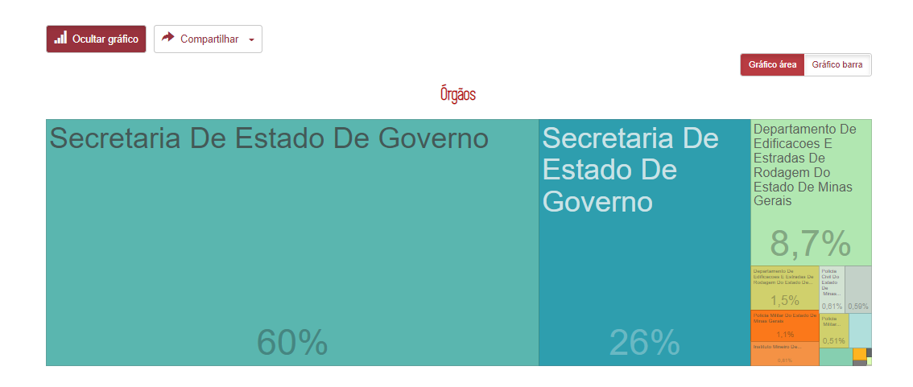

2- OK ~No segundo nível da consulta (Empenhos) o gráfico deverá exibir apenas a descrição do Favorecido, como ocorre atualmente~

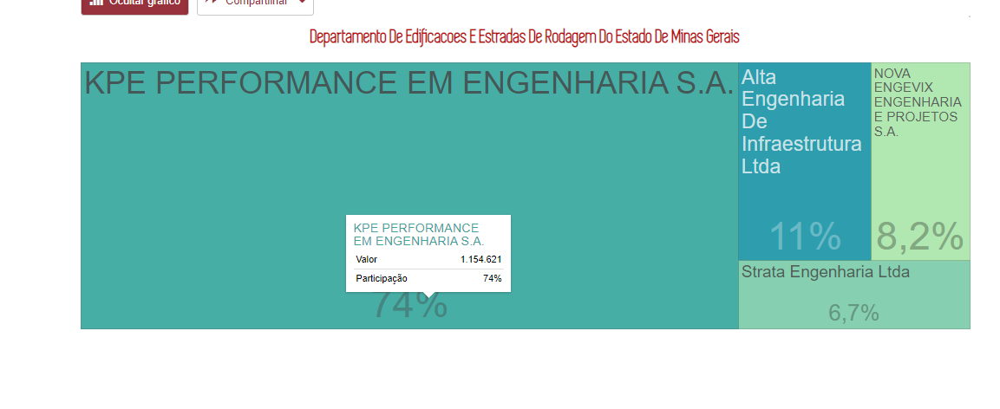

3- OK ~Ao clicar no gráfico o usuário é direcionado a página inicial da consulta.~

4- OK ~Os gráficos não estão representando o mesmo caminho das tabelas~

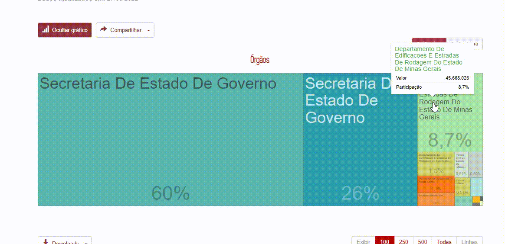

FORMATAÇÃO DAS TABELAS

**CORRIGIDO** 26/05/2022

Alinhar nome do órgão a esquerda da tela

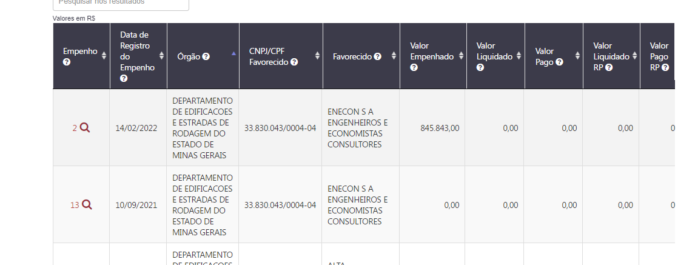

MIGALHAS / CABEÇALHO
--
<a href="#top">(inicio)</a>

**CORRIGIR**

ao selecionar um projeto pelo código na consulta de execução tanto a árvore quanto o cabeçalho deve exibir além do nome do projeto o código, pois caso o usuário clique no projeto 9288133 e nesses campos apresentar apenas a descrição ele poderá ficar perdido onde está realmente.

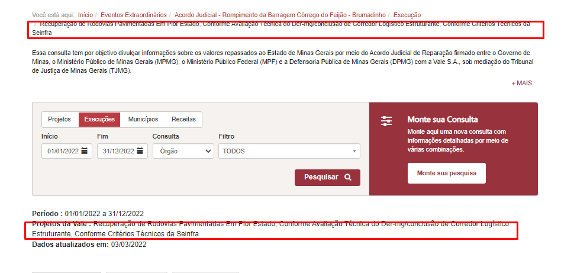

 

#### Download dos dados:
<a href="#top">(inicio)</a>

* **Download PDF:** O documento gerado em PDF deverá exibir:

DOWNLOAD PDF
--
<a href="#top">(inicio)</a>

**Não CORRIGIDO** 27/05/22 (O BOTÃO NÃO ESTÁ FUNCIONANDO)

1-  A URL* não está sendo exibida

2- o arquivo gerado em PDF não está sendo exibido em outra aba do navegador e sim está fazendo o downolad

3- O arquivo gerado irá exibir os mesmos dados apresentados na tela considerando todos os filtros aplicados e inclusive o TOTAL GERAL ou SUBTOTAL conforme o comportamento do usuário. **Não é possível verificar, pois o download não está exibindo os dados**

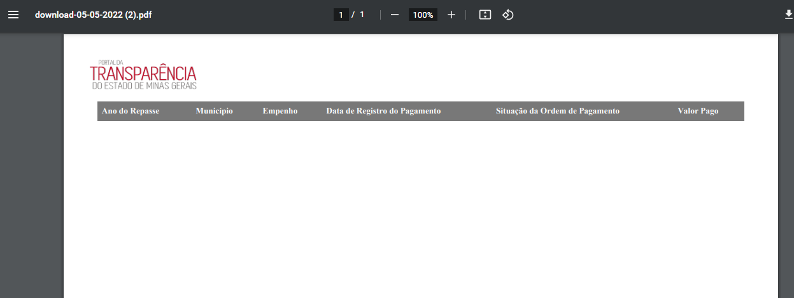

 

 * **OK** logo do Portal de Transparência no início da página e
 * **CORRIGIR** *URL*, paginação e a data no fim da página.
 * **CORRIGIR** O arquivo gerado irá exibir os mesmos dados apresentados na tela considerando todos os filtros aplicados e inclusive o TOTAL GERAL ou SUBTOTAL conforme o comportamento do usuário.
 * **CORRIGIR** ao selecionar essa opção o arquivo PDF deverá ser aberto em outra aba do navegador

* **Download Planilha (CSV):**

DOWNLOAD CSV
--
<a href="#top">(inicio)</a>

**CORRIGIR**

1- Não está funcionando - O campo TOTAL GERAL também deverá ser exibido;

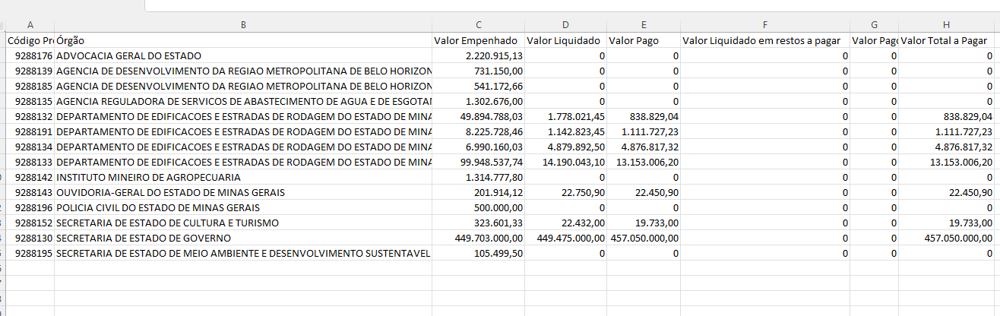
 

**CORRIGIDO**

~2- Não está funcionando Exibir código e descrição em campos distintos, independente de o usuário selecionar a opção '*Exibir código e descrição*'~

DOWNLOADO CSV - DADOS COMPLETOS
--
<a href="#top">(inicio)</a>

**CORRIGIR**

Será exibido a tabela completa de todas as páginas no formato CSV, independente do filtro aplicado, conforme documentação

 * Será exibido a tabela completa de todas as páginas no formato CSV, independente do filtro aplicado.
 * O campo TOTAL GERAL também deverá ser exibido.
 * **OK** Exibir código e descrição em campos distintos, independente de o usuário selecionar a opção '*Exibir código e descrição*'

* **Download base completa:**

DOWNLOADO BASE COMPLETA
--
<a href="#top">(inicio)</a>

**CORRIGIR**

Iremos informar o link do dataset para direcionamento.
Como ainda não temos o dataset de todos os conjuntos, o usuário será direcionado para o conjunto principal da consulta.

 * O usuário será direcionado para o conjunto de dados da respectiva consulta no Portal de Dados Abertos.
 *O PdT deverá permitir que a equipe DTA inclua/altere a *url* desse campo através da área administrativa do Portal.                  
 * O PdT deverá permitir que por meio da área administrativa do Portal a equipe DTA decida se o campo Download Base Completa será exibido ou não na parte superior da tabela de resultado.

#### Barra de pesquisa

A barra de pesquisa deve aceitar várias formas de preenchimento dos dados:

* Desconsiderar acentuação, letras maiúsculas/minúsculas;
* Desconsiderar palavras intermediárias (ex.: Ao digitar “gestao pública”, um dos resultados será “Gestão da Administração Pública”);
* O usuário poderá pesquisar por qualquer coluna na tabela de resultados.

#### Compartilhar dados: OK
<a href="#top">(inicio)</a>

O usuário poderá Compartilhar os link dos dados nos seguintes canais, no mínimo:

- Twitter **OK**
- Facebook **OK**
- WhatsApp **OK**
- Por e-mail
- Copiar *url* **OK**

#### Campos Pesquisa básica - Navegação por filtros

###### Consulta por Projeto

* 1º NÍVEL
  - [Código Projeto]() -> ao clicar o usuário será direcionado para o 2º nível
  - Projeto
  - Anexo
  - Valor do Projeto

**CORRIGIDO**

~1- Está faltando a coluna anexo~

~2- Corrigir o nome da coluna para 'Valor do Projeto'~

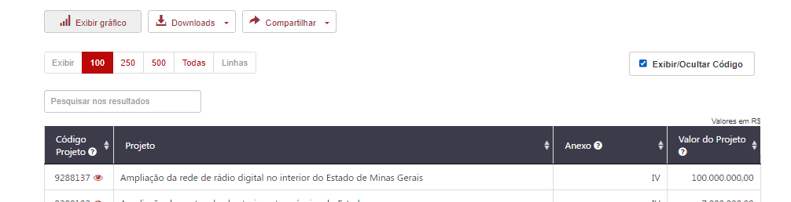

* 2º NÍVEL

  * [Empenho]() -> ao clicar o usuário será direcionado para o 3º nível
  * Data de Registro do Empenho
  * Código Órgão - > apenas quando o usuário clicar em 'Exibir Código e Descrição'         
  * Órgão
  * CNPJ/CPF Favorecido
  * Favorecido
  * Valor Despesa Empenhada            
  * Valor Despesa Liquidada         
  * Valor Pago
  * Valor Liquidado em Restos a Pagar
  * Valor Pago em Restos a Pagar
  * Valor Total Pago

* 3º NÍVEL
    - Formulário de Detalhamento

###### Consulta por Execução

  * 1º NÍVEL

    * [Código Projeto]() -> ao clicar o usuário será direcionado para o 2º nível
    * Código Órgão -> apenas quando o usuário clicar em 'Exibir Código e Descrição'           
    * Órgão               
    * Valor Despesa Empenhada            
    * Valor Despesa Liquidada         
    * Valor Pago
    * Valor Liquidado em RP
    * Valor Pago em Restos a Pagar
    * Valor Total Pago     

**CORRIGIDO**

- ~Esta faltando o código do órgão ao selecionar o campo 'Exibir código/descrição'~
- ~Corrigir o texto da coluna "Valor total pago" e não valor a pagar~

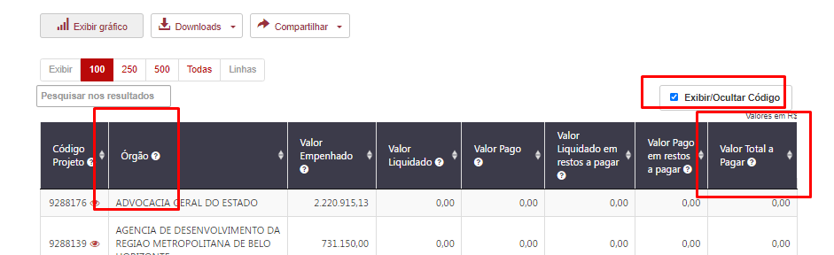

  * 2º NÍVEL **OK**
    * [Empenho]() -> ao clicar o usuário será direcionado para o 3º nível
    * Data de Registro do Empenho
    * CNPJ/CPF Favorecido
    * Favorecido
    * Valor Despesa Empenhada            
    * Valor Despesa Liquidada         
    * Valor Pago
    * Valor Liquidado em Restos a Pagar
    * Valor Pago em Restos a Pagar
    * Valor Total Pago

COLUNAS A MAIS NA TABELA - EXECUÇÃO 2 NÍVEL

**CORRIGIDO** 26/05/2021

- ~O segundo nível da consulta por execução não possui a coluna órgão;~
- ~Corrigir o texto da coluna "Valor total pago" e não valor a pagar~ CORRIGIDO

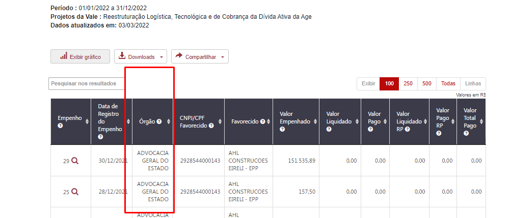

  * 3º NÍVEL - Formulário de Detalhamento

###### Consulta por Município

  * 1º NÍVEL  
    * Ano  do Repasse    
    * Município           
    * [Empenho]()       
    * Data de Registro do Pagamento
    * Situação da Ordem de Pagamento
    * Valor Pago

FORMATAÇÃO DA TABELA

**CORRIGIDO** 27/05/22

- ~Alinhar situação da ordem de pagamento a esquerda~      

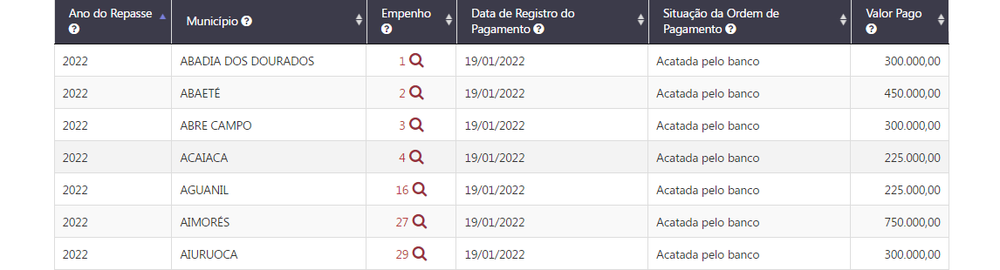

**CORRIGIDO** 10/05/2022

* Não existe código do município nessa tabela

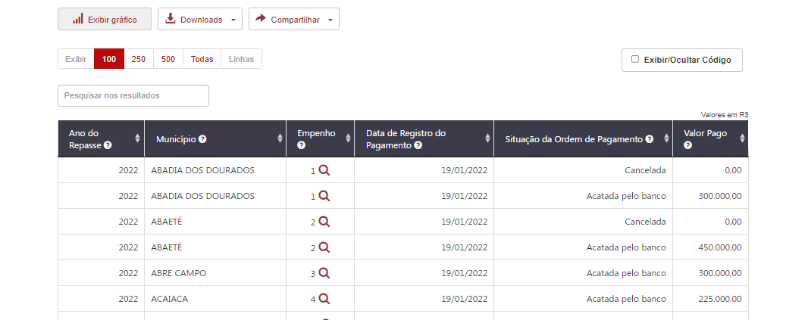

* 2º NÍVEL

**CORRIGIDO**

- ~Ao clicar no número do empenho o usuário deverá ser direcionado diretamente para o formulário de detalhamento.~   

* 3º NÍVEL
    - Formulário de Detalhamento

###### Consulta por Receita

  * 1º NÍVEL       
    * Ano de Exercício     
    * Código da Classificação da Receita -> apenas quando o usuário clicar em 'Exibir Código e Descrição'   
    * Classificação da Receita
    * Código da Fonte de Recurso -> apenas quando o usuário clicar em 'Exibir Código e Descrição'   
    * Fonte de Recurso
    * Valor Previsto Inicial
    * Valor Previsto Atualizado
    * Valor Arrecadado

FALTA COLUNAS NA TABELA DE RESULTADOS

**CORRIGIDO** 27/05/2022

~O Código da fonte de recurso não está sendo exibido~

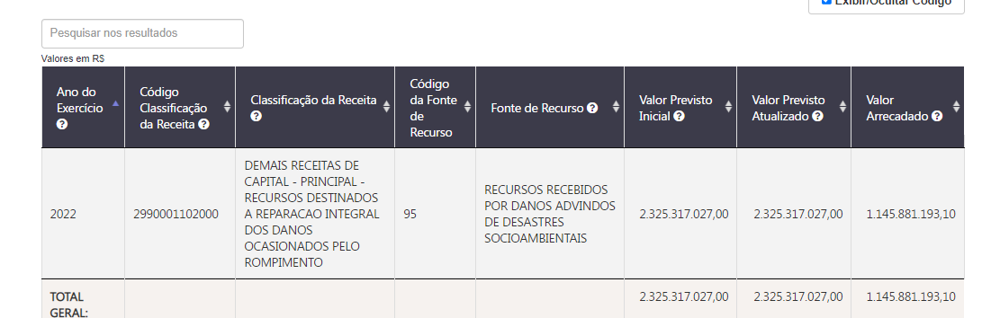

#### Leiaute - Formulário de Detalhamento
<a href="#top">(inicio)</a>

Ao clicar em campo clicável da tabela de resultados o usuário será direcionado para o formulário de detalhamento, que será composto pelos seguintes atributos:

* As tabelas que compõe o formulário de detalhamento serão exibidas em formato de guias (eg. [*Tabs*](https://www.w3schools.com/howto/howto_js_tabs.asp))

* O usuário poderá fazer o Download das informações do formulário de detalhamento ao clicar no botão '*Download*'.
A exportação em planilha (CSV) deverá ser em formato de tabela. Cada campo em uma coluna.

##### Campos do formulário de detalhamento OK

* Classificação Orçamentária
 

FORMATAÇÃO FORMULÁRIO DE DETALHAMENTO
--
<a href="#top">(inicio)</a>

**CORRIGIR**

 - Alterar nome de  Classificação para **Classificação Orçamentária**
            **O Nome alterado foi o errado**
 - OK ~Alterar nome de empenho para **Número do Empenho**~
 - OK ~A ordem dos campos deve ser a mesma solicitada~

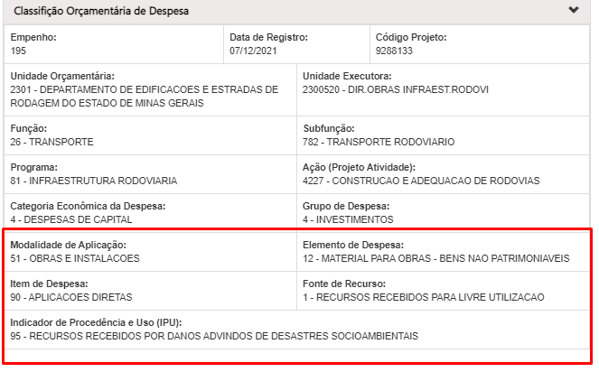

Correção do dia 26/05/22
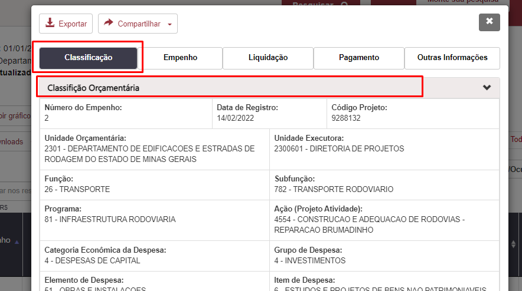

* Empenho
 

 

 FORMATAÇÃO FORMULÁRIO DE DETALHAMENTO - EMPENHO

 **CORRIGIDO** 27/05/22

  - ~A ordem dos campos deve ser a mesma solicitada;~
  - ~Colocar os dados alinhados~

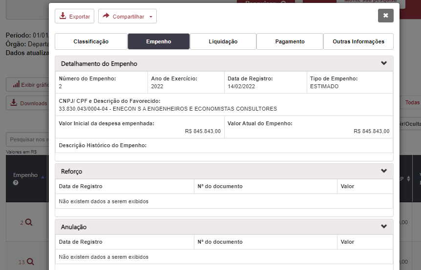

 OK
 --

* Liquidação

----          
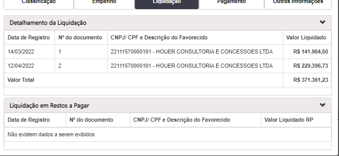

 

* Pagamento
 

FORMATAÇÃO FORMULÁRIO DE DETALHAMENTO - PAGAMENTO

 **CORRIGIDO**

~A quebra de linha no campo valor pago não é interessante, já que existe a quebra no favorecido acredito que podemos manter o valor pago sem quebra de linha.~

[LINK DO PDT](https://age7-novo.homologacao.prodemge.gov.br/eventos-extraordinarios/acordo-judicial-reparacao-vale?task=estado_recursosvale.listarEmpenho&ano=&dataInicio=01/01/2022&dataFim=31/12/2022&consulta=2&filtro=5&id_projeto=5)

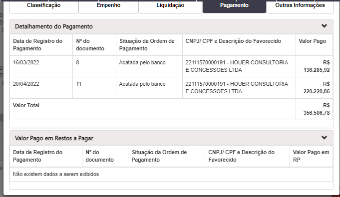.

 

* Outras Informações
  

CAMPOS TROCADOS FORMULÁRIO DE DETALHAMENTO

**CORRIGIDO**

- ~Os campos estão trocados~
- ~Se não há informações de convênios o formulário deve permanecer sem dados.~

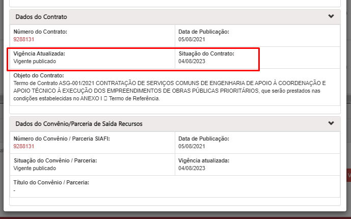

 

EXPORTAÇÃO FORMULÁRIO DE DETALHAMENTO CSV
--
<a href="#top">(inicio)</a>

**CORRIGIR**

Ao exportar o formulário de detalhamento o arquivo zipado esta vindo por tabela e não por bloco.

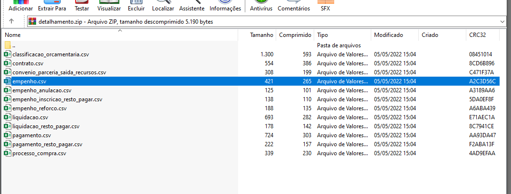

 

