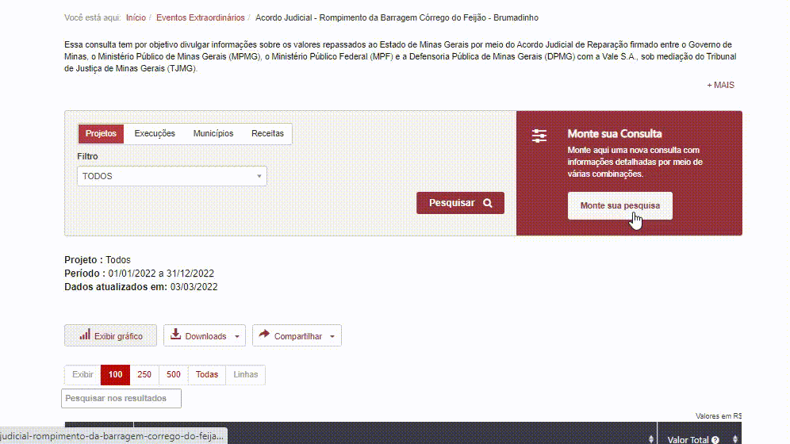
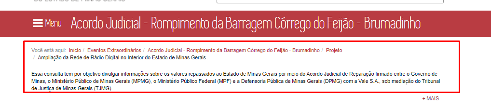
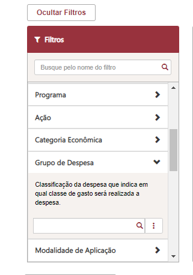
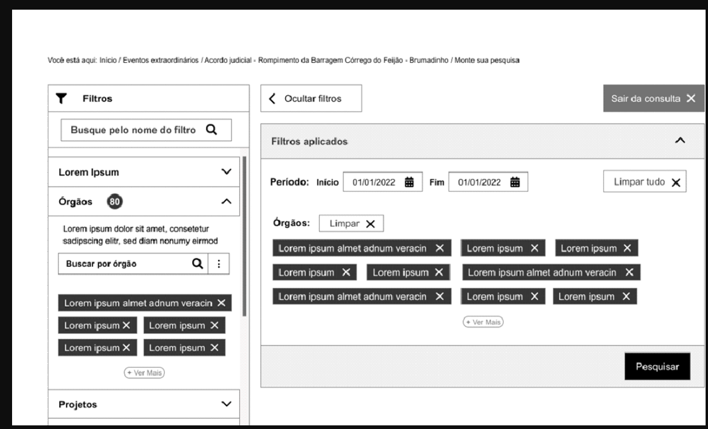
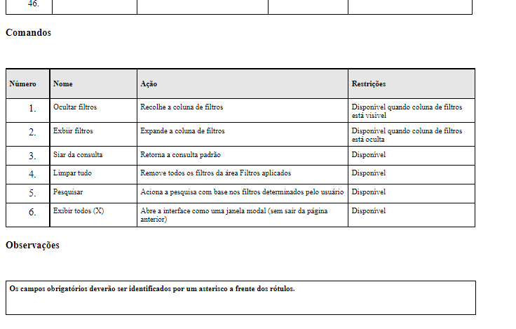

# Homologação do Layout - parte 3
<a href="#top">(inicio)</a>

## Monte sua consulta

<a href="#top">(inicio)</a>

**CORRIGIR**

**Como padrão ao clicar em monte sua pesquisa a barra de filtro lateral deverá vir ativada.**

**CORRIGIR**

A visualização entre as migalhas e o texto explicativo não está boa. Na minha opinião está dando a impressão que  texto explicativo é uma continuidade das migalhas.

A pesquisa será composta pelos seguintes componentes:

* Barra de navegação vertical com filtros;
* Filtros Aplicados;
* Tabela de Resultado;

### Barra de Navegação Vertical
<a href="#top">(inicio)</a>

 Atributos da barra de navegação vertical:

* **OK** Todos os filtros deverão apresentar uma breve descrição.

* Todos os campos da barra vertical poderão ser consultados por descrição ou código, assim como ocorre na [Consulta Avançada do PdT - Proposta Orçamentária](https://www.transparencia.mg.gov.br/planejamento-e-resultados/proposta-lei-orcamentaria/proposta-orcamentaria/proposta-pesquisa-avancada) em que é possível digitar o nome ou a descrição nos filtros.
* A lista de filtros será localizada a esquerda da tela. Caso a quantidade de filtros ultrapasse o limite da tela deverá ser utilizado a barra de rolagem.
[Ver filtros - Especificação Dados](https://github.com/transparencia-mg/especificacoes-portal-transparencia/blob/espec018_recusos-vale/espec018_recursos-acordo-judicial-vale/recursos-vale-dados.md)

* O usuário poderá realizar a busca de qualquer filtro na **barra de pesquisa**. A barra de pesquisa deverá possuir atributo [placeholder](https://www.w3schools.com/tags/att_input_placeholder.asp) para facilitar ou indicar como o campo deverá sem preenchido.

* Alguns filtros da barra de navegação também deverão possuir atributos *placeholder*.

* A barra de navegação poderá ser **ocultada/exibida** ([*collapsed Sidebar*](https://www.w3schools.com/howto/howto_js_collapse_sidebar.asp)) a partir dos comandos (eg. [Portal de Transparência Federal](http://www.portaltransparencia.gov.br/despesas/programa-e-acao?ordenarPor=programa&direcao=asc))

    *	Ocultada => ao clicar no símbolo **[<<]** ou no botão **[<< Ocultar Filtros]**;
    * Exibida => ao clicar no botão **[<< Exibir Filtros]**

**OBS**: Ao ocultar a barra de navegação vertical dos demais conteúdos (tabela de resultados, campos aplicados e etc) serão reajustados na página.

* Ao clicar em qualquer filtro da barra de navegação será exibido uma outra barra de filtros onde o usuário deverá selecionar os parâmetros da pesquisa.  

Página inicial - Monte sua pesquisa OK

### Barra deslizante para baixo
<a href="#top">(inicio)</a>

* A barra deslizante só será exibida se o usuário clicar em algum filtro  da barra de navegação vertical.
* A barra deslizante será **ocultada** ao clicar em outro filtro.

* Quando a barra deslizante for ocultada e as opções forem selecionadas a seção em que o utilizador se encontra deverá apresentar a quantidade de filtros foram selecionados. Exemplo tela wireframe proposta pela Prodemge [Slides 13 e 16](https://xd.adobe.com/view/64a90aea-4369-4d8d-b426-72f46590dbcd-31fa/screen/649d572d-e66a-466a-afae-96ed268ab76c)

* Ao clicar sob a **barra de pesquisa** será exibido uma lista suspensa com todos os parâmetros referente ao filtro. Para selecionar o parâmetro desejado o usuário poderá usar a barra de rolagem ou a barra de pesquisa.  

* A barra deslizante deverá listar os parâmetros selecionados com a opção ***['x']() (excluir)***. O usuário poderá remover os parâmetros não desejados clicando no ***['x']()***.

* O usuário poderá combinar vários parâmetros para o mesmo filtro (selecionar mais de um item) ou selecionar a opção ***[Exibir Todos]***.
* Ao selecionar ***[Exibir Todos]***, abrirá uma tela modal exibindo todos os parâmetros daquele filtro com as opções *Selecionar tudo, Limpar Seleção, Inverter seleção*. O usuário poderá remover os parâmetros não desejados ao assinalar com tique a opção.  
eg. [Slides 10](https://xd.adobe.com/view/965f7297-a884-462e-af3c-902944963cb1-c30c/screen/f342f2a6-6869-4a32-98aa-c77e9fe30dd3)

* Os botões **Aplicar/Limpar** devem ser estilisticamente diferenciados (eg. [*Differentiate button types*](https://medium.com/nextux/design-better-buttons-6b64eb7f13bc#aj%20la%20lb))

* Ao selecionar o período específico a barra deslizante de cada filtro irá exibir como parâmetros apenas as classificações orçamentárias vigentes no ano. A exceção será para a consulta de Restos a Pagar, onde os parâmetros da barra deslizante irá refletir apenas as classificações orçamentárias inscritas em restos a pagar, e não a classificação orçamentária vigente no ano.

* A medida que o usuário selecionar um parâmetro de qualquer filtro automaticamente apenas as opções que possuem relacionamento com o parâmetro selecionado será exibida nos demais filtros.    

Exemplo:   
Ao selecionar o parâmetro '1521- Controladoria-Geral do Estado' no filtro *Órgão* e em seguida clicar no filtro *Programa* apenas os programas que tiveram execução na Controladoria-Geral do Estado naquele ano serão exibidos.

O [Portal da Transparência do Estado de São Paulo](www.fazenda.sp.gov.br/SigeoLei131/Paginas/FlexConsDespesa.aspx) possui a funcionalidade citada acima.

* Todos os parâmetros selecionados serão exibidos no campo **Filtros Aplicados**.

### Filtros Aplicados
<a href="#top">(inicio)</a>

* O usuário poderá **ocultar/exibir** o conteúdo do campo filtros aplicados a partir do comandos: (eg. [Portal de Transparência Federal](http://www.portaltransparencia.gov.br/despesas/programa-e-acao?ordenarPor=programa&direcao=asc) ).

  * **[^]**: Exibi o conteúdo do campo;
  * **[v]**: Oculta o conteúdo do campo. Ao ocultar os dados do campo os demais conteúdos da tela serão ajustados na página.
  .

* Como padrão o filtro **Período** será exibido no campo filtros aplicados. O período exibido será o dd/mm/aaaa inicial do exercício vigente até o dd/mm/aaaa da última atualização dos dados.

* O campo filtro aplicados será composto pelos botões: Pesquisar, Atualizar e Limpar tudo localizados na parte superior:

  * A posição na tela dos botões Pesquisar e Atualizar será a mesma, sendo a exibição de um ou outro realizada de acordo com as regras abaixo.
  * Pesquisar: será exibido após o usuário selecionar qualquer parâmetro na barra deslizante.  O Usuário deverá clicar em pesquisar para exibir o resultado desejado.
  * Atualizar: será exibido quando o usuário remover/adicionar algum parâmetro, ou seja, fizer qualquer alteração no campo filtros aplicados.
  * Limpar tudo: ficará disponível sempre que houver pelo menos um parâmetro selecionado. Ao clicar nesse botão será excluído todo o conteúdo desse campo.

OBS: Os botões **Pesquisar/ Atualizar/Limpar** devem ser estilisticamente diferenciados (eg. [*Differentiate button types*](https://medium.com/nextux/design-better-buttons-6b64eb7f13bc#aj%20la%20lb))

* O usuário poderá excluir um filtro por completo. Por exemplo, caso o usuário queira excluir o campo 'Órgãos' ele poderá fazer isso sem a necessidade de excluir os filtros um a um. Ele poderá excluir o campo "ÓRGÃO"

* Casos os parâmetros selecionados não retornem nenhuma informação o PdT deverá apresentar uma mensagem informando que '*Não há dados a serem exibidos com os parâmetros selecionados.*''

* Os parâmetros selecionados na barra deslizante deverão ser exibidos na ordem que o usuário escolheu.

* Todos os parâmetros serão representados no campo filtros aplicados da seguinte forma:
  * **Filtro** (*nome do filtro*): **Parâmentro** (*nome do parâmetro*)-(**[X]()**)(*excluir*);

* À medida que o usuário for incluindo parâmetros na pesquisa a tabela de resultados será deslocada para baixo quando ultrapassar o limite da tela (eg. [Portal de Transparência Federal](http://www.portaltransparencia.gov.br/despesas/programa-e-acao?ordenarPor=programa&direcao=asc)).

* Caso o usuário selecione uma grande quantidade de filtros será acrescentado a opção *Ver mais* abaixo da lista de filtros.

OK

  

### Tabela de resultados
<a href="#top">(inicio)</a>

* A tabela de resultado levará em consideração os parâmetros do campo filtros aplicados.

* A tabela apresentará colunas padrões que serão exibidas independentemente de o usuário selecionar/aplicar algum filtro. [Ver especificação dados](https://github.com/transparencia-mg/especificacoes-portal-transparencia/edit/espec018_recusos-vale/espec018_recursos-acordo-judicial-vale/recursos-vale-dados.md).

* A data de atualização dos dados, e a opção de compartilhamento serão exibidos acima da tabela de resultados.

* Os valores **TOTAL GERAL** e o **SUBTOTAL** serão exibidos na tabela de resultados de acordo com o comportamento do usuário:

  * TOTAL GERAL: quando o usuário não aplicar nenhum filtro na tabela ou quanto todos os dados forem exibidos em uma única página, ou seja, sem paginação;   

  * SUBTOTAL: quando o usuário aplicar qualquer filtros na tabela através da barra de pesquisa ou quando houver paginação no tabela de resultado, ou seja, houver mais de uma página de resultado.

* A tabela de resultados não exibirá os campos **TOTAL GERAL** e o **SUBTOTAL** quando não houver dados referentes a valores.

* A **barra de pesquisa** da tabela de resultado deverá retornar os dados da tabela que estão exibidos. A medida que o usuário for digitando os dados a busca será acionada. O atributo *placeholder*: deve ser aplicado na barra de pesquisa.

* Estrutura de design das tabelas de resultados:
  * Cabeçalho fixo - *[Fixer Header](https://medium.com/nextux/design-better-data-tables-4ecc99d23356#86cf)* (eg. [Consulta de Remuneração do PdT](http://www.transparencia.mg.gov.br/estado-pessoal/remuneracao-dos-servidores/remuneracao-faixa/202103/1/1038/4158/C/3251081/986/23239313));

  * Rolagem horizontal - *[Horizontal Scroll](https://medium.com/nextux/design-better-data-tables-4ecc99d23356#2dba)*. Quando o número de colunas ultrapassar o limite da página o PdT deve possibilizar a rolagem horizontal.

  * Colunas movíveis e classificáveis conforme ocorre atualmente;

  * Paginação e seleção da quantidade de linhas a serem exibidas, conforme ocorre atualmente;
  * O texto deve ser ajustável nas colunas, ou seja, caso seja necessário pode haver quebra de linha;

* O usuário poderá adicionar ou remover colunas - [*hide/show columns*](https://ux.stackexchange.com/a/110079) na tabela de resultados. Ao clicar em **Adicionar/Remover colunas** será exibido uma barra lateral a direta com todas as colunas que poderão ser adicionadas ou removidas (eg. [Portal da Transparência Federal](http://www.portaltransparencia.gov.br/despesas/consulta?ordenarPor=mesAno&direcao=desc)).

* Ao exibir ou ocultar alguma coluna a tabela de resultados será atualizada automaticamente (eg.[Column Toggle Table](https://ux.stackexchange.com/questions/110077/best-practices-to-allow-user-to-hide-show-columns-in-a-data-table/110079#110079)).

* O ícone **Adicionar/Remover Colunas** além dos filtros pré-determinados pela DTA terá uma barra de pesquisa onde o usuário poderá digitar o filtro desejado.

* As colunas definidas como padrão ficarão marcadas na tabela ***Adicionar/Remover Colunas*** podendo o usuário desativá-las.

* Ao inserir qualquer coluna essas serão incluídas antes das colunas de valores. E caso seja incluída alguma coluna de valor o portal deverá manter a ordem da execução orçamentária (Valor empenhado, valor liquidado, valor pago, valor liquidado em RP, Valor Pago em RP, Valor Total Pago).

* Alguns filtros da tabela apresentará campos clicáveis (com link) que irá direcionar o usuário para o formulário de detalhamento da consulta (eg. [Consulta Compras e Contratos PdT](http://www.transparencia.mg.gov.br/compras-e-patrimonio/compras-e-contratos/comprasecontratos-resultado-pesquisa-avancada/2021/01-01-2021/31-12-2021/1831070/0/0/0/0/0/0/0/0/0/0/0/0/0/0/0/0/0/0/0/0/0/0/0/0/0/0/0/0/0/0/0/0/0/0/0/0/0/0)).

* Os campos clicáveis serão destacados conforme o layout já adotado pelo PdT e terão a imagem de uma lupa.

#### Download dos dados:

Seguir o padrão da pesquisa básica

### Observações gerais:

* Todas as **barras de pesquisa** devem aceitar várias formas de preenchimento dos dados.
  * Autocompletar (*autocomplete* ) desde a primeira letra (eg. [Portal de Transparência MG](http://www.transparencia.mg.gov.br/planejamento-e-resultados/proposta-lei-orcamentaria/proposta-orcamentaria/proposta-pesquisa-avancada));
  * Desconsiderar acentuação, letras maiúsculas/minúsculas;
  * Desconsiderar palavras intermediárias (ex.: Ao digitar “gestao pública”, um dos resultados será “Gestão da Administração Pública”);
  * O usuário poderá pesquisar código ou descrição das classificações orçamentárias (eg. [Proposta Orçamentára - PdT MG](http://www.transparencia.mg.gov.br/planejamento-e-resultados/proposta-lei-orcamentaria/proposta-orcamentaria/proposta-pesquisa-avancada)).   

* Todos os filtros selecionados serão exibidos na tabela de resultado.

* A exibição de código e descrição será diferente em cada seção:

 * Barra de pesquisa e filtros aplicados: exibir código e descrição no mesmo campo (eg. [Proposta Orçamentára - PdT MG](http://www.transparencia.mg.gov.br/planejamento-e-resultados/proposta-lei-orcamentaria/proposta-orcamentaria/proposta-pesquisa-avancada));
 * Tabela de resultado: exibir apenas descrição. Os códigos serão exibidos apenas se o usuário adicionar a coluna;
 * Opção exportar CSV.: exibir código e descrição em campos distintos, independente de o usuário selecionar a opção código na tabela de resultado.
