#### ERROS PENDENTES DE CORREÇÃO E/OU VERIFICAÇÃO

## 3.Filtro favorecido da consulta por Execução
**CORRIGIDO** - Verificado em 27/06/2022
--
A mensagem foi aplicada apenas no filtro "Favorecido por nome". Favor colocar a mensagem no filtro "Favorecido por CNPJ/CPF"
Ao clicar no filtro 'Favorecido por nome' ou Favorecido por CPF/CNPJ' e não escolher nenhum favorecido e clicar em pesquisar o usuário é direcionado para a página inicial da consulta Por Execução sem nenhuma mensagem.

Caso não seja possível a busca por todos os Favorecido o Portal deve apresentar uma mensagem informando que é preciso selecionar um favorecido, assim como ocorre atualmente nas consultas que se encontram em produção no PDT.

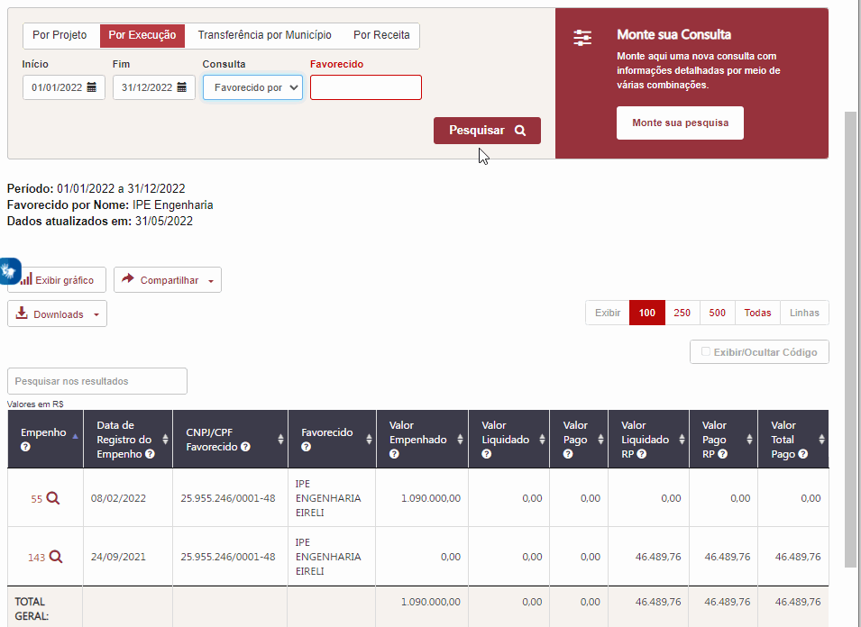

---

## 7. Legenda do Gráfico

**Consulta Por Receita - Gráfico de barras:**
**CORRIGIDO PARCIALMENTE** - Verificado em 13/06/2022
---
Ficou pendente a correção do item 1 "*O gráfico deve-se referir a Classificação da Receita e não a Fonte de Recurso;*"

1.  O gráfico deve-se referir a Classificação da Receita e não a Fonte de Recurso;
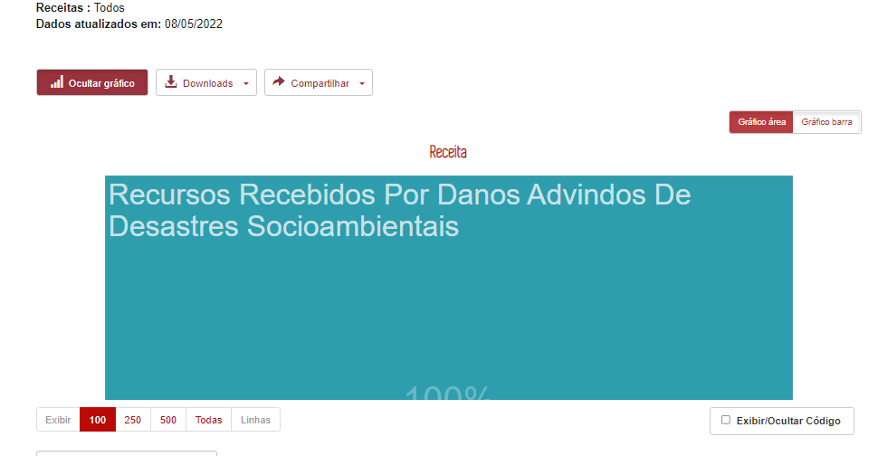

---

## 13. Download PDF - Tabela Modal - Monte sua pesquisa

**CORRIGIDO** - Verificado em 27/06/2022
--

- Os valores de subtotal e total não estão sendo exibidos na extração em PDF.

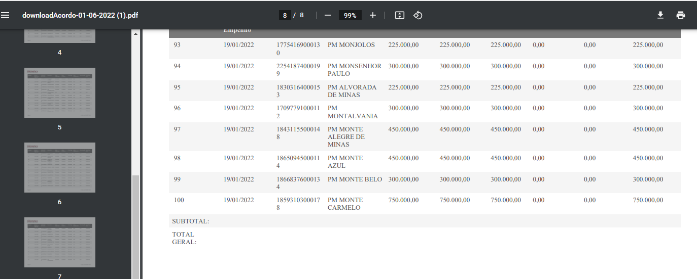

----

---

## 15.Download CSV - Tabela Modal - Monte sua pesquisa

**CORRIGIDO** Verificado dia 12/07/2022
--

- a extração em CSV está apresentando o valor SUBTOTAl e não o valor TOTAL

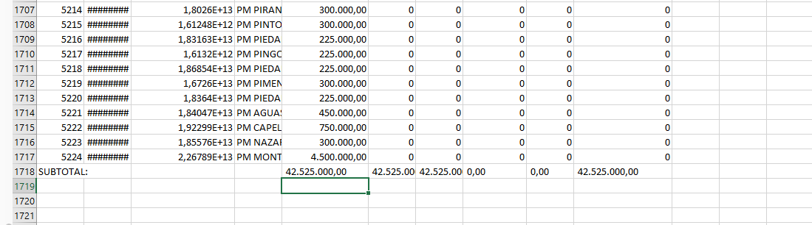

---

## 27. Detalhar - Monte sua pesquisa

**CORRIGIDO** verificado dia 27/06/2022
--
[link](https://age7-novo.homologacao.prodemge.gov.br/eventos-extraordinarios/acordo-judicial-reparacao-vale?task=estado_recursosvale.listarConsultaLivre&amp;jform[ID_UNIDADE_ORC][0]=2351&amp;jform[datainicio]=01/01/2022&amp;jform[datafim]=31/05/2022&amp;jform[codigo]=0&amp;jform[colunas]=PERIODO,ORGAO,VR_EMPENHADO,VR_LIQUIDADO,VR_PAGO,VR_LIQUIDADO_RP,VR_PAGO_RP,VR_PAGO_TOTAL&amp;jform[push]=ORGAO#:64a8e1d9a461b69bfb57fe9958f975df)
--
A depender do filtro que o usuário está usando ao clicar no botão detalhar ele é direcionado para a página inicial do PdT

- [Detalhar - com erro](https://age7-novo.homologacao.prodemge.gov.br/eventos-extraordinarios/acordo-judicial-reparacao-vale?task=estado_recursosvale.listarConsultaLivre&jform%5BID_FAVORECIDO%5D%5B0%5D=923681&jform%5Bdatainicio%5D=01/01/2022&jform%5Bdatafim%5D=27/05/2022&jform%5Bcodigo%5D=0&jform%5Bcolunas%5D=PERIODO,FAVORECIDO,VR_EMPENHADO,VR_LIQUIDADO,VR_PAGO,VR_LIQUIDADO_RP,VR_PAGO_RP,VR_PAGO_TOTAL&jform%5Bpush%5D=FAVORECIDO)
- [Detalhar sem erro](https://age7-novo.homologacao.prodemge.gov.br/eventos-extraordinarios/acordo-judicial-reparacao-vale?task=estado_recursosvale.listarConsultaLivre&amp;jform[ID_PROJETO][0]=3&amp;jform[ID_PROJETO][1]=1&amp;jform[datainicio]=01/01/2022&amp;jform[datafim]=31/05/2022&amp;jform[codigo]=0&amp;jform[colunas]=PERIODO,PROJETO&amp;jform[push]=PROJETO)

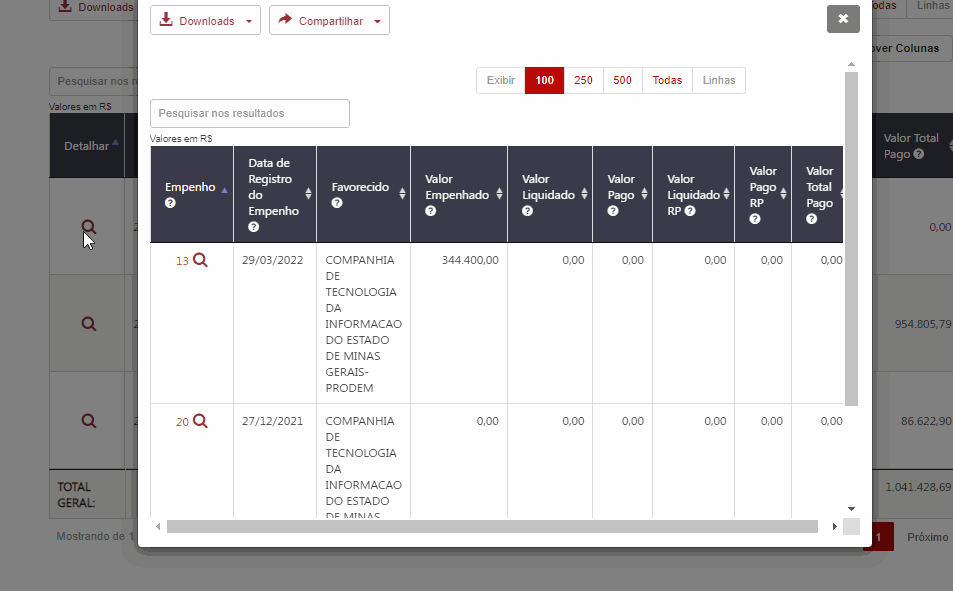

---

## 31.Tabelas modais - movíveis

**CORRIGIR** verificado dia 12/07/2022
--

O símbolo (cruz) de mover ainda não está sendo exibido. Ver imagem comparativa entre a consulta da Vale e a Consulta de Remuneração

---
**VERIFICAR** Verificado em 21/06/2022
--
* A funcionalidade até foi aplicada, mas é preciso que ao clicar na tabela modal a mesma apresente o símbolo de mover assim como ocorre na consulta de Remuneração.
Da forma que foi implementada não oferece indicativo que é possível mover a tabela modal.

---
Todas as tabelas modais (pesquisa básica e avançada) deverão ser movíveis, ex. [PDT Remuneração](https://www.transparencia.mg.gov.br/estado-pessoal/remuneracao-dos-servidores/remuneracao-faixa/202203/2/1064/3978/C/3968566/1001/27364479)

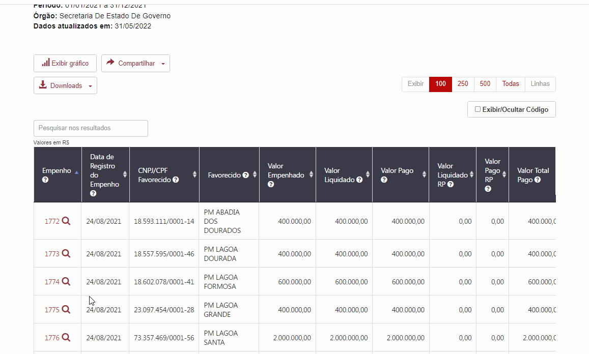

## 34.Compartilhar

**Corrigido parcialmente** 12/07/2022
--
Em verificação ocorrida no dia 12/07/2022 a correção foi aplicada apenas na pesquisa básica. A pesquisa avançada ainda encontra-se com o problema - ver imagem abaixo:

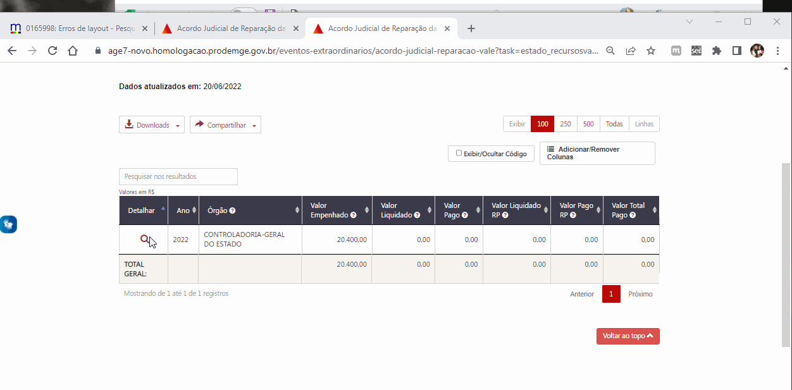
---

**Não Corrigido** - Verificado em 27/06/2022 => O link copiado não está funcionado dentro do formulário de detalhamento por meio da pesquisa avançada. Ver gif abaixo

Conforme relatado no issues [#72](https://github.com/transparencia-mg/especificacoes-portal-transparencia/issues/72) o Link do Compartilhar > Copiar Link não abre o detalhamento em novo formulário de acesso

verificado no dia 27/06/202203
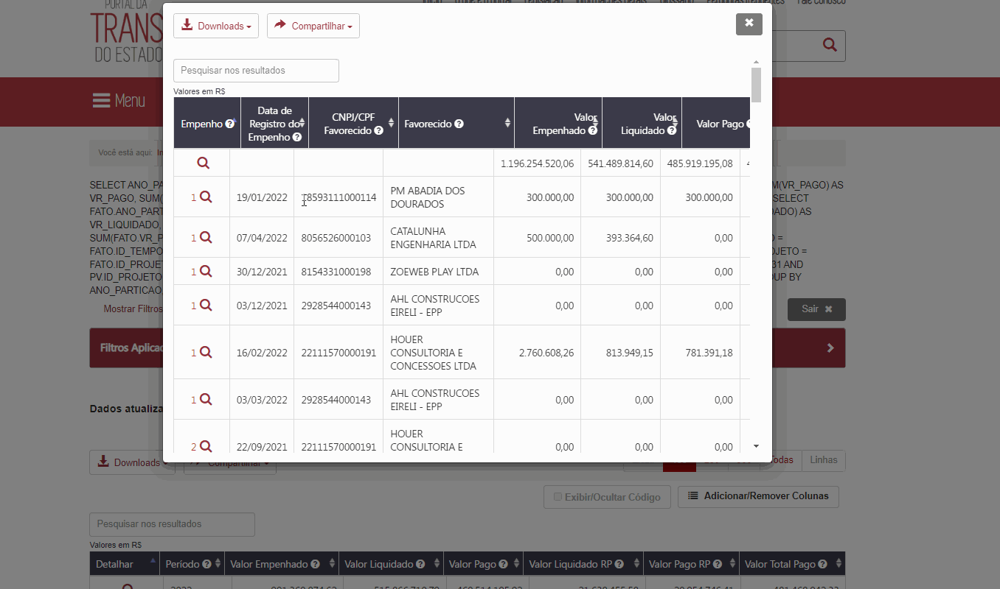

---

## 36.Barra Vertical - CPF/CNPJ Favorecido
**CORRIGIDO** - Verificado em 12/07/2022
--

Considerando a opção 2 aplicada temos as seguinte ressalva a ser corrigida:

Não é possível a busca pelo número completo do CPF. O que percebemos é que a busca está ocultado os 5 primeiros dígitos. Sendo assim o PDT só retorna algum resultado se o usuário digitar a partir do sexto caracter do CPF.

**OPÇÃO 2**

- Os dados de CPF que estão no menu *dropdown* ou na tela exibir todos deverão ser exibidos descaracterizados. Porém, quando o usuário digitar algum valor nesse campo o PDT irá realizar a busca normalmente.
- Os dados serão exibidos descaracterizados (quando se tratar de CPF) no campo filtros aplicados,  barra vertical e tela selecionar todos.

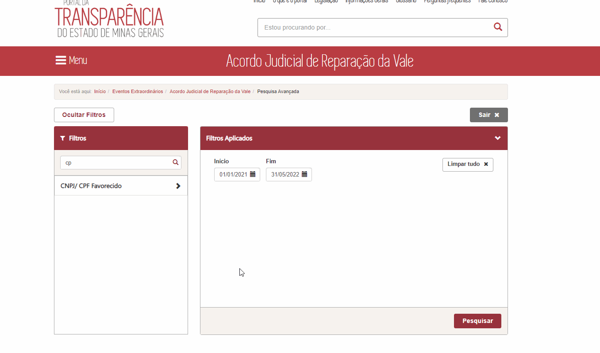

---

## 39. Barra vertical - horizonte de cobertura

**CORRIGIDO PARCIALMENTE** - Verificado em 12/07/2022 -> Não é possível a conferência, pois ao selecionar os itens o usuário é direcionado para a página inicial
--

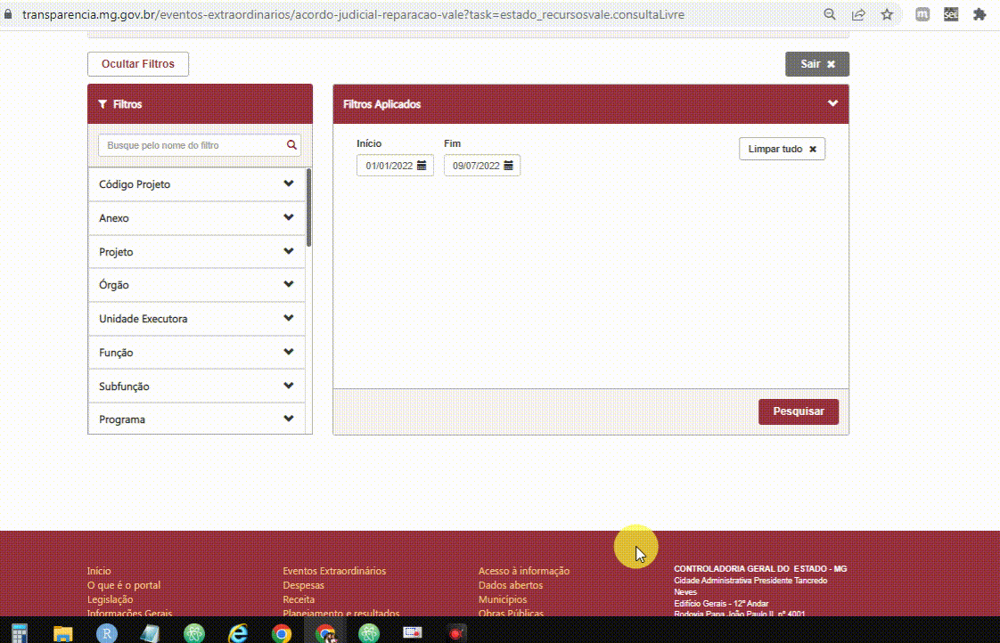

O relato desse erro está detalhando no issues [#75](https://github.com/transparencia-mg/especificacoes-portal-transparencia/issues/75)

----

# Itens não verificados (enumerados) no mantis:

---

## 46. Subtotal

**corrigido** - Verificado em 27/06/22

Conforme documentação a opção SUBTOTAL só deve aparecer quando for aplicado algum filtro ou houver paginação dos dados.

Exemplo 1 - Não existe paginação, porém ao usar algum filtro a opção subtotal não é exibida.

Exemplo 2 - Existe paginação, porém ao solicitar a exibição de todas as linhas o valor subtotal ainda é exibido.

---

# Novos itens identificados na conferência do dia 15/06/2022:

## 48. A legenda da tabela

**CORRIGIDO PARCIALMENTE** verificado dia 12/07/2022
--

Ao clicar na consulta 'Por execução' e selecionar um órgão no filtro a legenda está exibindo: **Projeto: Advocacia Geral do Estado**

E também o órgão não está sendo exibido na migalha.

Ver imagem abaixo
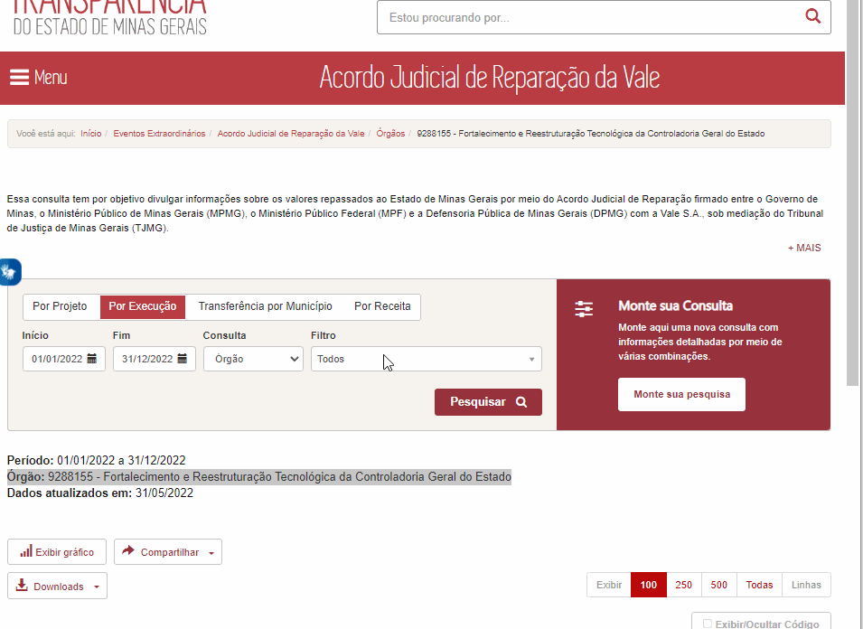

----

## 51. Botão Exportar - Formulário de detalhamento

**CORRIGIR** verificado dia 21/06/202203
--
 - Retirar o botão exportar do formulário de empenho da consulta Transferência por Município.
--
------

O botão exportar deve ser retirado de todos os formulários de detalhamento, uma vez que não essa funcionalidade está desativada.[link](https://age7-novo.homologacao.prodemge.gov.br/eventos-extraordinarios/acordo-judicial-reparacao-vale?task=estado_recursosvale.listarMunicipios&amp;ano=&amp;dataInicio=01/01/2022&amp;dataFim=31/12/2022&amp;consulta=3&amp;filtro=#;14630828)

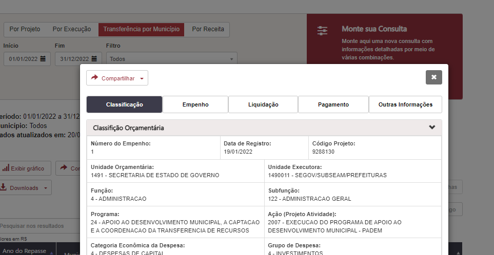

# Novos itens identificados na conferência do dia 21/06/2022:

## 52. Falta colunas na tabela modal - monte sua pesquisa

**CORRIDIDO PARCIALMENTE**Verificado dia 12/07/22
--
Na tabela está faltando a coluna **Órgão**
--

[Ver documentação](https://github.com/transparencia-mg/especificacoes-portal-transparencia/blob/master/espec018_recursos-acordo-judicial-vale/especifica%C3%A7%C3%A3o/recursos-vale-dados.md#tabela-de-resultados)

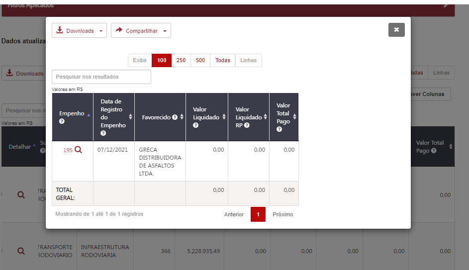

