#### ERROS PENDENTES DE CORREÇÃO E/OU VERIFICAÇÃO

## 1. O resultado da consulta não corresponde ao período selecionado
**CORRIGIDO** - Verificado em 13/06/2022
--

Ao selecionar apenas o período de 2022 para o órgão Controladoria Geral do Estado a tabela de resultados apresenta valores zerados e quando é clicado no detalhamento os empenhos listados correspondem ao exercício de 2021.

O empenho citado como exemplo apenas foi inscrito em RP em 2022 não havendo nenhuma execução referente a ele. Nesse sentido, ele deve ser exibido apenas quando houver liquidação e/ ou pagamento .

----

## 2. Trocar nome de 'todas' para 'todos', pois órgão é uma palavra masculina
**CORRIGIDO** - Verificado em 13/06/2022
--
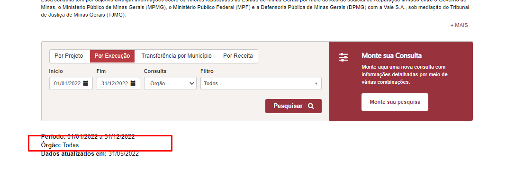

---

## 3.Filtro favorecido da consulta por Execução
**CORRIGIDO PARCIALMENTE** - Verificado em 13/06/2022
--
A mensagem foi aplicada apenas no filtro "Favorecido por nome". Favor colocar a mensagem no filtro "Favorecido por CNPJ/CPF"
Ao clicar no filtro 'Favorecido por nome' ou Favorecido por CPF/CNPJ' e não escolher nenhum favorecido e clicar em pesquisar o usuário é direcionado para a página inicial da consulta Por Execução sem nenhuma mensagem.

Caso não seja possível a busca por todos os Favorecido o Portal deve apresentar uma mensagem informando que é preciso selecionar um favorecido, assim como ocorre atualmente nas consultas que se encontram em produção no PDT.

---

## 4. Legenda da tabela ao selecionar o filtro favorecido
**CORRIGIDO** - Verificado em 13/06/2022
---

Ao selecionar um Favorecido a legenda da tabela de resultados não está sendo exibida.

Exemplo: [Consulta de Despesa](https://www.transparencia.mg.gov.br/despesa-estado/despesa/despesa-favorecidos/2022/01-01-2022/31-12-2022/0/CONSTRUTORA%20CENTRO%20LESTE%20ENGENHARIA/0/3)

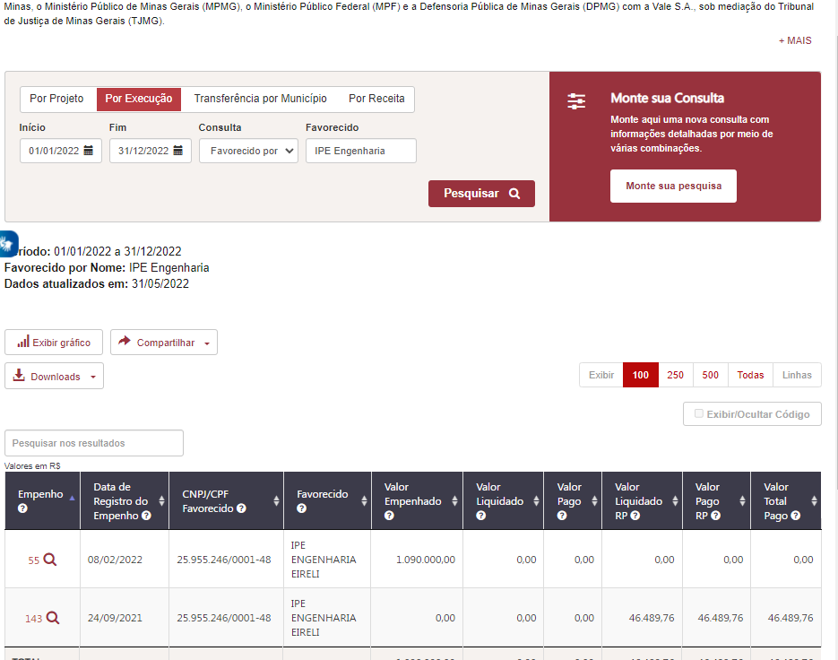

---

## 5. Formatação dos textos
**CORRIGIDO** - Verificado em 13/06/2022
---
- As preposições da legenda das tabelas e migalhas estão com a inicial em maiúsculo.
O fato está acontecendo no cabeçalho de todas as consultas.

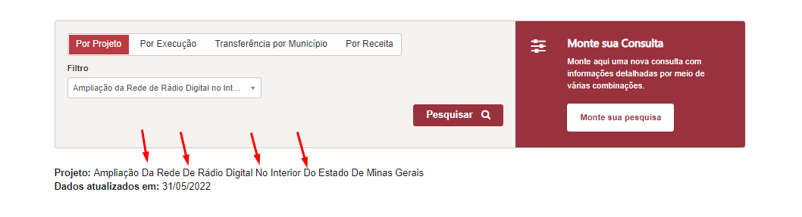

- Corrigir formatação do conteúdo do filtro anexo

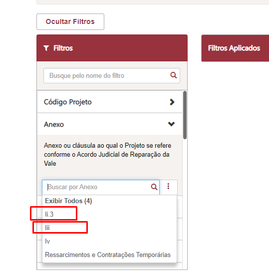

---

## 6. Exibir/Ocultar filtros - pesquisa básica
**CORRIGIDO** - Verificado em 13/06/2022
---
Conforme sugestão, favor desabilitar o botão onde não há coluna a ser exibida.

Sugestão Prodemge:
Nota: Sugiro que o botão exibir/oculta código fique desabilitado ou invisível nas consultas onde não há coluna de código a ser exibida. Assim que confirmado, podemos realizar o ajuste

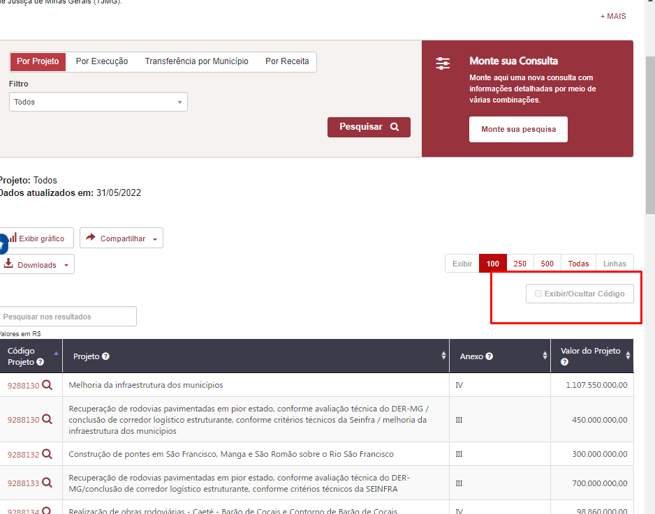

---

## 7. Legenda do Gráfico
**CORRIGIDO** - Verificado em 13/06/2022
---
**Consulta Por Execução - Gráfico de barras:** Trocar a legenda valor liquidado para "Valor Total Pago", pois o gráfico refere-se ao valor total Pago

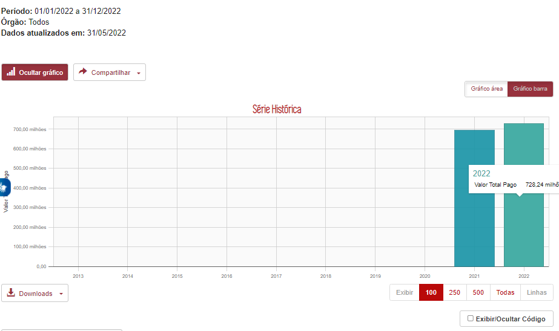

**Consulta Transferência por Município - Gráfico de barras:** Trocar a legenda valor liquidado para "Valor Pago", pois o gráfico refere-se ao valor Pago.

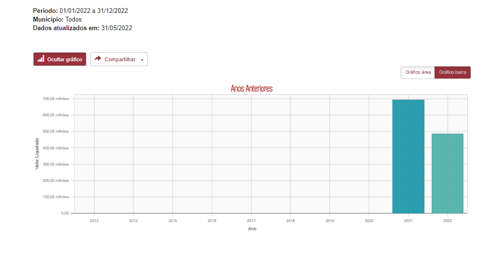

**Consulta Por Receita - Gráfico de barras:**
**CORRIGIDO PARCIALMENTE** - Verificado em 13/06/2022
---
Ficou pendente a correção do item 1 "*O gráfico deve-se referir a Classificação da Receita e não a Fonte de Recurso;*"

1.  O gráfico deve-se referir a Classificação da Receita e não a Fonte de Recurso;

2. Trocar a legenda valor liquidado para “Valor Arrecadado”.
**CORRIGIDO** - Verificado em 13/06/2022
---
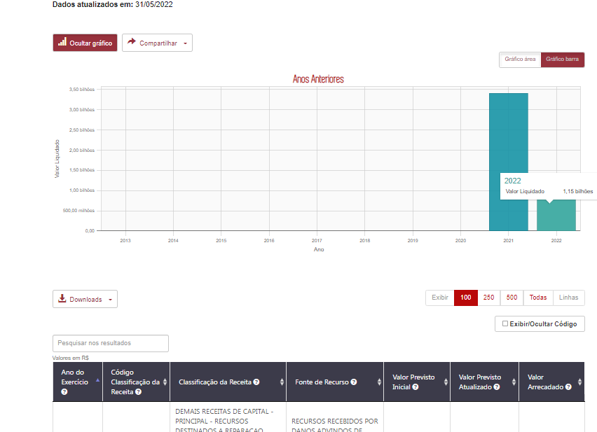

---

## 8. Título do Gráfico
**CORRIGIDO** - Verificado em 13/06/2022
---
O título dos gráficos de barra devem ser 'Série Histórica'

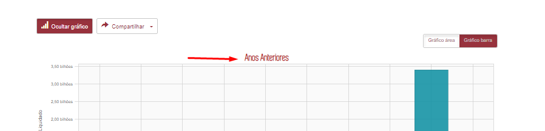

----

## 9. Valores do Gráfico

**CORRIGIDO** - Verificado em 13/06/2022
Os valores do gráfico de barras da consulta Transferência por Município não coincide com a tabela

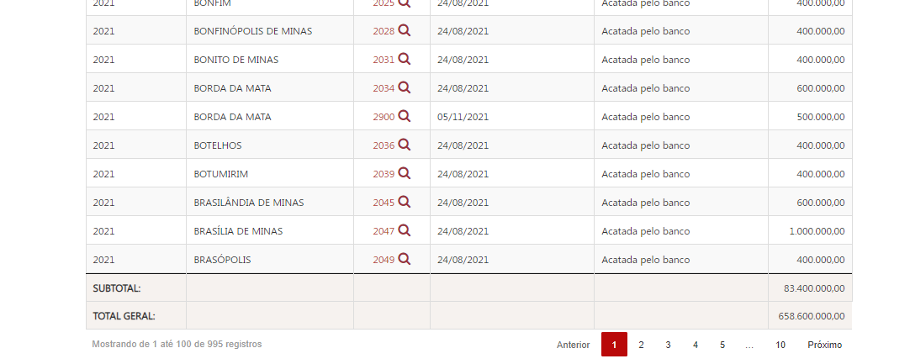

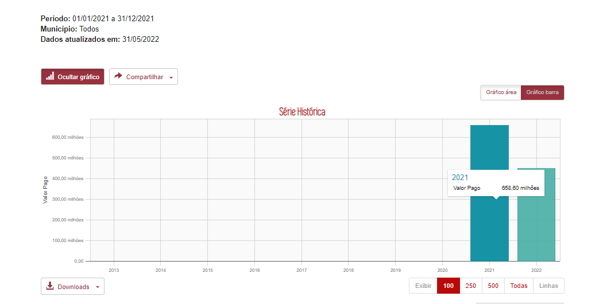

----

## 10. Campos clicáveis

**CORRIGIDO** - Verificado em 13/06/2022

A funcionalidade foi aplicada apenas na consulta básica a pesquisa avançada ainda está pendente.

- Tabela de resultados; tabela modal e tabela de empenhos

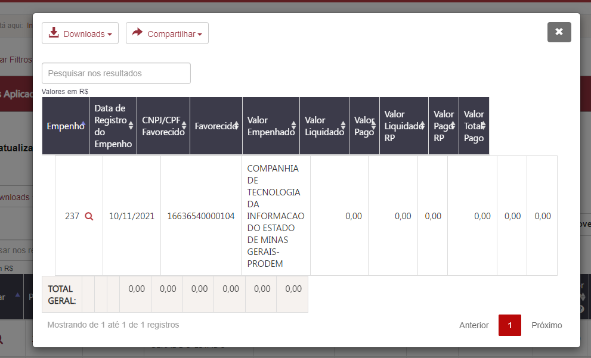

## 11. Migalhas / Cabeçalho
**CORRIGIDO** - Verificado em 13/06/2022
---

Ao selecionar um projeto pelo código na 'Consulta por Execução' tanto a árvore quanto o cabeçalho deve exibir o **Nome do projeto e o código do Projeto**, pois caso o usuário clique no projeto 9288133 e nesses campos apresentar apenas a descrição ele poderá ficar perdido onde está realmente.

Nesse questionamento foi realizado a alteração para exibição da descrição do Órgão na migalha. Essa alteração foi interessante, porém a descrição e código do Projeto norteia o cidadão no caminho por onde ele navegou.

O exemplo abaixo demonstra que ao selecionar o órgão DEER esse possui 4 projetos. Caso o usuário selecione algum projeto ele não saberá identificar pelo cabeçalho da tabela e migalha a qual projeto pertence a lista de empenhos. Assim é necessário retornar e fazer uma nova busca.

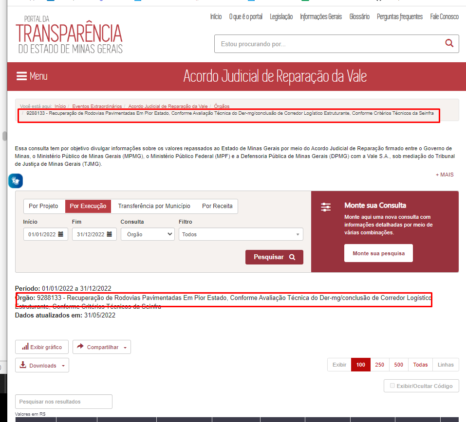

## 12. Download PDF - pesquisa básica

**CORRIGIDO** - Verificado em 20/06/2022

- A correção foi aplicada apenas na consulta avançada. Na pesquisa básica não está funcionando.
- Não é possível verificar as funcionalidades, pois o download na pesquisa básica não está funcionando.

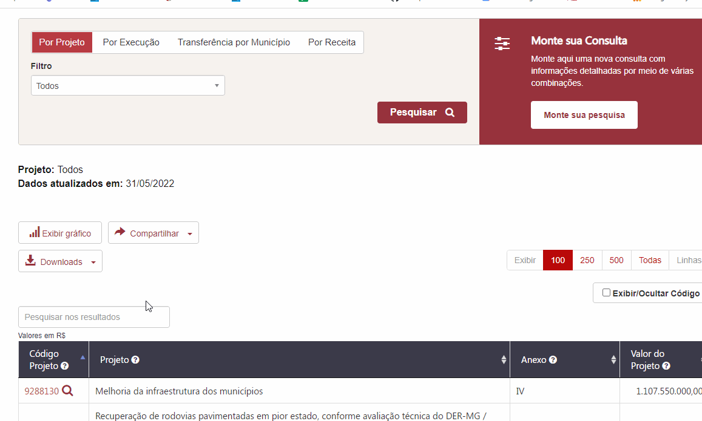

---

## 13. Download PDF - Tabela Modal - Monte sua pesquisa

- Os valores de subtotal e total não estão sendo exibidos na extração em PDF.

---
## 14. Download PDF

Não entendi a sua resposta nesse item. Caso seja trabalhoso colocar o link no documento gerado em PDF pode desconsiderar essa solicitação. Assim a mesma será solicitada em intervenções futuras.

>DOWNLOAD PDF
1- A URL* não está sendo exibida
2- o arquivo gerado em PDF não está sendo exibido em outra aba do navegador e sim está fazendo o downolad (mesmo comportamento do Portal atual/função de chama Download)
Obs: O processo consiste em um download do PDf que é gerado em tempo real. Não há link para download e o mesmo será feito o download, como já é na versão atual do Portal.

---
## 15.Download CSV - Tabela Modal - Monte sua pesquisa

- a extração em CSV está apresentando o valor SUBTOTAl e não o valor TOTAL

---

## 16. Download CSV - Pesquisa básica

**CORRIGIDO** - Verificado em 20/06/2022

- A correção foi aplicada apenas na consulta avançada. Na pesquisa básica não está funcionando.
- Não é possível verificar as funcionalidades, pois o download na pesquisa básica não está funcionando.

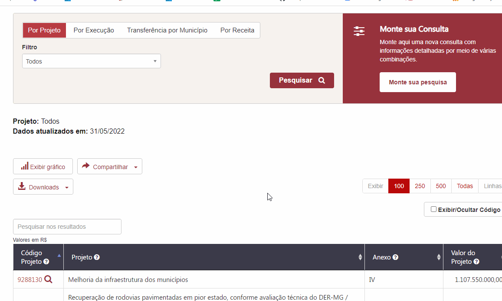

---
## 17. Download Base Completa

Os links que deverão ser usados quando o usuário clicar em download base completa

* Consulta por Projeto - 1 nível: https://dados.mg.gov.br/dataset/acordo-judicial-reparacacao-vale-projetos

* Demais consultas: https://dados.mg.gov.br/dataset

---

## 18. Exportação CSV - Formulário de detalhamento

Favor desabitar a opção "Exportar" para o formulário de detalhamento, pois a forma como está sendo exibido não atende o planejado.
Essa funcionalidade será melhor estudada para futurar intervenções.

---

## 19.Outras informações - Formulário de detalhamento
**CORRIGIDO** - Verificado em 13/06/2022
---
- O título da tabela está errado. Mudar parada 'Dados do Processo de Compra'

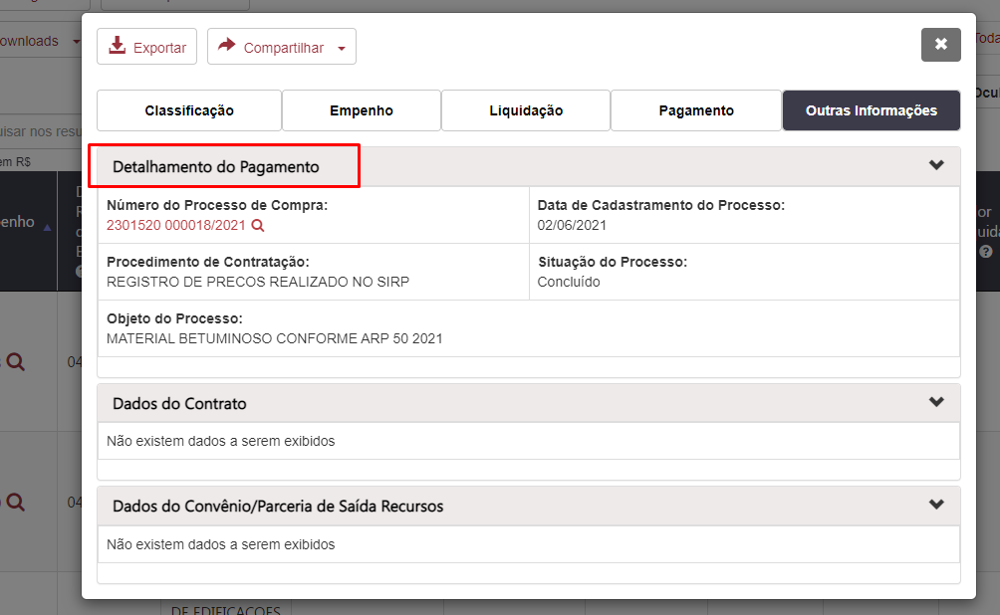

---

## 20. Filtro por Órgão
**CORRIGIDO** - Verificado em 15/06/2022
--

Ao selecionar o período de 01/01/2021 a 31/12/2021 e o órgão: 'Departamento de Edificações e Estradas de Rodagem do Estado De Minas Gerais' o PDT retorna a mensagem "*Nenhum resultado encontrado*", porém existem dados para o período selecionado quando solicita a exibição de todos os órgãos

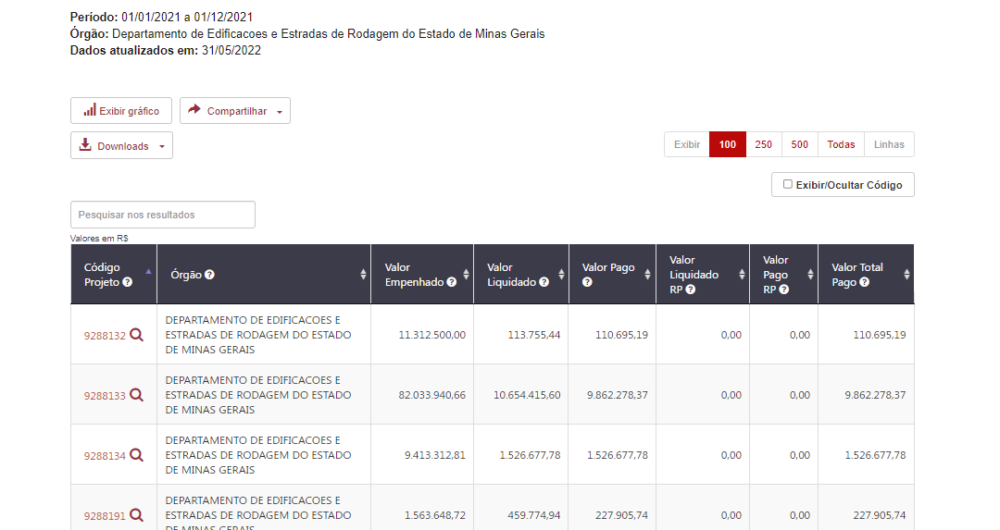

---

## 21. Botão Sair
**CORRIGIDO** - Verificado em 13/06/2022
---
- Ao clicar no botão sair a página do Portal apresenta erro

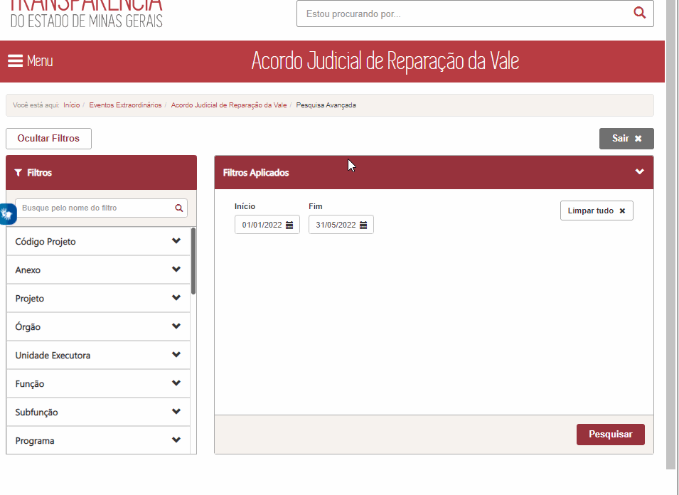

---

## 22. Adicionar/Remover colunas - Marcar/Desmarcar todos
**CORRIGIDO** - Verificado em 13/06/2022
---
O botão até foi incluído, porém ele deve ser estilisticamente diferente dos filtros

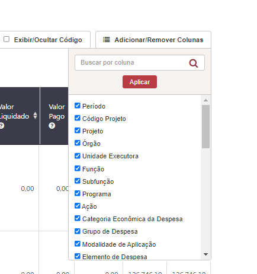

---
## 23.Tabela Modal - Monte sua pesquisa

- O Cabeçalho da tabela modal não está fixo;
- A exibição para selecionar a quantidade de linhas não está na tabela

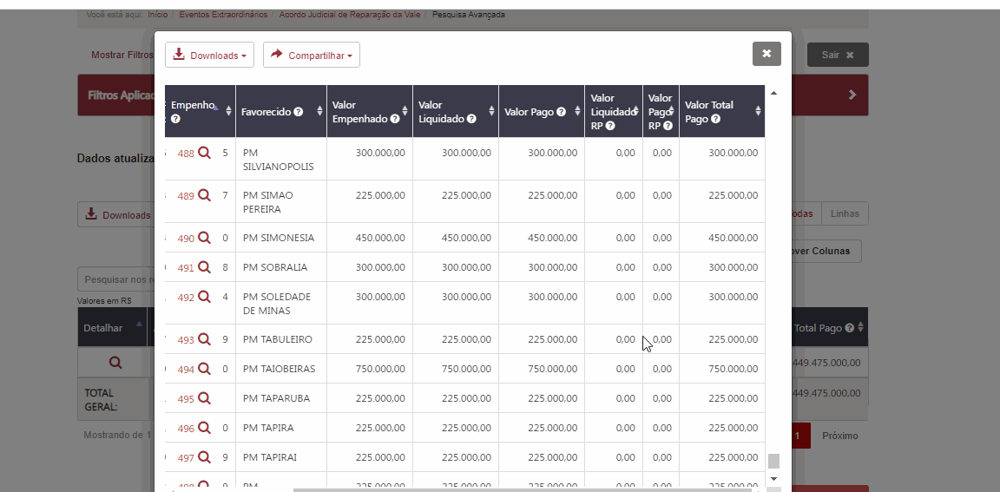

---
## 24.Tabela Modal - Formatação

- Verificar formatação da tabela modal - [monte sua pesquisa](https://age7-novo.homologacao.prodemge.gov.br/eventos-extraordinarios/acordo-judicial-reparacao-vale?task=estado_recursosvale.listarConsultaLivre&amp;jform[ID_PROJETO][0]=3&amp;jform[ID_PROJETO][1]=1&amp;jform[datainicio]=01/01/2022&amp;jform[datafim]=31/05/2022&amp;jform[codigo]=0&amp;jform[colunas]=PERIODO,PROJETO,VR_EMPENHADO,VR_LIQUIDADO,VR_PAGO,VR_LIQUIDADO_RP,VR_PAGO_RP,VR_PAGO_TOTAL&amp;jform[push]=PROJETO)

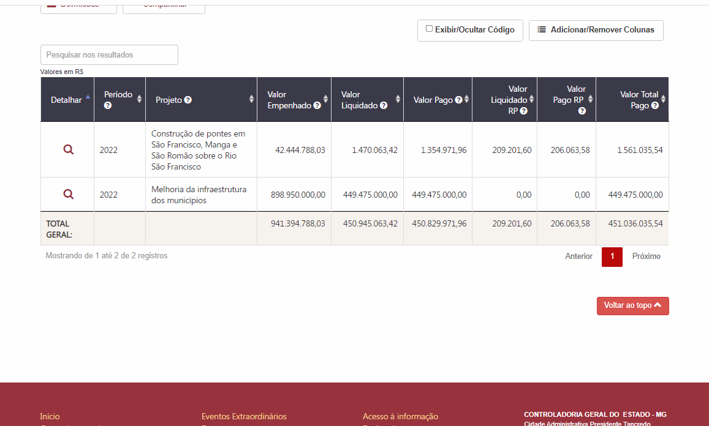

---
## 25.Lista de empenhos - Monte sua pesquisa

- Ao clicar em algum empenho na tabela modal o portal apresenta ERRO

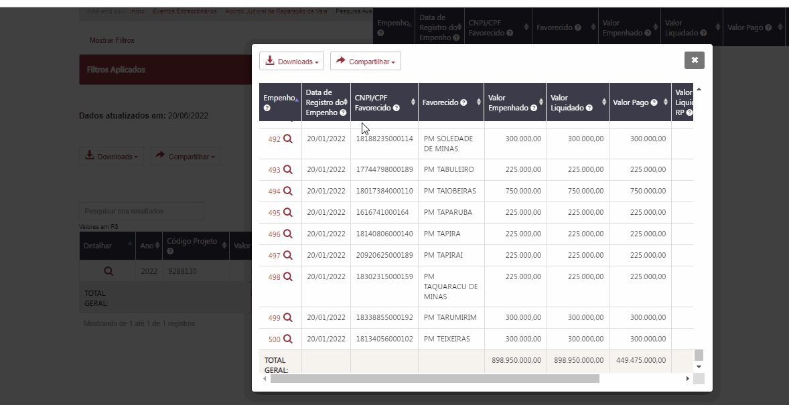

---
## 26. Barra de Pesquisa - Tabela de Resultados - Monte sua pesquisa

Como já mencionado algumas barras de pesquisa não estão respeitando o solicitado.

Ao escrever a palavra 'construc' com o "C" sem o cedinha a busca não é realizada.

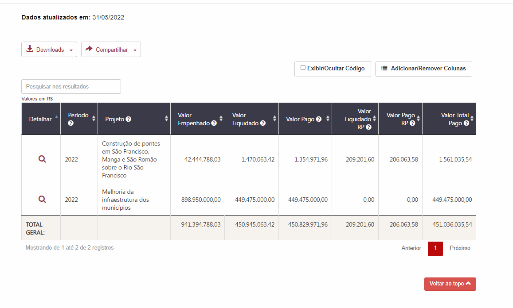

---

## 27. Detalhar - Monte sua pesquisa
O erro ainda está ocorrendo - verificado 15/06/2022 [link](https://age7-novo.homologacao.prodemge.gov.br/eventos-extraordinarios/acordo-judicial-reparacao-vale?task=estado_recursosvale.listarConsultaLivre&amp;jform[ID_UNIDADE_ORC][0]=2351&amp;jform[datainicio]=01/01/2022&amp;jform[datafim]=31/05/2022&amp;jform[codigo]=0&amp;jform[colunas]=PERIODO,ORGAO,VR_EMPENHADO,VR_LIQUIDADO,VR_PAGO,VR_LIQUIDADO_RP,VR_PAGO_RP,VR_PAGO_TOTAL&amp;jform[push]=ORGAO#:64a8e1d9a461b69bfb57fe9958f975df)
--
A depender do filtro que o usuário está usando ao clicar no botão detalhar ele é direcionado para a página inicial do PdT

- [Detalhar - com erro](https://age7-novo.homologacao.prodemge.gov.br/eventos-extraordinarios/acordo-judicial-reparacao-vale?task=estado_recursosvale.listarConsultaLivre&jform%5BID_FAVORECIDO%5D%5B0%5D=923681&jform%5Bdatainicio%5D=01/01/2022&jform%5Bdatafim%5D=27/05/2022&jform%5Bcodigo%5D=0&jform%5Bcolunas%5D=PERIODO,FAVORECIDO,VR_EMPENHADO,VR_LIQUIDADO,VR_PAGO,VR_LIQUIDADO_RP,VR_PAGO_RP,VR_PAGO_TOTAL&jform%5Bpush%5D=FAVORECIDO)
- [Detalhar sem erro](https://age7-novo.homologacao.prodemge.gov.br/eventos-extraordinarios/acordo-judicial-reparacao-vale?task=estado_recursosvale.listarConsultaLivre&amp;jform[ID_PROJETO][0]=3&amp;jform[ID_PROJETO][1]=1&amp;jform[datainicio]=01/01/2022&amp;jform[datafim]=31/05/2022&amp;jform[codigo]=0&amp;jform[colunas]=PERIODO,PROJETO&amp;jform[push]=PROJETO)

---

## 28.Paginação tabela de resultados - Monte sua pesquisa
**CORRIGIDO** - Verificado em 13/06/2022
---
 A tabela de resultados do "Monte sua pesquisa" não está exibindo a opção de selecionar a quantidade de linhas, conforme padrão adotado nessa consulta

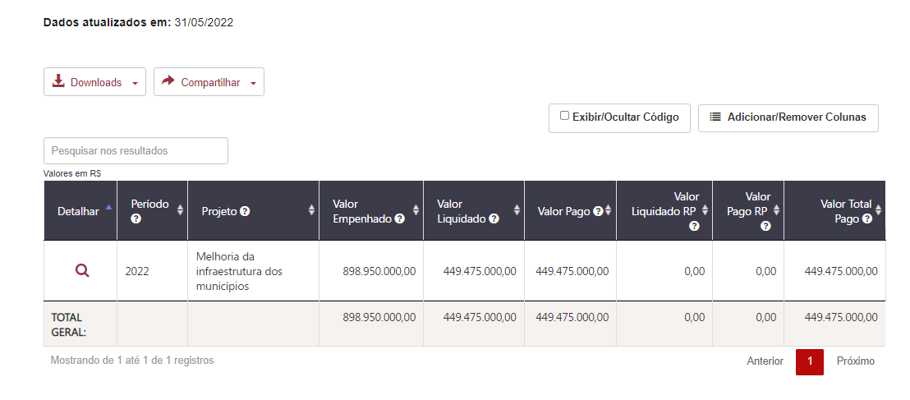

---

## 29.Subtotal/Total - tabela de resultados - Monte sua pesquisa
**CORRIGIDO** - Verificado em 13/06/2022
---
 A tabela de resultados não exibirá os campos TOTAL GERAL e o SUBTOTAL quando não houver dados referentes a valores.

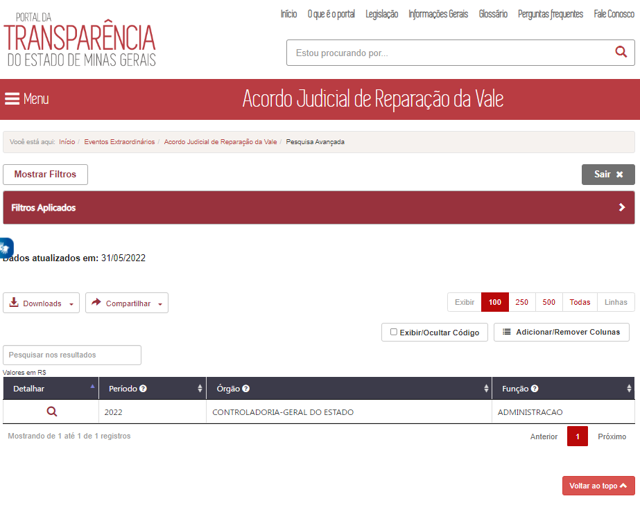

---

## 30.Formatação - tabela de resultados - Monte sua pesquisa
**CORRIGIDO** - Verificado em 13/06/2022
---
A formatação do cabeçalho da tabela deve ser alinhado à esquerda.

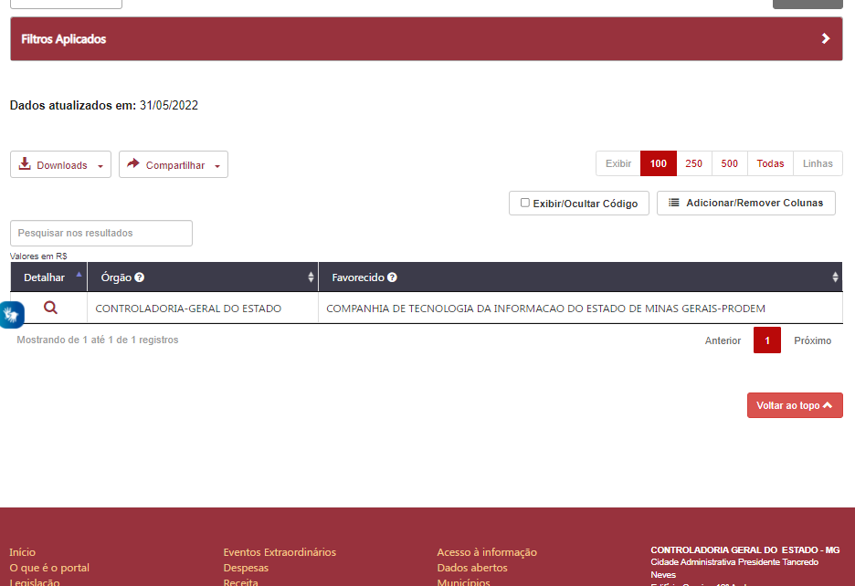

---
## 31.Tabelas modais - movíveis

Todas as tabelas modais (pesquisa básica e avançada) deverão ser movíveis, ex. [PDT Remuneração](https://www.transparencia.mg.gov.br/estado-pessoal/remuneracao-dos-servidores/remuneracao-faixa/202203/2/1064/3978/C/3968566/1001/27364479)

---

## 33. Barra de rolagem vertical
**CORRIGIDO** - Verificado em 13/06/2022
---
Conforme relatado no issues [#71](https://github.com/transparencia-mg/especificacoes-portal-transparencia/issues/71) o O comportamento da barra de rolagem vertical não permite a visualização dos dados do início da tabela em todas as páginas da consulta

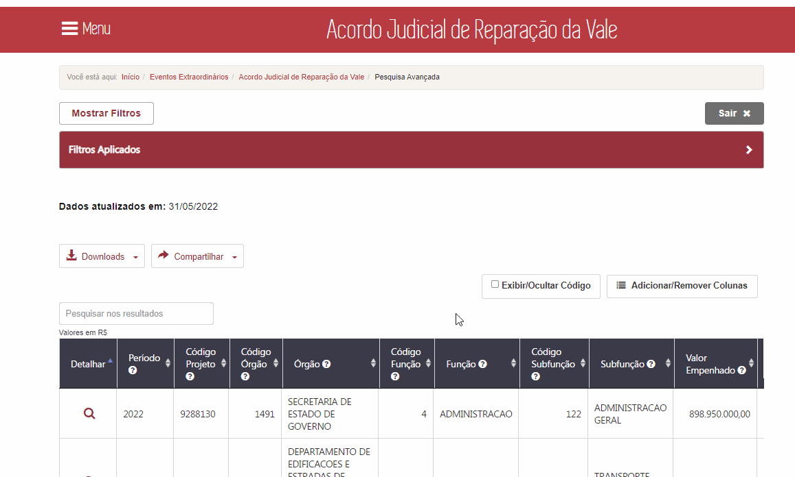

---

## 34.Compartilhar

**CORRIGIDO PARCIALMENTE** - Verificado em 20/06/2022 => O link copiado não está funcionado dentro do formulário de detalhamento por meio da pesquisa avançada. Ver gif abaixo

Conforme relatado no issues [#72](https://github.com/transparencia-mg/especificacoes-portal-transparencia/issues/72) o Link do Compartilhar > Copiar Link não abre o detalhamento em novo formulário de acesso

---

## 35. Formulário de detalhamento - Dados do Processo de Compra
**CORRIGIDO PARCIALMENTE** - Verificado em 13/06/2022
---
-Nome incorreto para seção Dados do Processo de Compra no formulário de detalhamento [#73](https://github.com/transparencia-mg/especificacoes-portal-transparencia/issues/73)

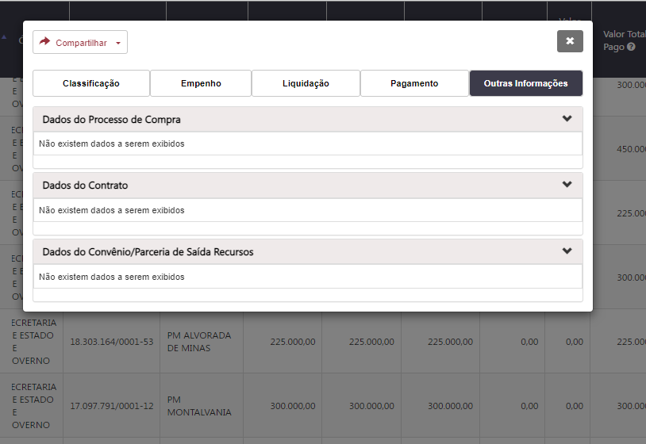

---

## 36.Barra Vertical - CPF/CNPJ Favorecido
**CORRIGIDO PARCIALMENTE** - Verificado em 20/06/2022
--

Considerando a opção 2 aplicada temos as seguinte ressalva a ser corrigida:

Não é possível a busca pelo número completo do CPF. O que percebemos é que a busca está ocultado os 5 primeiros dígitos. Sendo assim o PDT só retorna algum resultado se o usuário digitar a partir do sexto caracter do CPF.

**OPÇÃO 2**

- Os dados de CPF que estão no menu *dropdown* ou na tela exibir todos deverão ser exibidos descaracterizados. Porém, quando o usuário digitar algum valor nesse campo o PDT irá realizar a busca normalmente.
- Os dados serão exibidos descaracterizados (quando se tratar de CPF) no campo filtros aplicados,  barra vertical e tela selecionar todos.

---

## 37. Monte sua pesquisa - tooltip tabela de resultados

**CORRIGIDO** - Verificado em 13/06/2022
---
- Alterar o nome elemento para **Elemento de Despesa** e acrescentar o tooltip;
- Alterar o nome Item para **Item de Despesa** e acrescentar o tooltip;
- Alterar o nome Procedimento para **Procedimento de Contratação** e acrescentar o tooltip;
- Acrescentar o tooltip no nome Identificador de Procedência e Uso; número do empenho, situação da ordem de pagamento
- Alterar o nome Fonte para **Fonte de Recurso* e acrescentar o tooltip;

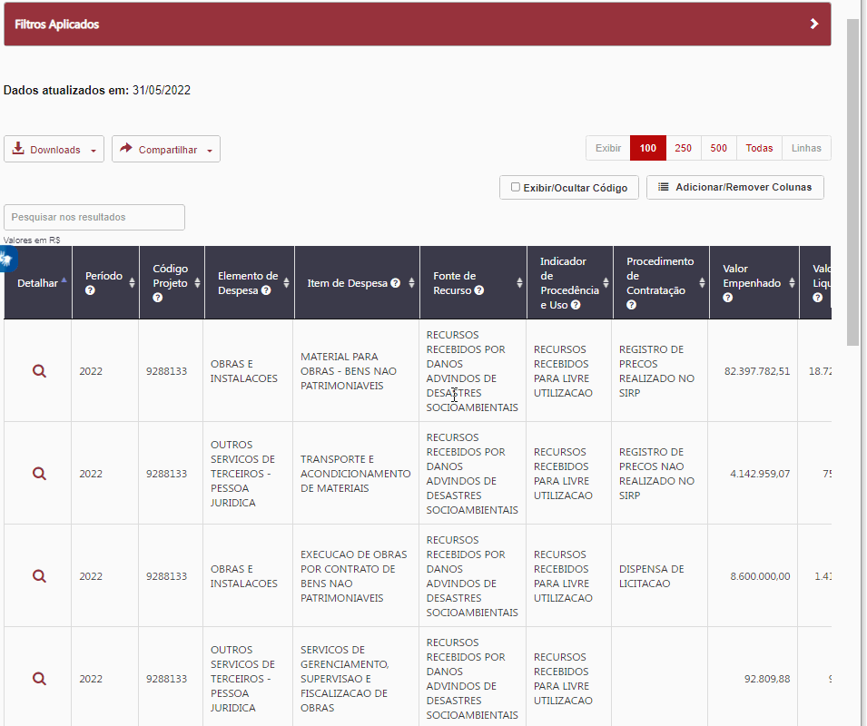

## 38.Barra Vertical - Filtro período
**Essa implementação será realizada em uma nova intervenção no PDT**
---
O filtro período deve estar disposto na barra de navegação vertical e essa deve obedecer os critérios desse filtro.

[Especificação - Dados](https://github.com/transparencia-mg/especificacoes-portal-transparencia/blob/master/espec018_recursos-acordo-judicial-vale/especifica%C3%A7%C3%A3o/recursos-vale-dados.md#monte-sua-pesquisa---pesquisa-avan%C3%A7ada)

---

## 39. Barra vertical - horizonte de cobertura

**CORRIGIDO PARCIALMENTE** - Verificado em 20/06/2022 -> ver explicação no issues
--

O relato desse erro está detalhando no issues [#75](https://github.com/transparencia-mg/especificacoes-portal-transparencia/issues/75)

---

## 40. Tabela de Resultados - Monte sua pesquisa

**CORRIGIDO** - Verificado em 13/06/2022

A tabela de resultados não está exibindo os dados referentes ao Procedimento de Contratação

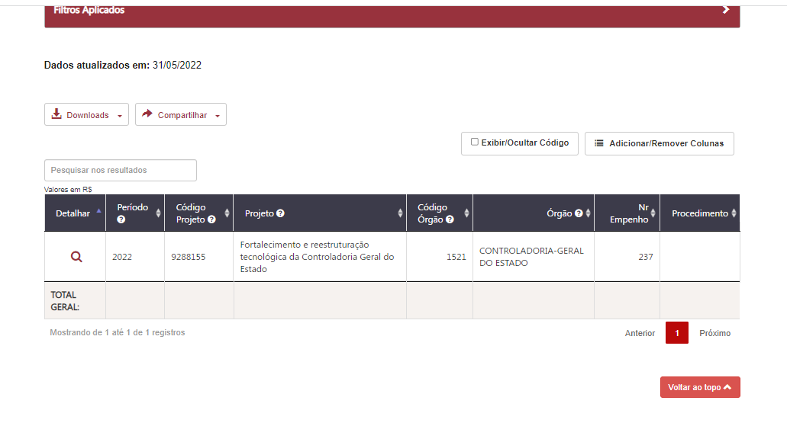

---

## 41.Barra Vertical - Campo 'Número documento Pagamento'

Ao clicar no campo "Número documento Pagamento" na barra vertical a caixa de diálogo para digitar o nome é expandida, porém permanece invisível.

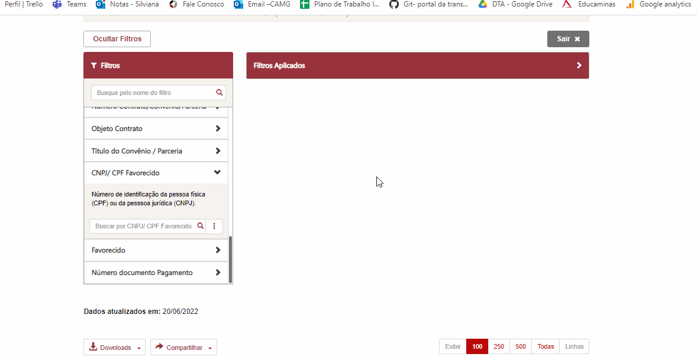

---

## 42. Formulário de Detalhamento -Histórico do empenhos

Mensagem Prodemge:
>Nota: o ambiente de homologação não possui recursos automatizados para o histórico de empenho, mas o dado será exibido normalmente em produção
>

A informação do histórico do empenho não está sendo exibida no formulário de detalhamento.

## 43.Tabela de Resultados - 'Número documento Pagamento'

Ao selecionar o número de documento de Pagamento na barra vertical e clicar em pesquisar os resultados são exibidos corretamente na tabela de resultado, porém caso o usuário inclua a coluna 'empenho' através do botão "Adiciona/remover Colunas" o critério selecionado na barra vertical é desconsiderado.

Assim a tabela de resultados apresenta todos os empenhos independente do número de documento de Pagamento escolhido anteriormente.

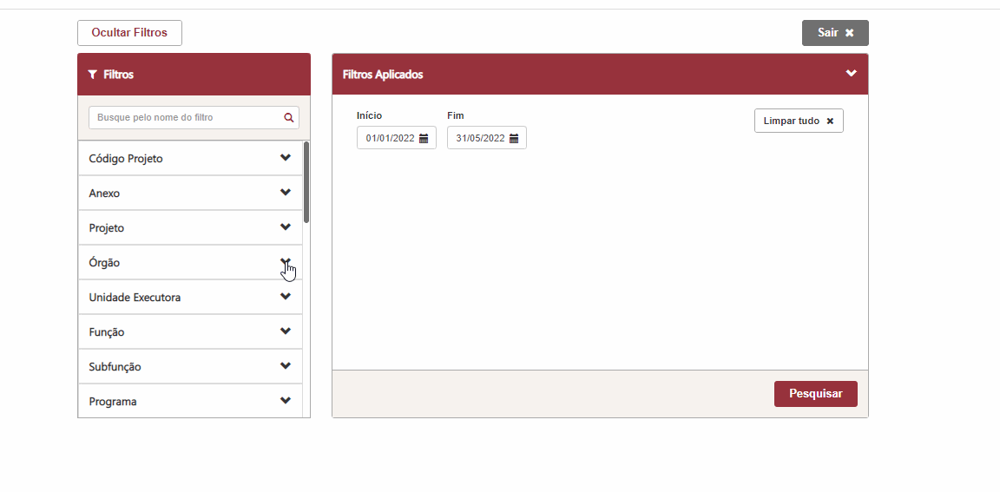

---

## 44. Tabela de Resultados - 'Valores Negativos'

**CORRIGIDO** - Verificado em 20/06/2022
--
A tabela de resultado está apresentando valores negativos empenhado e liquidado.

[Link PDT](https://age7-novo.homologacao.prodemge.gov.br/eventos-extraordinarios/acordo-judicial-reparacao-vale?task=estado_recursosvale.listarConsultaLivre&jform%5BSQA_PAGAMENTO%5D%5B0%5D=23724248,23733702,23808281&jform%5Bdatainicio%5D=01/01/2022&jform%5Bdatafim%5D=27/05/2022&jform%5Bcodigo%5D=0&jform%5Bcolunas%5D=PERIODO,NR_PAGAMENTO,VR_EMPENHADO,VR_LIQUIDADO,VR_PAGO,VR_LIQUIDADO_RP,VR_PAGO_RP,VR_PAGO_TOTAL&jform%5Bpush%5D=NR_PAGAMENTO)

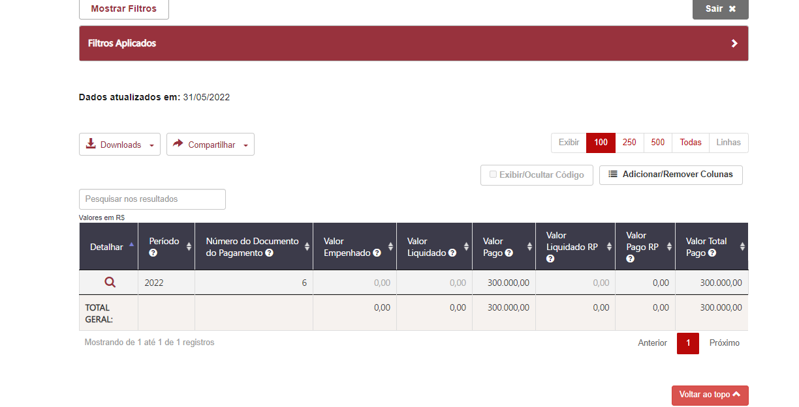

---
## 45.Consulta Por Projeto - Mensagem

Na consulta por Projeto ao clicar em um projeto que não possui execução o PDT exibe a seguinte frase: "Nenhum resultado encontrado". Essa mensagem passa a ideia que pode ser um erro.

É possível nesse caso colocar outra mensagem: "Não existem dados de execução para esse projeto"

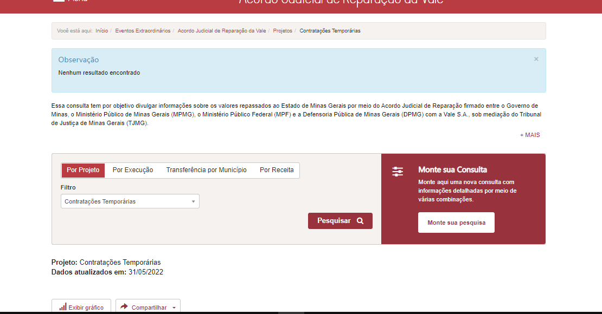

--

# Itens não verificados (enumerados) no mantis:

## 46. Exibir/Ocultar filtros - Monte sua pesquisa

Conforme solicitado os códigos dos filtros só devem ser exibidos quando o usuário clicar o botão 'Exibir/Ocultar filtros'. Na pesquisa avançada, ao selecionar um filtro tanto na barra vertical ou no campo "Adicionar/ Remover Colunas" a coluna de código está sendo exibida.

E ao tentar usar o botão 'Exibir/Ocultar filtros' esse não está respondendo ao comando.

**Mensagem Prodemge**

>Nota: um recurso (ou falta do mesmo) tem influência sobre o outro. Agrupado.

Não entendi a sua colocação.

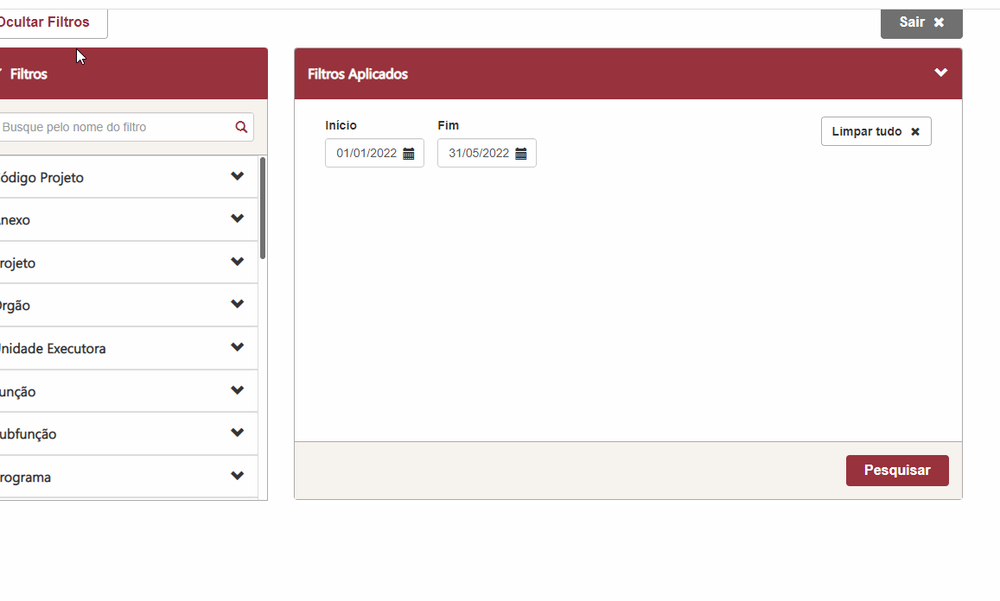

---

## 47. Subtotal

**Não corrigido** - Verificado em 26/05/2022

Conforme documentação a opção SUBTOTAL só deve aparecer quando for aplicado algum filtro ou houver paginação dos dados.

Exemplo 1 - Não existe paginação, porém ao usar algum filtro a opção subtotal não é exibida.

Exemplo 2 - Existe paginação, porém ao solicitar a exibição de todas as linhas o valor subtotal ainda é exibido.

**Exemplo 1**

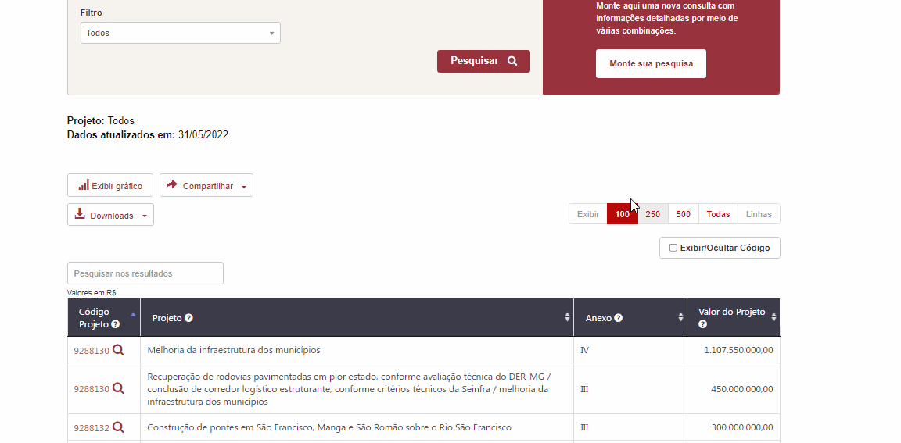

**Exemplo 2**

---

# Novos itens identificados na conferência do dia 15/06/2022:

## 48. A legenda da tabela

A legenda da tabela deve obedecer a navegação realizada pelo usuário.
Exemplo:

O usuário selecionou um órgão e em seguida selecionou um projeto. Nesse caso a legenda deve exibir o passa a passo realizado pelo usuário conforme ocorre atualmente nas demais consultas do Portal.

----
## 49. Tabela modal - linha a mais

Na tabela modal que lista os empenhos na pesquisa

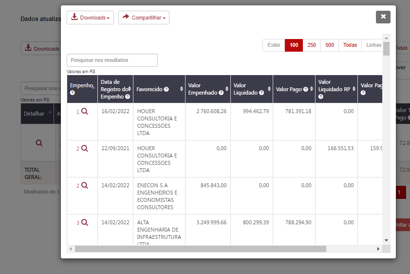

----
## 50. Barra Vertical - Favorecido

Ao digitar mais de um valor na busca o filtro não está funcionando.

Exemplo: Quando digita apenas 'Francisco' o campo busca funciona corretamente, porém ao acrescentar as palavras 'Ana de' a busca não está funcionando.

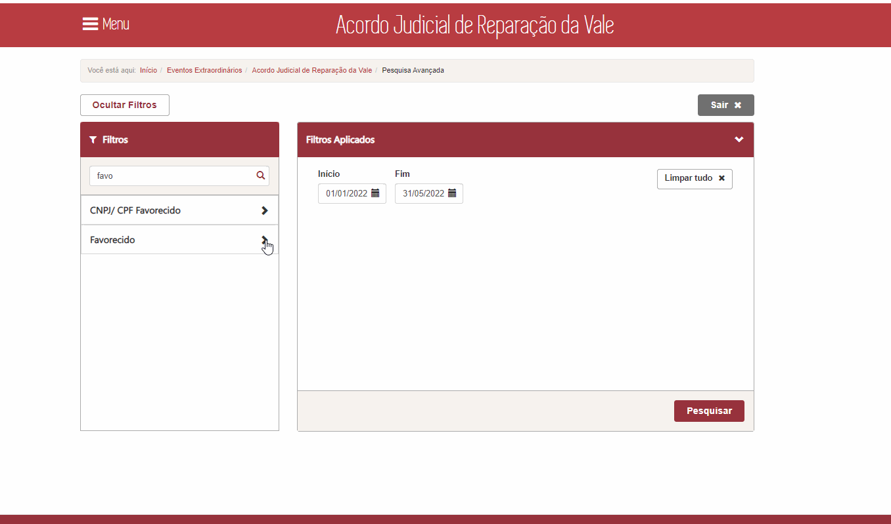

----

## 51. Botão Exportar - Formulário de detalhamento

O botão exportar deve ser retirado de todos os formulários de detalhamento, uma vez que não essa funcionalidade está desativada.[link](https://age7-novo.homologacao.prodemge.gov.br/eventos-extraordinarios/acordo-judicial-reparacao-vale?task=estado_recursosvale.listarMunicipios&amp;ano=&amp;dataInicio=01/01/2022&amp;dataFim=31/12/2022&amp;consulta=3&amp;filtro=#;14630828)

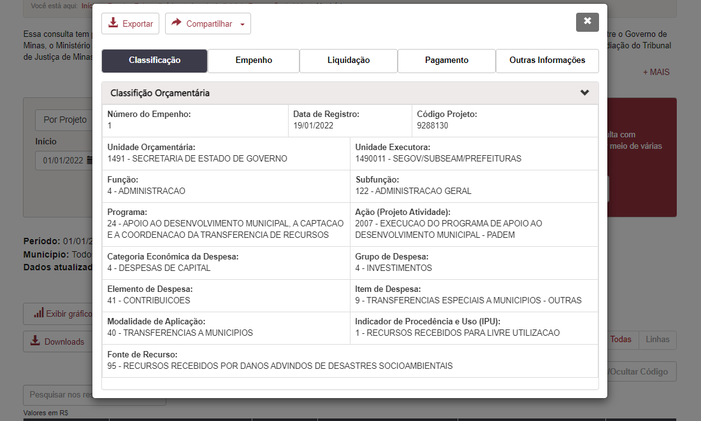
