## O resultado da consulta não corresponde ao período selecionado

**Não corrigido** - Verificado em 26/05/2022

Ao selecionar apenas o período de 2022 para o órgão Controladoria Geral do Estado a tabela de resultados apresenta valores zerados e quando é clicado no detalhamento os empenhos listados correspondem ao exercício de 2021.

O empenho citado como exemplo apenas foi inscrito em RP em 2022 não havendo nenhuma execução referente a ele. Nesse sentido, ele deve ser exibido apenas quando houver liquidação e/ ou pagamento .


----

## Trocar nome de 'todas' para 'todos', pois órgão é uma palavra masculina


---

## Filtro favorecido da consulta por Execução

Ao clicar no filtro 'Favorecido por nome' ou Favorecido por CPF/CNPJ' e não escolher nenhum favorecido e clicar em pesquisar o usuário é direcionado para a página inicial da consulta Por Execução sem nenhuma mensagem.

Caso não seja possível a busca por todos os Favorecido o Portal deve apresentar uma mensagem informando que é preciso selecionar um favorecido, assim como ocorre atualmente nas consultas que se encontram em produção no PDT.


---
## Legenda da tabela ao selecionar o filtro favorecido

Ao selecionar um Favorecido a legenda da tabela de resultados não está sendo exibida.

Exemplo: [Consulta de Despesa](https://www.transparencia.mg.gov.br/despesa-estado/despesa/despesa-favorecidos/2022/01-01-2022/31-12-2022/0/CONSTRUTORA%20CENTRO%20LESTE%20ENGENHARIA/0/3)


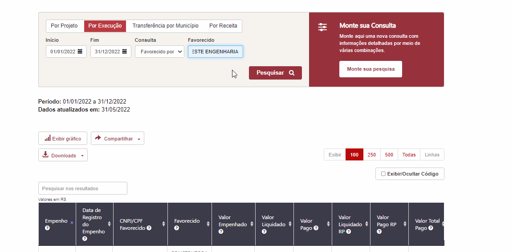

---

## Formatação dos textos

- As preposições da legenda das tabelas e migalhas estão com a inicial em maiúsculo.
O fato está acontecendo no cabeçalho de todas as consultas.


- Corrigir formatação do conteúdo do filtro anexo


---
## Exibir/Ocultar filtros - pesquisa básica

Conforme sugestão, favor desabilitar o botão onde não há coluna a ser exibida.

***Sugestão Prodemge***:

> Nota: Sugiro que o botão exibir/oculta código fique desabilitado ou invisível nas consultas onde não há coluna de código a ser exibida. Assim que confirmado, podemos realizar o ajuste

---
## Exibir/Ocultar filtros - Monte sua pesquisa

Conforme solicitado os códigos dos filtros só devem ser exibidos quando o usuário clicar o botão 'Exibir/Ocultar filtros'. Na pesquisa avançada, ao selecionar um filtro tanto na barra vertical ou no campo "Adicionar/ Remover Colunas" a coluna de código está sendo exibida.

E ao tentar usar o botão 'Exibir/Ocultar filtros' esse não está respondendo ao comando.

**Mensagem Prodemge**

>Nota: um recurso (ou falta do mesmo) tem influência sobre o outro. Agrupado.

Não entendi a sua colocação.


---

## Subtotal

**Não corrigido** - Verificado em 26/05/2022

Conforme documentação a opção SUBTOTAL só deve aparecer quando for aplicado algum filtro ou houver paginação dos dados.

Exemplo 1 - Não existe paginação, porém ao usar algum filtro a opção subtotal não é exibida.

Exemplo 2 - Existe paginação, porém ao solicitar a exibição de todas as linhas o valor subtotal ainda é exibido.


**Exemplo 1**


**Exemplo 2**


---
## Legenda do Gráfico

**Consulta Por Execução - Gráfico de barras:** Trocar a legenda valor liquidado para "Valor Total Pago", pois o gráfico refere-se ao valor total Pago


**Consulta Transferência por Município - Gráfico de barras:** Trocar a legenda valor liquidado para "Valor Pago", pois o gráfico refere-se ao valor Pago.


**Consulta Por Receita - Gráfico de barras:**

1.  O gráfico deve-se referir a Classificação da Receita e não a Fonte de Recurso;
2.  Trocar a legenda valor liquidado para "Valor Arrecadado".


---

## Título do Gráfico

O título dos gráficos de barra devem ser 'Série Histórica'


---
## Valores do Gráfico

Os valores do gráfico de barras da consulta Transferência por Município não coincide com a tabela

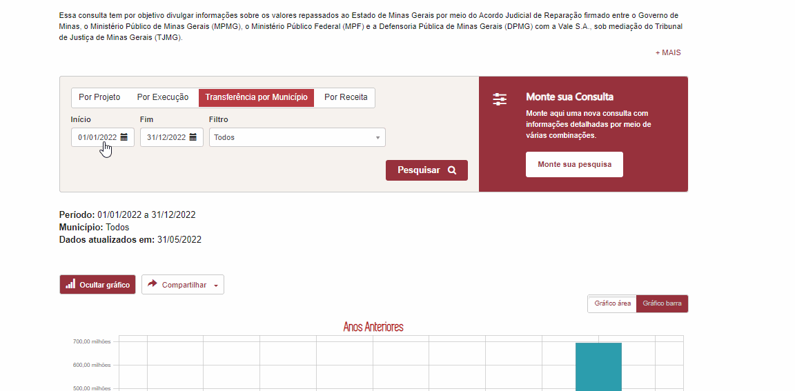

----

## Campos clicáveis

**Corrigido Parcialmente** verificao em 26/05/2022

A funcionalidade foi aplicada apenas na consulta básica a pesquisa avançada ainda está pendente.

- Tabela de resultados; tabela modal e tabela de empenhos


---
## Migalhas / Cabeçalho

**Não corrigido** - Verificado em 26/05/2022

Ao selecionar um projeto pelo código na 'Consulta por Execução' tanto a árvore quanto o cabeçalho deve exibir o **Nome do projeto e o código do Projeto**, pois caso o usuário clique no projeto 9288133 e nesses campos apresentar apenas a descrição ele poderá ficar perdido onde está realmente.

Nesse questionamento foi realizado a alteração para exibição da descrição do Órgão na migalha. Essa alteração foi interessante, porém a descrição e código do Projeto norteia o cidadão no caminho por onde ele navegou.

O exemplo abaixo demonstra que ao selecionar o órgão DEER esse possui 4 projetos. Caso o usuário selecione algum projeto ele não saberá identificar pelo cabeçalho da tabela e migalha a qual projeto pertence a lista de empenhos. Assim é necessário retornar e fazer uma nova busca.

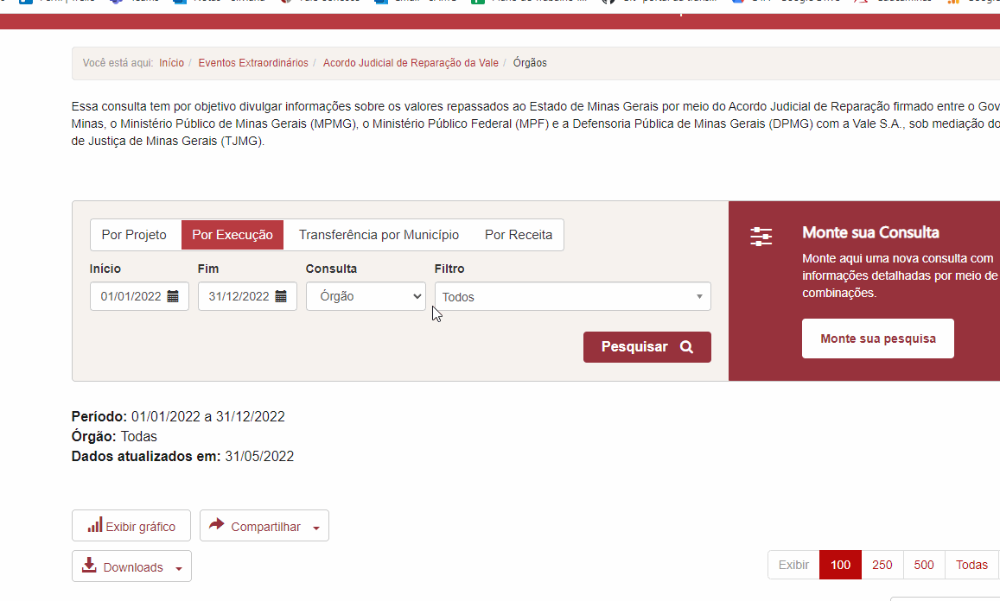

----
## Download PDF - pesquisa básica

**Não corrigido** - Verificado em 26/05/2022

- A correção foi aplicada apenas na consulta avançada. Na pesquisa básica não está funcionando.
- Não é possível verificar as funcionalidades, pois o download na pesquisa básica não está funcionando.


---
## Download PDF - Tabela Modal - Monte sua pesquisa

- Os valores de subtotal e total não estão sendo exibidos na extração em PDF.


---
## Download CSV - Tabela Modal - Monte sua pesquisa

- a extração em CSV está apresentando o valor SUBTOTAl e não o valor TOTAL


---
## Download CSV - Pesquisa básica

**Não corrigido** - Verificado em 26/05/2022

- A correção foi aplicada apenas na consulta avançada. Na pesquisa básica não está funcionando.
- Não é possível verificar as funcionalidades, pois o download na pesquisa básica não está funcionando.


---
## Download Base Completa

Os links quwe deverão ser usados quando o usuário clicar em download base completa

* Consulta por Projeto - 1 nível: https://dados.mg.gov.br/dataset/acordo-judicial-reparacacao-vale-projetos

* Demais consultas: https://dados.mg.gov.br/dataset

---

###### Exportação CSV - Formulário de detalhamento

```
Ao exportar o formulário de detalhamento o arquivo zipado esta vindo por tabela e não por bloco.
Nota: Foi adotado o CSV por tabela pelo aspecto de variação de colunas em alguns casos. do contrário poderia gerar inconsistências, caso o usuário desejasse importar as informações.
Ex: Aba Empenho possui 8 colunas de dados em Detalhe do Empenho, porém reforço, Anulação, e Inscrição e RP possuem 3 colunas.
```

- Os dados estão trocados na extração CSV - tabela empenho

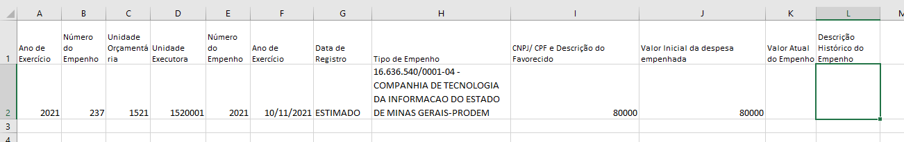

---
- o **Valor Total** na tabela gerada em CSV aparece como se fosse um outro reforço/Anulação.

- O mesmo problema ocorre na extração da liquidação e e Pagamento

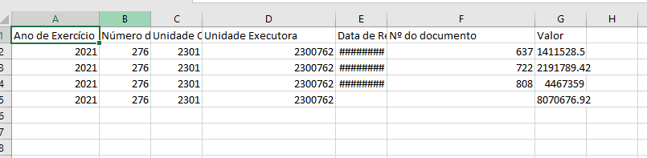

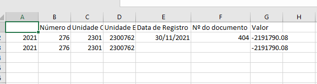

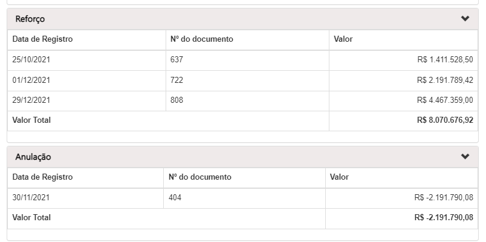

----

- o **Valor Total** na tabela gerada em CSV aparece como se fosse um outra inscrição/liquidação em RP;
- O ano de exercício deverá ser 2022 nesse caso pois a inscrição refere-se a 2022 e não a 2021.
- O mesmo fato ocorre na liquidação em RP e Pagamento em RP

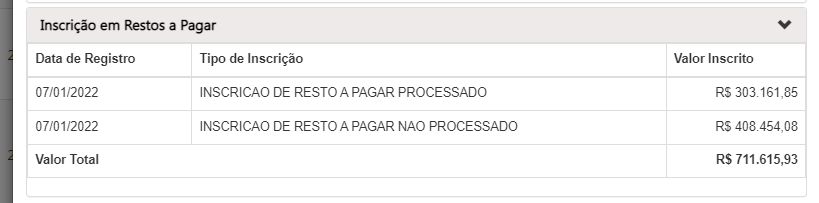

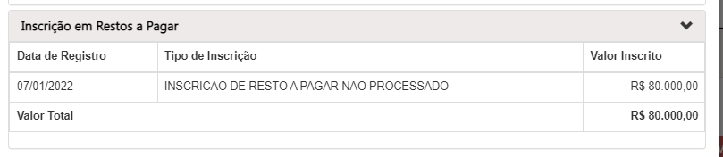

---
- A extração em CVS está apresentando os valores nas colunas erradas;
- O ano de exercício que deverá ser exibido é o ano de exercício do processo ou empenho????

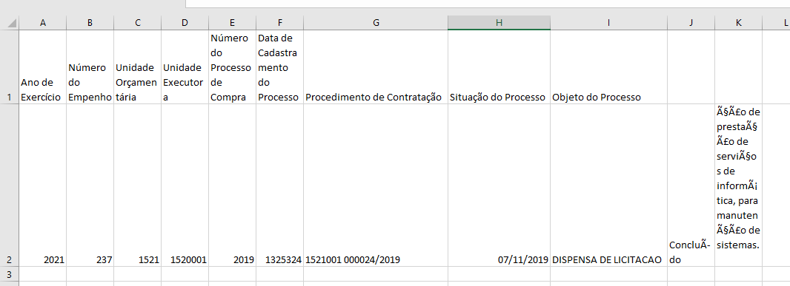

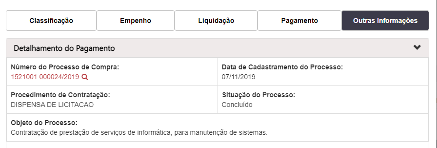

---

- A tabela CVS contratos está desformatada.
- verificar a extração na tabela convênios, pois não localizei nenhum empenho que pudesse testar.

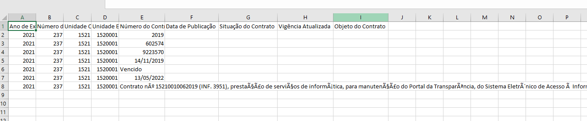
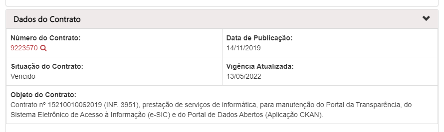

---
## Outras informações - Formulário de detalhamento

- O título da tabela está errado. Mudar parada 'Dados do Processo de Compra'


---
## Filtro por Órgão

Ao selecionar o período de 01/01/2021 a 31/12/2021 e o órgão: 'Departamento de Edificações e Estradas de Rodagem do Estado De Minas Gerais' o PDT retorna a mensagem "*Nenhum resultado encontrado*", porém existem dados para o período selecionado quando solicita a exibição de todos os órgãos

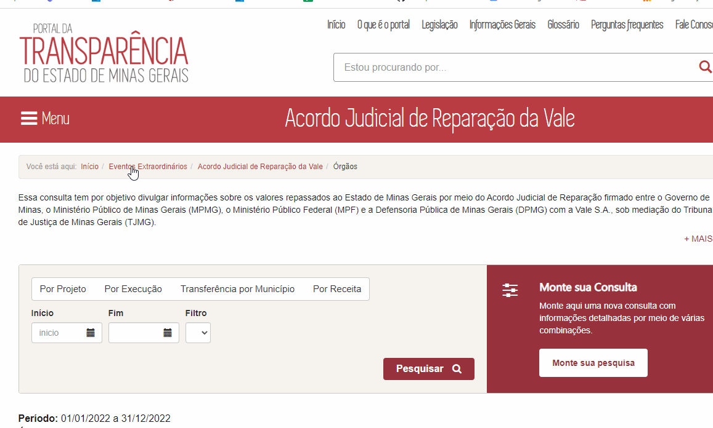

---
## Botão Sair

**Não Corrigido** 30/05/2022

- Ao clicar no botão sair a página do Portal apresenta erro


---
## Adicionar/Remover colunas - Marcar/Desmarcar todos
O botão até foi incluído, porém ele deve ser estilisticamente diferente dos filtros


---
## Tabela Modal - Monte sua pesquisa

- O Cabeçalho da tabela modal não está fixo;
- A exibição para selecionar a quantidade de linhas não está na tabela


---
## Tabela Modal - Formatação

- Verificar formatação da tabela modal - [monte sua pesquisa](https://age7-novo.homologacao.prodemge.gov.br/eventos-extraordinarios/acordo-judicial-reparacao-vale?task=estado_recursosvale.listarConsultaLivre&amp;jform[ID_PROJETO][0]=3&amp;jform[ID_PROJETO][1]=1&amp;jform[datainicio]=01/01/2022&amp;jform[datafim]=31/05/2022&amp;jform[codigo]=0&amp;jform[colunas]=PERIODO,PROJETO,VR_EMPENHADO,VR_LIQUIDADO,VR_PAGO,VR_LIQUIDADO_RP,VR_PAGO_RP,VR_PAGO_TOTAL&amp;jform[push]=PROJETO)


---
## Lista de empenhos - Monte sua pesquisa

- Ao clicar em algum empenho na tabela modal o portal apresenta ERRO


---
## Barra de Pesquisa - Tabela de Resultados - Monte sua pesquisa

Como já mencionado algumas barras de pesquisa não estão respeitando o solicitado.

Ao escrever a palavra 'construc' com o "C" sem o cedinha a busca não é realizada.


---
## Detalhar - Monte sua pesquisa

A depender do filtro que o usuário está usando ao clicar no botão detalhar ele é direcionado para a página inicial do PdT

- [Detalhar - com erro](https://age7-novo.homologacao.prodemge.gov.br/eventos-extraordinarios/acordo-judicial-reparacao-vale?task=estado_recursosvale.listarConsultaLivre&jform%5BID_FAVORECIDO%5D%5B0%5D=923681&jform%5Bdatainicio%5D=01/01/2022&jform%5Bdatafim%5D=27/05/2022&jform%5Bcodigo%5D=0&jform%5Bcolunas%5D=PERIODO,FAVORECIDO,VR_EMPENHADO,VR_LIQUIDADO,VR_PAGO,VR_LIQUIDADO_RP,VR_PAGO_RP,VR_PAGO_TOTAL&jform%5Bpush%5D=FAVORECIDO)
- [Detalhar sem erro](https://age7-novo.homologacao.prodemge.gov.br/eventos-extraordinarios/acordo-judicial-reparacao-vale?task=estado_recursosvale.listarConsultaLivre&amp;jform[ID_PROJETO][0]=3&amp;jform[ID_PROJETO][1]=1&amp;jform[datainicio]=01/01/2022&amp;jform[datafim]=31/05/2022&amp;jform[codigo]=0&amp;jform[colunas]=PERIODO,PROJETO&amp;jform[push]=PROJETO)


---
## Paginação tabela de resultados - Monte sua pesquisa

 A tabela de resultados do "Monte sua pesquisa" não está exibindo a opção de selecionar a quantidade de linhas, conforme padrão adotado nessa consulta


---
## Subtotal/Total - tabela de resultados - Monte sua pesquisa

 A tabela de resultados não exibirá os campos TOTAL GERAL e o SUBTOTAL quando não houver dados referentes a valores.


---
## Formatação - tabela de resultados - Monte sua pesquisa

A formatação do cabeçalho da tabela deve ser alinhado à esquerda.


---
## Tabelas modais - movíveis

Todas as tabelas modais (pesquisa básica e avançada) deverão ser movíveis, ex. [PDT Remuneração](https://www.transparencia.mg.gov.br/estado-pessoal/remuneracao-dos-servidores/remuneracao-faixa/202203/2/1064/3978/C/3968566/1001/27364479)


---
## Barra vertical - Contratos/Convênios

A lista de contratos/convênio de saída não exibe todos os itens para seleção.
Acredito que isso deve-se ao fato de os dados do contrato estar vinculado ao período de publicação.

Opção 1- Colocar toda a base na busca

Opção 2- Colocar o período na barra vertical


---
## Barra de rolagem vertical

Conforme relatado no issues [#71](https://github.com/transparencia-mg/especificacoes-portal-transparencia/issues/71) o O comportamento da barra de rolagem vertical não permite a visualização dos dados do início da tabela em todas as páginas da consulta


---
## Compartilhar

Conforme relatado no issues [#72](https://github.com/transparencia-mg/especificacoes-portal-transparencia/issues/72) o Link do Compartilhar > Copiar Link não abre o detalhamento em novo formulário de acesso

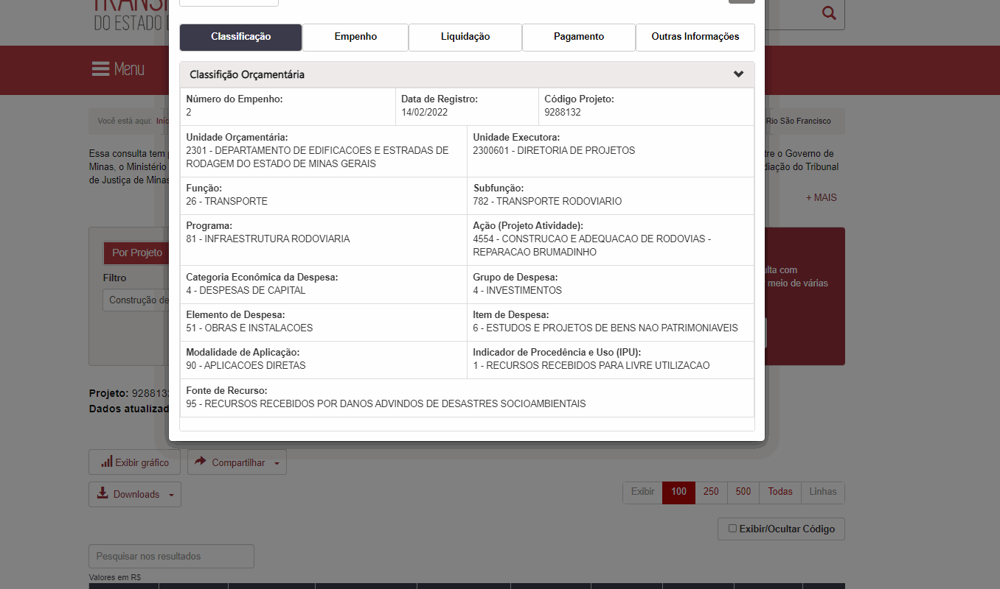


---
## Formulário de detalhamento - Dados do Processo de Compra

-Nome incorreto para seção Dados do Processo de Compra no formulário de detalhamento [#73](https://github.com/transparencia-mg/especificacoes-portal-transparencia/issues/73)


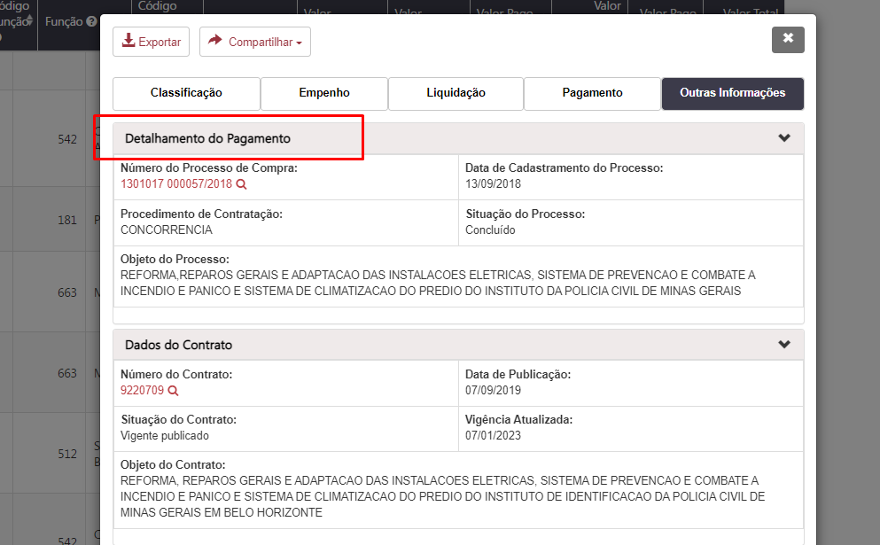
