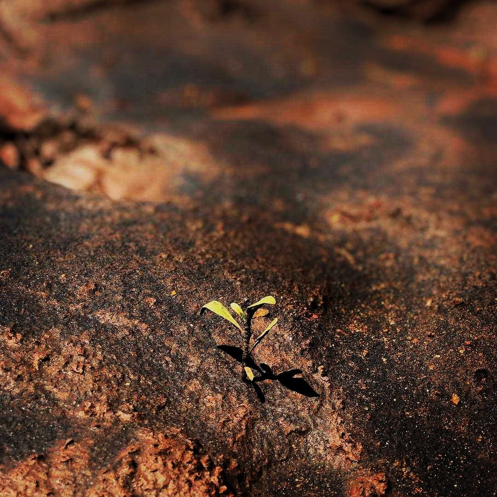
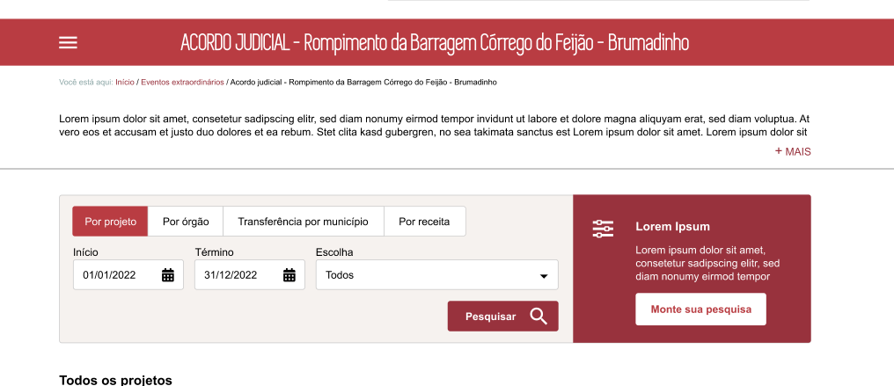

# Homologa telas de alta fidelidade
<a href="#top">(inicio)</a>

Esse documento tem como objetivo alinhar/sugerir as alterações propostas pela PRODEMGE quanto a especificação da consulta Acordo Judicial da Vale.

- [*URL Telas de Alta Fidelidade*](https://xd.adobe.com/view/89288ace-e003-48ad-8172-de66982d985a-dc7b/)

## Comentários
<a href="#top">(inicio)</a>

### Banner página inicial

Alterar a imagem do banner conforme imagens disponibilizadas pela equipe do Comitê Brumadinho

### Botão Monte sua pesquisa

A opção escolhida pela equipe DTA/CGE é o slide 41

### Tabela de Resultados

A opção escolhida pela equipe DTA/CGE é o slide 40 - Paleta de Cor azul acinzentado

