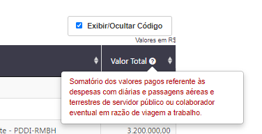
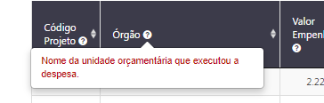
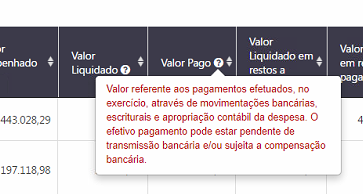
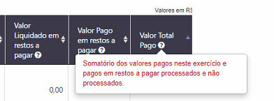
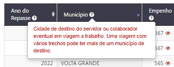
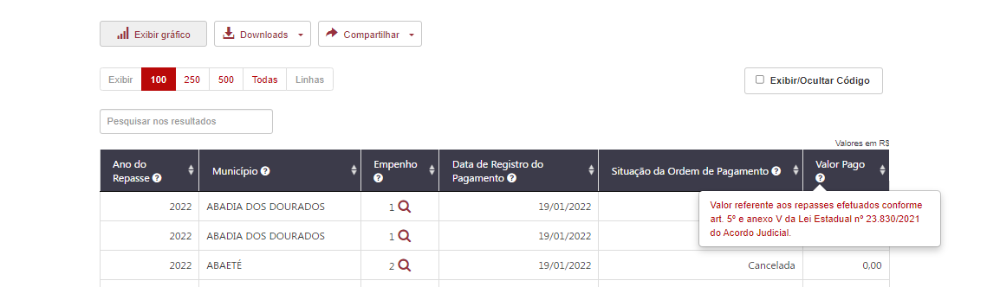
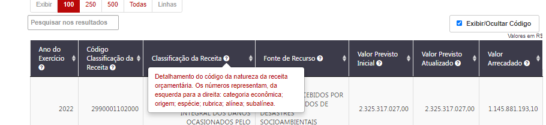

# Especificação - Dados da Consulta
<a href="#top">(inicio)</a>

Esse documento tem como base a criação de uma nova consulta para possibilitar o acompanhamento das ações desenvolvidas pelo governo do estado com recursos provenientes do acordo judicial firmado com a Vale .

### 1. Por Projeto

#### 1.1 Campos da Tabela

**CORRIGIDO**

- ~Alterar a palavra 'Nome' para **Projeto**~
- ~Alterar a palavra 'Valor Total' para **Valor do Projeto**~
- ~Alterar tooltip do campo **Valor do Projeto**~

| Portal de Dados Abertos | PdT | Tooltip - PdT | Exibição da Coluna
|------------|-----|--------------------|---|
| Código Projeto| Código Projeto           | Código do Projeto no armazém SIAFI (Sistema Integrado de Administração Financeira de Minas Gerais ) |default
| Projeto     | Projeto                | Descrição do Projeto conforme consta no Acordo de Reparação e de execução do Governo do Estado                 |default
| Anexo         | Anexo      |          Anexo ao qual o Projeto se refere conforme o Acordo de Reparação      |default
| Valor do Projeto          | Valor do Projeto        |          Valor total destinado ao projeto         |default

### 2. Por Execução
<a href="#top">(inicio)</a>

**CORRIGIDO**

- ~Corrigir tooltip do campo órgão, valor pago e valor total pago~
- ~Alterar nomde do valor total a pagar para  **Valor total pago**~

##### 2.2 Tabela 1º nível

|Dados| Campo armazém BO- SIAFI     | Dimensão SIAFI| Campo PdT | Tooltip - PdT           | Exibição da Coluna
|--|------|---|---------------|------------|---|
|Despesa| ContratoConvênio Entrada | SIAFI - Execução Orçamentária da Despesa > Despesa Realizada |Código Projeto            | Código do Projeto no armazém SIAFI (Sistema Integrado de Administração Financeira de Minas Gerais ) |default
|Despesa| Unidade Orçamentária-Código      |SIAFI - Execução Orçamentária da Despesa > Despesa Realizada |Código Órgão            |    Código da Unidade Orçamentária responsável pelo Projeto                | ao acionar o botão '*Exibir código e descrição*''
|Despesa| Unidade Orçamentária-Nome        | SIAFI - Execução Orçamentária da Despesa > Despesa Realizada| Órgão                   |    Descrição da Unidade Orçamentária responsável pelo Projeto                |default
|Despesa| Valor Despesa Empenhada             |SIAFI - Execução Orçamentária da Despesa > Despesa Realizada | Valor Empenhado       | Valor do orçamento reservado para cumprir o compromisso assumido com o fornecedor ou credor |default
|Despesa| Valor Despesa Liquidada            | SIAFI - Execução Orçamentária da Despesa > Despesa Realizada| Valor Liquidado      | Valor que o fornecedor ou credor tem direito a receber referente ao produto ou serviço devidamente entregue       |default
|Despesa| Valor Pago Financeiro           |SIAFI - Execução Orçamentária da Despesa > Despesa Realizada | Valor Pago | Valor referente aos pagamentos efetuados, no exercício, através de movimentações bancárias, escriturais e apropriação contábil da despesa. O efetivo pagamento pode estar pendente de transmissão bancária e/ou sujeita a compensação bancária  |default
|Restos a Pagar| Valor Despesa Liquidada             |SIAFI - Execução de Restos a Pagar > Restos a Pagar |Valor Liquidado em RP      | Valor que o fornecedor ou credor tem direito a receber referente ao produto ou serviço devidamente entregue referente a exercícios anteriores                    |default
|Restos a Pagar| -Valor Pago Processado  -Valor Pago não processado |  SIAFI - Execução de Restos a Pagar > Restos a Pagar | Valor Pago em Restos a Pagar     | Valor pago referente a exercícios anteriores efetuados através de movimentações bancárias, escriturais e apropriação contábil da despesa, referente a produtos e serviços realizados em exercícios anteriores. O efetivo pagamento pode estar pendente de transmissão bancária e/ou sujeita a compensação bancária. |default
|Fórmula Portal|   | | Valor Total Pago   | Somatório dos valores pagos neste exercício e pagos em restos a pagar processados e não processados.           |default

##### 2.3 Tabela 2º nível

|Dados|  Campo Armazém BO- SIAFI     | Dimensão SIAFI| Campo PdT | Tooltip - PdT           | Exibição da Coluna
|--|-----------------------------|---|-------------------------|--------------------|---|
|Despesa| Número Empenho| SIAFI - Execução Orçamentária da Despesa > Despesa Realizada| Empenho           | Número de identificação do documento de empenho no SIAFI (Sistema Integrado de Administração Financeira de Minas Gerais )  |default
|Despesa| Data Registro Doc Empenho | SIAFI - Execução Orçamentária da Despesa > Despesa Realizada |Data de Registro do Empenho  | Data de registro do documento de empenho   |default
|Despesa|  CNPJ_CPF Credor - Formatado    |SIAFI - Execução Orçamentária da Despesa > Despesa Realizada |CNPJ/ CPF  Favorecido  | Número de identificação: Pessoa Física (CPF) e Pessoa Jurídica (CNPJ) | default
| Despesa|  Razão Social Credor   |SIAFI - Execução Orçamentária da Despesa > Despesa Realizada | Favorecido    | Nome de quem recebeu recursos públicos estaduais pela prestação de serviço ou entrega do produto. Ex: prefeituras, servidores, empresas, entidades do terceiro setor, etc.  |default
| Despesa| Valor Despesa Empenhada |SIAFI - Execução Orçamentária da Despesa > Despesa Realizada | Valor Empenhado| Valor do orçamento reservado para cumprir o compromisso assumido com o fornecedor ou credor |default
| Despesa| Valor Despesa Liquidada  | SIAFI - Execução Orçamentária da Despesa > Despesa Realizada| Valor Liquidado      | Valor que o fornecedor ou credor tem direito a receber referente ao produto ou serviço devidamente entregue        |default
| Despesa| Valor Pago Financeiro  | SIAFI - Execução Orçamentária da Despesa > Despesa Realizada| Valor Pago  | Valor referente aos pagamentos efetuados, no exercício, através de movimentações bancárias, escriturais e apropriação contábil da despesa. O efetivo pagamento pode estar pendente de transmissão bancária e/ou sujeita a compensação bancária |default
|Restos a Pagar| Valor Despesa Liquidada   |SIAFI - Execução de Restos a Pagar > Restos a Pagar |Valor Liquidado em RP      | Valor que o fornecedor ou credor tem direito a receber referente ao produto ou serviço devidamente entregue referente a exercícios anteriores |default
|Restos a Pagar| - Valor Pago Processado  - Valor Pago não processado |  SIAFI - Execução de Restos a Pagar > Restos a Pagar | Valor Pago em Restos a Pagar     | Valor pago referente a exercícios anteriores efetuados através de movimentações bancárias, escriturais e apropriação contábil da despesa, referente a produtos e serviços realizados em exercícios anteriores. O efetivo pagamento pode estar pendente de transmissão bancária e/ou sujeita a compensação bancária. |default                 |default
|Fórmula Portal|   | | Valor Total Pago   |   Somatório dos valores pagos neste exercício e pagos em restos a pagar processados e não processados.           |default

_______
### 3. Por Município
<a href="#top">(inicio)</a>

- ~Corrigir tooltip do campo município~

**CORRIGIDO**

~Corrigir tooltip do Valor Pago: Valor referente aos repasses efetuados conforme art. 5º e anexo V da Lei Estadual nº 23.830/2021 do Acordo Judicial~

 **OBS: Lembrando que o tooltip desse valor pago é para apenas essa consulta de município**

|Dados| Campo armazém BO- SIAFI     | Dimensão SIAFI| Campo PdT | Tooltip - PdT           | Exibição da Coluna
|-|------|---|---------------|------------|---|
|Município |Ano de Exercício |Período Contábil| Ano do Repasse|Ano de exercício que o repasse ocorreu|---|
|Município |Município Credor - Descrição| SIAFI - Execução Orçamentária da Despesa - Despesa Realizada > Credor - Despesa |Município |Nome do Município que recebeu os repasses do Acordo Judicial conforme art. 5º e anexo V da Lei Estadual nº 23.830/2021|*default*
|Município |Número Empenho| SIAFI - Execução Orçamentária da Despesa - Despesa Realizada|Empenho| Número de identificação do documento de empenho no SIAFI (Sistema Integrado de Administração Financeira de Minas Gerais )|*default*|
|Município |Data Registro| SIAFI - Execução Orçamentária da Despesa > Despesa Realizada > Dados da Ordem de Pagamento - Despesa| Data de Registro do pagamento|Data de Registro do Pagamento no SIAFI (Sistema Integrado de Administração Financeira de Minas Gerais )|*default*|
|Município |Situação Ordem de Pagamento - Descrição |SIAFI - Execução Orçamentária da Despesa > Despesa Realizada > Dados da Ordem de Pagamento - Despesa |Situação da Ordem de Pagamento| Situação da Ordem de Pagamento conforme consta no SIAFI (Sistema Integrado de Administração Financeira de Minas Gerais )|*default*|
|Município |Valor Pago Financeiro| SIAFI - Execução Orçamentária da Despesa > Despesa Realizada |Valor Pago| Valor referente aos repasses efetuados conforme art. 5º e anexo V da Lei Estadual nº 23.830/2021 do Acordo Judicial|*default*|

______
### 4. Por Receita
<a href="#top">(inicio)</a>

**CORRIGIDO**

- ~Corrigir tooltip do campo classificação da Receita~

|Dados| Campo armazém BO- SIAFI     | Dimensão SIAFI| Campo PdT | Tooltip - PdT           | Exibição da Coluna
|-| -|---|---------------|------------|---|
|Receita| Ano de Exercício |SIAFI - Período Contábil|Ano de Exercício |Ano de exercício que ocorreu a arrecadação|*default*|
|Receita |Classificação Receita - Formatado |SIAFI - Execução Orçamentária da Receita > Receita Orçamentária > Classificação Receita Orçamentária a partir de 2018 > |Código da Classificação Receita|Classificação criada a fim de possibilitar a identificação detalhada dos recursos que ingressam nos cofres públicos. Os números representam, da esquerda para a direita: categoria econômica; origem da receita; espécie da receita; desdobramento 1 da receita, desdobramento 2 da receita, desdobramento 3 da receita, tipo da receita| ao acionar o botão 'Exibir código e descrição'|
|Receita| Classificação Receita - Descrição |SIAFI - Execução Orçamentária da Receita > Receita Orçamentária > Classificação Receita Orçamentária a partir de 2018|Classificação Receita |Descrição da identificação detalhada dos recursos que ingressam nos cofres públicos |*default*|
|Receita| Fonte de Recurso - Código |SIAFI - Execução Orçamentária da Receita > Receita Orçamentária > Classificação Receita Orçamentária a partir de 2018|Código da Fonte de Recurso||ao acionar o botão 'Exibir código e descrição'|
|Receita| Fonte de Recurso -  |SIAFI - Execução Orçamentária da Receita > Receita Orçamentária > Classificação Receita Orçamentária a partir de 2018|Fonte de Recurso |Indica a origem do dinheiro arrecadado. Combina a origem do dinheiro às despesas orçamentárias. Esta vinculação visa demonstrar o montante de dinheiro que já está comprometido com o atendimento de determinadas finalidades, e aquele que pode ser livremente alocado.|*default*|
|Receita| Valor Previsto Inicial |SIAFI - Execução Orçamentária da Receita > Receita Orçamentária > Classificação Receita Orçamentária a partir de 2018| Valor Previsto Inicial| Valor estimado da arrecadação para o ano consultado, previsto na Lei Orçamentária Anual (LOA)|*default*|
|Receita|  Valor Previsto Atualizado|SIAFI - Execução Orçamentária da Receita > Receita Orçamentária > Classificação Receita Orçamentária a partir de 2018|Valor Previsto Atualizado| Valor estimado inicial para arrecadação no ano consultado, previsto na Lei Orçamentária Anual, atualizado ao longo do ano.|*default*
|Receita| Valor Efetivado Ajustado |SIAFI - Execução Orçamentária da Receita > Receita Orçamentária > Classificação Receita Orçamentária a partir de 2018|Valor Arrecadado| Valor financeiro que entrou nos cofres públicos no período consultado|*default*
