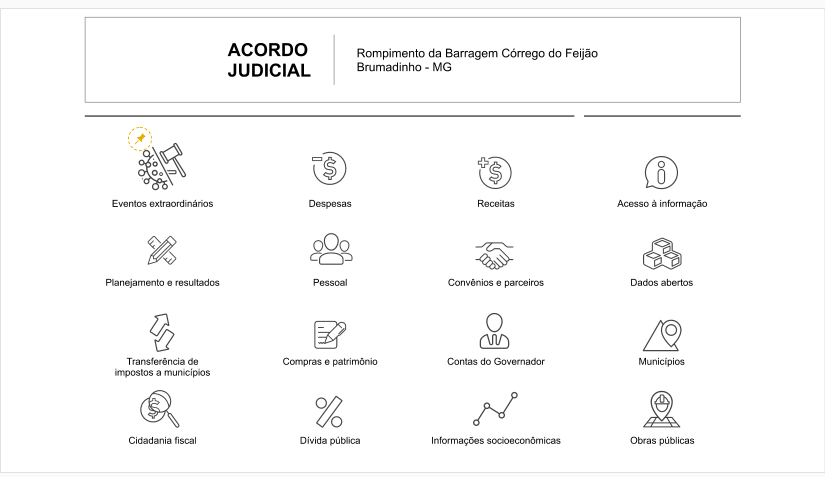
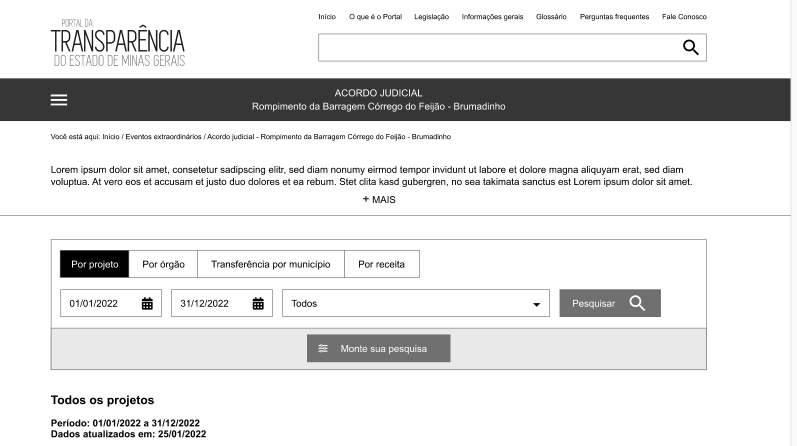
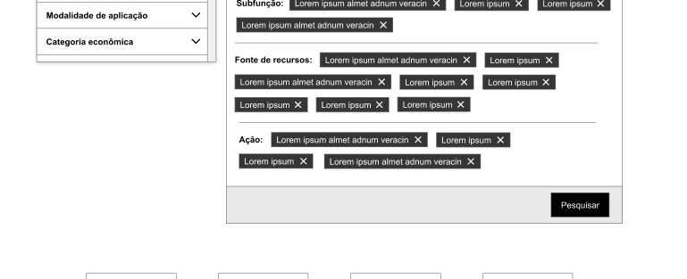
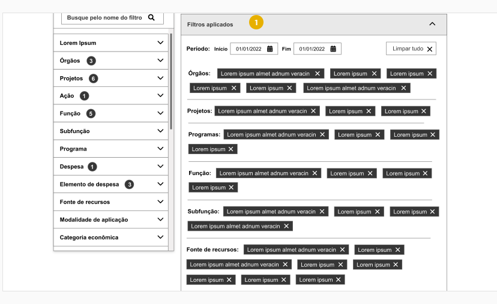
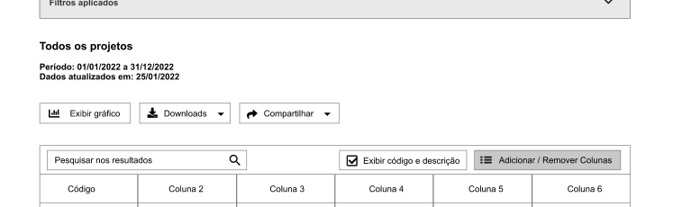

# Homologa telas Wireframe

Esse documento tem como objetivo alinhar/sugerir as alterações propostas pela PRODEMGE quanto a especificação da consulta Acordo Judicial da Vale.

- [*URL Wireframe*](https://xd.adobe.com/view/64a90aea-4369-4d8d-b426-72f46590dbcd-31fa/screen/518fb455-60d2-4870-84d4-57c43f6c224a)
- [Documentação Monte sua pesquisa](https://github.com/transparencia-mg/especificacoes-portal-transparencia/blob/espec016_remodelagem-pesquisa-avancada/espec016_remodelagem-pesquisa-avancada/pesquisa-avandada-espec.md)
- [Documentação layout](https://github.com/transparencia-mg/especificacoes-portal-transparencia/blob/v1_layout_20220127/espec018_recursos-acordo-judicial-vale/recursos-vale-espec.md)
- [Documentação Dados](https://github.com/transparencia-mg/especificacoes-portal-transparencia/blob/v1_dados_20220127/espec018_recursos-acordo-judicial-vale/recursos-vale-dados.md)

## Comentários
<a href="#top">(inicio)</a>

### Slide 1

O ícone da sessão 'Eventos extraordinários' deverá ser mais genérico uma vez que esse bloco poderá abarcar outros dados que não seja apenas a Consulta de COVID e do Acordo Judicial.

____

### Slide 3

1.  Verificar a possibilidade de inclusão do dados abaixo conforme consta no [documento de especificação](https://github.com/transparencia-mg/especificacoes-portal-transparencia/blob/espec018_recusos-vale/espec018_recursos-acordo-judicial-vale/recursos-vale-espec.md). Lembrando que caso o esforço venha a comprometer o cronograma a inclusão dos dados deverá ser realizada em momento posterior.

2. É interessante o tooltip também aparecer quando o usuário passar o mouse na palavra. Lembrando que o Portal deverá permitir que por meio da área administrativa a equipe DTA inclua ou altere os dados desses campos.

3. O ícone "Monte sua pesquisa" deverá ser posicionado em outro lugar da tela, para não dar a impressão que o usuário está construindo uma consulta dentro da pesquisa básica.

------

### Slide 5

1. Alterar texto do botão Download:
- Planilha (CSV)
- Base Completa

2. Alterar a funcionalidade da opão PDF
- PDF -> ao selecionar essa opção o arquivo PDF deverá ser aberto em outra aba do navegador

Ver mais detalhes do comportamento da funcionalidade no documento de Especificação - Capítulo **Download dos dados**

3.  A opção de 'Exibir Linhas' deverá ficar na parte superior da tabela como já ocorre atualmente.

Assim caso a tabela seja extensa o usuário não precisa usar a barra de rolagem para escolher a quantidade de linhas.

3. Compartilhar Dados

Acrescentar a opção compartilhar pelo WhatsApp

----

### Slide 7

A formulário de detalhamento no formato modal ficou interessante, porém é necessário que o usuário possa compartilhar a *url* dessa tela. 
Assim, sugere-se:
- Possibilitar o compartilhamento desses dados, mesmo sendo no formato modal, caso isso não venha a comprometer a execução do cronograma, ou,

- Manter o padrão, atualmente, adotado no Portal, ou seja, abrir os dados em outra aba, possibilitando ao usuário compartilhar a *url*

----
### Slide 12 / slide 17 /slide 26

Todos os botões descritos abaixos devem estar localizados na parte superior da tela:
1. Botão aplicar:
2. Botão pesquisa/atualizar (tabela de filtros aplicados)
3. Botão pesquisa/atualizar (tabela de filtros aplicados)

Assim caso os filtros/tabelas sejam extensos o usuário não precisa usar a barra de rolagem para selecionar as opções.

1. Botão Aplicar

--

2. Botão pesquisa/atualizar (tabela de filtros aplicados)

--

3. Botão pesquisa/atualizar (tabela de filtros aplicados)

---

### Slide 15

1. Acrescentar a opção TODOS em cada filtro da consulta avançada.

Assim, o usuário poderá combinar vários parâmetros para o mesmo filtro ao selecionar mais de um item ou selecionar a opção **[Todos]**.   

Ao selecionar [Todos], serão exibidos todos os parâmetros daquele filtro com a opção 'x' (excluir) nos itens, podendo o usuário poderá remover os parâmetros não desejados clicando no 'x'.

2. **Caso seja possível, ao selecionar um filtro no barra a esquerda, que o portal direcione automaticamente a opção escolhida paraa tela filtros aplicados, sem a necessidade do usuário clicar em 'aplicar'. **

Detalhes do comportamento desse campos estão descritas no documento de especificação.

### Slide 17

1. Incluir a opção do usuário excluir um filtro selecionado no campo filtros aplicados.

Por exemplo, caso o usuário queira excluir o campo 'Órgãos' ele poderá fazer isso sem a necessidade de excluir os filtros um a um. Ele poderá excluir o campo "ÓRGÃO"

--
### Slide 19

1. Excluir a opção Exibir Gráfico da consulta "monte sua pesquisa". A exibição de gráfico nesse nível da consulta não é possível devido a diversidade de informações.

