# Homologa telas Wireframe

Esse documento tem como objetivo alinhar/sugerir as alterações propostas pela PRODEMGE quanto a especificação da consulta Acordo Judicial da Vale.

- [*URL Wireframe Principal*](https://xd.adobe.com/view/64a90aea-4369-4d8d-b426-72f46590dbcd-31fa/)
- [*URL Wireframe glossario*](https://xd.adobe.com/view/41b82ff6-5d59-4deb-97eb-e834b1562853-14eb/)
- [*URL Wireframe filtros*](https://xd.adobe.com/view/f683cb28-7a64-497d-93ff-9482bf27490c-a3d0/)
- [Documentação layout](https://github.com/transparencia-mg/especificacoes-portal-transparencia/blob/espec018_recusos-vale/espec018_recursos-acordo-judicial-vale/recursos-vale-espec.md)
- [Documentação Dados](https://github.com/transparencia-mg/especificacoes-portal-transparencia/blob/espec018_recusos-vale/espec018_recursos-acordo-judicial-vale/recursos-vale-dados.md)

## Comentários
<a href="#top">(inicio)</a>

### Slide 1 - OK

O ícone da sessão 'Eventos extraordinários' deverá ser mais genérico uma vez que esse bloco poderá abarcar outros dados que não seja apenas a Consulta de COVID e do Acordo Judicial.
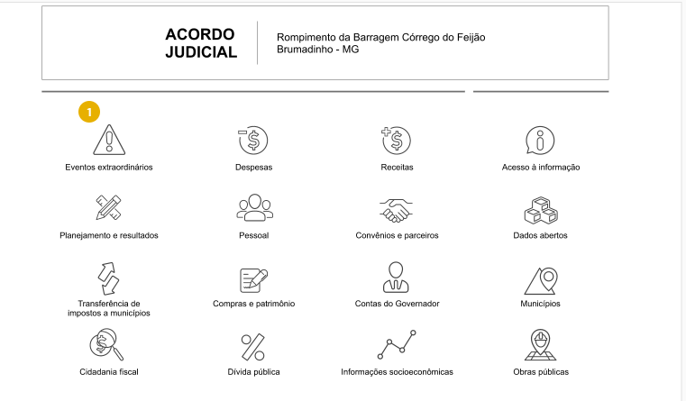
____
  

### Slide 3

1.  Verificar a possibilidade de inclusão do dados abaixo conforme consta no [documento de especificação](https://github.com/transparencia-mg/especificacoes-portal-transparencia/blob/espec018_recusos-vale/espec018_recursos-acordo-judicial-vale/recursos-vale-espec.md). Lembrando que caso o esforço venha a comprometer o cronograma a inclusão dos dados deverá ser realizada em momento posterior.

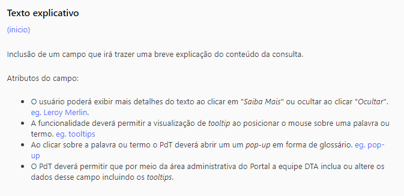

### Slide 5 OK

**Resposta Prodemge:**
> Para contemplar este projeto, tanto o texto explicativo da consulta como as informações do glossário/tooltip serão estáticos, sem viabilidade de alterações por meio da área administrativa. Em uma futura evolução, tal funcionalidade poderá ser incluída.

É interessante o tooltip também aparecer quando o usuário passar o mouse na palavra. Lembrando que o Portal deverá permitir que por meio da área administrativa a equipe DTA inclua ou altere os dados desses campos.

### Slide 34

CORRIGIR
--
Apenas retirar o título Pesquisa Avançada. O texto para esse campo será informado posteriormente.
--

O ícone "Monte sua pesquisa" deverá ser posicionado em outro lugar da tela, para não dar a impressão que o usuário está construindo uma consulta dentro da pesquisa básica.

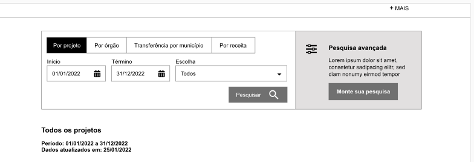

------

### Slide 5

OK
--
1. Alterar texto do botão Download:
  - Planilha (CSV)

2. Alterar a funcionalidade da opção PDF
  - PDF -> ao selecionar essa opção o arquivo PDF deverá ser aberto em outra aba do navegador

Ver mais detalhes do comportamento da funcionalidade no documento de Especificação - Capítulo **Download dos dados**

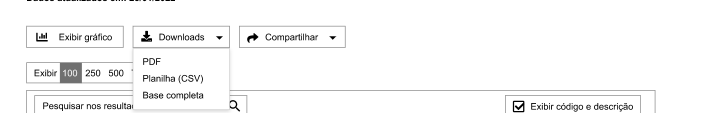

CORRIGIR
--
Deixar a opção 'Exibir Linhas' apenas na parte superior uma vez que o cabeçalho das colunas, o exibir linhas, pesquisar resultados terão a funcionalidade * Cabeçalho fixo - Fixer Header ([eg. Consulta de Remuneração do PdT](https://www.transparencia.mg.gov.br/estado-pessoal/remuneracao-dos-servidores/remuneracao-faixa/202112/3/1094/4022/C/3569184/995/26150365));
--

3.  A opção de 'Exibir Linhas' deverá ficar na parte superior da tabela como já ocorre atualmente.

Assim caso a tabela seja extensa o usuário não precisa usar a barra de rolagem para escolher a quantidade de linhas.

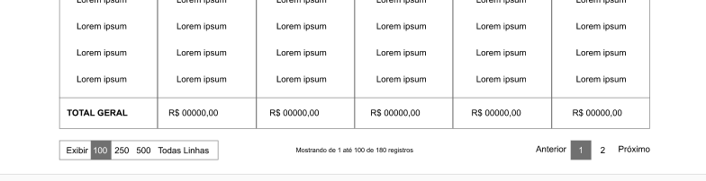

CORRIGIR
--
Faltou acrescentar a opção de compartilhar WhatsApp
--
3. Compartilhar Dados

Acrescentar a opção compartilhar pelo WhatsApp

  

----

### Slide 8

ATENÇÃO
--
Reforçamos a necessidade do usuário poder compartilhar a *url* do formulário no formato modal.
--
Favor acrescentar no botão 'compartilhar' o ícone **copiar** para que o usuário possa copiar a *url* se achar necessário.
--

O formulário de detalhamento no formato modal ficou interessante, porém é necessário que o usuário possa compartilhar a *url* dessa tela.
Assim, sugere-se:
- Possibilitar o compartilhamento desses dados, mesmo sendo no formato modal, caso isso não venha a comprometer a execução do cronograma, ou,

- Manter o padrão, atualmente, adotado no Portal, ou seja, abrir os dados em outra aba, possibilitando ao usuário compartilhar a *url*

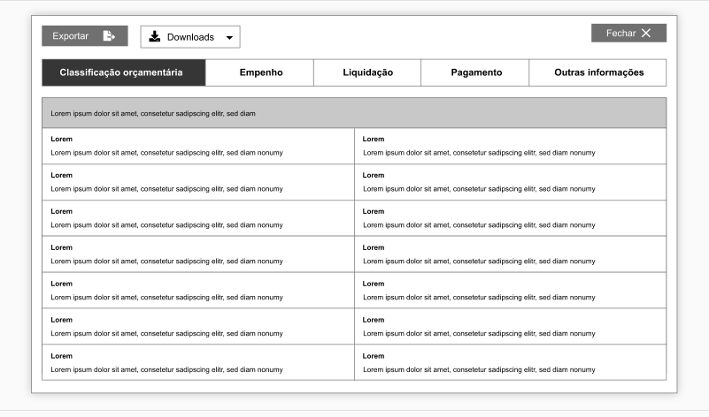
  

----
### Slide 15 / slide 17 /slide 26 OK

Todos os botões descritos abaixo devem estar localizados na parte superior da tela:
1. Botão aplicar:
> Proposta Prodemge: ao selecionar algum filtro a informação será direcionada automaticamente para a barra fitros aplicados.

2. Botão pesquisa/atualizar (tabela de filtros aplicados) OK
>Na tabela de filtros aplicados nós optamos por manter o botão pequisar embaixo e usar uma rolagem interna no caso que tiverem um maior números de parâmetros selecionados.

3. Botão aplicar (Adicionar/Remover Colunas) OK
> No caso do Adicionar e remover colunas, colocamos o botão aplicar na parte superior. slide 18

Assim caso os filtros/tabelas sejam extensos o usuário não precisa usar a barra de rolagem para selecionar as opções.

1. Botão Aplicar

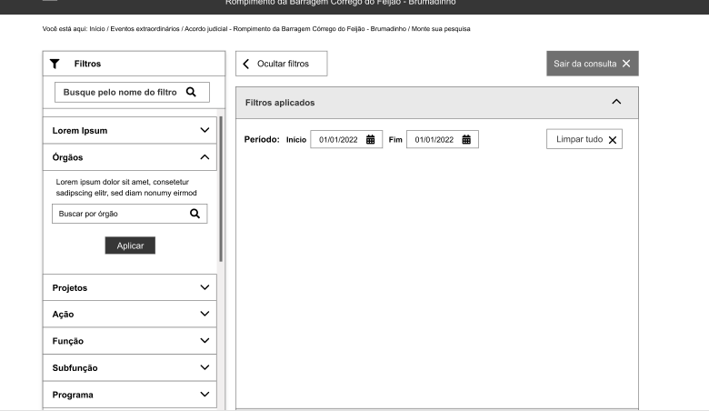

----

2. Botão pesquisa/atualizar (tabela de filtros aplicados)

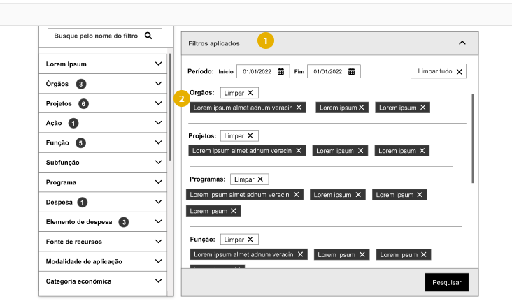

----

3. Botão aplicar (Adicionar/Remover Colunas)

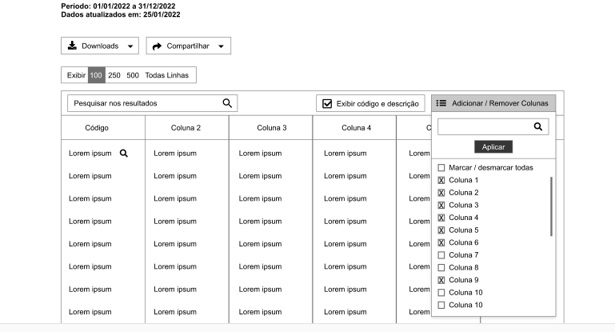

---
  

### Slide 15

1. Acrescentar a opção TODOS em cada filtro da consulta avançada.

Assim, o usuário poderá combinar vários parâmetros para o mesmo filtro ao selecionar mais de um item ou selecionar a opção **[Todos]**.   

Ao selecionar [Todos], serão exibidos todos os parâmetros daquele filtro com a opção 'x' (excluir) nos itens, podendo o usuário  remover os parâmetros não desejados clicando no 'x'.

OK
--

2. Caso seja possível, ao selecionar um filtro no barra a esquerda, que o portal direcione automaticamente a opção escolhida para tela filtros aplicados, sem a necessidade do usuário clicar em 'aplicar'.

Detalhes do comportamento desse campos estão descritas no documento de especificação.

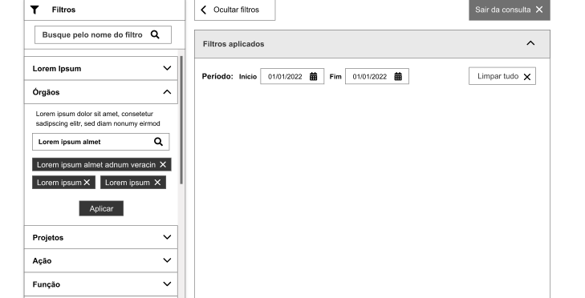

  

### Slide 18 OK

1. Incluir a opção do usuário excluir um filtro selecionado no campo filtros aplicados.

Por exemplo, caso o usuário queira excluir o campo 'Órgãos' ele poderá fazer isso sem a necessidade de excluir os filtros um a um. Ele poderá excluir o campo "ÓRGÃO"

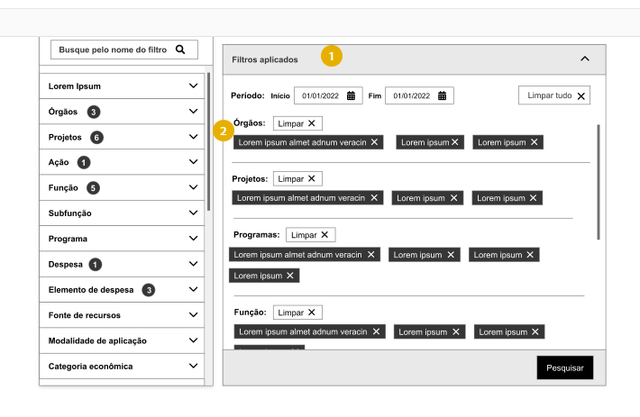

--
### Slide 20 OK

1. Excluir a opção Exibir Gráfico da consulta "monte sua pesquisa". A exibição de gráfico nesse nível da consulta não é possível devido a diversidade de informações.

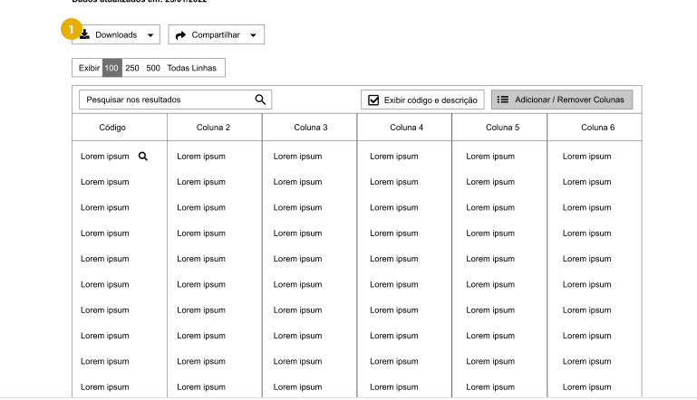
  

### Slide 22

Ressaltamos que ao compartilhar a *url* da tabela de resultados do monte sua pesquisa o usuário estará compartilhando o resultado exibido, ou seja, caso ele salve o link e posteriormente decida consultar novamente todos os filtros já aplicados estarão presentes.

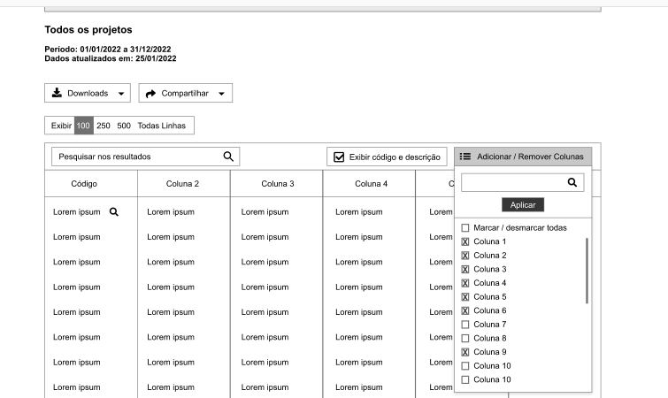

### [Glossário](https://xd.adobe.com/view/41b82ff6-5d59-4deb-97eb-e834b1562853-14eb/screen/76fdb647-bd87-43c6-9e14-925ef33a2a10) Slide 2

Reforçamos que ao clicar em um qualquer termo o usuário deverá ser direcionado diretamente para a palavra correspondente dentro do glossário.

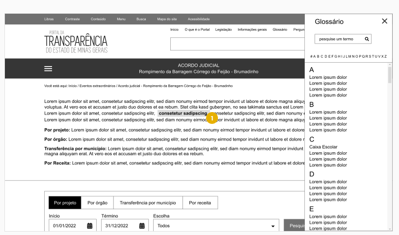

  

  

Alterar
--

### [Filtro Exibir](https://xd.adobe.com/view/f683cb28-7a64-497d-93ff-9482bf27490c-a3d0/screen/fc0a1e82-1c45-494e-b789-59df9034ebab)

A opção escolhida pela CGE refere-se  a versão expandida com as seguinte alterações:

- A opção 'exibir todos' deverá ficar dentro da barra horizontal conforme foi sugerido na versão compactada. Lembrando que o número referente ao quantitativo de opções possíveis deverá ser mantido.

- Acrescentar o símbolo "..." ao da lado da lupa.
- O comportamento do 'exibir todos' e do símbolo serão os mesmos, ou seja, abrirá o popup com as opções de seleção.

Na imagem abaixo tentei reproduzir a ideia:

  

