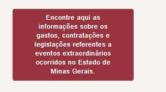
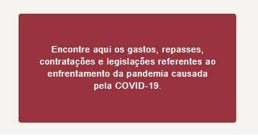
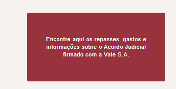
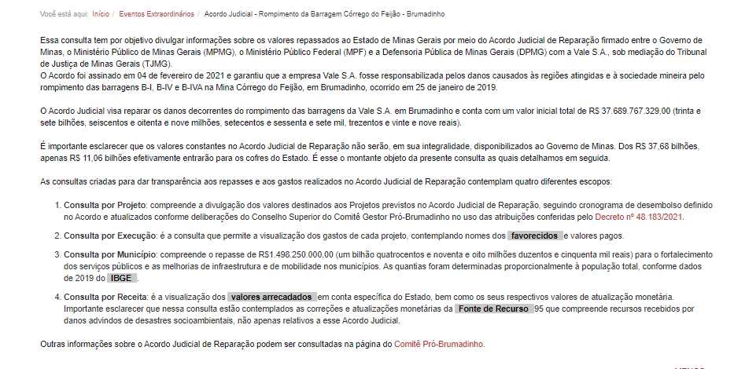
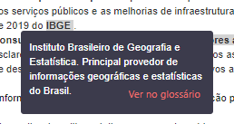
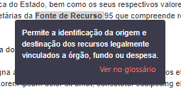
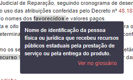
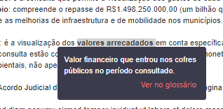
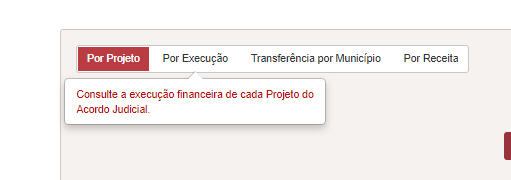

# Especificação tooltips
<a href="#top">(inicio)</a>

OK
--

## Texto da Consultas

**Eventos Extraordinários**: Encontre aqui as informações sobre os gastos, contratações e legislações referentes a eventos extraordinários ocorridos no Estado de Minas Gerais.

**COVID 19**: Encontre aqui os gastos, repasses, contratações e legislações referentes ao enfrentamento da pandemia causada pela COVID-19

**Acordo Judicial de Reparação da Vale**: Encontre aqui os repasses, gastos e informações sobre o Acordo Judicial firmado com a Vale S.A.

 

## Texto página Inicial
<a href="#top">(inicio)</a>

Essa consulta tem por objetivo divulgar informações sobre os valores repassados ao Estado de Minas Gerais por meio do Acordo Judicial de Reparação firmado entre o Governo de Minas, o Ministério Público de Minas Gerais (MPMG), o Ministério Público Federal (MPF) e a Defensoria Pública de Minas Gerais (DPMG) com a Vale S.A., sob mediação do Tribunal de Justiça de Minas Gerais (TJMG).

O Acordo foi assinado em 04 de fevereiro de 2021 e garantiu que a empresa Vale S.A. fosse responsabilizada pelos danos causados às regiões atingidas e à sociedade mineira pelo rompimento das barragens B-I, B-IV e B-IVA na Mina Córrego do Feijão, em Brumadinho, ocorrido em 25 de janeiro de 2019.

O Acordo Judicial visa reparar os danos decorrentes do rompimento das barragens da Vale S.A. em Brumadinho e conta com um valor inicial total de R$ 37.689.767.329,00 (trinta e sete bilhões, seiscentos e oitenta e nove milhões, setecentos e sessenta e sete mil, trezentos e vinte e nove reais).

É importante esclarecer que os valores constantes no Acordo Judicial de Reparação não serão, em sua integralidade, disponibilizados ao Governo de Minas. Dos R$ 37,68 bilhões, apenas R$ 11,06 bilhões efetivamente entrarão para os cofres do Estado. É esse o montante objeto da presente consulta as quais detalhamos em seguida.

As consultas criadas para dar transparência aos repasses e aos gastos realizados no Acordo Judicial de Reparação contemplam quatro diferentes escopos:

Corrigir
--
1- Colocar um espaço entre os itens

2- retirar o texto destacado na imagem

3- O lik deverá ficar sobre toda o texto Decreto nº 48.183/2021 e não apenas sobre o números

-----

1.	**Consulta por Projeto**: compreende a divulgação dos valores destinados aos Projetos previstos no Acordo Judicial de Reparação, seguindo cronograma de desembolso definido no Acordo e atualizados conforme deliberações do Conselho Superior do Comitê Gestor Pró-Brumadinho no uso das atribuições conferidas pelo [Decreto nº 48.183/2021](https://www.almg.gov.br/consulte/legislacao/completa/completa.html?tipo=DEC&num=48183&comp=&ano=2021).

1. **Consulta por Execução:** é a consulta que permite a visualização dos gastos de cada projeto, contemplando nomes dos [favorecidos](a "Nome de identificação da pessoa física ou jurídica que recebeu recursos públicos estaduais pela prestação de serviço ou pela entrega do produto.).") e valores pagos.

1.	**Consulta por Município:** compreende o repasse de R$1.498.250.000,00 (um bilhão quatrocentos e noventa e oito milhões duzentos e cinquenta mil reais) para o fortalecimento dos serviços públicos e as melhorias de infraestrutura e de mobilidade nos municípios. As quantias foram determinadas proporcionalmente à população total, conforme dados de 2019 do [IBGE](a "Instituto Brasileiro de Geografia e Estatística - Principal provedor de informações geográficas e estatísticas do Brasil").

4. **Consulta por Receita**: é a visualização dos [valores arrecadados](a "Valor financeiro que entrou nos cofres públicos no período consultado.") em conta específica do Estado, bem como os seus respectivos valores de atualização monetária. Importante esclarecer que nessa consulta estão contemplados as correções e atualizações monetárias da [Fonte de Recurso](a "    Permite a identificação da origem e destinação dos recursos legalmente vinculados a órgão, fundo ou despesa") 95 que compreende recursos recebidos por danos advindos de desastres socioambientais, não apenas relativos a esse Acordo Judicial.

Outras informações sobre o Acordo Judicial de Reparação podem ser consultadas na página do [Comitê Pró-Brumadinho](https://www.mg.gov.br/pro-brumadinho).

 

### Tooltip dos termos destacados dentro do texto inicial
<a href="#top">(inicio)</a>

OK
--

Ao clicar em qualquer termo destacado o usuário será direcionado para o termo especifico dentro do glossário do Portal.

* **IBGE:** Instituto Brasileiro de Geografia e Estatística. Principal provedor de informações geográficas e estatísticas do Brasil.

* **Fonte de Recurso:** Permite a identificação da origem e destinação dos recursos legalmente vinculados a órgão, fundo ou despesa.

* **Favorecido**: Nome de identificação da pessoa física ou jurídica que recebeu recursos públicos estaduais pela prestação de serviço ou pela entrega do produto

* **Valores arrecadados:** Valor financeiro que entrou nos cofres públicos no período consultado

## Tooltip das consultas pré-formatadas
<a href="#top">(inicio)</a>

**Corrigir** - Tooltip do ícone Execução

|Consulta     |tooltip                                                          
|----------|--------------|
|Por Projeto     |Consulte os valores destinados a cada Projeto do Acordo Judicial |
|Por Execução    |Consulte a execução financeira de cada Projeto do Acordo Judicial|
|Transferência por Município|   Consulte as transferências realizadas para os municípios         |
|Por Receita        |Consulte os valores arrecadados por danos advindos de desastres socioambientais |
|Pesquisar  |Exibe os dados pesquisados      |

## Texto do botão Monte sua pesquisa
<a href="#top">(inicio)</a>

**OK**

Monte aqui uma nova consulta com informações detalhadas por meio de várias combinações.

## Tooltip tabelas da pesquisa básica
<a href="#top">(inicio)</a>

**Ainda não foi liberado para homologação**

| Tabela | Tooltip - PdT | Consulta      
|------------|---|-
|**OK** Anexo      |  Anexo ou cláusula ao qual o Projeto se refere conforme o Acordo Judicial de Reparação da Vale. | Projeto
|Ano do Repasse| Ano de exercício que o repasse ocorreu|  Município
|CNPJ/ CPF  Favorecido  | Número de identificação: Pessoa Física (CPF) e Pessoa Jurídica (CNPJ) | Projeto   Execução
|Ano de Exercício|Ano de exercício que ocorreu a arrecadação|  Receita
|Código da Classificação Receita|Classificação criada a fim de possibilitar a identificação detalhada dos recursos que ingressam nos cofres públicos. Os números representam, da esquerda para a direita: categoria econômica; origem da receita; espécie da receita; desdobramento 1 da receita, desdobramento 2 da receita, desdobramento 3 da receita, tipo da receita| Receita
|Classificação Receita|Descrição da identificação detalhada dos recursos que ingressam nos cofres públicos| Receita
|Código da Fonte de Recurso||  Receita
| Código Projeto           | Código do Projeto no armazém SIAFI (Sistema Integrado de Administração Financeira de Minas Gerais ) |  Projeto   Execução
|Código Órgão    |    Código da Unidade Orçamentária responsável pelo Projeto.| Projeto   Execução       
|Data Registro do Empenho |Data de registro do documento de empenho|  Projeto   Execução
| Data de Registro do pagamento |Data de Registro do Pagamento no SIAFI (Sistema Integrado de Administração Financeira de Minas Gerais ) | Município
| Empenho           | Número de identificação do documento de empenho no SIAFI (Sistema Integrado de Administração Financeira de Minas Gerais )|  Projeto   Execução   Município
| Favorecido    | Nome de quem recebeu recursos públicos estaduais pela prestação de serviço ou entrega do produto. Ex: prefeituras, servidores, empresas, entidades do terceiro setor, etc. |  Projeto   Execução
|Fonte de Recurso|Indica a origem do dinheiro arrecadado. Combina a origem do dinheiro às despesas orçamentárias. Esta vinculação visa demonstrar o montante de dinheiro que já está comprometido com o atendimento de determinadas finalidades, e aquele que pode ser livremente alocado|  Receita
|Município |Nome do Município que recebeu os repasses do Acordo Judicial conforme art. 5º e anexo V da Lei Estadual nº 23.830/2021|  Município
|Órgão                   |    Descrição da Unidade Orçamentária responsável pelo Projeto | Projeto  Execução                
|Projeto                 | Descrição do Projeto conforme consta no Acordo de Reparação e de execução do Governo do Estado | Projeto
|Situação da Ordem de Pagamento| Situação da Ordem de Pagamento conforme consta no SIAFI (Sistema Integrado de Administração Financeira de Minas Gerais )|  Município
|Valor do Projeto        |   Valor total destinado ao projeto |  Projeto         
|Valor Empenhado       | Valor do orçamento reservado para cumprir o compromisso assumido com o fornecedor ou credor |  Projeto   Execução
| Valor Liquidado      | Valor que o fornecedor ou credor tem direito a receber referente ao produto ou serviço devidamente entregue |  Projeto   Execução
|Valor Pago | Valor referente aos repasses efetuados conforme art. 5º e anexo V da Lei Estadual nº 23.830/2021 do Acordo Judicial|      Município
|Valor Pago | Valor referente aos pagamentos efetuados, no exercício, através de movimentações bancárias, escriturais e apropriação contábil da despesa. O efetivo pagamento pode estar pendente de transmissão bancária e/ou sujeita a compensação bancária  |  Projeto   Execução
|Valor Liquidado em RP   | Valor que o fornecedor ou credor tem direito a receber referente ao produto ou serviço devidamente entregue referente a exercícios anteriores    |  Projeto   Execução                 
| Valor Pago em Restos a Pagar     | Valor pago referente a exercícios anteriores efetuados através de movimentações bancárias, escriturais e apropriação contábil da despesa, referente a produtos e serviços realizados em exercícios anteriores. O efetivo pagamento pode estar pendente de transmissão bancária e/ou sujeita a compensação bancária. |  Projeto   Execução
|Valor Total Pago   | Somatório dos valores pagos neste exercício e pagos em restos a pagar processados e não processados.     |  Projeto   Execução       
|Valor Previsto Inicial|Valor estimado da arrecadação para o ano consultado, previsto na Lei Orçamentária Anual (LOA)| Receita
|Valor Previsto Atualizado|Valor estimado inicial para arrecadação no ano consultado, previsto na Lei Orçamentária Anual, atualizado ao longo do ano.| Receita
|Valor Arrecadado|Valor financeiro que entrou nos cofres públicos no período consultado|  Receita

## Tooltip dos filtros da barra vertical
<a href="#top">(inicio)</a>

* Alterar o nome em todos os campos que constar Convênio/Parceria recurso de saída para **Convênio/Parceria de saída de recursos**

* **Tooltips pendentes**

  * Número Contrato / Convênio/Parceria de saída de recursos: Número de identificação do Contrato ou do Convênio/Parceria de saída de recursos no SIAFI (Sistema Integrado de Administração Financeira de Minas Gerais)
  * Objeto do Contrato: Descrição do objeto do contrato
  * Título do Convênio / Parceria: Descrição do título do Convênio/Parceria de saída de recursos.

|Filtro|Tooltip
|-|-
|Período |Período da consulta
|Código Projeto  |Código do Projeto no armazém SIAFI (Sistema Integrado de Administração Financeira de Minas Gerais)
|Anexo  |Anexo ou cláusula ao qual o Projeto se refere conforme o Acordo Judicial de Reparação  da Vale   
|Projeto| Descrição do Projeto conforme consta no Acordo Judicial de Reparação                                             
|Órgão |Descrição da Unidade Orçamentária responsável pelo Projeto                                                                         
|Unidade Executora |Descrição da Unidade Executora responsável pelo Projeto    
|Função |Descrição da área de atuação do setor público  
|Subfunção  |Descrição de uma partição da função, visando agregar determinado subconjunto de despesa
|Programa | Instrumento de organização de ação governamental que integra o planejamento visando a concretização dos objetos pretendidos.          
|Ação (Projeto Atividade)  |Descrição do instrumento de programação para alcançar o objetivo de um programa.         
|Categoria Econômica da Despesa   |Classificação da despesa quanto ao impacto econômico que ela gera, podendo ser corrente ou de capital.
|Grupo de Despesa |Classificação da despesa que indica em qual classe de gasto será realizada a despesa.  
|Modalidade de Aplicação  | Classificação que traduz a forma como os recursos serão aplicados pelos órgãos/entidades, podendo ser diretamente pelos mesmos ou sob a forma de transferências.
|Elemento de Despesa| Identifica os objetos de gasto, tais como vencimentos, diárias, material de consumo, subvenções sociais, obras e instalações e outros que a administração pública utiliza para a consecução de seus fins.    
|Item de Despesa  | Desdobramento do elemento de despesa (material gráfico, medicamentos, diárias, etc)      
|Fonte de Recurso |Permite a identificação da origem e destinação dos recursos legalmente vinculados a órgão, fundo ou despesa.
|Indicador de Procedência e Uso (IPU)|Identifica a origem e a utilização dos recursos.    
|Empenho  |Número de identificação do documento de empenho no SIAFI-MG   
|Número do Processo de Compra       |Número identificador no processo de compra no Portal de Compras do Estado de Minas Gerais
|Procedimento de Contratação         |Indica a modalidade de licitação (ex. concorrência, dispensa de licitação, leilão e etc.)
|CNPJ/ CPF Favorecido                |Número de identificação da pessoa física (CPF) ou da pesssoa jurídica (CNPJ).
|Favorecido     |Nome de identificação da pessoa física ou jurídica que recebeu recursos públicos estaduais pela prestação de serviço ou pela entrega do produto
|Objeto do Processo  |Descrição do objeto do processo de compra        
|Número do documento do pagamento | Número de identificação do documento de pagamento no SIAFI-MG

## Tooltip tabela de resultados Monte sua pesquisa

Os tooltips da tabela de resultado deverá ser o mesmo já utilizado nas tabelas das consultas pré-formatadas.

Abaixo acrescenta-se os campos que não constam nas consultas pré-formatadas.

|Filtro|Tooltip
|-|-
|Tipo Empenho |Descrição do tipo de empenho: global, estimado, ordinário, extra-orçamentário.
