# Visão geral da demanda
<a href="#top">(inicio)</a>

Atualmente a informação da coluna “Valor a pagar” da consulta do Portal de Transparência é construída através do cálculo:
Valor Inscrito Processado + Valor Inscrito Não Processado – Valor Pago no Ano, porém quando ocorre retenções a soma não reflete o valor correto do saldo a pagar na consulta de restos a pagar.

Com o objetivo de corrigir essa inconsistência no Portal, o correto é que a coluna “Valor a pagar” extraia as informações diretamente do Armazém SIAFI e que os valores retidos também sejam exibidos na consulta de restos a pagar para melhor compreensão do usuário.

# Homologação - LAYOUT
<a href="#top">(inicio)</a>

## Consulta Restos a pagar

#### ITENS PARA CORREÇÃO

**14- Incluir a coluna "Valor Retido" - consulta avançada** - **CORRIGIR**

**Não foi localizada a coluna Valor Retido na consulta avançada.**

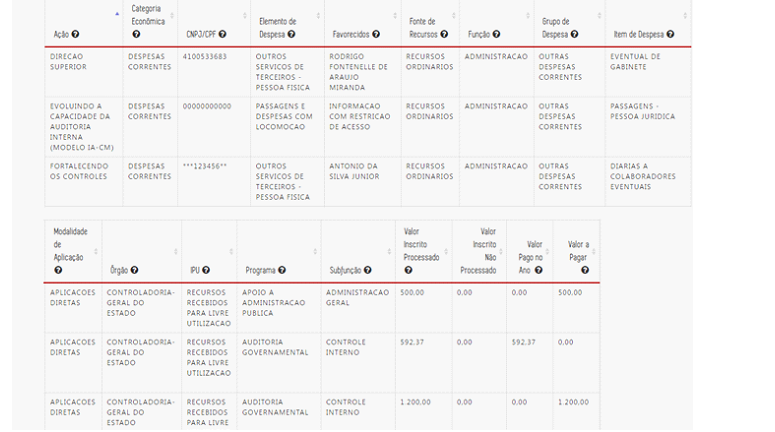

#### ITENS APROVADOS

**1- Incluir a coluna "Valor Retido" - tela inicial** - **OK**

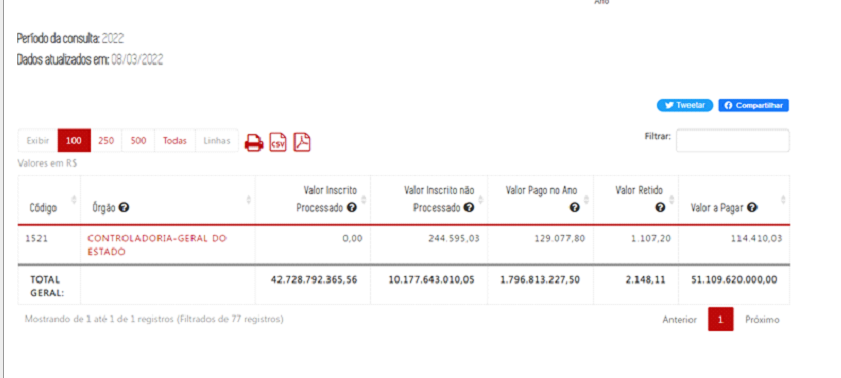

**2- Incluir a coluna "Valor Retido" - consulta por órgão** - **OK**

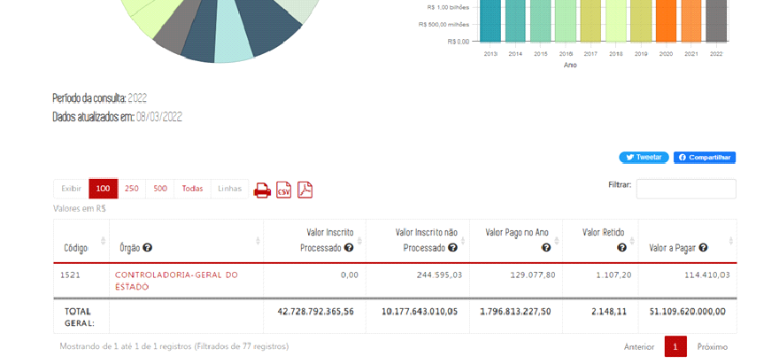

**3- Incluir a coluna "Valor Retido" - consulta por órgão - elemento** - **OK**

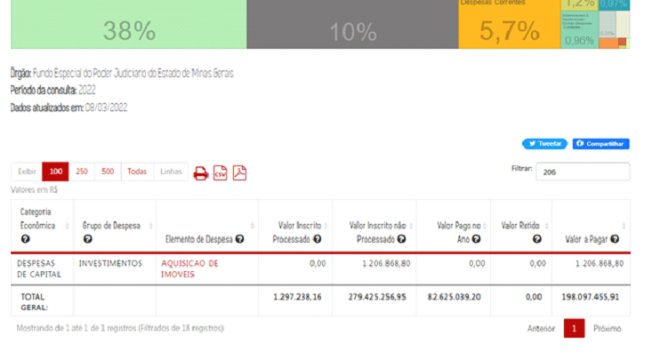

**4- Incluir a coluna "Valor Retido" - consulta por órgão - elemento item** - **OK**

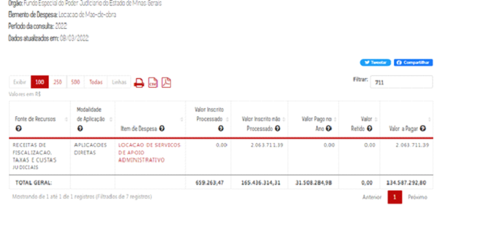

**5- Incluir a coluna "Valor Retido" - consulta por órgão - elemento item - empenho** - **OK**

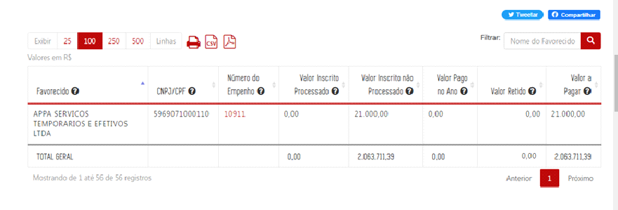

**6- Incluir a coluna "Valor Retido" - consulta por favorecido** - **OK**

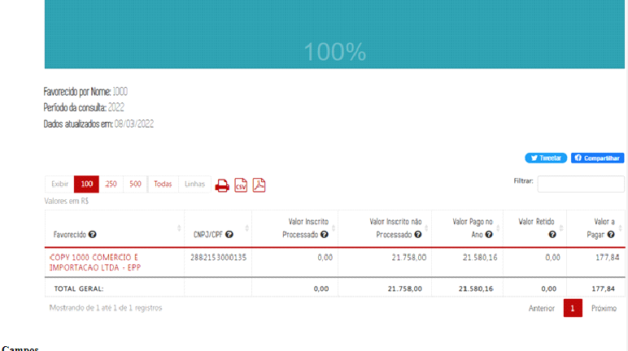

**7- Incluir a coluna "Valor Retido" - consulta por Favorecido - elemento** - **OK**

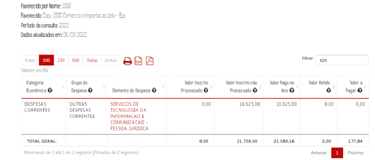

**8- Incluir a coluna "Valor Retido" - consulta por Favorecido - elemento item** - **OK**

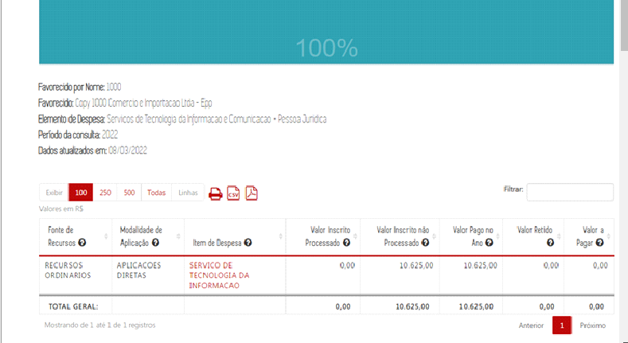

**9- Incluir a coluna "Valor Retido" - consulta por Favorecido - elemento item - órgão** - **OK**

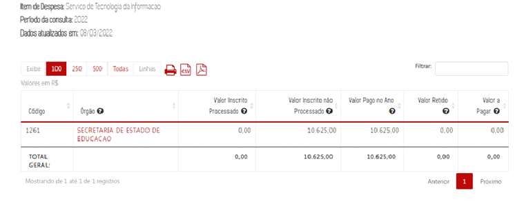

**10- Incluir a coluna "Valor Retido" - consulta por Favorecido - elemento item - órgão documento** - **OK**

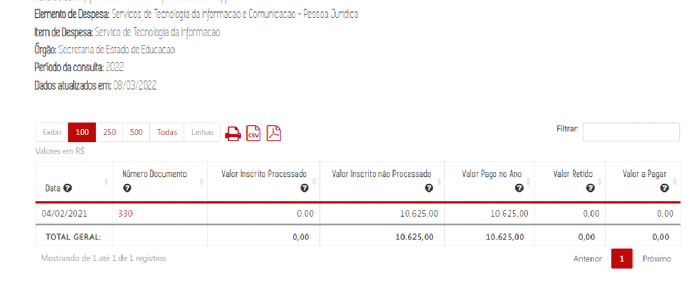

