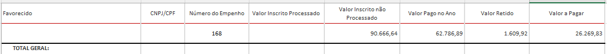

# Visão geral da demanda
<a href="#top">(inicio)</a>

Atualmente a informação da coluna “Valor a pagar” da consulta do Portal de Transparência é construída através do cálculo:
Valor Inscrito Processado + Valor Inscrito Não Processado – Valor Pago no Ano, porém quando ocorre retenções a soma não reflete o valor correto do saldo a pagar em restos a pagar.

Com o objetivo de corrigir essa inconsistência no Portal, o correto seria que a coluna “Valor a pagar” extraísse as informações diretamente do Armazém SIAFI e que os valores retidos sejam exibidos para melhor compreensão do usuário.

# Especificação
<a href="#top">(inicio)</a>

## Consulta Restos a pagar

**1- Incluir a coluna "Valor Retido"**

| Campo SIAFI| Universo| Campo PdT | Tooltip | Observação
|---|---|-|--|-|
| Valor Liquidado Retido |  SIAFI > Execução de Restos a Pagar > Restos a Pagar | Valor Retido| Valor, em reais, de apropriação de retenção da despesa orçamentária contida no documento de obrigação liquidada a pagar.| A coluna será acrescida em todos os níveis

**2- Alterar a fórmula de cálculo da coluna "Valor a Pagar"**

|Campo PdT| Campo SIAFI|Universo| Fórmula|
|---|---|-|--|
| Valor a Pagar | - Saldo Restos a Pagar   Processado   - Saldo Restos a Pagar não Processado | SIAFI > Execução de Restos a Pagar > Restos a Pagar| Somar os valores das Colunas:  Saldo Restos a Pagar   Processado **(+)**  Saldo Restos a Pagar não Processado

**3- Resultado Portal de Transparência**

Abaixo segue o exemplo do [Empenho 168](https://www.transparencia.mg.gov.br/despesa-estado/restos-a-pagar/restospagar-orgaos/2020/3964/546/42/20/3065/130/58)

A consulta do Campos BO está disponível em:

Pastas Públicas > SIAFI > CGE - PdT > Restos a Pagar > correção_valor_a_pagar_Restos_a_pagar

