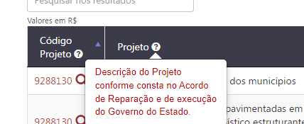
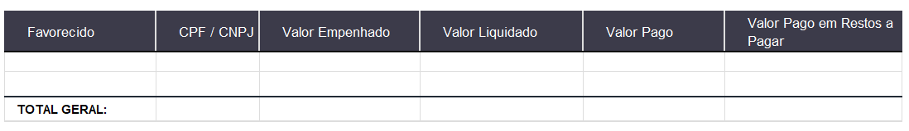
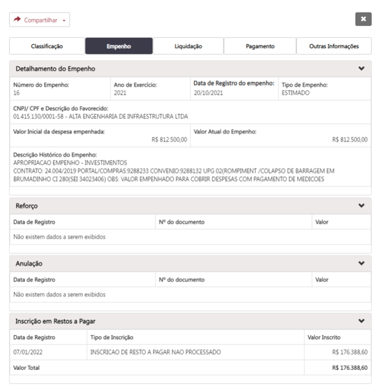
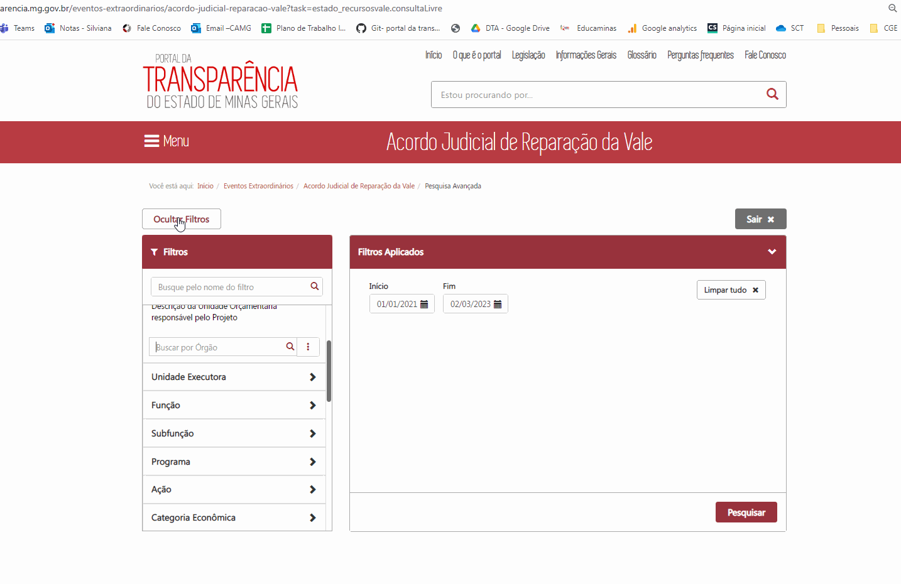

# Visão geral da demanda
<a href="#top">(inicio)</a>

Reestruturação da consulta de Despesa para incluir numa mesma consulta todas as informações de um mesmo empenho. A consulta conterá dados de toda execução financeira do empenho, incluindo dados de restos a pagar, processos de compras, contratos e convênios vinculados.

# Motivação / contexto da demanda
<a href="#top">(inicio)</a>

A alteração faz-se necessária para atender à demandas dos usuários em correlacionar as informacões dentro de uma única consulta.

Atualmente, no Portal da Transparência, para ter acesso a informações de execução financeira, incluindo restos a pagar, compras e contratos, o usuário precisa realizar a consulta em três locais diferentes (consulta de Despesa, consulta de Restos a Pagar, Consulta de Compras e Contratos, além da consulta de Convênios, quando aplicável), sendo que nem sempre os dados são de fácil compreensão por parte do usuário.

Para essa reestruturação, o objetivo será trazer todas as informações para uma mesma consulta, além de tornar a consulta mais intuitiva, com possibilidade do usuário estruturar a sua consulta, incluir ou retirar colunas, além de reduzir a quantidade de cliques para chegar a informação desejada.

# Especificação
<a href="#top">(inicio)</a>

Esse documento tem como objetivo apresentar as alterações que deverão ser implementadas na pesquisa básica e na pesquisa avançada da consulta de Despesa Pública.

## Observações Gerais:

1. Todas as páginas da consulta deverão exibir ícones com links para compartilhar as  consultas. O usuário poderá compartilhar os links dos dados nos seguintes canais, no mínimo:
     * Twitter
     * Facebook
     * WhatsApp
     * Instagram
     * Copiar url

2. Todas as páginas deverão exibir cabeçalho da tabela para que o usuário identifique qual o caminho percorrido. Além do caminho percorrido pelo usuário o PDT deverá apresentar a data de atualização dos dados e o período selecionado.

     * Período:
     * Dados atualizados em:

3. Todas as páginas deverão exibir as migalhas de pão (*Breadcrumbs navigation*):

    

4. Os ícones '*Exibir Gráfico*/*Ocultar Gráfico*', '*Download*' e '*Compartilhar*' serão exibidos acima do gráfico/tabela de resultados. Sendo que, quando o usuário clicar em exibir gráfico o botão '*Download*' será deslocado para depois do gráfico. Esse comportamento já é adotado na consulta Acordo Judicial da Vale.

5. Todas as **barras de pesquisa** devem aceitar várias formas de preenchimento dos dados.
    * Autocompletar (*autocomplete* ) desde a primeira letra (eg. [Portal de Transparência MG](http://www.transparencia.mg.gov.br));
    * Desconsiderar acentuação, letras maiúsculas e minúsculas;
    * Desconsiderar palavras intermediárias (ex.: Ao digitar “gestao pública”, um dos resultados será “Gestão da Administração Pública”);
    * O usuário poderá pesquisar código ou descrição das classificações orçamentárias (eg. [Consulta Acordo Judicial da Vale - PdT MG](https://www.transparencia.mg.gov.br/eventos-extraordinarios/acordo-judicial-reparacao-vale?task=estado_recursosvale.consultaLivre)).  
    *  O usuário poderá pesquisar por qualquer coluna na tabela de resultados.

6. O design de todas as tabelas de resultados da pesquisa básica deverá apresentar o seguinte comportamento:
    * Cabeçalho fixo - Fixer Header ([eg. Consulta de Remuneração do PdT](https://www.transparencia.mg.gov.br/estado-pessoal/remuneracao-dos-servidores/remuneracao-faixa/202112/3/1094/4022/C/3569184/995/26150365));
   * Rolagem horizontal - Horizontal Scroll. Quando o número de colunas ultrapassar o limite da página o PdT deve possibilitar a rolagem horizontal;
   * Colunas movíveis e classificáveis, conforme ocorre atualmente;
   * Paginação e seleção da quantidade de linhas a serem exibidas, conforme ocorre atualmente;
   * O texto deve ser ajustável nas colunas, ou seja, caso seja necessário pode haver quebra de linha;
   * A tabela apresentará campos clicáveis (com link) que irão direcionar o usuário para o próximo nível da consulta.
   * Os campos clicáveis serão destacados conforme o layout já adotado pelo PdT - [Consulta Acordo Judicial de Reparação da Vale](https://www.transparencia.mg.gov.br/eventos-extraordinarios/acordo-judicial-reparacao-vale?task=estado_recursosvale.listarExecucoes&amp;ano=&amp;dataInicio=01/01/2021&amp;dataFim=31/12/2022&amp;consulta=2&amp;filtro=).
   * Todos os termos das tabelas terão tooltip que serão exibidos quando o usuário passar o mouse sobre o ícone de "?"

   

7. A descrição dos tooltips e os campos de cada tabela estão disponíveis em:
    * [Especificação Tooltip](https://github.com/transparencia-mg/especificacoes-portal-transparencia/blob/espec020_filtros_consulta_despesa/espec020_filtros_consulta_despesa/especificacao-despesa-tooltip.md)
   * [Especificação Dados](https://github.com/transparencia-mg/especificacoes-portal-transparencia/blob/master/espec020_filtros_consulta_despesa/especificacao-despesa-dados.md)

8. Todas as funcionalidades não exemplificadas seguirão o mesmo padrão já adotado na consulta Acordo Judicial da Vale do Portal de Transparência.

## Página Inicial - Pesquisa Básica
<a href="#top">(inicio)</a>

## 1. Texto Introdutório

Inclusão de um campo que irá trazer uma breve explicação do conteúdo da consulta. *Exemplo: [Consulta Acordo Judicial da Vale](https://www.transparencia.mg.gov.br/eventos-extraordinarios/acordo-judicial-reparacao-vale)*

### Atributos do campo 

1. O PdT deverá permitir que por meio da área administrativa do Portal a equipe da DTA inclua ou altere os dados de texto desse campo, incluindo os tooltips.
2. O usuário poderá exibir mais detalhes do texto ao clicar em **Mais** ou ocultar ao clicar **Menos**;
3. A funcionalidade deverá permitir a visualização de tooltip ao posicionar o mouse sobre uma palavra ou termo;
4. Ao clicar sobre a palavra ou termo o PdT deverá abrir um pop-up em forma de glossário. [eg. pop-up](https://www.usaspending.gov/)

5. Ao clicar em qualquer termo destacado o usuário será direcionado para o termo específico dentro do glossário do Portal.

### Texto explicativo

* Ver  [Especificação Tooltip](https://github.com/transparencia-mg/especificacoes-portal-transparencia/blob/espec020_filtros_consulta_despesa/espec020_filtros_consulta_despesa/especificacao-despesa-tooltip.md)

## 2. Leiaute - Barra de navegação
<a href="#top">(inicio)</a>

A barra de navegação superior será composta pelos seguintes campos:

  * Ícones por tipo de Consulta: Órgão, Favorecido, Programa e Função;
  * Ano;
  * Período (01/04/2021 a 30/12/2021);
  * Opção de *'Filtro*;
  * Botão *'Monte sua consulta'*

### Atributos do campo 

1. O campo período será no formato **dd/mm/aaaa** composto por início e fim (eg. 01/04/2021 a 30/12/2021). Como padrão, o campo "Início/Fim" irá exibir o exercício vigente até o último dia de atualização dos dados.
2. No campo da data o usuário poderá selecionar ou digitar a data na caixa.  Exemplo: [Portal de Transparêcia ES](https://transparencia.es.gov.br/Despesa);
3. Caso o usuário digite uma data que ultrapasse o exercício financeiro o PdT deverá exibir uma mensagem orientando que a data esteja dentro do período do exercício financeiro.

3. A busca poderá ser realizada por meio de 4 tipos de filtros:
  * Órgão
  * Favorecido (Nome ou CPF/CNPJ)
  * Função
  * Programa

4. Quando o usuário posicionar o mouse sobre o ícone será exibido um tooltip com uma breve descrição.

5. O comportamento do campo *'Filtro'* será conforme o tipo de consulta selecionada e como padrão será exibido a opção 'Todos': 
     - **Órgão, Função, Programa**:  Ao selecionar uma das opções o PDT irá permitir que o usuário selecione um item no campo filtro. Esse campo poderá ser selecionado através da barra de rolagem ou por digitação.

  
      - **Favorecido**:  Ao selecionar esse tipo de consulta o usuário poderá escolher se a busca será realizada pelo nome do Favorecido ou pelo CPF/CNPJ. Nesse caso, deverá ser exibida uma barra em que o usuário irá digitar os dados.

  

6. A barra de pesquisa do campo filtro deverá possuir atributo [placeholder](https://www.w3schools.com/tags/att_input_placeholder.asp) para facilitar ou indicar como o campo deverá sem preenchido. Destaca-se que o campo favorecido nome e CNPJ serão obrigatórios para o usuário seguir na busca, conforme ocorre na consulta da Vale. Porém nos demais filtros (órgão, programa, função) a informação deverá ser retornada a medida que o usuário for digitando.  (Texto: *Digite o nome, parte do nome ou CPF/CNPJ*)

7. As demais funcionalidades serão as mesmas já adotadas na consulta 'Acordo Judicial de Reparação da Vale' (MELHOR TRAZER DA ESPECIFICAÇÃO DA CONSULTA DA VALE AQUI E REPETIR AS FUNCIONALIDADES QUE QUEREMOS QUE SEJAM IMPLEMENTADAS PFV)

## 3. Leiaute - Tabelas de Resultados
<a href="#top">(inicio)</a>

1. A tabela de resultado levará em consideração os parâmetros dos filtros aplicados pelo usuário.
2. A pesquisa básica irá apresentar como padrão a tabela de resultados com os dados do exercício vigente por Órgão.
3.  Como padrão os dados serão exibidos no formato de tabela e caso o usuário queira visualizar os dados em forma de gráfico deve clicar em '*Exibir Gráfico*' e os dados da tabela serão deslocados para baixo. Para retornar a exibição para o formato tabela o usuário deve clicar em '*Ocultar Gráfico*'
4. A opção de 'Exibir linhas' (quantidade de linhas) será exibida na parte superior da tabela.
5. O usuário poderá solicitar a exibição dos dados com código e descrição. Ao clicar no botão *'Exibir/Ocultar Código'* uma nova coluna será adicionada a esquerda de cada coluna que tenha a descrição.
6. Os valores TOTAL GERAL e o SUBTOTAL serão exibidos na tabela de resultados de acordo com o comportamento do usuário:

  * **TOTAL GERAL:** quando o usuário não aplicar nenhum filtro na tabela ou quando todos os dados forem exibidos em uma única página, ou seja, sem paginação;
  * **SUBTOTAL:** quando o usuário aplicar qualquer filtro na tabela através da barra de pesquisa ou quando houver paginação na tabela de resultado, ou seja, houver mais de uma página de resultado.

7. Todos os parâmetros apresentados acima, podem ser verificados na consulta do Portal *'Acordo Judicial da Vale'*.

### Leiaute - Gráficos
<a href="#top">(inicio)</a>

* O usuário terá a opção de verificar a série histórica ao clicar no gráfico de barra;
* Os gráficos apresentaram os dados da coluna 'Valor Liquidado'.
* Todos os gráficos deverão apresentar títulos, conforme o usuário for navegando pela consulta. 
Exemplo: Consulta de Despesa

### Download dos dados:
<a href="#top">(inicio)</a>

  - **Download PDF:**

  * O documento gerado em PDF deverá exibir:
      * logo do Portal de Transparência no início da página;
      * *URL*, paginação e a data no fim da página;
      * O arquivo gerado irá exibir os mesmos dados apresentados na tela considerando todos os filtros aplicados, inclusive TOTAL GERAL ou SUBTOTAL conforme o comportamento do usuário.
      * ao selecionar essa opção o arquivo PDF deverá ser aberto em outra aba do navegador

  - **Download Planilha (CSV):**

  * O documento gerado em CSV deverá:
      * Exibir a tabela completa de todas as páginas no formato CSV, independente do filtro aplicado.
      * Exibir código e descrição em campos distintos, independente do usuário selecionar a opção '*Exibir/Ocultar código*'

  - **Download base completa:**

  * O download da base completa:
      * O usuário será direcionado para o conjunto de dados da respectiva consulta no Portal de Dados Abertos.
      * O PdT deverá permitir que a equipe DTA inclua/altere a *url* desse campo através da área administrativa do Portal.                  

## 4. Pesquisa básica - Navegação por filtros
<a href="#top">(inicio)</a>

### CONSULTA POR ÓRGÃO - Página Inicial
<a href="#top">(inicio)</a>

Essa consulta será composta por 5 níveis:
_______
  1º nível - [Órgão]() 
  2º nível - Órgão > [Elemento de despesa]() 
  3º nível - Órgão > Elemento de despesa > [Favorecido]() 
  4º nível - Órgão > Elemento de despesa > Favorecido > [Empenho]() 
  5º nível - Órgão > Elemento de despesa > Favorecido > Empenho > [Formulário de Detalhamento]() 
___________

##### 1º NÍVEL
  - Código do Órgão
  - [Órgão]() -> ao clicar o usuário será direcionado para o 2º nível
  - Valor Empenhado
  - Valor Liquidado
  - Valor Pago
  - Valor Pago de Restos a Pagar 

##### 2º NÍVEL
  - [Elemento de despesa]() -> ao clicar o usuário será direcionado para o 3º nível
  - Valor Empenhado
  - Valor Liquidado
  - Valor Pago
  - Valor Pago de Restos a Pagar 

##### 3º NÍVEL
  - [Favorecido]() -> ao clicar o usuário será direcionado para o 4º nível
  - CPF / CNPJ
  - Valor Empenhado
  - Valor Liquidado
  - Valor Pago
  - Valor Pago de Restos a Pagar 

##### 4º NÍVEL
  - [Empenho]() -> ao clicar o usuário será direcionado para o formulário de detalhamento
  - Data de registro do Empenho
  - Valor Empenhado
  - Valor Liquidado
  - Valor Pago
  - Valor Pago de Restos a Pagar 

##### 5º NÍVEL

 - **Formulário de Detalhamento**

  Ao clicar no número do empenho o usuário será direcionado para o formulário de detalhamento, que será composto pelos seguintes atributos:
    * As tabelas que compõem o formulário de detalhamento serão exibidas em formato de guias.
    * O usuário poderá fazer o Download das informações do formulário de detalhamento ao clicar no botão 'Download'.

**OBS:**O usuário poderá fazer o Download das informações do formulário de detalhamento ao clicar no botão 'Download'. A exportação em planilha (CSV) deverá ser estruturada em formato de tabela. Cada campo em uma coluna.

##### Campos do formulário de detalhamento

###### Classificação Orçamentária

###### Empenho

- O formulário de detalhamento deverá exibir a inscrição, liquidação e pagamento dos valores em restos a pagar referente ao todos os exercícios. Exemplo:
  * Ano de registro do Empenho: 2020
  * Inscrição em Restos a Pagar: 2021
  * Reinscrito em Restos e Pagar: 2022

###### Liquidação

 

###### Pagamento

 

###### Outras Informações

  

**Comportamento da Consulta:**

- Ao clicar no campo 'Número do Processo de Compra' o usuário será direcionado o [formulário de detalhamento da consulta Compras e Contratos](https://www.transparencia.mg.gov.br/compras-e-patrimonio/compras-e-contratos/comprasecontratos-detalhe-proccompra/2022/20220101/20221231/369556).

- Ao clicar no campo 'Número do Contrato' o usuário o usuário será direcionado o [formulário de detalhamento da consulta Contratos](https://www.transparencia.mg.gov.br/compras-e-patrimonio/compras-e-contratos/comprasecontratos-filtros/5/2022/01-01-2022/31-12-2022/564/75328).

- Ao clicar no campo 'Número do Convênio / Parceria SIAFI' o usuário será direcionado o formulário de detalhamento da consulta [Consulta Convênios / Parceria de Saída de Recursos](https://www.transparencia.mg.gov.br/convenios/convenios-de-saida/convenios-conslivre-detalhesconv/2021/01-01-2021/31-12-2021/61691)

### CONSULTA POR FUNÇÃO
<a href="#top">(inicio)</a>

Essa consulta será composta por 5 níveis:
_______
  1º nível - [Função]() 
  2º nível - Função > [Subfunção]() 
  3º nível - Função > Subfunção > [Favorecido]() 
  4º nível - Função > Subfunção > Favorecido > [Empenho]() 
  5º nível - Função > Subfunção > Favorecido > Empenho > [Formulário de Detalhamento]() 
___________

##### 1º NÍVEL
  - Código da Função
  - [Função]() -> ao clicar o usuário será direcionado para o 2º nível
  - Valor Empenhado
  - Valor Liquidado
  - Valor Pago
  - Valor Pago de Restos a Pagar 

##### 2º NÍVEL
  - Código do Subfunção
  - [Subfunção]() -> ao clicar o usuário será direcionado para o 3º nível
  - Valor Empenhado
  - Valor Liquidado
  - Valor Pago
  - Valor Pago de Restos a Pagar 

##### 3º NÍVEL
  - [Favorecido]() -> ao clicar o usuário será direcionado para o 4º nível
  - CPF / CNPJ
  - Código do Órgão -> Apenas quando o usuário clicar em *'Exibir/Ocultar Código'*)
  - Órgão
  - Valor Empenhado
  - Valor Liquidado
  - Valor Pago
  - Valor Pago de Restos a Pagar 

##### 4º NÍVEL
  - [Empenho]() -> ao clicar o usuário será direcionado para o formulário de detalhamento
  - Data de registro do Empenho
  - Valor Empenhado
  - Valor Liquidado
  - Valor Pago
  - Valor Pago de Restos a Pagar 

##### 5º NÍVEL

- Formulário de Detalhamento

### CONSULTA POR PROGRAMA
<a href="#top">(inicio)</a>

Essa consulta será composta por 5 níveis:
_______
  1º nível - [Programa]() 
  2º nível - Programa > [Ação]() 
  3º nível - Programa > Ação > [Favorecido]() 
  4º nível - Programa > Ação > Favorecido > [Empenho]() > 
  5º nível - Programa > Ação > Favorecido > Empenho > Formulário de Detalhamento 
___________

##### 1º NÍVEL
  - Código da Programa
  - [Programa]() -> ao clicar o usuário será direcionado para o 2º nível
  - Valor Empenhado
  - Valor Liquidado
  - Valor Pago
  - Valor Pago de Restos a Pagar 

##### 2º NÍVEL
  - Código do Ação
  - [Ação]() -> ao clicar o usuário será direcionado para o 3º nível
  - Valor Empenhado
  - Valor Liquidado
  - Valor Pago
  - Valor Pago de Restos a Pagar 

##### 3º NÍVEL
  - [Favorecido]() -> ao clicar o usuário será direcionado para o 4º nível
  - CPF / CNPJ
  - Código do Órgão -> Apenas quando o usuário clicar em *'Exibir/Ocultar Código'*)
  - Órgão
  - Valor Empenhado
  - Valor Liquidado
  - Valor Pago
  - Valor Pago de Restos a Pagar 

##### 4º NÍVEL
  - [Empenho]() -> ao clicar o usuário será direcionado para o formulário de detalhamento
  - Data de registro do Empenho
  - Valor Empenhado
  - Valor Liquidado
  - Valor Pago
  - Valor Pago de Restos a Pagar 

##### 5º NÍVEL

- Formulário de Detalhamento

### CONSULTA POR FAVORECIDO (NOME E CPF/CNPJ)
<a href="#top">(inicio)</a>

Essa consulta será composta por 3 níveis:
_______
  1º nível - [Favorecido]() 
  2º nível - Favorecido > [Empenho]() 
  3º nível - Favorecido > Empenho > Formulário de Detalhamento 
___________

##### 1º NÍVEL
  - [Favorecido]() -> ao clicar o usuário será direcionado para o 4º nível
  - CPF / CNPJ
  - Valor Empenhado
  - Valor Liquidado
  - Valor Pago
  - Valor Pago de Restos a Pagar 

##### 2º NÍVEL
 - [Empenho]() -> ao clicar o usuário será direcionado para o formulário de detalhamento
  - Data de registro do Empenho
  - Código do Órgão -> Apenas quando o usuário clicar em *'Exibir/Ocultar Código'*)
  - Órgão
  - Valor Empenhado
  - Valor Liquidado
  - Valor Pago
  - Valor Pago de Restos a Pagar 

##### 3º NÍVEL

- Formulário de Detalhamento

## Pesquisa Avançada - Monte sua consulta
<a href="#top">(inicio)</a>

A pesquisa será composta pelos seguintes componentes:

* Barra de navegação vertical com filtros;
* Filtros Aplicados;
* Tabela de Resultado;

### Barra de Navegação Vertical
<a href="#top">(inicio)</a>

 Atributos da barra de navegação vertical:

* Todos os filtros deverão apresentar uma breve descrição.
* Todos os campos da barra vertical poderão ser consultados por descrição ou código, assim como ocorre na [Consulta Avançada do PdT -Acordo Judicial da Vale](https://www.transparencia.mg.gov.br/eventos-extraordinarios/acordo-judicial-reparacao-vale?task=estado_recursosvale.consultaLivre) na qual é possível digitar o nome ou código nos filtros.
* A lista de filtros será localizada a esquerda da tela. Caso a quantidade de filtros ultrapasse o limite da tela deverá ser utilizada a barra de rolagem.
[Consulta Avançada do PdT -Acordo Judicial da Vale](https://www.transparencia.mg.gov.br/eventos-extraordinarios/acordo-judicial-reparacao-vale?task=estado_recursosvale.consultaLivre)
* O usuário poderá realizar a busca de qualquer filtro na **barra de pesquisa**. A barra de pesquisa deverá possuir atributo [placeholder](https://www.w3schools.com/tags/att_input_placeholder.asp) para facilitar ou indicar como o campo deverá ser preenchido.
* Alguns filtros da barra de navegação também deverão possuir atributos *placeholder*.
* A barra de navegação poderá ser **ocultada/exibida** ([*collapsed Sidebar*](https://www.w3schools.com/howto/howto_js_collapse_sidebar.asp)) a partir dos comandos.
    *	Ocultada => ao clicar no botão **[Ocultar Filtros]**;
    * Exibida => ao clicar no botão **[Mostrar Filtros]**
    * **OBSERVAÇÃO**: Ao ocultar a barra de navegação vertical dos demais conteúdos (tabela de resultados, campos aplicados e etc) serão reajustados na página.

* Ao clicar no símbolo '(⋮) 'será exibida uma outra barra de filtros onde o usuário poderá selecionar outros parâmetros da pesquisa.
* A barra deslizante só será exibida se o usuário clicar em algum filtro  da barra de navegação vertical.
* A barra deslizante será **ocultada** ao clicar em outro filtro.
* Quando a barra deslizante for ocultada e as opções forem selecionadas, a seção em que o usuário se encontra deverá apresentar a quantidade de filtros selecionados.
* Ao clicar sob a **barra de pesquisa** será exibida uma lista suspensa com todos os parâmetros referente ao filtro. Para selecionar o parâmetro desejado o usuário poderá usar a barra de rolagem ou a barra de pesquisa.  
* A barra deslizante deverá listar os parâmetros selecionados com a opção ***['x']() (excluir)***. O usuário poderá remover os parâmetros não desejados clicando no ***['x']()***.
* O usuário poderá combinar vários parâmetros para o mesmo filtro (selecionar mais de um item) ou selecionar a opção ***[Exibir Todos]*** ou ainda clicar no símbolo (⋮)
* Ao selecionar ***[Exibir Todos]***, abrirá uma tela modal exibindo todos os parâmetros daquele filtro com as opções *Selecionar tudo, Limpar Seleção, Inverter seleção*. O usuário poderá remover os parâmetros não desejados ao assinalar com tique a opção.  
* Os botões **Atualizar, Pesquisar e Limpar tudo** devem ser estilisticamente diferenciados (eg. [*Differentiate button types*](https://medium.com/nextux/design-better-buttons-6b64eb7f13bc#aj%20la%20lb))
* Ao selecionar o período específico a barra deslizante de cada filtro irá exibir como parâmetro apenas as classificações orçamentárias vigentes no ano da pesquisa. A exceção será para a consulta de Restos a Pagar, onde os parâmetros da barra deslizante irão refletir apenas as classificações orçamentárias inscritas em restos a pagar, e não a classificação orçamentária vigente no ano.
* A medida que o usuário selecionar um parâmetro de qualquer filtro, automaticamente apenas as opções que possuem relacionamento com o parâmetro selecionado serão exibida nos demais filtros.
  * **Exemplo**:   
Ao selecionar o parâmetro '1521- Controladoria-Geral do Estado' no filtro *Órgão* e em seguida clicar no filtro *Programa* apenas os programas que tiveram execução na Controladoria-Geral do Estado naquele ano serão exibidos.
* Todos os parâmetros selecionados serão exibidos no campo **Filtros Aplicados**.

-> Todas as funcionalidade listadas acima estão disponíveis na consulta do Portal - Acordo Judicial da Vale

### Filtros Aplicados
<a href="#top">(inicio)</a>

* O usuário poderá **ocultar/exibir** o conteúdo do campo filtros aplicados a partir do comandos:
  * **[^]**: Exibir o conteúdo do campo;
  * **[v]**: Ocultar o conteúdo do campo. Ao ocultar os dados do campo, os demais conteúdos da tela serão ajustados na página.

* Como padrão o filtro **Período** será exibido no campo filtros aplicados. O campo será no formato dd/mm/aaaa composto por início e fim (eg. 01/04/2021 a 30/12/2021). Como padrão o campo "Início/Fim" irá exibir exercício vigente até o último dia de atualização dos dados. No campo da data o usuário poderá selecionar ou digitar a data na caixa. Exemplo: Portal de Transparêcia ES;
* O campo filtro aplicados será composto pelos botões: Pesquisar, Atualizar e Limpar Tudo localizados na parte superior:
* A posição na tela dos botões Pesquisar e Atualizar será a mesma, sendo a exibição de um ou outro realizada de acordo com as regras abaixo.
  - **Pesquisar**: será exibido após o usuário selecionar qualquer parâmetro na barra deslizante.  O Usuário deverá clicar em pesquisar para exibir o resultado desejado.
  - **Atualizar**: será exibido quando o usuário remover/adicionar algum parâmetro, ou seja, fizer qualquer alteração no campo filtros aplicados.
  - **Limpar Tudo**: ficará disponível sempre que houver pelo menos um parâmetro selecionado. Ao clicar nesse botão será excluído todo o conteúdo desse campo.

  OBS: Os botões **Pesquisar/Atualizar/Limpar Tudo** devem ser estilisticamente diferenciados (eg. [*Differentiate button types*](https://medium.com/nextux/design-better-buttons-6b64eb7f13bc#aj%20la%20lb))
* O usuário poderá excluir um filtro por completo. Por exemplo, caso o usuário queira excluir o campo 'Órgãos' ele poderá fazer isso sem a necessidade de excluir os filtros um a um. Ele poderá excluir o campo "ÓRGÃO"
* Casos os parâmetros selecionados não retornem nenhuma informação, o PdT deverá apresentar a seguinte mensagem:  '*Não há dados a serem exibidos com os parâmetros selecionados.*''
* Os parâmetros selecionados na barra deslizante deverão ser exibidos na ordem que o usuário escolheu.
* Todos os parâmetros serão representados no campo filtros aplicados da seguinte forma:
  * **Filtro** (*nome do filtro*): **Parâmentro** (*nome do parâmetro*)-(**[X]()**)(*excluir*);
* À medida que o usuário for incluindo parâmetros na pesquisa, a tabela de resultados será deslocada para baixo quando ultrapassar o limite da tela (eg. [Portal de Transparência Federal](http://www.portaltransparencia.gov.br/despesas/programa-e-acao?ordenarPor=programa&direcao=asc)).
* Caso o usuário selecione uma grande quantidade de filtros será acrescida a opção *Ver mais* abaixo da lista de filtros.

-> Todas as funcionalidade listadas acima estão disponíveis na consulta do Portal - Acordo Judicial da Vale

### Tabela de resultados
<a href="#top">(inicio)</a>

* A tabela de resultado levará em consideração os parâmetros do campo filtros aplicados.
* A tabela apresentará colunas padrão que serão exibidas independentemente de o usuário selecionar/aplicar algum filtro.
  **Ver [Especificação Dados](https://github.com/transparencia-mg/especificacoes-portal-transparencia/blob/master/espec020_filtros_consulta_despesa/especificacao-despesa-dados.md)**

* A data de atualização dos dados, opção de compartilhamento e download serão exibidos acima da tabela de resultados.

* Os valores **TOTAL GERAL** e o **SUBTOTAL** serão exibidos na tabela de resultados de acordo com o comportamento do usuário. Conforme descrito na pesquisa básica.
* A **barra de pesquisa** da tabela de resultado deverá retornar os dados da tabela que estão exibidos.
A medida que o usuário for digitando os dados a busca será acionada. O atributo *placeholder*: deve ser aplicado na barra de pesquisa.

* O usuário poderá adicionar ou remover colunas - [*hide/show columns*](https://ux.stackexchange.com/a/110079) na tabela de resultados. Ao clicar em **Adicionar/Remover colunas** será exibida uma barra lateral a direta com todas as colunas que poderão ser adicionadas ou removidas.
* Ao exibir ou ocultar alguma coluna a tabela de resultados será atualizada automaticamente (eg.[Column Toggle Table](https://ux.stackexchange.com/questions/110077/best-practices-to-allow-user-to-hide-show-columns-in-a-data-table/110079#110079)).

* O ícone **Adicionar/Remover Colunas** além dos filtros pré-determinados pela DTA terá uma barra de pesquisa onde o usuário poderá digitar o filtro desejado.

* As colunas definidas como padrão ficarão marcadas na tabela ***Adicionar/Remover Colunas*** podendo o usuário desativá-las.  Ver [Especificação Dados](https://github.com/transparencia-mg/especificacoes-portal-transparencia/blob/master/espec020_filtros_consulta_despesa/especificacao-despesa-dados.md)

* Ao inserir qualquer coluna essas serão incluídas antes das colunas de valores. E caso seja incluída alguma coluna de valor o portal deverá manter a ordem da execução orçamentária (Valor empenhado, valor liquidado, valor pago, valor pago em restos a pagar).

* Os campos clicáveis serão destacados conforme o layout já adotado  pelo PdT e terão a imagem de uma lupa. Para exibir mais informações o usuário deverá clicar na lupa da coluna "detalhar":
  * O 1º nível terá como opção o botão Detalhar o qual direcionará o usuário para o segundo nível, conforme os filtros selecionados, e, em seguida, poderá ser direcionado para o próximo nível e assim por diante.
  * No caso especifico da Consulta de Despesa o último nível da consulta será sempre o formulário de detalhamento que será acessado após o usuário clicar em algum empenho.

  * **OBS** Caso o usuário solicite a exibição da coluna empenho já no 1º nível e este for um valor único, o usuário será direcionado diretamente para o formulário de detalhamento relacionado ao empenho.
  * **Exceção:** Quando o usuário utilizar o filtro ***"Número da Ordem de Pagamento"*** na barra de filtro vertical as colunas abaixo deverão ser exibidas em formato desabilitado, sem a exibição de dados: Valor empenhado e Valor liquidado.
  * Caso o filtro ***"Número da Ordem de Pagamento"*** seja retirado da barra de filtros aplicados a formatação e exibição dos valores dessas colunas seguirá o padrão.

* A única tabela que deverá ser exibida no estilo modal será o formulário de detalhamento. A navegação pelos níveis será exibida normalmente, conforme ocorre na pesquisa básica.

* Todos os filtros selecionados serão exibidos na tabela de resultado.

* A exibição de código e descrição será diferente em cada seção:
  * Barra de pesquisa e filtros aplicados: exibir código e descrição no mesmo campo;
  * Tabela de resultado: exibir apenas descrição. Os códigos serão exibidos apenas se o usuário adicionar a coluna código;

#### Download dos dados:
  * Como regra geral deverá seguir o padrão da pesquisa básica.
  * Opção exportar Planilha (CSV): exibir código e descrição em colunas distintas, independente de o usuário selecionar a opção código na tabela de resultado. O período selecionado deverá ser exibido na primeira coluna da planilha;

#### Observação
- Os dados/tabelas da pesquisa avançada serão os mesmos que constam nas tabelas da pesquisa básica, porém será necessário verificar a granularidade para os devidos cruzamentos. Ver [Especificação de Dados](https://github.com/transparencia-mg/especificacoes-portal-transparencia/blob/master/espec020_filtros_consulta_despesa/especificacao-despesa-dados.md)
