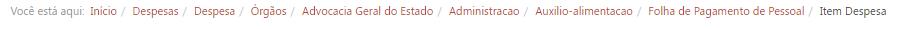
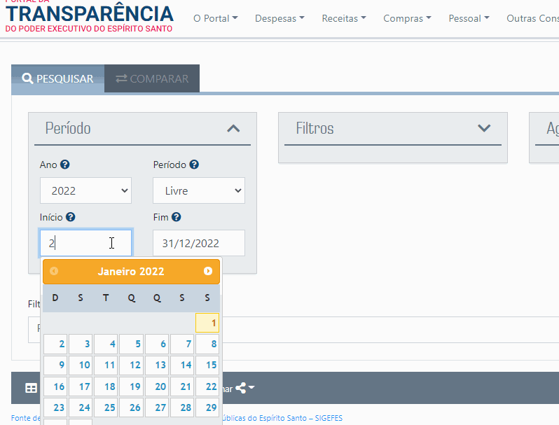
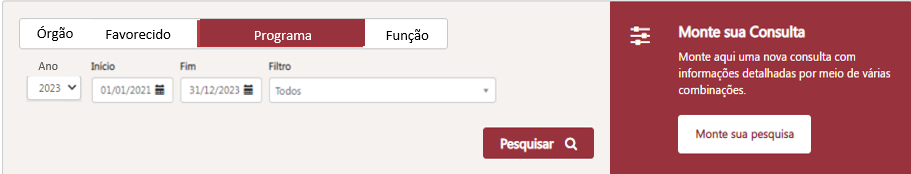
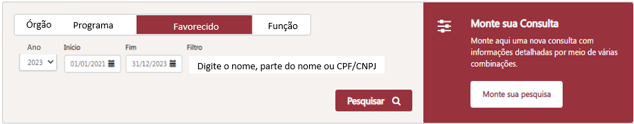
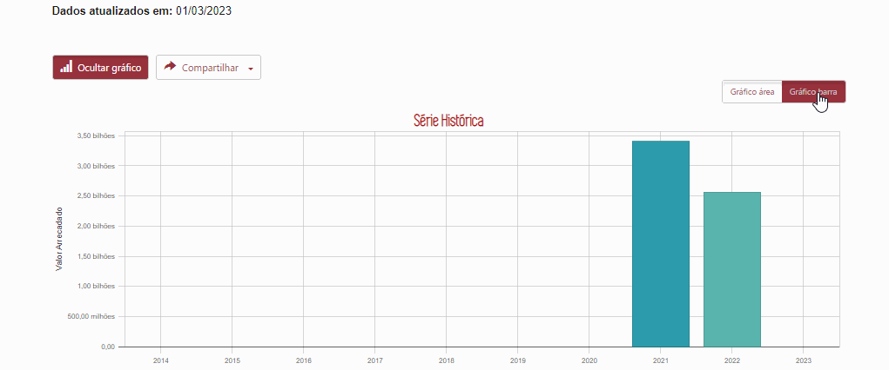

# Visão geral da demanda
<a href="#top">(inicio)</a>

Reestruturação da consulta de Despesa para incluir numa mesma consulta todas as informações de um mesmo empenho. A consulta incluirá dados da execução financeira do empenho, incluindo dados de restos a pagar, dados dos processos de compras, contratos e convênios vinculados.

# Motivação / contexto da demanda
<a href="#top">(inicio)</a>

A alteração se faz necessária para atender a demandas dos usuários de realizar a pesquisa de várias informações dentro de uma única consulta.

Atualmente no Portal da Transparência, para ter acesso a informações de execução financeira, incluindo restos a pagar, compras e contratos, o usuário precisa realizar a consulta em três locais diferentes (consulta de Despesa, consulta de Restos a Pagar, Consulta de Compras e Contratos, além da consulta de Convênios, quando for aplicável), sendo que nem sempre os dados são de fácil compreensão do usuário.

Para essa reestruturação, o objetivo será trazer todas as informações para uma mesma única consulta, além de tornar a consulta mais intuitiva, com possibilidade do usuário montar a sua consulta, incluir ou retirar colunas, além de reduzir a quantidade de cliques para chegar a informação desejada.


# Especificação
<a href="#top">(inicio)</a>

Esse documento tem como objetivo apresentar as alterações que deverão ser implementadas na pesquisa básica e avançada da consulta da Despesa Pública.

## Observações Gerais:

1. Todas as páginas de consulta deverão exibir ícones com links para compartilhar as  consultas. O usuário poderá Compartilhar os link dos dados nos seguintes canais, no mínimo:

* Twitter
* Facebook
* WhatsApp
* Copiar url

2. Todas as páginas deverão exibir cabeçalho da tabela para que o usuário identifique qual o caminho percorrido. Além do caminho percorrido pelo usuário o PDT deverá apresentar a data de atualização dos dados e o período selecionado.

- Dados atualizados em:
- Período:


3. Todas as páginas deverão exibir as migalhas de pão (*Breadcrumbs navigation*):

    

4. Os ícones '*Exibir Gráfico*/*Ocultar Gráfico*', '*Download*' e '*Compartilhar*' serão exibidos acima do gráfico/tabela de resultados. Sendo que ao solicitar a exibição do gráfico o botão '*Download*' será  deslocado para depois do gráfico.
Esse comportamento atualmente é adotado na consulta Acordo Judicial da Vale.

## Página Inicial - Pesquisa Básica
<a href="#top">(inicio)</a>

## 1. Texto explicativo

Inclusão de um campo que irá trazer uma breve explicação do conteúdo da consulta.<br>
*Exemplo: [Consulta Acordo Judicial da Vale](https://www.transparencia.mg.gov.br/eventos-extraordinarios/acordo-judicial-reparacao-vale)*

### Atributos do campo<br>
***Exemplo: [Página Inicial - Consulta Acordo Judicial de Reparação da Vale](https://www.transparencia.mg.gov.br/eventos-extraordinarios/acordo-judicial-reparacao-vale?task=estado_recursosvale.listarExecucoes&amp;ano=&amp;dataInicio=01/01/2021&amp;dataFim=31/12/2022&amp;consulta=2&amp;filtro=)***

1. O PdT deverá permitir que por meio da área administrativa do Portal a equipe DTA inclua ou altere os dados o texto desse campo, incluindo os tooltips.
2. O usuário poderá exibir mais detalhes do texto ao clicar em **Mais** ou ocultar ao clicar **Menos**;
3. A funcionalidade deverá permitir a visualização de tooltip ao posicionar o mouse sobre uma palavra ou termo;
4. Ao clicar sobre a palavra ou termo o PdT deverá abrir um pop-up em forma de glossário. [eg. pop-up](https://www.usaspending.gov/)


### Texto Introdutório

> A Despesa pública é a aplicação do dinheiro arrecadado pelo Estado por meio de impostos, taxas, transferências ou outras fontes para custear os serviços de ordem pública ou para investir no próprio desenvolvimento econômico do estado. É o compromisso de gasto dos recursos públicos, autorizados pelo Poder competente, com a finalidade de atender a uma necessidade da coletividade prevista no orçamento.
>
> A execução da despesa é realizada seguindo os três estágios presentes na [Lei Federal nº 4.320/64](http://www.planalto.gov.br/Ccivil_03/leis/L4320.htm):
> - [`Empenho`]((a ""): etapa em que o governo reserva o dinheiro que será pago quando o bem for entregue ou o serviço concluído;
> - [`Liquidação`]((a ""): etapa em que se verifica se o governo recebeu aquilo que comprou. Ou seja, quando se confere que o bem foi entregue corretamente ou que a etapa da obra foi concluída como acordado; e,
> - [`Pagamento`]((a ""): caso esteja tudo certo com as fases anteriores, o governo pode fazer o pagamento, repassando o valor ao fornecedor ou prestador de serviço.
>
> Para acessar os dados da despesa pública, o Portal da Transparência traz informações sobre a execução financeira e orçamentária da despesa pública do Estado de Minas Gerais através dos dados extraídos do [`SIAFI/MG`]((a ""). Os dados estão disponíveis desde o ano de 2002 e são atualizados diariamente (D+1).
>
> As informações dessa consulta de despesa incluem apenas as informações do Estado de Minas Gerais (Poder Executivo, Legislativo e Judiciário). As informações das despesas públicas dos municípios mineiros devem ser obtidas diretamente no portal de transparência do município desejado, conforme determina a [Lei Complementar nº 131](http://www.planalto.gov.br/ccivil_03/leis/lcp/lcp131.htm).


### Tooltip dos termos destacados dentro do texto inicial

- SIAFI/MG: Sistema Integrado de Administração Financeira de Minas Gerais.

**Observação:**<br> Ao clicar em qualquer termo destacado o usuário será direcionado para o termo especifico dentro do glossário do Portal.

## 2. Leiaute - Barra de navegação
<a href="#top">(inicio)</a>

A barra de navegação superior será composta pelos seguintes campos:

  * Ícones por tipo de Consulta: Órgão, Favorecido, Programa e Função;
  * Ano;
  * Período (01/04/2021 a 30/12/2021);
  * Opção de *'Filtro*;
  * Botão *'Monte sua consulta'*


### Atributos do campo<br>
**Exemplo:** ***[Página Inicial - Consulta Acordo Judicial de Reparação da Vale](https://www.transparencia.mg.gov.br/eventos-extraordinarios/acordo-judicial-reparacao-vale?task=estado_recursosvale.listarExecucoes&amp;ano=&amp;dataInicio=01/01/2021&amp;dataFim=31/12/2022&amp;consulta=2&amp;filtro=)***


1. O campo período será no formato **dd/mm/aaaa** composto por início e fim (eg. 01/04/2021 a 30/12/2021). Como padrão o campo "Início/Fim" irá exibir exercício vigente até o dia da última atualização dos dados.
2. No campo da data o usuário poderá selecionar ou digitar a data na caixa. Exemplo: [Portal de Transparêcia ES](https://transparencia.es.gov.br/Despesa);




3. Os ícones serão clicáveis. Quando o usuário posicionar o mouse sobre o ícone será exibido um tooltip com uma breve descrição.
    - Órgão: Consulte os valores por órgão (unidade orçamentária) responsável pela execução da despesa.
    - Favorecido: Consulte a execução financeira utilizando nome ou CPF/CNPJ do favorecido.
    - Programa: Consulte a execução pelo tipo de Programa, conforme previsto na LOA.
    - Função: Consulte a execução por área de atuação do governo. Exemplo: saúde, educação, transporte e segurança pública.


4. O comportamento do campo *'Filtro'* será conforme o tipo de consulta selecionada e como padrão será exibido a opção 'Todos':<br>
  - **Órgão, Função, Programa**: ao selecionar uma das opções o PDT irá permitir que o usuário selecione um item no campo filtro. Esse campo poderá ser selecionado através da barra de rolagem ou por digitação.

  

  - **Favorecido**: Ao selecionar esse tipo de consulta o usuário poderá escolher se a busca será realizada pelo nome do Favorecido ou pelo CPF/CNPJ. Nesse caso deverá ser exibido uma barra onde o usuário irá digitar os dados ([eg. Consulta PDT - Acordo Judicial da Vale]())

  

5. O campo *'Filtro'* deverá retornar os dados a medida que o usuário for digitando. O atributo placeholder deve ser aplicado.
6. A consulta irá apresentar como padrão a tabela de resultado com os dados do exercício vigente da consulta 'Órgão'.
7. As demais funcionalidades serão as mesmas já adotadas na consulta Acordo Judicial de Reparação da Vale'


## 3. Leiaute - Tabelas navegação
<a href="#top">(inicio)</a>

1. A tabela de resultado levará em consideração os parâmetros dos filtros aplicados pelo usuário.
1. A pesquisa básica irá apresentar como padrão a tabela de resultados com os dados do exercício vigente por Órgão.
1.  Como padrão os dados serão exibidos no formato de tabela e caso o usuário queira visualizar os dados em forma de gráfico deve clicar em '*Exibir Gráfico*' e os dados da tabela serão deslocados para baixo. Para retornar a exibição apenas no formato tabela o usuário deve clicar em '*Ocultar Gráfico*'
1. A opção de 'Exibir linhas' (quantidade de linhas) será exibida na parte superior da tabela.
1. O usuário poderá solicitar a exibição dos dados com código e descrição. Ao clicar no botão 'Exibir/Ocultar Código' uma nova coluna será adicionada a esquerda de cada coluna que tenha a descrição.
1. Os valores TOTAL GERAL e o SUBTOTAL serão exibidos na tabela de resultados de acordo com o comportamento do usuário:

  * **TOTAL GERAL:** quando o usuário não aplicar nenhum filtro na tabela ou quanto todos os dados forem exibidos em uma única página, ou seja, sem paginação;
  * **SUBTOTAL:** quando o usuário aplicar qualquer filtro na tabela através da barra de pesquisa ou quando houver paginação na tabela de resultado, ou seja, houver mais de uma página de resultado.

1. Todos os parâmetros apresentados acima, podem ser verificados na consulta do Portal *'Acordo Judicial da Vale'*.

### Estrutura de design das tabelas de resultados da Pesquisa básica
<a href="#top">(inicio)</a>

1. Cabeçalho fixo - Fixer Header ([eg. Consulta de Remuneração do PdT](https://www.transparencia.mg.gov.br/estado-pessoal/remuneracao-dos-servidores/remuneracao-faixa/202112/3/1094/4022/C/3569184/995/26150365));
1. Rolagem horizontal - Horizontal Scroll. Quando o número de colunas ultrapassar o limite da página o PdT deve possibilizar a rolagem horizontal;
1. Colunas movíveis e classificáveis conforme ocorre atualmente;
1. Paginação e seleção da quantidade de linhas a serem exibidas, conforme ocorre atualmente;
1. O texto deve ser ajustável nas colunas, ou seja, caso seja necessário pode haver quebra de linha;
1. A tabela apresentará campos clicáveis (com link) que irá direcionar o usuário para o próximo nível da consulta.
1. Os campos clicáveis serão destacados conforme o layout já adotado pelo PdT - [Consulta Acordo Judicial de Reparação da Vale](https://www.transparencia.mg.gov.br/eventos-extraordinarios/acordo-judicial-reparacao-vale?task=estado_recursosvale.listarExecucoes&amp;ano=&amp;dataInicio=01/01/2021&amp;dataFim=31/12/2022&amp;consulta=2&amp;filtro=).

### Leiaute - Gráficos
<a href="#top">(inicio)</a>

* O Gráfico apresentado como padrão será o tipo Treemap (Gráfico área) com os dados do exercício vigente;
* O usuário terá a opção de verificar série histórica ao clicar no gráfico de barra;
* Os gráficos apresentaram os dados da coluna 'Valor Liquidado'.




### Download dos dados:
<a href="#top">(inicio)</a>

* **Download PDF:**

O documento gerado em PDF deverá exibir:
  * logo do Portal de Transparência no início da página e
  * *URL*, paginação e a data no fim da página.
  * O arquivo gerado irá exibir os mesmos dados apresentados na tela considerando todos os filtros aplicados e inclusive o TOTAL GERAL ou SUBTOTAL conforme o comportamento do usuário.
  * ao selecionar essa opção o arquivo PDF deverá ser aberto em outra aba do navegador

* **Download Planilha (CSV):**

O documento gerado em CSV:
  * Será exibido a tabela completa de todas as páginas no formato CSV, independente do filtro aplicado.
  * Exibir código e descrição em campos distintos, independente de o usuário selecionar a opção '*Exibir/Ocultar código*'

* **Download base completa:**

O download da base completa:
  * O usuário será direcionado para o conjunto de dados da respectiva consulta no Portal de Dados Abertos.
  * O PdT deverá permitir que a equipe DTA inclua/altere a *url* desse campo através da área administrativa do Portal.                  

### Barra de pesquisa

1. A barra de pesquisa da tabela de resultado deverá retornar os dados a medida que o usuário for digitando. O atributo *placeholder* deve ser aplicado na barra de pesquisa.
2. A barra de pesquisa deve aceitar várias formas de preenchimento dos dados:
  * Desconsiderar acentuação, letras maiúsculas/minúsculas;
  * Desconsiderar palavras intermediárias (ex.: Ao digitar “gestao pública”, um dos resultados será “Gestão da Administração Pública”);
  * O usuário poderá pesquisar por qualquer coluna na tabela de resultados.

## 4. Pesquisa básica - Navegação por filtros
<a href="#top">(inicio)</a>


### CONSULTA POR ÓRGÃO
<a href="#top">(inicio)</a>

Essa consulta será composta por 5 níveis:
_______
  1º nível - [Órgão]()<br>
  2º nível - Órgão > [Elemento]()<br>
  3º nível - Órgão > Elemento > [Favorecido]()<br>
  4º nível - Órgão > Elemento > Favorecido > [Empenho]()<br>
  5º nível - Órgão > Elemento > Favorecido > Empenho > [Formulário de Detalhamento]()<br>
___________

##### 1º NÍVEL
  - Código do Órgão -> Apenas quando o usuário clicar em *'Exibir/Ocultar Código'*
  - [Órgão]() -> ao clicar o usuário será direcionado para o 2º nível
  - Valor Empenhado
  - Valor Liquidado
  - Valor Pago
  - Valor Pago de Restos a Pagar<br>


##### 2º NÍVEL
  - [Elemento]() -> ao clicar o usuário será direcionado para o 3º nível
  - Valor Empenhado
  - Valor Liquidado
  - Valor Pago
  - Valor Pago de Restos a Pagar<br>


##### 3º NÍVEL
  - [Favorecido]() -> ao clicar o usuário será direcionado para o 4º nível
  - CPF / CNPJ
  - Valor Empenhado
  - Valor Liquidado
  - Valor Pago
  - Valor Pago de Restos a Pagar<br>


##### 4º NÍVEL
  - [Empenho]() -> ao clicar o usuário será direcionado para o formulário de detalhamento
  - Data de registro do Empenho
  - Unidade Executora
  - Valor Empenhado
  - Valor Liquidado
  - Valor Pago
  - Valor Pago de Restos a Pagar<br>


##### 5º NÍVEL

 - Formulário de Detalhamento

Ao clicar no número do empenho o usuário será direcionado para o formulário de detalhamento, que será composto pelos seguintes atributos:
  * As tabelas que compõe o formulário de detalhamento serão exibidas em formato de guias
  * O usuário poderá fazer o Download das informações do formulário de detalhamento ao clicar no botão 'Download'.


________________ PAREI AQUI - SILVIANA
````
# **Decidir será no formato modal ou Não**

O usuário poderá fazer o Download das informações do formulário de detalhamento ao clicar no botão 'Download'. A exportação em planilha (CSV) deverá ser em formato de tabela. Cada campo em uma coluna.
``````

###### Campos do formulário de detalhamento

* Classificação Orçamentária

 

* Empenho

 

* Liquidação

 

* Pagamento

 

* Outras Informações

  

### CONSULTA POR FUNÇÃO
<a href="#top">(inicio)</a>

Essa consulta será composta por 4 níveis:
_______
  1º nível - [Função]()<br>
  2º nível - Função > [Subfunção]()<br>
  3º nível - Função > Subfunção > [Favorecido]()<br>
  4º nível - Função > Subfunção > Favorecido > [Empenho]()<br>
  5º nível - Função > Subfunção > Favorecido > Empenho > [Formulário de Detalhamento]()<br>
___________

##### 1º NÍVEL
  - Código da Função
  - [Função]() -> ao clicar o usuário será direcionado para o 2º nível
  - Valor Empenhado
  - Valor Liquidado
  - Valor Pago
  - Valor Pago de Restos a Pagar<br>

  


##### 2º NÍVEL
  - Código do Subfunção
  - [Subfunção]() -> ao clicar o usuário será direcionado para o 3º nível
  - Valor Empenhado
  - Valor Liquidado
  - Valor Pago
  - Valor Pago de Restos a Pagar<br>

  


##### 3º NÍVEL
  - [Favorecido]() -> ao clicar o usuário será direcionado para o 4º nível
  - CPF / CNPJ
  - Valor Empenhado
  - Valor Liquidado
  - Valor Pago
  - Valor Pago de Restos a Pagar<br>

  


##### 4º NÍVEL
  - [Empenho]() -> ao clicar o usuário será direcionado para o formulário de detalhamento
  - Data de registro do Empenho
  - Unidade Executora
  - Valor Empenhado
  - Valor Liquidado
  - Valor Pago
  - Valor Pago de Restos a Pagar<br>


##### 5º NÍVEL

- Formulário de Detalhamento

### CONSULTA POR PROGRAMA
<a href="#top">(inicio)</a>

Essa consulta será composta por 5 níveis:
_______
  1º nível - [Programa]()<br>
  2º nível - Programa > [Ação]()<br>
  3º nível - Programa > Ação > [Favorecido]()<br>
  4º nível - Programa > Ação > Favorecido > [Empenho]() ><br>
  5º nível - Programa > Ação > Favorecido > Empenho > Formulário de Detalhamento<br>
___________

##### 1º NÍVEL
  - Código da Programa
  - [Programa]() -> ao clicar o usuário será direcionado para o 2º nível
  - Valor Empenhado
  - Valor Liquidado
  - Valor Pago
  - Valor Pago de Restos a Pagar<br>

  


##### 2º NÍVEL
  - Código do Ação
  - [Ação]() -> ao clicar o usuário será direcionado para o 3º nível
  - Valor Empenhado
  - Valor Liquidado
  - Valor Pago
  - Valor Pago de Restos a Pagar<br>

  


##### 3º NÍVEL
  - [Favorecido]() -> ao clicar o usuário será direcionado para o 4º nível
  - CPF / CNPJ
  - Valor Empenhado
  - Valor Liquidado
  - Valor Pago
  - Valor Pago de Restos a Pagar<br>

  


##### 4º NÍVEL
  - [Empenho]() -> ao clicar o usuário será direcionado para o formulário de detalhamento
  - Data de registro do Empenho
  - Unidade Executora
  - Valor Empenhado
  - Valor Liquidado
  - Valor Pago
  - Valor Pago de Restos a Pagar<br>


##### 5º NÍVEL

- Formulário de Detalhamento


### CONSULTA POR FAVORECIDO (NOME E CPF/CNPJ)
<a href="#top">(inicio)</a>

Essa consulta será composta por 5 níveis:
_______
  1º nível - [Favorecido]()<br>
  2º nível - Favorecido > [Empenho]()<br>
  3º nível - Favorecido > Empenho > Formulário de Detalhamento<br>
___________

##### 1º NÍVEL
  - [Favorecido]() -> ao clicar o usuário será direcionado para o 4º nível
  - CPF / CNPJ
  - Valor Empenhado
  - Valor Liquidado
  - Valor Pago
  - Valor Pago de Restos a Pagar<br>

  


##### 2º NÍVEL
  - [Empenho]() -> ao clicar o usuário será direcionado para o formulário de detalhamento
  - Data de registro do Empenho
  - Unidade Executora
  - Valor Empenhado
  - Valor Liquidado
  - Valor Pago
  - Valor Pago de Restos a Pagar<br>

  

##### 3º NÍVEL

- Formulário de Detalhamento


## Campos Pesquisa básica - Navegação por filtros
<a href="#top">(inicio)</a>

Os dados dessa consulta serão extraídos do Universo BO SIAFI:
  * Armazém BO / ~tmp /nova-espec-despesa

#### Filtros da Consulta

## Monte sua consulta
<a href="#top">(inicio)</a>

A pesquisa será composta pelos seguintes componentes:

* Barra de navegação vertical com filtros;
* Filtros Aplicados;
* Tabela de Resultado;

### Barra de Navegação Vertical
<a href="#top">(inicio)</a>

 Atributos da barra de navegação vertical:

* Todos os filtros deverão apresentar uma breve descrição.
* Todos os campos da barra vertical poderão ser consultados por descrição ou código, assim como ocorre na [Consulta Avançada do PdT - Proposta Orçamentária](https://www.transparencia.mg.gov.br/planejamento-e-resultados/proposta-lei-orcamentaria/proposta-orcamentaria/proposta-pesquisa-avancada) em que é possível digitar o nome ou a descrição nos filtros.
* A lista de filtros será localizada a esquerda da tela. Caso a quantidade de filtros ultrapasse o limite da tela deverá ser utilizado a barra de rolagem.
[Ver filtros - Especificação Dados](https://github.com/transparencia-mg/especificacoes-portal-transparencia/blob/espec018_recusos-vale/espec018_recursos-acordo-judicial-vale/recursos-vale-dados.md)


* O usuário poderá realizar a busca de qualquer filtro na **barra de pesquisa**. A barra de pesquisa deverá possuir atributo [placeholder](https://www.w3schools.com/tags/att_input_placeholder.asp) para facilitar ou indicar como o campo deverá sem preenchido.

* Alguns filtros da barra de navegação também deverão possuir atributos *placeholder*.

* A barra de navegação poderá ser **ocultada/exibida** ([*collapsed Sidebar*](https://www.w3schools.com/howto/howto_js_collapse_sidebar.asp)) a partir dos comandos (eg. [Portal de Transparência Federal](http://www.portaltransparencia.gov.br/despesas/programa-e-acao?ordenarPor=programa&direcao=asc))

    *	Ocultada => ao clicar no símbolo **[<<]** ou no botão **[<< Ocultar Filtros]**;
    * Exibida => ao clicar no botão **[<< Exibir Filtros]**

**OBS**: Ao ocultar a barra de navegação vertical dos demais conteúdos (tabela de resultados, campos aplicados e etc) serão reajustados na página.


* Ao clicar em qualquer filtro da barra de navegação será exibido uma outra barra de filtros onde o usuário deverá selecionar os parâmetros da pesquisa.  

### Barra deslizante para baixo
<a href="#top">(inicio)</a>

* A barra deslizante só será exibida se o usuário clicar em algum filtro  da barra de navegação vertical.
* A barra deslizante será **ocultada** ao clicar em outro filtro.

* Quando a barra deslizante for ocultada e as opções forem selecionadas a seção em que o utilizador se encontra deverá apresentar a quantidade de filtros foram selecionados. Exemplo tela wireframe proposta pela Prodemge [Slides 13 e 16](https://xd.adobe.com/view/64a90aea-4369-4d8d-b426-72f46590dbcd-31fa/screen/649d572d-e66a-466a-afae-96ed268ab76c)

* Ao clicar sob a **barra de pesquisa** será exibido uma lista suspensa com todos os parâmetros referente ao filtro. Para selecionar o parâmetro desejado o usuário poderá usar a barra de rolagem ou a barra de pesquisa.  

* A barra deslizante deverá listar os parâmetros selecionados com a opção ***['x']() (excluir)***. O usuário poderá remover os parâmetros não desejados clicando no ***['x']()***.

* O usuário poderá combinar vários parâmetros para o mesmo filtro (selecionar mais de um item) ou selecionar a opção ***[Exibir Todos]***.
* Ao selecionar ***[Exibir Todos]***, abrirá uma tela modal exibindo todos os parâmetros daquele filtro com as opções *Selecionar tudo, Limpar Seleção, Inverter seleção*. O usuário poderá remover os parâmetros não desejados ao assinalar com tique a opção.  
eg. [Slides 10](https://xd.adobe.com/view/965f7297-a884-462e-af3c-902944963cb1-c30c/screen/f342f2a6-6869-4a32-98aa-c77e9fe30dd3)


* Os botões **Aplicar/Limpar** devem ser estilisticamente diferenciados (eg. [*Differentiate button types*](https://medium.com/nextux/design-better-buttons-6b64eb7f13bc#aj%20la%20lb))

* Ao selecionar o período específico a barra deslizante de cada filtro irá exibir como parâmetros apenas as classificações orçamentárias vigentes no ano. A exceção será para a consulta de Restos a Pagar, onde os parâmetros da barra deslizante irá refletir apenas as classificações orçamentárias inscritas em restos a pagar, e não a classificação orçamentária vigente no ano.

* A medida que o usuário selecionar um parâmetro de qualquer filtro automaticamente apenas as opções que possuem relacionamento com o parâmetro selecionado será exibida nos demais filtros.    

Exemplo:   
Ao selecionar o parâmetro '1521- Controladoria-Geral do Estado' no filtro *Órgão* e em seguida clicar no filtro *Programa* apenas os programas que tiveram execução na Controladoria-Geral do Estado naquele ano serão exibidos.

O [Portal da Transparência do Estado de São Paulo](www.fazenda.sp.gov.br/SigeoLei131/Paginas/FlexConsDespesa.aspx) possui a funcionalidade citada acima.

* Todos os parâmetros selecionados serão exibidos no campo **Filtros Aplicados**.


### Filtros Aplicados
<a href="#top">(inicio)</a>

* O usuário poderá **ocultar/exibir** o conteúdo do campo filtros aplicados a partir do comandos: (eg. [Portal de Transparência Federal](http://www.portaltransparencia.gov.br/despesas/programa-e-acao?ordenarPor=programa&direcao=asc) ).

  * **[^]**: Exibi o conteúdo do campo;
  * **[v]**: Oculta o conteúdo do campo. Ao ocultar os dados do campo os demais conteúdos da tela serão ajustados na página.
  .


* Como padrão o filtro **Período** será exibido no campo filtros aplicados. O período exibido será o dd/mm/aaaa inicial do exercício vigente até o dd/mm/aaaa da última atualização dos dados.

* O campo filtro aplicados será composto pelos botões: Pesquisar, Atualizar e Limpar tudo localizados na parte superior:

  * A posição na tela dos botões Pesquisar e Atualizar será a mesma, sendo a exibição de um ou outro realizada de acordo com as regras abaixo.
  * Pesquisar: será exibido após o usuário selecionar qualquer parâmetro na barra deslizante.  O Usuário deverá clicar em pesquisar para exibir o resultado desejado.
  * Atualizar: será exibido quando o usuário remover/adicionar algum parâmetro, ou seja, fizer qualquer alteração no campo filtros aplicados.
  * Limpar tudo: ficará disponível sempre que houver pelo menos um parâmetro selecionado. Ao clicar nesse botão será excluído todo o conteúdo desse campo.

OBS: Os botões **Pesquisar/ Atualizar/Limpar** devem ser estilisticamente diferenciados (eg. [*Differentiate button types*](https://medium.com/nextux/design-better-buttons-6b64eb7f13bc#aj%20la%20lb))

* O usuário poderá excluir um filtro por completo. Por exemplo, caso o usuário queira excluir o campo 'Órgãos' ele poderá fazer isso sem a necessidade de excluir os filtros um a um. Ele poderá excluir o campo "ÓRGÃO"


* Casos os parâmetros selecionados não retornem nenhuma informação o PdT deverá apresentar uma mensagem informando que '*Não há dados a serem exibidos com os parâmetros selecionados.*''

* Os parâmetros selecionados na barra deslizante deverão ser exibidos na ordem que o usuário escolheu.

* Todos os parâmetros serão representados no campo filtros aplicados da seguinte forma:
  * **Filtro** (*nome do filtro*): **Parâmentro** (*nome do parâmetro*)-(**[X]()**)(*excluir*);


* À medida que o usuário for incluindo parâmetros na pesquisa a tabela de resultados será deslocada para baixo quando ultrapassar o limite da tela (eg. [Portal de Transparência Federal](http://www.portaltransparencia.gov.br/despesas/programa-e-acao?ordenarPor=programa&direcao=asc)).

* Caso o usuário selecione uma grande quantidade de filtros será acrescentado a opção *Ver mais* abaixo da lista de filtros.


### Tabela de resultados
<a href="#top">(inicio)</a>

* A tabela de resultado levará em consideração os parâmetros do campo filtros aplicados.

* A tabela apresentará colunas padrões que serão exibidas independentemente de o usuário selecionar/aplicar algum filtro. [Ver especificação dados](https://github.com/transparencia-mg/especificacoes-portal-transparencia/edit/espec018_recusos-vale/espec018_recursos-acordo-judicial-vale/recursos-vale-dados.md).

* A data de atualização dos dados, e a opção de compartilhamento serão exibidos acima da tabela de resultados.

* Os valores **TOTAL GERAL** e o **SUBTOTAL** serão exibidos na tabela de resultados de acordo com o comportamento do usuário:

  * TOTAL GERAL: quando o usuário não aplicar nenhum filtro na tabela ou quanto todos os dados forem exibidos em uma única página, ou seja, sem paginação;   

  * SUBTOTAL: quando o usuário aplicar qualquer filtros na tabela através da barra de pesquisa ou quando houver paginação no tabela de resultado, ou seja, houver mais de uma página de resultado.

* A tabela de resultados não exibirá os campos **TOTAL GERAL** e o **SUBTOTAL** quando não houver dados referentes a valores.

* A **barra de pesquisa** da tabela de resultado deverá retornar os dados da tabela que estão exibidos. A medida que o usuário for digitando os dados a busca será acionada. O atributo *placeholder*: deve ser aplicado na barra de pesquisa.

* Estrutura de design das tabelas de resultados:
  * Cabeçalho fixo - *[Fixer Header](https://medium.com/nextux/design-better-data-tables-4ecc99d23356#86cf)* (eg. [Consulta de Remuneração do PdT](http://www.transparencia.mg.gov.br/estado-pessoal/remuneracao-dos-servidores/remuneracao-faixa/202103/1/1038/4158/C/3251081/986/23239313));

  

  * Rolagem horizontal - *[Horizontal Scroll](https://medium.com/nextux/design-better-data-tables-4ecc99d23356#2dba)*. Quando o número de colunas ultrapassar o limite da página o PdT deve possibilizar a rolagem horizontal.

  

  * Colunas movíveis e classificáveis conforme ocorre atualmente;

  * Paginação e seleção da quantidade de linhas a serem exibidas, conforme ocorre atualmente;
  * O texto deve ser ajustável nas colunas, ou seja, caso seja necessário pode haver quebra de linha;

* O usuário poderá adicionar ou remover colunas - [*hide/show columns*](https://ux.stackexchange.com/a/110079) na tabela de resultados. Ao clicar em **Adicionar/Remover colunas** será exibido uma barra lateral a direta com todas as colunas que poderão ser adicionadas ou removidas (eg. [Portal da Transparência Federal](http://www.portaltransparencia.gov.br/despesas/consulta?ordenarPor=mesAno&direcao=desc)).

* Ao exibir ou ocultar alguma coluna a tabela de resultados será atualizada automaticamente (eg.[Column Toggle Table](https://ux.stackexchange.com/questions/110077/best-practices-to-allow-user-to-hide-show-columns-in-a-data-table/110079#110079)).


* O ícone **Adicionar/Remover Colunas** além dos filtros pré-determinados pela DTA terá uma barra de pesquisa onde o usuário poderá digitar o filtro desejado.

* As colunas definidas como padrão ficarão marcadas na tabela ***Adicionar/Remover Colunas*** podendo o usuário desativá-las.

* Ao inserir qualquer coluna essas serão incluídas antes das colunas de valores. E caso seja incluída alguma coluna de valor o portal deverá manter a ordem da execução orçamentária (Valor empenhado, valor liquidado, valor pago, valor liquidado em RP, Valor Pago em RP, Valor Total Pago).


* Alguns filtros da tabela apresentará campos clicáveis (com link) que irá direcionar o usuário para o formulário de detalhamento da consulta (eg. [Consulta Compras e Contratos PdT](http://www.transparencia.mg.gov.br/compras-e-patrimonio/compras-e-contratos/comprasecontratos-resultado-pesquisa-avancada/2021/01-01-2021/31-12-2021/1831070/0/0/0/0/0/0/0/0/0/0/0/0/0/0/0/0/0/0/0/0/0/0/0/0/0/0/0/0/0/0/0/0/0/0/0/0/0/0)).

* Os campos clicáveis serão destacados conforme o layout já adotado pelo PdT e terão a imagem de uma lupa.


#### Download dos dados:

Seguir o padrão da pesquisa básica

### Observações gerais:

* Todas as **barras de pesquisa** devem aceitar várias formas de preenchimento dos dados.
  * Autocompletar (*autocomplete* ) desde a primeira letra (eg. [Portal de Transparência MG](http://www.transparencia.mg.gov.br/planejamento-e-resultados/proposta-lei-orcamentaria/proposta-orcamentaria/proposta-pesquisa-avancada));
  * Desconsiderar acentuação, letras maiúsculas/minúsculas;
  * Desconsiderar palavras intermediárias (ex.: Ao digitar “gestao pública”, um dos resultados será “Gestão da Administração Pública”);
  * O usuário poderá pesquisar código ou descrição das classificações orçamentárias (eg. [Proposta Orçamentára - PdT MG](http://www.transparencia.mg.gov.br/planejamento-e-resultados/proposta-lei-orcamentaria/proposta-orcamentaria/proposta-pesquisa-avancada)).   

* Todos os filtros selecionados serão exibidos na tabela de resultado.

* A exibição de código e descrição será diferente em cada seção:

 * Barra de pesquisa e filtros aplicados: exibir código e descrição no mesmo campo (eg. [Proposta Orçamentára - PdT MG](http://www.transparencia.mg.gov.br/planejamento-e-resultados/proposta-lei-orcamentaria/proposta-orcamentaria/proposta-pesquisa-avancada));
 * Tabela de resultado: exibir apenas descrição. Os códigos serão exibidos apenas se o usuário adicionar a coluna;
 * Opção exportar CSV.: exibir código e descrição em campos distintos, independente de o usuário selecionar a opção código na tabela de resultado.
