# Visão geral da demanda

Essa demanda visa especificar uma ferramenta de feedback para o Portal da Transparência, com o objetivo de coletar informações dos usuários do Portal sobre o que eles querem e o que eles precisam.

Para coletar as informações será utilizada a fonte ativa de informação, por meio de formulário de pesquisa inserida nas páginas das consultas do Portal da Transparência.

# Motivação / contexto da demanda

O Portal da Transparência criado em 2015 para atender a Lei de Acesso à Informação tem passado por constantes transformações com o objetivo de melhorar a disponibilização e visualização dos dados e informações.

No entanto, as alterações realizadas até aqui, não foram objeto de uma pesquisa sistematizada das necessidades reais dos usuários.

As alterações realizadas até o momento tem sido fruto de erros e melhorias detectadas pela equipe do Portal e por atualizações da legislação, e de alguns perspectativas de feedback não sistematizadas dos usuários.

Assim, a ferramenta de feedback proposta pretende por meio de coleta de informações dos usuários identificar erros, melhorias e evoluções necessárias para o atendimento das demandas da sociedade.

Algumas diretrizes para nortear a pesquisa serão utilizadas:

- Certifique-se de que o comprimento da pesquisa não seja muito longo.
- Faça uso da lógica.
- Mantenha todas as questões de avaliação usando escalas consistentes de 1 a 5 ou de 1 a 10.

# Especificação

### Sugestão

A pesquisa deve ser aplicada em todas as páginas de consultas do Portal da Transparência, possibilitando assim oferecer uma facilidade permanente para que os usuários deem feedback em cada página.

#### Formato

##### Dê a sua opinião sobre esta página do Portal da Transparência e ajude-nos a melhorar esta ferramenta

##### 1. Estes dados estão disponíveis como você esperava?
> (  ) SIM (80%)  (  ) NÃO (20%)

Ao lado das opções de marcar SIM ou NÃO deverá ser apresentada o percentual dos usuários que marcaram SIM e NÃO, de acordo com o histórico apurado desde a criação da ferramenta de pesquisa.

##### 6. Botão de ENVIAR a pesquisa
Ao finalizar a pesquisa o usuário irá clicar em ENVIAR.

A opção para esta pergunta dará dois caminhos:

##### 2.1 Resposta: SIM.

O usuário será direcionado para a seguinte página.
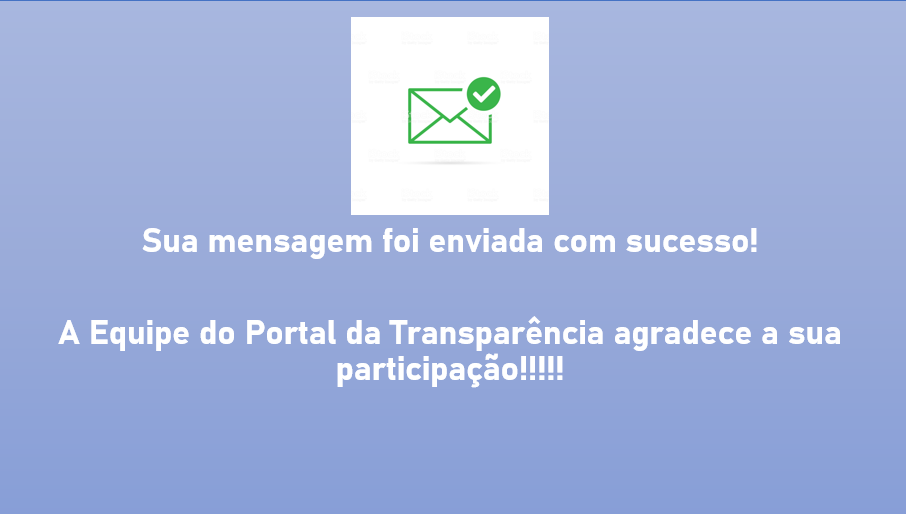

##### Sua mensagem foi enviada com sucesso!

##### A Equipe do Portal da Transparência agradece a sua participação!

##### 2.2 Resposta: NÃO.

O usuário será direcionado para a seguinte página.
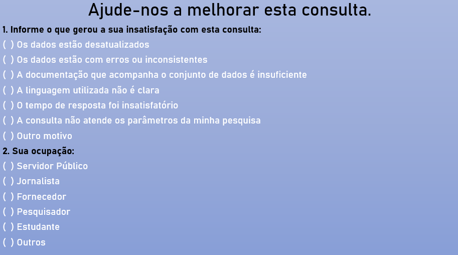
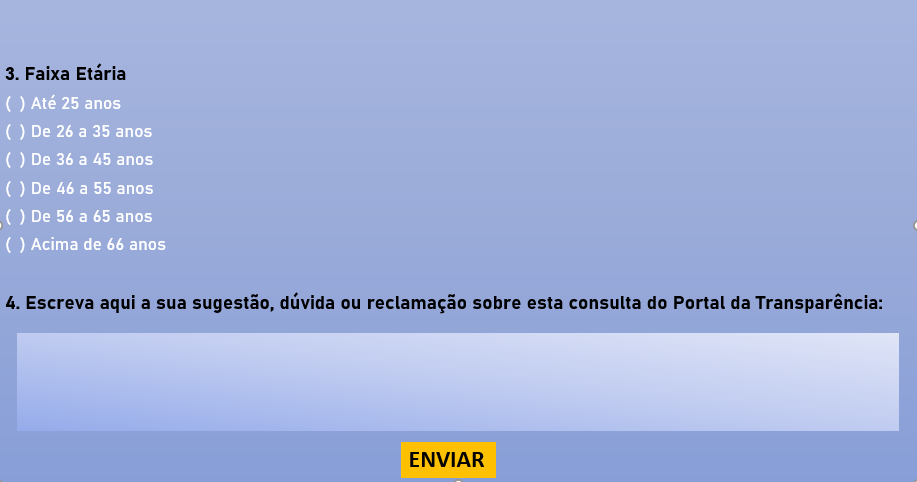

###### Ajude-nos a melhorar esta consulta.

##### 1. Informe o que gerou a sua insatisfação com esta consulta:

> (  ) Os dados estão desatualizados
>
> (  ) Os dados estão com erros ou inconsistentes
>
> (  ) A documentação que acompanha o conjunto de dados é insuficiente
>
> (  ) A linguagem utilizada não está clara
>
> (  ) O tempo de resposta foi insatisfatório
>
> (  ) A consulta não atende os parâmetros da minha pesquisa
>
> (  ) Outro Motivo

##### 2. Sua ocupação

> (  ) Servidor Público
>
> (  ) Jornalista
>
> (  ) Fornecedor
>
> (  ) Pesquisador
>
> (  ) Estudante
>
> (  ) Outros

##### 3. Faixa Etária

> (  ) Até 25 anos
>
> (  ) De 26 a 35 anos
>
> (  ) De 36 a 45 anos
>
> (  ) De 46 a 55 anos
>
> (  ) De 56 a 65 anos
>
> (  ) Acima de 66 anos

##### 4. Escreva aqui a sua sugestão, dúvida ou reclamação sobre esta consulta do Portal da Transparência:

##### 6. Botão de ENVIAR a pesquisa

Ao finalizar a pesquisa o usuário irá clicar em ENVIAR, e na tela seguinte será apresentada a seguinte mensagem.

##### Sua mensagem foi enviada com sucesso!

##### A Equipe do Portal da Transparência agradece a sua participação!

##### Observação:
As pesquisas de satisfação devem estar disponíveis em todas as consultas do Portal. Além disso, o resultado das pesquisas devem ser disponibilizadas de forma a permitir identificar para qual página do Portal o usuário avaliou.

### Exemplos

[PORTO ALEGRE](https://prefeitura.poa.br/)

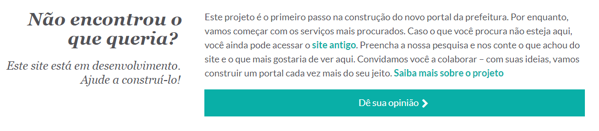

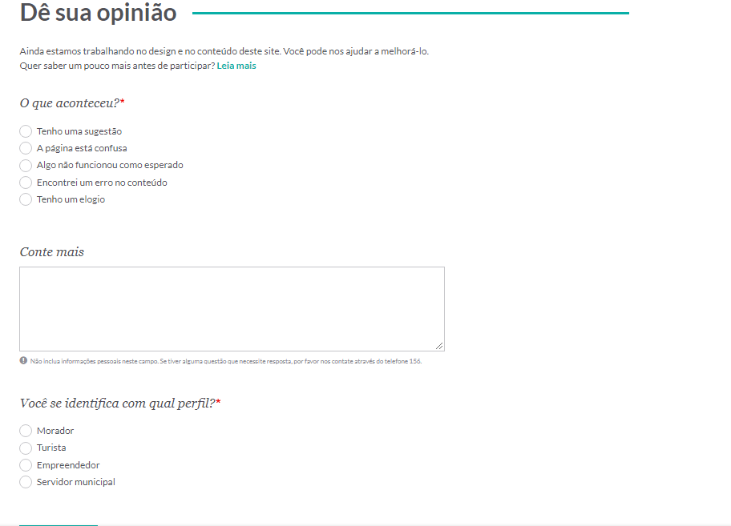

[DISTRITO FEDERAL](http://www.transparencia.df.gov.br/#/)

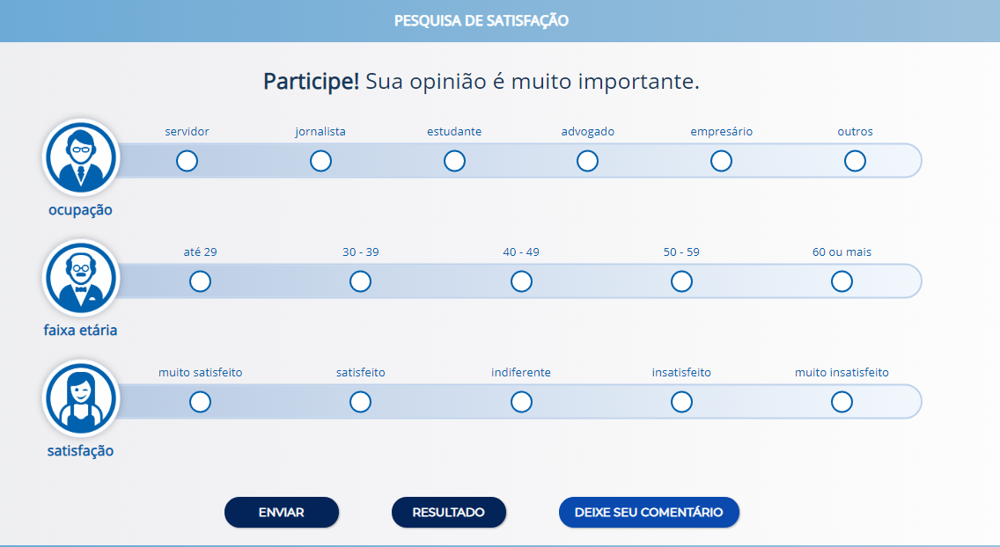

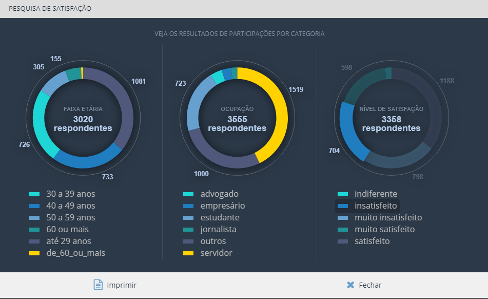

[ALAGOAS](http://transparencia.al.gov.br/)

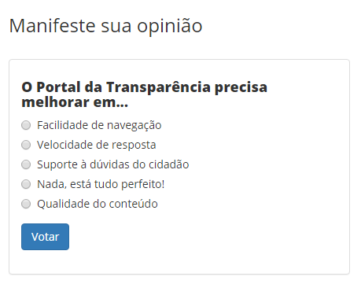

[GOVERNO DO PARANÁ](http://www.transparencia.pr.gov.br/pte/pages/cadastroSugestao/edit_sugestao.jsf?windowId=400)

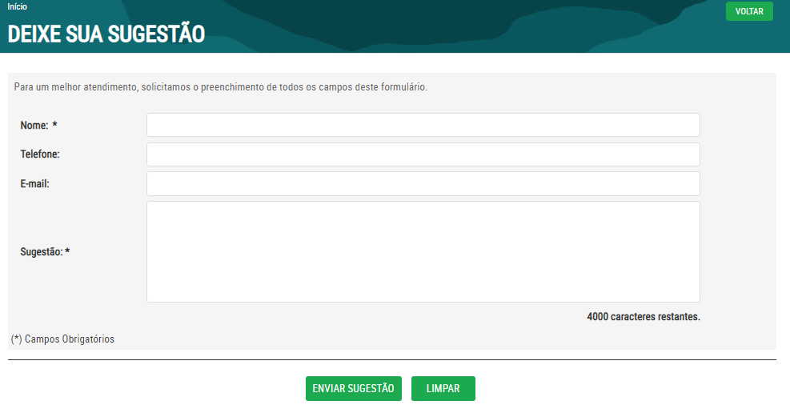

[CEARÁ](https://cearatransparente.ce.gov.br/portal-da-transparencia/manifestacoes-e-solicitacoes/estatisticas-de-satisfacao?evaluation_type=transparency&locale=pt-BR)

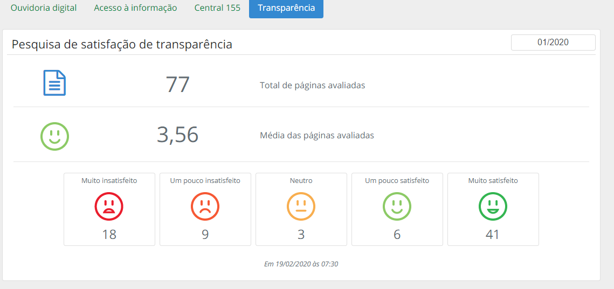

[GOIÁS](http://www.transparencia.go.gov.br/portaldatransparencia/institucional/sugestao-portal)

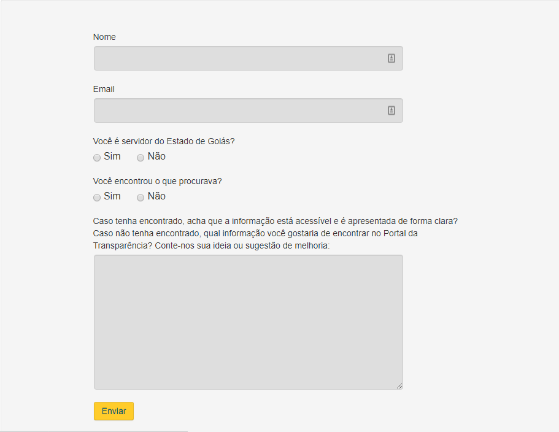

[CGE](http://www.cge.mg.gov.br/publicacoes/relatorios/relatorios-de-auditoria)

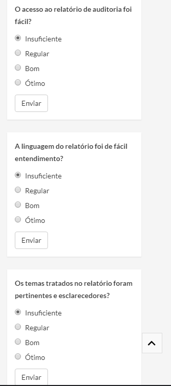

[Dados Abertos](http://www.dados.gov.br/dataset/serie-historica-de-precos-de-combustiveis-por-revenda)

Outros portais pesquisados que não possuem ferramenta de Feedback:

- PREFEITURA DE SÃO PAULO
- GOVERNO DE SÃO PAULO
- GOVERNO ESPIRITO SANTO
- GOVERNO DO ACRE
- GOVERNO DO RIO GRANDE DO SUL
- GOVERNO SANTA CATARINA
- GOVERNO DO AMAPA
- GOVERNO DO PARÁ
- PREFEITURA DE CURITIBA
- PREFEITURA DE BELO HORIZONTE
