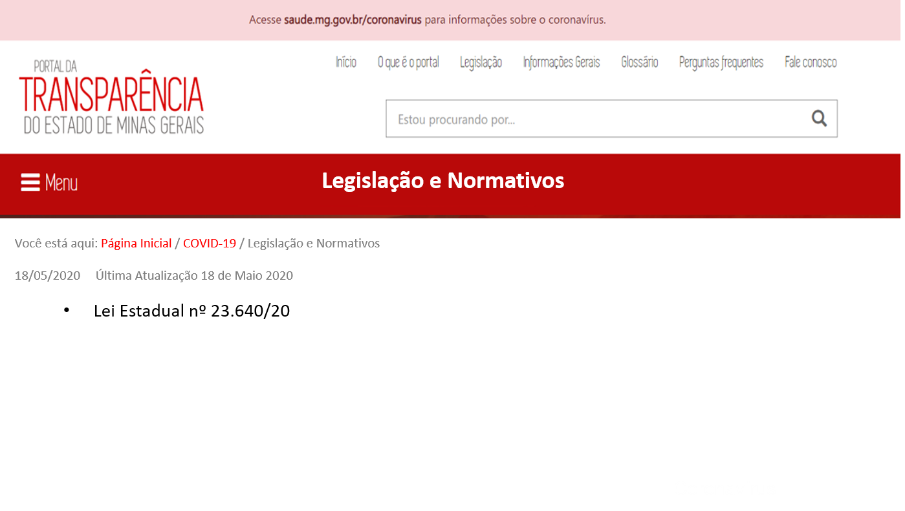

# Visão geral da Demanda
<a href="#top">(inicio)</a>

Essa demanda visa criar uma um local específica para divulgar as ações do governo destinadas ao enfrentamento do Coronavírus (COVID-19).

# Motivação
<a href="#top">(inicio)</a>

Com foco no fomento da transparência e melhores práticas para atender ao cidadão, o Estado de Minas Gerais disponibiliza sessão específica para facilitar ainda mais a divulgação de dados relativos às contratações do Programa Enfrentamento dos Efeitos da Pandemia de COVID-19.

A iniciativa reforça o compromisso com a transparência, enquanto diretriz de governo, e abre mais uma possibilidade para o cidadão exercer seu papel no controle social.

# Especificação
<a href="#top">(inicio)</a>

## Página Inicial
<a href="#top">(inicio)</a>

Para contemplar a inclusão dos modos de consulta relacionadas às Contratações/Aquisições decorrentes do Programa 026 - Enfrentamento dos efeitos da pandemia de COVID-19 a página inicial do Portal deve ser:

* __Texto do ícone COVID-19:__ Encontre aqui os gastos, contratações e legislações do Estado referente ao enfretamento à pandemia causada pelo novo coronavírus.

Após clicar no ícone ___[COVID-19]___ deve ser apresentado a página a seguir:

#### __Texto dos ícones:__

* Aquisições e Contratações: Acesse as contratações e execução referente ao Programa Enfrentamento dos efeitos da pandemia de COVID-19.

* Legislação e Normativos: Acesse a legislação e os normativos relativos às medidas de prevenção e combate a COVID- 19.

* Ouvidoria Coronavírus: Registre as denúncias e reclamações sobre o Coronavírus.

* Acesso à Informação: Registre sua solicitação de acesso à informação para órgãos e entidades do Poder Executivo Estadual.

* Dados Abertos COVID -19: Acesse aqui o conjunto de dados das aquisições e contratações relacionadas ao COVID-9.

* Conselho de Transparência e Combate a Corrupção: Acesse aqui as informações sobre o Conselho de Transparência e Combate à Corrupção e sua atuação no monitoramento e avaliação das ações relacionadas ao enfrentamento da COVID-19.

#### __Texto Página Inicial__

Com foco no fomento da transparência e melhores práticas para atender ao cidadão, o Estado de Minas Gerais disponibiliza sessão específica para facilitar ainda mais a divulgação de dados relativos às contratações do Programa eEnfrentamento dos Efeitos da Pandemia de COVID-19.

O Cidadão poderá acessar a legislação de referência, os relatórios das compras de forma estruturada e em formato aberto, com ferramenta de busca, bem como acessar os canais de Ouvidoria e Lei de Acesso a Informação.

### 1. Consulta Aquisições  Contratações
<a href="#top">(inicio)</a>

Ao clicar em ___[Aquisições e Contratações]___ o portal exibe uma página com o painel das aquisições e contratações relacionados ao Programa 26 - Enfrentamento dos efeitos da pandemia de COVID-19.

Arquico .xls: [leiaute-tabelas-covid19]()

___Itens da tabela___:

__1. Número do Processo de Compra:__ Número identificador do processo de compra no Portal de Compras.

__2. Objeto do Processo:__ Descrição dos bens e serviços que estão sendo comprados e sua finalidade.

__3. Edital__:

__4. Órgão demandante__: Órgão ou entidade que solicitou a compra de determinado material ou serviço. Pode coincidir ou não com o órgão que está executando o processo de compra.

__5. Procedimento de contratação:__ Inclui as modalidades de licitação (concorrência, tomada de preços, convite e leilão), pregão, dispensa, inexigibilidade, registro de preços, etc.

__6. Situação do Processo:__ Situação do processo de compra durante a aquisição de materiais e serviços (concluído, suspenso, em andamento, etc.). Quanto aos processos de compra com situação em andamento, são considerados apenas os itens já homologados desses processos.

__7. Órgão Contrato__: Órgão ou entidade que formalizou o instrumento de contratação.

__8. Número do Contrato__: Número do contrato registrado no SIAFI.

__9. CPF/CNPJ do Contratado:__ Número de identificação do fornecedor. Pessoa Jurídica (CNPJ) e Pessoa física (CPF).

__10. Contratado:__ Nome da pessoa física ou jurídica contratada para prestar um serviço ou entregar bens materiais ao Estado.

__11. Data da Publicação do Contrato__: Data de Publicação do Contrato no IOF.

__12.Fim da Vigência do Contrato__: Data atualizada do fim da vigência do Contrato.

__13. Valor de Referência__:Valor estimado de um determinado bem ou serviço, obtido por meio de pesquisa de mercado ou cadastro de preços.

__14. Valor Homologado__: Valor final licitado ou comprado.

#### Observações Importantes

* O campo filtro deverá buscar qualquer item na tabela;

* O Painel deverá apresentar todos os processos de compras relacionados ao Programa 026 -Enfrentamento dos Efeitos da Pandemia de COVID-19: processos concluídos e em andamento, bem como os processos que ainda não tiveram nenhuma execução.

* Ao clicar no _[Número do processo de compra]_ o usuário será direcionado a página de detalhamento do Portal que apresenta os dados do processo de compra;

* Ao clicar no _[Número do contrato]_ o usuário será direcionado para a página do Portal de Compras para realizar o download do contrato;

* O cidadão poderá realizar a extração dos dados através dos ícones (imprimir, CSV e PDF);

* As colunas da tabela deverão ser movivéis, conforme o já adotado pelas demais consultas do Portal.

### 2. Consulta Legislação e Normativos
<a href="#top">(inicio)</a>

Ao clicar no ícone ___[Legislação e Normativos ]___ o portal exibe a página de conteúdo Legislação e Normativos COVID-19 (eg. Voos do Governador).

O conteúdo dessa página será alimentado pela CGE atravé do aréa administrativa do Portal (Joomla).

### 3. Consulta Dados Abertos COVID -19
<a href="#top">(inicio)</a>

Ao clicar no ícone ___[Dados Abertos COVID -19]___ o portal exibe o conjunto de dados com a relação das contratações celebradas pelo Governo de Minas Gerais com fulcro na Lei Federal n. 13.979 de 06 de fevereiro de 2020 para enfrentamento da emergência de saúde pública de importância internacional decorrente do coronavírus.

Link: http://www.transparencia.dadosabertos.mg.gov.br/dataset/contratacoes-coronavirus

### 4. Consulta Conselho de Transparência e Combate a Corrupção
<a href="#top">(inicio)</a>

Ao clicar no ícone ___[Conselho de Transparência e Combate a Corrupção]___ o portal exibe informações sobre o Conselho de Transparência e Combate à Corrupção e sua atuação no monitoramento e avaliação das ações relacionadas ao enfrentamento da COVID-19).

Link: http://portaldosconselhos.cge.mg.gov.br/

### 5. Ouvidoria Coronavírus
<a href="#top">(inicio)</a>

Ao clicar no ícone ___[Ouvidoria Coronavírus]___ o portal exibe a página da Ouvidoria exclusiva para manifestações relacionadas ao Coronavírus.

Link: http://www.ouvidoriageral.mg.gov.br/coronavirus

### 6. Acesso à Informação
<a href="#top">(inicio)</a>

Ao clicar no ícone ___[Acesso à Informação]___ o portal exibe a página Sistema Eletrônico de Acesso à Informação (e-Sic)

Link: http://www.acessoainformacao.mg.gov.br/
