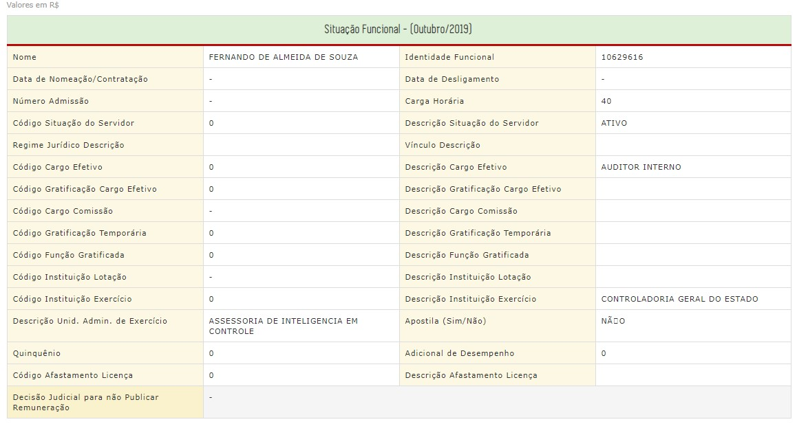
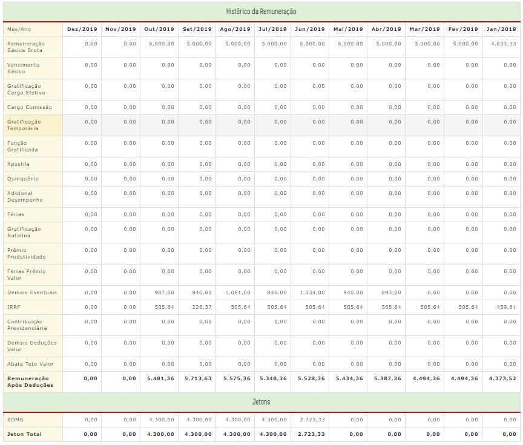

# Visão geral da intervenção

Objetivo: rever a especificação do leiaute da consulta de remuneração elaborada em 2015 e que está em produção atualmente, para ajustar campos do cabeçalho 'Situação Funcional' e da tabela 'Histórico da Remuneração'. Seja para adicionar campos necessários e adequar a forma de apresentação e dos espaços que outros campos ocupam.

Na hipótese da implantação da ['Remuneração de Servidores'](https://github.com/transparencia-mg/especificacoes-portal-transparencia/blob/feat/especificacao-remuneracao-servidores/espec002_remuneracao-servidores/especificacao-remuneracao-servidores.md)([para aumentar horizonte de divulgação da remuneração](https://github.com/transparencia-mg/especificacoes-portal-transparencia/pull/2)), os campos de linhas desta especificação deverão ser lidos como campos de colunas.

# Motivação / contexto da intervenção

A especificação da consulta de remuneração foi elaborada em 2012, quando da publicação do decreto 45.969/12, que obrigou a publicação da remuneração. Ela foi revista em 2015, quando da atualização e reformulação do Portal da Transparência. Tal revisão visou dar mais transparência à vida funcional dos servidores e à composição dos proventos, seguindo as boas práticas identificadas e as diversas demandas recebidas por meio de fale conosco e da Lei de Acesso a Informação.

Naquele ano, optou-se por atualizar a interface web da consulta de remuneração, já colocando os novos campos; mas não foi feita a adequação no banco de dados, o que seria feito logo em seguida. Posteriormente, foram priorizadas as novas consultas do Portal e, por fim, não houve recursos suficientes para realizar a adequação no banco.

Desde então existem campos disponibilizados na interface web da consulta que não possuem dados preenchidos com valores válidos, mas apenas '-' ou '0' (exemplos: 'Código Instituição Exercício' e 'Código Cargo Comissão').

# Especificação

Na consulta Página Principal > Pessoal > Remuneração dos Servidores > Faixa Salarial > Órgao > Cargo > Servidor, adotar:

1.Informações dos campos que já existem na interface web da consulta e no leiaute da planilha de remuneração especificada em 2015 (*Esta é a principal alteração trazida por esta especificação*)

1.1. No cabeçalho de 'SITUAÇÃO FUNCIONAL DO SERVIDOR':preenchimento dos valores de todos os campos que atualmente constam como vazios, com '0' ou '-', sendo:
- Data de Nomeação/Contratação
-	Data de Desligamento
- Número Admissão		
- Código Situação do Servidor
- Regime Jurídico Descrição		
- Vínculo Descrição
- Código Cargo Efetivo
- Código Gratificação Cargo Efetivo
- Descrição Gratificação Cargo Efetivo
- Código Cargo Comissão
- Código Gratificação Temporária
- Descrição Gratificação Temporária
- Código Função Gratificada
- Código Instituição Lotação
-	Descrição Instituição Lotação
- Código Instituição Exercício
- Quinquênio
- Adicional de Desempenho
- Código Afastamento Licença
- Descrição Afastamento Licença
- Decisão Judicial para não Publicar Remuneração

 

 1.2. Na tabela 'HISTÓRICO DA REMUNERAÇÃO': preenchimento dos valores de todos os campos que atualmente constam como vazios na composição remuneratória:
 - Vencimento Básico
 - Gratificação Cargo Efetivo
 - Cargo Comissão
 - Gratificação Temporária
 - Função Gratificada
 - Adicional Desempenho
 - Apostila
 - Quinquênio
 - Jetons (linha que deveria aparecer após 'Remuneração Após Deduções')

 *Este item presume o detalhamento retroativo do campo 'Remuneração Básica Bruta', de forma que todo o valor agregado, atualmente constante nesse campo, seja detalhado para os campos acima citados, desde 2012, ou a data mais antiga disponível*

2. Para informações de novos campos:

 2.1. No cabeçalho de 'SITUAÇÃO FUNCIONAL DO SERVIDOR', abaixo da linha do campo 'Descrição do Cargo Efetivo' e acima da linha do campo 'Código Gratificação Cargo Efetivo', incluir um linha com dois campos :
- Nível na carreira (no mês filtrado para a pesquisa)
- Grau na carreira (no mês filtrado para a pesquisa)

 2.2. Na tabela 'HISTÓRICO DA REMUNERAÇÃO':
 - Evidenciação e discriminação dos auxílios alimentação e transporte e ajuda de custo, em três linhas adicionais entre 'Demais eventuais Valor' e 'Abate Teto Valor'
- Evidenciação de desconto decorrente de faltas nos dias trabalhados, em uma linha adicional entre 'Contribuição Previdenciária' e 'Demais eventuais Valor'
- Evidenciação da composição dos subtotais de vantagens e deduções a partir da criação de uma nova coluna à esquerda da tabela, com dois campos denominados 'Vantagens' e 'Deduções', que mesclem: para o subtotal de 'Vantagens', desde a linha de 'Remuneração Básica Bruta' até 'Demais eventuais Valor'; para o subtotal 'Deduções', desde 'IRRF' até 'Abate Teto Valor'

# Dependências / Integrações

Será necessária recuperação da base histórica do SISAP para nova geração das consultas com os campos que não foram preenchidos (ver possíveis implicações em 'Dúvidas' abaixo).
Será necessário agendamento de reuniões de validação com os órgãos envolvidos (CBMMG, PMMG), para que os mesmos possam preencher a planilha de remuneração, tal qual definido nesta especificação.

# Exemplos

# Dúvidas
É possível obter o detalhamento retroativo do campo 'Remuneração Básica Bruta'?
É possível realocar os valores componentes do campo 'Remuneração Básica Bruta' nos demais campos existentes na planilha especificada desde 2012 (há correspondência exata para o desdobramento nos campos citados em 2.2)?
É possível que haja perda de dados na operação de correspondência aventada no item acima?
Na possibilidade de perda de dados, é possível adotar uma regra que redirecione os valores impossíveis de serem classificados nos campos já existentes para o campo 'Demais itens eventuais'?
Qual seria a diferença de significado entre '0' e '-' nos atuais campos do cabeçalho de 'SITUAÇÃO FUNCIONAL DO SERVIDOR'?

# Dicionário de Dados

| LEIAUTE_Portal                                 | LEIAUTE_Planilha | Conceituaусo                                                                                                                                                                                                                          |
|------------------------------------------------|------------------|---------------------------------------------------------------------------------------------------------------------------------------------------------------------------------------------------------------------------------------|
| Identidade Funcional                           | masp             | NЩmero que identifica o servidor civil (Ex. MASP) ou militar                                                                                                                                                                          |
| Nome                                           | nome             | Nome do servidor civil ou militar conforme registrado nosSistemas de Pagamento de Pessoal da SEPLAG, CBMMG e PMMG                                                                                                                     |
| Data da nomeaусo/Contrataусo                   | vazio            | Data da nomeaусo/contrataусo                                                                                                                                                                                                          |
| Data de Desligamento                           | vazio            | Data de saьda do servidor                                                                                                                                                                                                             |
| NЩmero de Admissсo                             | vazio            | Cзdigo da Admissсo (tabela SISAP)                                                                                                                                                                                                     |
| Carga Horрria                                  | carga_hora       | Carga horрria semanal do servidor                                                                                                                                                                                                     |
| Cзdigo Situaусo do Servidor                    | vazio            | ?                                                                                                                                                                                                                                     |
| Descriусo Situaусo do Servidor                 | descsitser       | Ativo e Inativo                                                                                                                                                                                                                       |
| Regime Jurьdico Descriусo                      | vazio            | Estatutрrio/celetista/Recrutamento Amplo/Contratado                                                                                                                                                                                   |
| Vьnculo Descriусo                              | vazio            | Efetivo/recrutamento amplo/designado/contrato temporрrio                                                                                                                                                                              |
| Cзdigo Cargo Efetivo                           | vazio            | Cargo da carreira de origem                                                                                                                                                                                                           |
| Descriусo Cargo Efetivo                        | nmefet           | Descriусo do cargo de provimento efetivo, cuja investidura ж duradoura, assegurando-se estabilidade ao servidor civil/militar                                                                                                         |
| Nьvel Carreira                                 | nivcar           | Cзdigo que indica o posicionamento do servidor nos nьveis existentes da sua carreira em que se encontra no mЖs de pesquisa                                                                                                            |
| Grau Carreira                                  | gracar           | Cзdigo que indica o posicionamento do servidor nos graus existentes dentro do nьvel da sua carreiraem que se encontra no mЖs de pesquisa                                                                                              |
| Cзdigo Gratificaусo Cargo Efetivo              | vazio            | Cзdigo da gratificaусo de cargo efetivo                                                                                                                                                                                               |
| Descriусo Gratificaусo Cargo Efetivo           | vazio            | Gratificaусo vinculada ao cargo da carreira - GDPI, GEDAMA, etc                                                                                                                                                                       |
| Cзdigo Cargo Comissсo                          | vazio            | Cзdigo referente aos DADs e DAIs                                                                                                                                                                                                      |
| Descriусo Cargo Comissсo                       | desccomi         | Destinado Яs atribuiушes de direусo, chefia e assessoramento, caracterizando-se pela transitoriedade da investidura. Pode ser preenchido por pessoa que nсo seja servidor/militar de carreira.                                        |
| Cзdigo Gratificaусo Temporрria                 | vazio            | Cзdigo referente aos GTE e GTEI                                                                                                                                                                                                       |
| Descriусo Gratificaусo Temporрria              | vazio            | Descriусo Gratificaусo                                                                                                                                                                                                                |
| Cзdigo Funусo Gratificada                      | vazio            | Cзdigo referente as FGD e FGI                                                                                                                                                                                                         |
| Descriусo Funусo Gratificada                   | vazio            | Descriусo Funусo Gratificada                                                                                                                                                                                                          |
| Cзdigo Instituiусo Lotaусo                     | vazio            | Cзdigo da instituiусo de lotaусo do servidor                                                                                                                                                                                          |
| Descriусo Instituiусo Lotaусo                  | vazio            | Descriусo da instituiусo de lotaусo do servidor                                                                                                                                                                                       |
| Cзdigo Instituiусo Exercьcio                   | vazio            | Cзdigo da instituiусo de exercьcio do servidor                                                                                                                                                                                        |
| Descriусo Instituiусo Exercьcio                | descinst         | Indica o зrgсo e/ou entidade de exercьcio do servidor civil ou militar.                                                                                                                                                               |
| Descriусo Unid. Adm. De Exercьcio              | descunid         | Unidade administrativa de exercьcio dentro do зrgсo                                                                                                                                                                                   |
| Apostila                                       | tem_apost        | Quando sinalizado com a expressсo ЊSimћ, indica que o servidor tem direito a uma remuneraусo adicional a do seu cargo efetivo. Conforme previsto nas Leis n║ 9.532, de 30 de dezembro de 1987 e n║ 13.434, de 30 de dezembro de 1999. |
| QuinquЖnio                                     | vazio            | Informar Sim ou Nсo.                                                                                                                                                                                                                  |
| Adicional de Desempenho                        | vazio            | Informar Sim ou Nсo.                                                                                                                                                                                                                  |
| Cзdigo Afastamento Licenуa                     | vazio            | Informar cзdigo do afastamento                                                                                                                                                                                                        |
| Descriусo Afastamento Licenуa                  | vazio            | Informar a descriусo do afastamento                                                                                                                                                                                                   |
| Decisсo Judicial para nсo Publicar Remuneraусo | judic            | Quando sinalizado com a expressсo ЊSimћ, indica que existe decisсo judicial amparando a composiусo da remuneraусo diferenciada da prevista no limite constitucional                                                                   |
| Remuneraусo Bрsica Bruta                       | remuner          | ╔ composta pela soma das parcelas remuneratзrias correspondentes ao cargo efetivo, a funусo ou o cargo comissionado, nсo incorporando os valores listados no item ЊRemuneraусo Eventualћ                                              |
| Vencimento Bрsico                              | vazio            | Valor do vencimento bрsico do servidor                                                                                                                                                                                                |
| Gratificaусo Cargo Efetivo                     | vazio            | Valor do cargo efetivo                                                                                                                                                                                                                |
| Cargo Comissсo                                 | vazio            | Valor do cargo em comissсo                                                                                                                                                                                                            |
| Gratificaусo Temporрria                        | vazio            | Valor da gratificaусo temporрria                                                                                                                                                                                                      |
| Funусo Gratifificada                           | vazio            | Valor da funусo gratificada                                                                                                                                                                                                           |
| QuinquЖnio                                     | vazio            | Valor referente ao benefьcio pessoal consequencia de quinquenio                                                                                                                                                                       |
| Apostila                                       | vazio            | Valor referente ao benefьcio pessoal consequencia de apostila                                                                                                                                                                         |
| Adicional Desempenho                           | vazio            | Valor referente ao benefьcio pessoal consequencia de ADE                                                                                                                                                                              |
| Fжrias                                         | ferias           | Adicional correspondente a 1/3 (um terуo) da remuneraусo, pago ao servidor civil ou militar por ocasiсo das fжrias                                                                                                                    |
| Gratificaусo Natalina                          | decter           | Gratificaусo assegurada ao servidor civil ou militar a tьtulo de dжcimo terceiro salрrio                                                                                                                                              |
| PrЖmio Produtividade                           | premio           | Percentual de remuneraусo paga a tьtulo de premiaусo aos servidores civis ou militares que atingiram as metas pactuadas no Acordo de Resultados                                                                                       |
| Fжrias-PrЖmio Valor                            | feriasprem       | Conversсo em espжcie, quando da aposentadoria, do saldo de fжrias prЖmio concedida e nсo gozadas, conforme legislaусo pertinente                                                                                                      |
| Axьlio Alimentaусo                             | auxaliment       | Valor percebido pelo servidor a tьtluo de auxьlio alimentaусo no mЖs de consulta                                                                                                                                                      |
| Auxьlio Transporte                             | auxtransp        | Valor percebido pelo servidor a tьtluo de auxьlio transporte no mЖs de consulta                                                                                                                                                       |
| Ajuda de Custo                                 | ajudcust         | Valor percebido pelo servidor a tьtluo de ajuda de custo no mЖs de consulta                                                                                                                                                           |
| Demais Eventuais                               | eventual         | Gratificaушes, restituiушes, horas-extras e outros, pagos de forma variрvel e/ou eventual, que nсo estejam incluьdas em nenhum dos itens acima discriminados                                                                          |
| IRPF                                           | ir               | Imposto de Renda Retido na Fonte, nos termos da legislaусo prзpria                                                                                                                                                                    |
| Contribuiусo Previdenciрria                    | prev             | Contribuiусo Previdenciрria obrigatзria, nos termos da legislaусo pertinente                                                                                                                                                          |
| Faltas                                         | falt             | Valores deduzidos em funусo de faltas no mЖs de consulta                                                                                                                                                                              |
| Demais Deduушes Valor                          | vazio            | Valor das demais deduушes                                                                                                                                                                                                             |
| Abate Teto Valor                               | teto             | Valor deduzido da remuneraусo bрsica bruta, quando esta ultrapassar o teto constitucional, nos termos da legislaусo pertinente                                                                                                        |
| Remuneraушes Apзs Deducшes                     | rem_pos          | Valor obtido pela soma das remuneraушes bрsica e eventual, descontados o abate teto e as deduушes obrigatзrias                                                                                                                        |
| Jetons                                         | jetons           | Gratificaусo paga, em folha, referente a participaусo em reuniшes dos зrgсos de deliberaусo coletiva. Pode ser pago a pessoa que nсo tenha vьnculo funcional com o Estado                                                             |
